# 优化算法

<cite>
**本文档引用的文件**   
- [chapter_optimization/index.ipynb](file://chapter_optimization/index.ipynb)
- [chapter_optimization/gd.ipynb](file://chapter_optimization/gd.ipynb)
- [chapter_optimization/sgd.ipynb](file://chapter_optimization/sgd.ipynb)
- [chapter_optimization/minibatch-sgd.ipynb](file://chapter_optimization/minibatch-sgd.ipynb)
- [chapter_optimization/adagrad.ipynb](file://chapter_optimization/adagrad.ipynb)
- [chapter_optimization/lr-scheduler.ipynb](file://chapter_optimization/lr-scheduler.ipynb)
- [chapter_optimization/convexity.ipynb](file://chapter_optimization/convexity.ipynb)
- [chapter_optimization/momentum.ipynb](file://chapter_optimization/momentum.ipynb)
- [chapter_optimization/rmsprop.ipynb](file://chapter_optimization/rmsprop.ipynb)
- [chapter_optimization/adadelta.ipynb](file://chapter_optimization/adadelta.ipynb)
- [chapter_optimization/adam.ipynb](file://chapter_optimization/adam.ipynb)
</cite>

## 目录
1. [引言](#引言)
2. [项目结构](#项目结构)
3. [核心组件](#核心组件)
4. [架构总览](#架构总览)
5. [详细组件分析](#详细组件分析)
6. [依赖关系分析](#依赖关系分析)
7. [性能考虑](#性能考虑)
8. [故障排查指南](#故障排查指南)
9. [结论](#结论)
10. [附录](#附录)

## 引言
本章节聚焦深度学习中的优化算法，系统讲解梯度下降的数学原理与收敛性质、随机梯度下降与小批量策略、动量机制、自适应优化器（AdaGrad、RMSProp、Adam、AdaDelta）的设计思想与适用场景，学习率调度策略与超参数调优方法，以及凸与非凸优化的区别与挑战。同时提供可视化与监控实践建议，帮助读者在工程实践中选择并调优合适的优化器。

## 项目结构
优化相关代码以 Jupyter Notebook 形式组织在 chapter_optimization 目录下，按主题分节：基础梯度下降、SGD、小批量 SGD、动量、自适应优化器、学习率调度、凸性理论等。每个 Notebook 包含概念讲解、公式推导、示例实现与可视化结果，便于循序渐进地理解与复现实验。

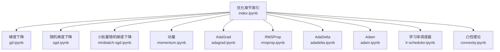

**图表来源** 
- [chapter_optimization/index.ipynb](file://chapter_optimization/index.ipynb)

**章节来源**
- [chapter_optimization/index.ipynb](file://chapter_optimization/index.ipynb)

## 核心组件
- 梯度下降（GD）：基于泰勒展开的一阶近似，沿负梯度方向更新参数，适用于理解优化过程与学习率影响。
- 随机梯度下降（SGD）：每次迭代使用单个样本的梯度估计，计算复杂度 O(1)，具有无偏性但方差较大。
- 小批量 SGD：平衡数据效率与计算效率，利用向量化和缓存提升吞吐，降低梯度噪声标准差。
- 动量（Momentum）：引入历史梯度的指数加权平均，加速收敛并抑制震荡。
- 自适应优化器：
  - AdaGrad：按坐标累积平方梯度，自动缩放学习率，适合稀疏特征。
  - RMSProp：对平方梯度进行指数滑动平均，缓解 AdaGrad 学习率单调衰减问题。
  - Adam：结合动量与 RMSProp，维护一阶矩与二阶矩估计，广泛用于深度学习。
  - AdaDelta：无需全局学习率，通过移动平均的梯度与参数更新幅度比进行自适应。
- 学习率调度：包括预热、衰减、周期性调整等策略，显著影响训练稳定性与最终精度。
- 凸性与非凸性：凸问题具良好理论保证；非凸问题存在局部极小值与鞍点，需借助噪声、动量与自适应策略改善。

**章节来源**
- [chapter_optimization/gd.ipynb](file://chapter_optimization/gd.ipynb)
- [chapter_optimization/sgd.ipynb](file://chapter_optimization/sgd.ipynb)
- [chapter_optimization/minibatch-sgd.ipynb](file://chapter_optimization/minibatch-sgd.ipynb)
- [chapter_optimization/momentum.ipynb](file://chapter_optimization/momentum.ipynb)
- [chapter_optimization/adagrad.ipynb](file://chapter_optimization/adagrad.ipynb)
- [chapter_optimization/rmsprop.ipynb](file://chapter_optimization/rmsprop.ipynb)
- [chapter_optimization/adadelta.ipynb](file://chapter_optimization/adadelta.ipynb)
- [chapter_optimization/adam.ipynb](file://chapter_optimization/adam.ipynb)
- [chapter_optimization/lr-scheduler.ipynb](file://chapter_optimization/lr-scheduler.ipynb)
- [chapter_optimization/convexity.ipynb](file://chapter_optimization/convexity.ipynb)

## 架构总览
优化流程的核心是“损失函数—梯度—参数更新”的闭环。不同优化器通过不同的状态变量与更新规则改变步长与方向，学习率调度器则动态调节步长大小。

```mermaid
sequenceDiagram
participant Data as "数据批次"
participant Model as "模型前向"
participant Loss as "损失函数"
participant Grad as "反向传播"
participant Opt as "优化器"
participant LR as "学习率调度器"
Data->>Model : 输入X, 标签y
Model-->>Loss : 预测ŷ
Loss-->>Grad : 计算损失L
Grad-->>Opt : 返回各参数梯度g_t
Opt->>LR : 获取当前学习率η_t
Opt-->>Model : 更新参数w_{t+1} = w_t - η_t * Δ(w_t)
Note over Opt,LR : 不同优化器决定Δ(w_t)的计算方式
```

**图表来源** 
- [chapter_optimization/minibatch-sgd.ipynb](file://chapter_optimization/minibatch-sdn.ipynb)
- [chapter_optimization/lr-scheduler.ipynb](file://chapter_optimization/lr-scheduler.ipynb)

## 详细组件分析

### 梯度下降（GD）
- 数学原理：利用目标函数的一阶泰勒展开，沿负梯度方向以固定步长更新参数，确保函数值在一阶近似下下降。
- 收敛性质：当学习率足够小且梯度非零时，函数值逐步减小；若学习率过大可能发散。
- 可视化：一维二次函数的轨迹显示参数逐步趋近最优解。

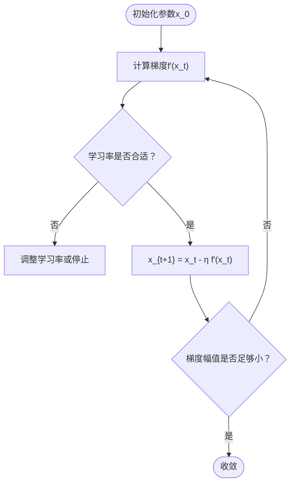

**图表来源** 
- [chapter_optimization/gd.ipynb](file://chapter_optimization/gd.ipynb)

**章节来源**
- [chapter_optimization/gd.ipynb](file://chapter_optimization/gd.ipynb)

### 随机梯度下降（SGD）
- 无偏估计：单次样本梯度是对整体梯度的无偏估计，期望等于真实梯度。
- 方差与噪声：单样本梯度方差大，导致轨迹抖动；可通过学习率衰减或小批量降低方差。
- 复杂度：每次迭代 O(1)，适合大规模数据。

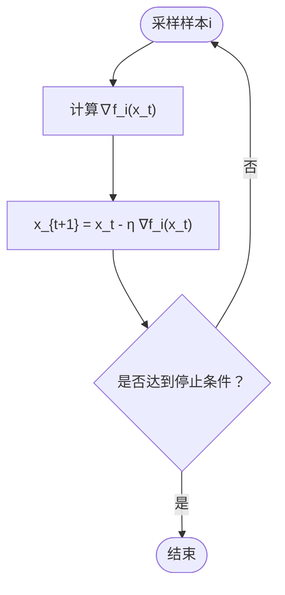

**图表来源** 
- [chapter_optimization/sgd.ipynb](file://chapter_optimization/sgd.ipynb)

**章节来源**
- [chapter_optimization/sgd.ipynb](file://chapter_optimization/sgd.ipynb)

### 小批量随机梯度下降（Mini-batch SGD）
- 动机：平衡数据效率与计算效率，利用矩阵运算与缓存层次提高吞吐。
- 统计特性：小批量梯度方差随批大小 b 增加而降低（标准差约降为 1/√b）。
- 实现要点：向量化操作、批量归一化、数据加载与并行。

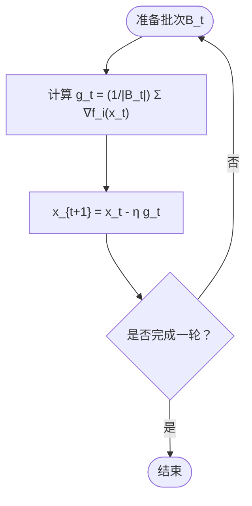

**图表来源** 
- [chapter_optimization/minibatch-sgd.ipynb](file://chapter_optimization/minibatch-sgd.ipynb)

**章节来源**
- [chapter_optimization/minibatch-sgd.ipynb](file://chapter_optimization/minibatch-sgd.ipynb)

### 动量（Momentum）
- 思想：引入速度项 v_t = β v_{t-1} + g_t，参数更新为 w_{t+1} = w_t - η v_t，平滑轨迹并加速收敛。
- 适用场景：存在高曲率或噪声较大的损失曲面时效果显著。

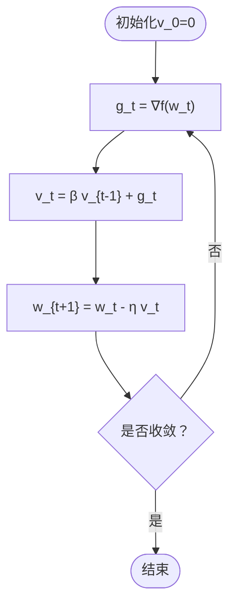

**图表来源** 
- [chapter_optimization/momentum.ipynb](file://chapter_optimization/momentum.ipynb)

**章节来源**
- [chapter_optimization/momentum.ipynb](file://chapter_optimization/momentum.ipynb)

### AdaGrad
- 设计：按坐标累积平方梯度 s_t = s_{t-1} + g_t^2，更新 w_{t+1} = w_t - η g_t / √(s_t + ε)。
- 特点：自动为每个参数设置学习率，适合稀疏特征；但学习率单调衰减可能导致后期停滞。

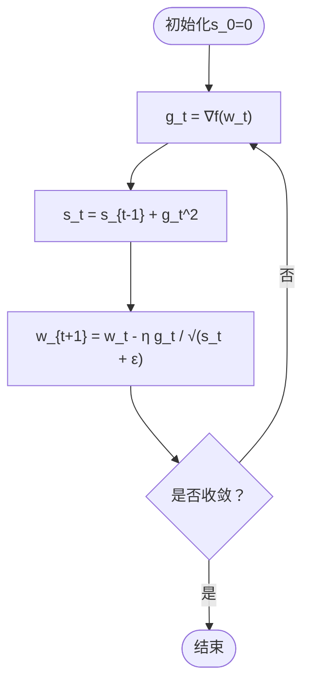

**图表来源** 
- [chapter_optimization/adagrad.ipynb](file://chapter_optimization/adagrad.ipynb)

**章节来源**
- [chapter_optimization/adagrad.ipynb](file://chapter_optimization/adagrad.ipynb)

### RMSProp
- 设计：对平方梯度进行指数滑动平均 r_t = β r_{t-1} + (1-β) g_t^2，更新 w_{t+1} = w_t - η g_t / √(r_t + ε)。
- 优势：避免学习率单调衰减，适合非平稳目标与循环网络。

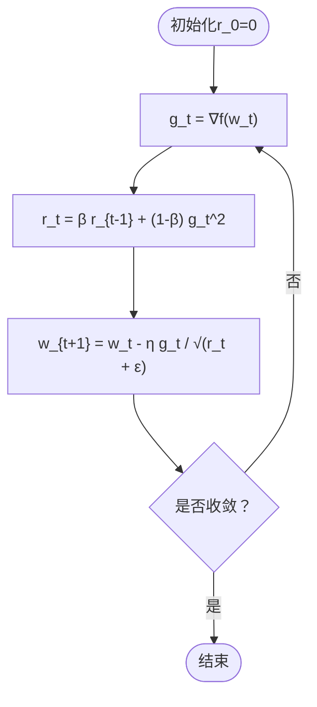

**图表来源** 
- [chapter_optimization/rmsprop.ipynb](file://chapter_optimization/rmsprop.ipynb)

**章节来源**
- [chapter_optimization/rmsprop.ipynb](file://chapter_optimization/rmsprop.ipynb)

### Adam
- 设计：维护一阶矩 m_t = β1 m_{t-1} + (1-β1) g_t 与二阶矩 v_t = β2 v_{t-1} + (1-β2) g_t^2，并进行偏差校正后更新。
- 适用性：广泛作为默认优化器，兼顾速度与稳定性。

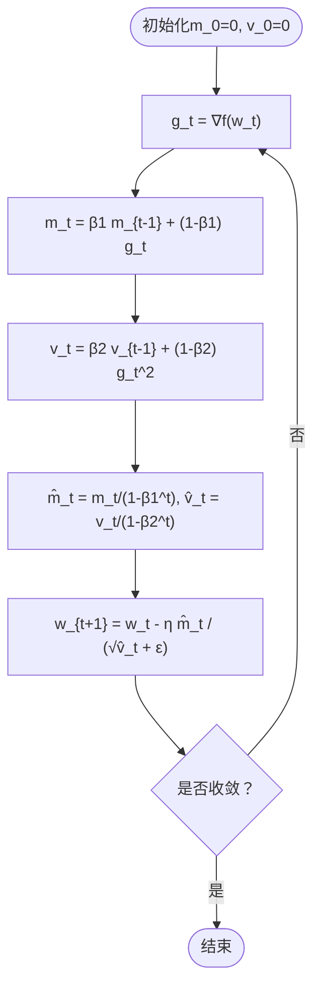

**图表来源** 
- [chapter_optimization/adam.ipynb](file://chapter_optimization/adam.ipynb)

**章节来源**
- [chapter_optimization/adam.ipynb](file://chapter_optimization/adam.ipynb)

### AdaDelta
- 设计：无需全局学习率，维护梯度与参数更新的指数滑动平均，通过比值自适应步长。
- 特点：对超参数不敏感，适合难以调参的场景。

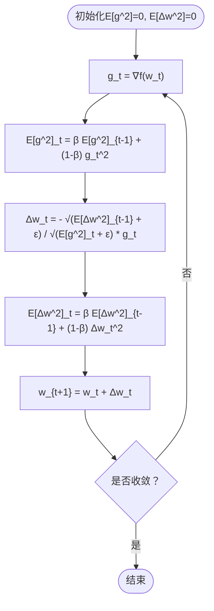

**图表来源** 
- [chapter_optimization/adadelta.ipynb](file://chapter_optimization/adadelta.ipynb)

**章节来源**
- [chapter_optimization/adadelta.ipynb](file://chapter_optimization/adadelta.ipynb)

### 学习率调度器
- 策略：预热（warmup）、线性/指数衰减、余弦退火、周期性重启等。
- 作用：控制探索与利用的平衡，避免初期不稳定与后期停滞。

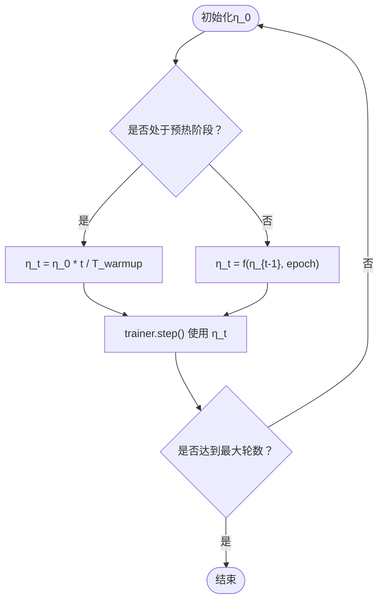

**图表来源** 
- [chapter_optimization/lr-scheduler.ipynb](file://chapter_optimization/lr-scheduler.ipynb)

**章节来源**
- [chapter_optimization/lr-scheduler.ipynb](file://chapter_optimization/lr-scheduler.ipynb)

### 凸性与非凸性
- 凸集与凸函数定义：集合内任意两点连线仍在集合内；函数满足 Jensen 不等式。
- 凸优化优势：局部最优即全局最优，收敛性有严格保证。
- 非凸挑战：存在多个局部极小值与鞍点，需借助噪声、动量与自适应策略跳出不良区域。

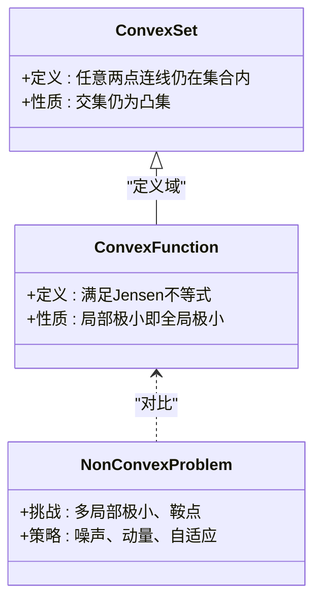

**图表来源** 
- [chapter_optimization/convexity.ipynb](file://chapter_optimization/convexity.ipynb)

**章节来源**
- [chapter_optimization/convexity.ipynb](file://chapter_optimization/convexity.ipynb)

## 依赖关系分析
优化器的实现通常依赖以下模块：
- 数据加载与批处理：提供小批量数据迭代器。
- 模型与前向/反向传播：计算损失与梯度。
- 优化器核心：根据算法维护状态变量并更新参数。
- 学习率调度器：在每个步骤或周期更新学习率。
- 可视化工具：记录损失、准确率与参数轨迹。

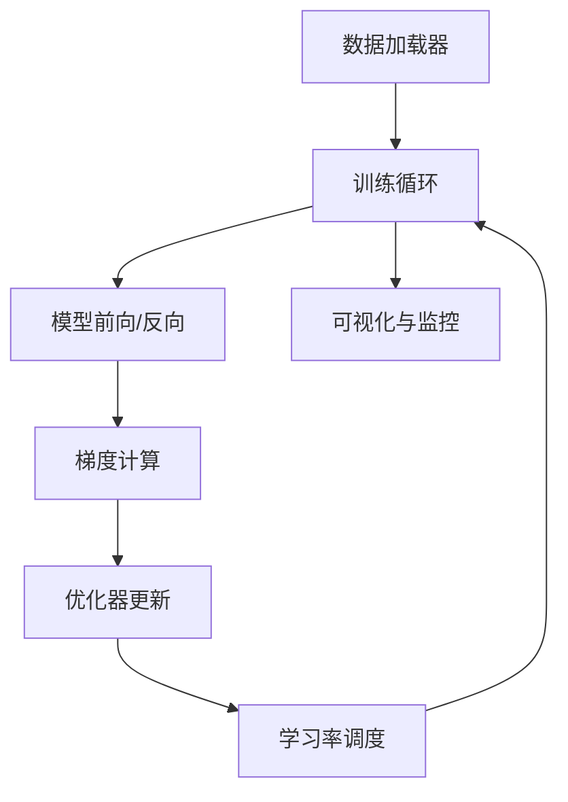

**图表来源** 
- [chapter_optimization/minibatch-sgd.ipynb](file://chapter_optimization/minibatch-sgd.ipynb)
- [chapter_optimization/lr-scheduler.ipynb](file://chapter_optimization/lr-scheduler.ipynb)

**章节来源**
- [chapter_optimization/minibatch-sgd.ipynb](file://chapter_optimization/minibatch-sgd.ipynb)
- [chapter_optimization/lr-scheduler.ipynb](file://chapter_optimization/lr-scheduler.ipynb)

## 性能考虑
- 批大小选择：增大批大小可降低梯度方差并提升吞吐，但受显存限制；需权衡内存与收敛质量。
- 向量化与缓存：优先使用矩阵运算与块级操作，减少 Python 解释器开销。
- 数值稳定性：添加 ε 防止除零，注意梯度裁剪与权重初始化。
- 硬件利用：GPU 并行与多卡扩展，合理划分批次与通信。

[本节为通用指导，不直接分析具体文件]

## 故障排查指南
- 发散或不稳定：检查学习率是否过大、是否存在梯度爆炸；尝试梯度裁剪或降低学习率。
- 收敛缓慢：考虑引入动量或改用自适应优化器；调整批大小与学习率调度策略。
- 过拟合：加入正则化（如权重衰减）、早停或数据增强；观察训练与验证曲线差距。
- 稀疏特征问题：使用 AdaGrad 或 RMSProp；必要时对特征进行归一化。

**章节来源**
- [chapter_optimization/lr-scheduler.ipynb](file://chapter_optimization/lr-scheduler.ipynb)
- [chapter_optimization/adagrad.ipynb](file://chapter_optimization/adagrad.ipynb)
- [chapter_optimization/rmsprop.ipynb](file://chapter_optimization/rmsprop.ipynb)

## 结论
优化算法是深度学习训练的核心。从基础的梯度下降到现代的 Adam，每种方法都有其适用场景与局限。实践中应结合问题特性（如稀疏性、非凸性）、硬件资源与数据规模选择合适的优化器与学习率策略，并通过可视化与监控持续调优，以获得稳定高效的训练过程。

[本节为总结性内容，不直接分析具体文件]

## 附录
- 实验建议：在同一数据集上对比 SGD、Adam、RMSProp 的学习率与批大小敏感性。
- 可视化建议：绘制损失曲线、参数轨迹与学习率变化，辅助诊断训练行为。
- 参考材料：可结合各 Notebook 中的示例与图示进一步复现实验与验证理论。

[本节为补充信息，不直接分析具体文件]