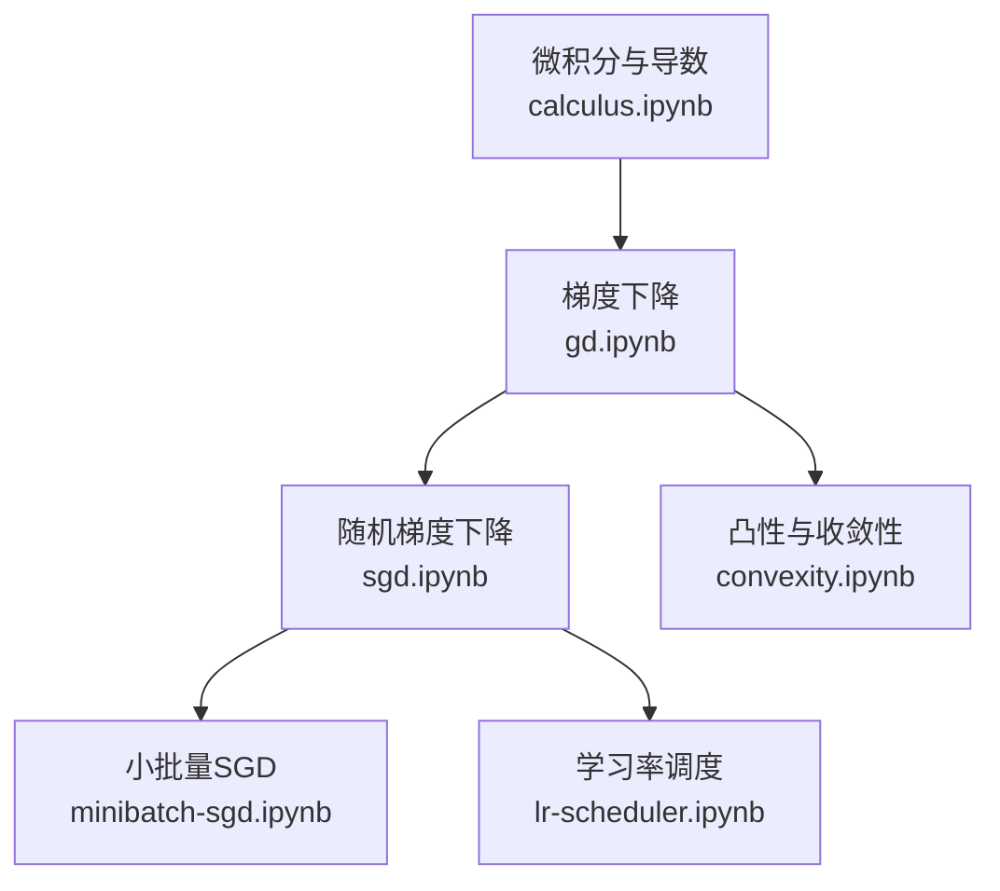
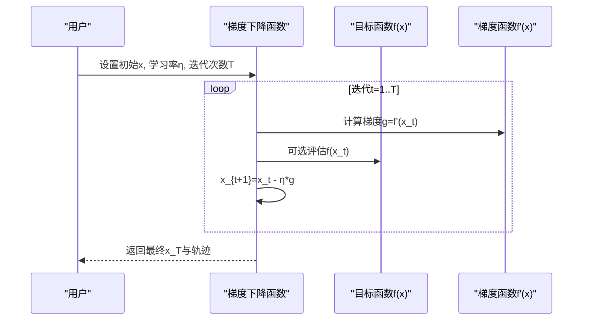
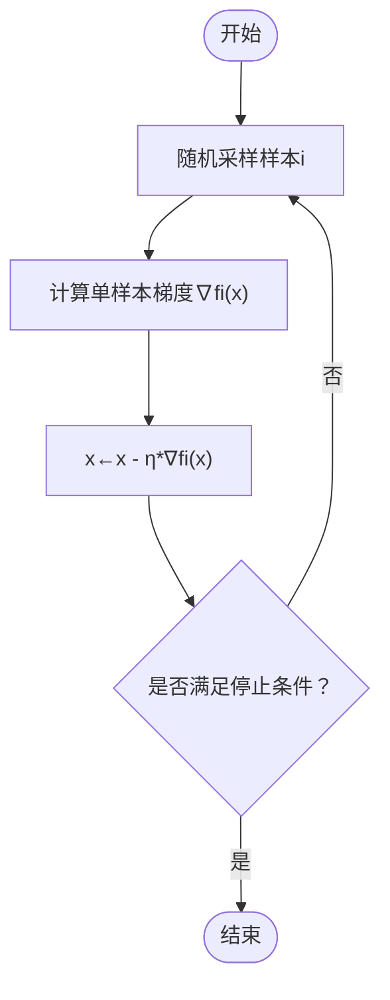
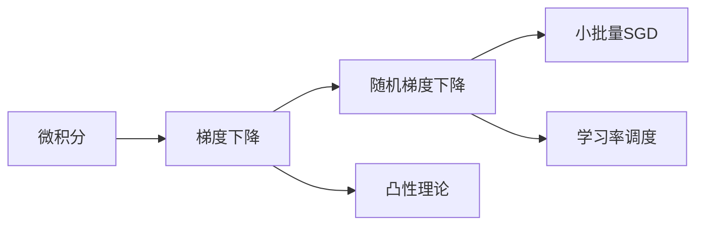

# 梯度下降法

<cite>
**本文引用的文件**   
- [chapter_optimization/gd.ipynb](file://chapter_optimization/gd.ipynb)
- [chapter_optimization/sgd.ipynb](file://chapter_optimization/sgd.ipynb)
- [chapter_optimization/minibatch-sgd.ipynb](file://chapter_optimization/minibatch-sgd.ipynb)
- [chapter_preliminaries/calculus.ipynb](file://chapter_preliminaries/calculus.ipynb)
- [chapter_optimization/convexity.ipynb](file://chapter_optimization/convexity.ipynb)
- [chapter_optimization/lr-scheduler.ipynb](file://chapter_optimization/lr-scheduler.ipynb)
</cite>

## 目录
1. [引言](#引言)
2. [项目结构](#项目结构)
3. [核心组件](#核心组件)
4. [架构总览](#架构总览)
5. [详细组件分析](#详细组件分析)
6. [依赖关系分析](#依赖关系分析)
7. [性能考量](#性能考量)
8. [故障排查指南](#故障排查指南)
9. [结论](#结论)
10. [附录](#附录)

## 引言
本文件围绕“梯度下降法”的系统性知识展开，结合仓库中的优化与微积分材料，给出：
- 数学原理：梯度、方向导数、链式法则；一维与多元函数的梯度下降推导
- 算法实现：数值梯度与解析梯度的对比思路与实践要点
- 可视化：不同函数上的优化轨迹与收敛行为
- 理论概念：局部最优与全局最优、凸性与收敛性
- 调优建议：学习率策略、步长选择、稳定性与收敛速度权衡
- 常见问题：发散、震荡、鞍点、病态条件数的应对

## 项目结构
本仓库以章节化的 Jupyter Notebook 组织内容。与梯度下降相关的核心材料集中在：
- 优化章节：gd.ipynb（梯度下降）、sgd.ipynb（随机梯度下降）、minibatch-sgd.ipynb（小批量SGD）
- 预备知识：calculus.ipynb（微积分基础、导数与可视化）
- 凸性：convexity.ipynb（凸集与凸函数定义及性质）
- 学习率调度：lr-scheduler.ipynb（学习率对训练的影响与调度器使用）

图表来源 
- [chapter_preliminaries/calculus.ipynb](file://chapter_preliminaries/calculus.ipynb)
- [chapter_optimization/gd.ipynb](file://chapter_optimization/gd.ipynb)
- [chapter_optimization/sgd.ipynb](file://chapter_optimization/sgd.ipynb)
- [chapter_optimization/minibatch-sgd.ipynb](file://chapter_optimization/minibatch-sgd.ipynb)
- [chapter_optimization/convexity.ipynb](file://chapter_optimization/convexity.ipynb)
- [chapter_optimization/lr-scheduler.ipynb](file://chapter_optimization/lr-scheduler.ipynb)

章节来源
- [chapter_optimization/gd.ipynb](file://chapter_optimization/gd.ipynb)
- [chapter_preliminaries/calculus.ipynb](file://chapter_preliminaries/calculus.ipynb)

## 核心组件
- 微积分与导数：提供导数定义、数值极限实验、常用求导法则与可视化工具，为理解梯度与方向导数奠定基础
- 梯度下降（GD）：从一维泰勒展开出发，推导参数更新公式，演示目标函数 f(x)=x^2 的迭代过程与可视化
- 随机梯度下降（SGD）：将全量梯度替换为单样本无偏估计，降低每次迭代复杂度至 O(1)，并展示带噪声的更新轨迹
- 小批量 SGD：在计算效率与统计性质之间折中，利用向量化与缓存提升吞吐，同时保持梯度估计的无偏性
- 凸性与收敛性：凸集与凸函数定义，说明凸问题下局部最优即全局最优，有助于理解收敛保证
- 学习率调度：讨论学习率大小、衰减策略、预热与周期性调整对收敛速度与稳定性的影响

章节来源
- [chapter_preliminaries/calculus.ipynb](file://chapter_preliminaries/calculus.ipynb)
- [chapter_optimization/gd.ipynb](file://chapter_optimization/gd.ipynb)
- [chapter_optimization/sgd.ipynb](file://chapter_optimization/sgd.ipynb)
- [chapter_optimization/minibatch-sgd.ipynb](file://chapter_optimization/minibatch-sgd.ipynb)
- [chapter_optimization/convexity.ipynb](file://chapter_optimization/convexity.ipynb)
- [chapter_optimization/lr-scheduler.ipynb](file://chapter_optimization/lr-scheduler.ipynb)

## 架构总览
下图展示了从微积分基础到各类梯度下降算法的知识流与依赖关系。

图表来源 
- [chapter_preliminaries/calculus.ipynb](file://chapter_preliminaries/calculus.ipynb)
- [chapter_optimization/gd.ipynb](file://chapter_optimization/gd.ipynb)
- [chapter_optimization/sgd.ipynb](file://chapter_optimization/sgd.ipynb)
- [chapter_optimization/minibatch-sgd.ipynb](file://chapter_optimization/minibatch-sgd.ipynb)
- [chapter_optimization/convexity.ipynb](file://chapter_optimization/convexity.ipynb)
- [chapter_optimization/lr-scheduler.ipynb](file://chapter_optimization/lr-scheduler.ipynb)

## 详细组件分析

### 微积分与导数基础
- 导数定义与数值极限：通过 h→0 的差分逼近验证导数，帮助理解数值梯度的近似本质
- 常用求导法则：幂律、常数乘、加减乘除法则，为链式法则与多元梯度推导提供基础
- 可视化：绘制函数及其切线，直观解释导数的几何意义（斜率）

章节来源
- [chapter_preliminaries/calculus.ipynb](file://chapter_preliminaries/calculus.ipynb)

### 一维梯度下降推导与实现
- 泰勒展开：f(x+ε)≈f(x)+εf'(x)，取 ε=−ηf'(x) 得到 f(x−ηf'(x))≤f(x)（在小 η 时成立）
- 更新规则：x←x−ηf'(x)，逐步沿负梯度方向移动，直至梯度接近零或达到迭代上限
- 示例函数：f(x)=x^2，解析梯度 f'(x)=2x，初始 x=10，学习率 η=0.2，迭代10次后 x 趋近于 0

图表来源 
- [chapter_optimization/gd.ipynb](file://chapter_optimization/gd.ipynb)

章节来源
- [chapter_optimization/gd.ipynb](file://chapter_optimization/gd.ipynb)

### 多元梯度下降与方向导数
- 多元函数 f(x1,x2,...,xd) 的梯度 ∇f 是各偏导数组成的向量
- 方向导数：沿单位向量 u 的方向导数为 ∇f·u，当 u=−∇f/||∇f|| 时取得最大下降方向
- 更新规则：x←x−η∇f(x)，每一步沿负梯度方向移动固定步长 η

章节来源
- [chapter_optimization/sgd.ipynb](file://chapter_optimization/sgd.ipynb)

### 随机梯度下降（SGD）与无偏估计
- 目标函数为样本损失均值：f(x)=(1/n)∑fi(x)
- 全量梯度复杂度 O(n)，SGD 每次随机采样 i，用 ∇fi(x) 近似 ∇f(x)，复杂度 O(1)
- 无偏性：E[∇fi(x)]=∇f(x)，因此平均意义上是良好估计
- 可视化：添加均值为0、方差为1的噪声模拟随机梯度，观察更新轨迹的抖动与总体趋势

图表来源 
- [chapter_optimization/sgd.ipynb](file://chapter_optimization/sgd.ipynb)

章节来源
- [chapter_optimization/sgd.ipynb](file://chapter_optimization/sgd.ipynb)

### 小批量SGD：向量化与缓存
- 动机：逐样本更新开销大且难以利用硬件并行；全量更新内存与计算压力大
- 折中：使用大小为 b 的小批量，梯度 g=(1/b)∑_{i∈B}∇fi(x)，期望仍为 ∇f(x)
- 性能：矩阵运算按列或分块进行，充分利用CPU/GPU缓存与带宽，显著提升吞吐
- 统计性质：标准差随 b^{-1/2} 减小，平衡计算效率与估计质量

章节来源
- [chapter_optimization/minibatch-sgd.ipynb](file://chapter_optimization/minibatch-sgd.ipynb)

### 凸性与收敛性
- 凸集：任意两点连线仍在集合内
- 凸函数：λf(x)+(1−λ)f(x')≥f(λx+(1−λ)x')，凸问题下局部极小即全局极小
- 对优化意义：若目标函数凸，则梯度下降可保证收敛到全局最优（在适当学习率条件下）

章节来源
- [chapter_optimization/convexity.ipynb](file://chapter_optimization/convexity.ipynb)

### 学习率调度与稳定性
- 学习率大小：过大导致发散，过小导致收敛慢或陷入次优
- 衰减策略：需要足够慢的衰减以保证凸问题的收敛性（如比 O(t^{-1/2}) 慢）
- 预热与周期性调整：初期预热避免随机初始化带来的无效方向；周期性调整有助于跳出局部陷阱
- 实践：使用框架内置调度器或自定义函数动态调整 η

章节来源
- [chapter_optimization/lr-scheduler.ipynb](file://chapter_optimization/lr-scheduler.ipynb)

## 依赖关系分析
- 微积分基础为所有优化方法提供数学支撑（导数、链式法则、方向导数）
- 梯度下降是基础，随机与小批量SGD在其上引入统计与工程折中
- 凸性理论为收敛性提供保障；学习率调度直接影响稳定性与收敛速度

图表来源 
- [chapter_preliminaries/calculus.ipynb](file://chapter_preliminaries/calculus.ipynb)
- [chapter_optimization/gd.ipynb](file://chapter_optimization/gd.ipynb)
- [chapter_optimization/sgd.ipynb](file://chapter_optimization/sgd.ipynb)
- [chapter_optimization/minibatch-sgd.ipynb](file://chapter_optimization/minibatch-sgd.ipynb)
- [chapter_optimization/convexity.ipynb](file://chapter_optimization/convexity.ipynb)
- [chapter_optimization/lr-scheduler.ipynb](file://chapter_optimization/lr-scheduler.ipynb)

## 性能考量
- 计算复杂度：全量梯度 O(n)，SGD O(1)，小批量介于两者之间
- 内存与缓存：小批量能更好地利用 CPU/GPU 缓存层次结构与向量化指令
- 统计性质：小批量降低梯度估计方差，提高稳定性
- 硬件特性：矩阵乘法分块与列优先访问模式显著减少内存带宽瓶颈

章节来源
- [chapter_optimization/minibatch-sgd.ipynb](file://chapter_optimization/minibatch-sgd.ipynb)

## 故障排查指南
- 发散或不收敛
  - 检查学习率是否过大；尝试退火或更小的初始学习率
  - 确认梯度计算是否正确（数值梯度与解析梯度对比）
- 震荡或停滞
  - 学习率衰减不足或过早；使用调度器平滑调整
  - 数据未标准化导致病态条件数；对输入特征进行归一化
- 陷入局部最优
  - 增加噪声或采用动量类方法；考虑多起点初始化
  - 使用周期性学习率或权重平均技巧
- 数值不稳定
  - 检查梯度爆炸/消失；使用梯度裁剪或合适的激活函数
  - 注意浮点精度与数值截断误差

章节来源
- [chapter_optimization/lr-scheduler.ipynb](file://chapter_optimization/lr-scheduler.ipynb)
- [chapter_preliminaries/calculus.ipynb](file://chapter_preliminaries/calculus.ipynb)

## 结论
梯度下降法是优化的基石，其数学原理清晰、实现简洁，但在实践中需综合考虑学习率、批大小、数值稳定性与硬件特性。通过微积分基础、凸性理论与学习率调度，可以在不同问题上获得稳健的收敛行为。对于大规模数据，随机与小批量SGD提供了计算与统计之间的有效折中。

## 附录

### 数学原理速览
- 梯度：∇f=[∂f/∂x1, ..., ∂f/∂xd]^T
- 方向导数：Du f(x)=∇f(x)·u，最大下降方向为 −∇f(x)/||∇f(x)||
- 链式法则：复合函数求导时逐层相乘，便于反向传播
- 一维更新：x←x−ηf'(x)
- 多元更新：x←x−η∇f(x)

章节来源
- [chapter_preliminaries/calculus.ipynb](file://chapter_preliminaries/calculus.ipynb)
- [chapter_optimization/gd.ipynb](file://chapter_optimization/gd.ipynb)
- [chapter_optimization/sgd.ipynb](file://chapter_optimization/sgd.ipynb)

### 数值梯度与解析梯度对比思路
- 数值梯度：使用中心差分 (f(x+h)−f(x−h))/(2h) 近似导数，便于验证解析梯度正确性
- 解析梯度：直接对表达式求导，精度高、速度快
- 对比方法：比较两者范数差异，判断实现是否正确；注意 h 的选择与数值误差

章节来源
- [chapter_preliminaries/calculus.ipynb](file://chapter_preliminaries/calculus.ipynb)

### 可视化建议
- 一维函数：绘制 f(x) 曲线与迭代点轨迹，标注梯度方向
- 二维函数：等高线图叠加路径，显示下降方向与收敛区域
- 收敛曲线：记录损失随迭代的变化，观察学习率策略的效果

章节来源
- [chapter_optimization/gd.ipynb](file://chapter_optimization/gd.ipynb)
- [chapter_optimization/sgd.ipynb](file://chapter_optimization/sgd.ipynb)

### 调优建议清单
- 学习率：从小值开始，配合衰减策略；必要时使用预热
- 批大小：根据内存与硬件能力选择，兼顾统计性质与计算效率
- 数据预处理：标准化/归一化，改善条件数
- 监控指标：损失、梯度范数、学习率变化；出现异常及时干预
- 正则化与早停：防止过拟合，提升泛化能力

章节来源
- [chapter_optimization/lr-scheduler.ipynb](file://chapter_optimization/lr-scheduler.ipynb)
- [chapter_optimization/minibatch-sgd.ipynb](file://chapter_optimization/minibatch-sgd.ipynb)