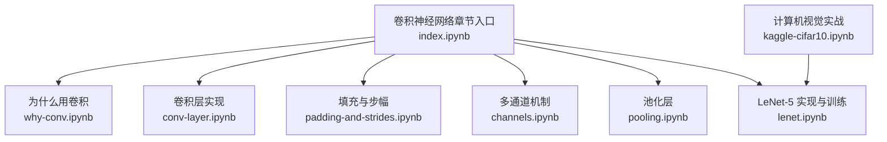
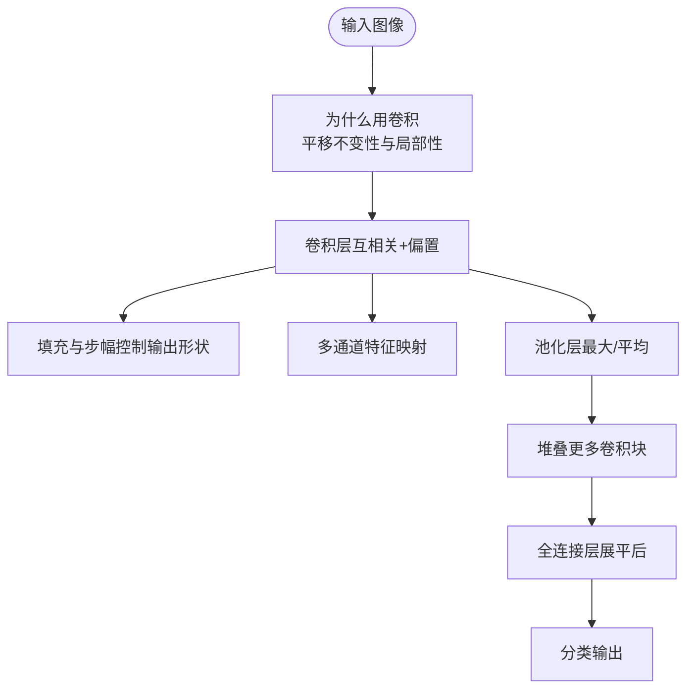
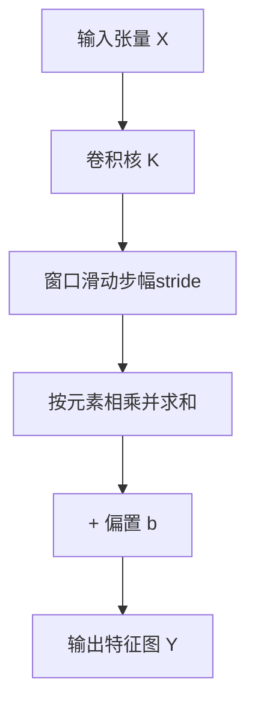
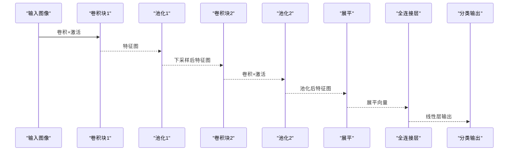
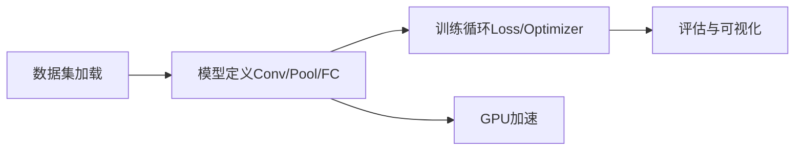

# 卷积神经网络

<cite>
**本文引用的文件**   
- [chapter_convolutional-neural-networks/index.ipynb](file://chapter_convolutional-neural-networks/index.ipynb)
- [chapter_convolutional-neural-networks/why-conv.ipynb](file://chapter_convolutional-neural-networks/why-conv.ipynb)
- [chapter_convolutional-neural-networks/conv-layer.ipynb](file://chapter_convolutional-neural-networks/conv-layer.ipynb)
- [chapter_convolutional-neural-networks/pooling.ipynb](file://chapter_convolutional-neural-networks/pooling.ipynb)
- [chapter_convolutional-neural-networks/channels.ipynb](file://chapter_convolutional-neural-networks/channels.ipynb)
- [chapter_convolutional-neural-networks/padding-and-strides.ipynb](file://chapter_convolutional-neural-networks/padding-and-strides.ipynb)
- [chapter_convolutional-neural-networks/lenet.ipynb](file://chapter_convolutional-neural-networks/lenet.ipynb)
- [chapter_computer-vision/kaggle-cifar10.ipynb](file://chapter_computer-vision/kaggle-cifar10.ipynb)
</cite>

## 目录
1. [引言](#引言)
2. [项目结构](#项目结构)
3. [核心组件](#核心组件)
4. [架构总览](#架构总览)
5. [详细组件分析](#详细组件分析)
6. [依赖关系分析](#依赖关系分析)
7. [性能与内存考量](#性能与内存考量)
8. [故障排查指南](#故障排查指南)
9. [结论](#结论)
10. [附录：实战与可视化](#附录实战与可视化)

## 引言
本章节围绕卷积神经网络（CNN）展开，系统阐述卷积操作的数学原理、计算过程与工程实现；深入讲解LeNet-5的设计思想与完整训练流程；解释CNN为何适合图像数据（局部连接与权值共享的优势）；介绍池化层的作用与类型（最大池化与平均池化）；给出卷积层参数与显存占用的计算方法；提供完整的CNN模型实现与训练步骤；并包含图像分类实战案例与性能优化技巧，以及特征图与卷积核可视化的方法。

## 项目结构
本仓库的“卷积神经网络”主题集中在 chapter_convolutional-neural-networks 目录下，配套有计算机视觉实战示例。关键文件组织如下：
- 概念与动机：why-conv.ipynb
- 卷积层基础：conv-layer.ipynb
- 填充与步幅：padding-and-strides.ipynb
- 多通道机制：channels.ipynb
- 池化层：pooling.ipynb
- 经典网络：lenet.ipynb
- 实战案例：kaggle-cifar10.ipynb

图表来源
- [chapter_convolutional-neural-networks/index.ipynb:1-53](file://chapter_convolutional-neural-networks/index.ipynb#L1-L53)

章节来源
- [chapter_convolutional-neural-networks/index.ipynb:1-53](file://chapter_convolutional-neural-networks/index.ipynb#L1-L53)

## 核心组件
- 互相关运算与卷积层：二维互相关是卷积层的实际计算内核，通过滑动窗口逐位置做点积求和，再叠加偏置得到输出。可手工实现，也可使用框架内置卷积。
- 填充与步幅：填充用于控制边界信息损失与输出尺寸；步幅控制滑动的疏密程度，影响感受野与计算量。
- 多通道：输入通道对应颜色或前一层特征通道，输出通道由不同卷积核学习到的特征映射组成。
- 池化层：对局部区域进行下采样，常用最大池化与平均池化，降低空间分辨率并增强平移鲁棒性。
- LeNet-5：早期成功应用，包含两个卷积块与全连接密集块，配合激活与池化完成手写数字识别。

章节来源
- [chapter_convolutional-neural-networks/conv-layer.ipynb:1-120](file://chapter_convolutional-neural-networks/conv-layer.ipynb#L1-L120)
- [chapter_convolutional-neural-networks/padding-and-strides.ipynb](file://chapter_convolutional-neural-networks/padding-and-strides.ipynb)
- [chapter_convolutional-neural-networks/channels.ipynb](file://chapter_convolutional-neural-networks/channels.ipynb)
- [chapter_convolutional-neural-networks/pooling.ipynb](file://chapter_convolutional-neural-networks/pooling.ipynb)
- [chapter_convolutional-neural-networks/lenet.ipynb](file://chapter_convolutional-neural-networks/lenet.ipynb)

## 架构总览
下图展示从动机到实现的端到端路径：从全连接的局限出发，引入平移不变性与局部性假设，形成卷积层；结合多通道、填充与步幅，构建多层卷积网络；通过池化压缩表示；最终接入全连接层进行分类。

图表来源
- [chapter_convolutional-neural-networks/why-conv.ipynb:1-120](file://chapter_convolutional-neural-networks/why-conv.ipynb#L1-L120)
- [chapter_convolutional-neural-networks/conv-layer.ipynb:1-120](file://chapter_convolutional-neural-networks/conv-layer.ipynb#L1-L120)
- [chapter_convolutional-neural-networks/pooling.ipynb](file://chapter_convolutional-neural-networks/pooling.ipynb)
- [chapter_convolutional-neural-networks/lenet.ipynb](file://chapter_convolutional-neural-networks/lenet.ipynb)

## 详细组件分析

### 卷积操作与互相关
- 数学原理：在离散二维情况下，互相关以卷积核在输入上滑动，逐位置做元素乘加求和，得到输出特征图。严格卷积涉及核翻转，但在深度学习实践中通常直接称互相关为卷积。
- 计算过程：输出尺寸由输入尺寸、卷积核大小、步幅与填充共同决定；每个输出位置的计算复杂度与核面积成正比。
- 边缘检测示例：通过设计特定核（如水平差分核）可实现边缘检测，验证卷积核的学习能力。

图表来源
- [chapter_convolutional-neural-networks/conv-layer.ipynb:1-120](file://chapter_convolutional-neural-networks/conv-layer.ipynb#L1-L120)

章节来源
- [chapter_convolutional-neural-networks/conv-layer.ipynb:1-120](file://chapter_convolutional-neural-networks/conv-layer.ipynb#L1-L120)

### 填充与步幅
- 填充（padding）：在输入边界补零，控制输出尺寸与边界信息保留程度。
- 步幅（stride）：控制窗口移动步长，增大步幅会减小输出尺寸并提升计算效率，同时扩大感受野。
- 输出尺寸公式：给定输入H×W、核kh×kw、步幅s、填充p，输出尺寸为 floor((H + 2p - kh)/s) + 1。

章节来源
- [chapter_convolutional-neural-networks/padding-and-strides.ipynb](file://chapter_convolutional-neural-networks/padding-and-strides.ipynb)

### 多通道机制
- 输入通道：RGB三通道或多层特征通道。
- 输出通道：每个输出通道由一组卷积核学习到的特征映射构成。
- 计算：对每个输出通道，沿输入通道维度做加权求和，再叠加偏置。

章节来源
- [chapter_convolutional-neural-networks/channels.ipynb](file://chapter_convolutional-neural-networks/channels.ipynb)

### 池化层
- 作用：降低空间分辨率、减少参数量与计算量，增强对平移的鲁棒性。
- 类型：最大池化取窗口内最大值；平均池化取窗口内均值。
- 配置：窗口大小与步幅决定下采样比例。

章节来源
- [chapter_convolutional-neural-networks/pooling.ipynb](file://chapter_convolutional-neural-networks/pooling.ipynb)

### LeNet-5 设计与实现
- 结构：两个卷积块（含卷积、激活、池化）+ 三个全连接层（含激活），最后输出类别概率。
- 数据流：输入图像经卷积提取局部特征，池化降采样，展平后进入全连接层进行分类。
- 训练：使用交叉熵损失与小批量随机梯度下降，支持GPU加速。

图表来源
- [chapter_convolutional-neural-networks/lenet.ipynb](file://chapter_convolutional-neural-networks/lenet.ipynb)

章节来源
- [chapter_convolutional-neural-networks/lenet.ipynb](file://chapter_convolutional-neural-networks/lenet.ipynb)

### 为什么CNN适合图像数据
- 平移不变性：同一滤波器在图像各处扫描，无需为每个位置学习独立权重。
- 局部性：每层仅关注局部邻域，符合图像的局部相关性先验。
- 参数效率：相比全连接，卷积显著减少参数数量，利于训练与泛化。

章节来源
- [chapter_convolutional-neural-networks/why-conv.ipynb:1-120](file://chapter_convolutional-neural-networks/why-conv.ipynb#L1-L120)

## 依赖关系分析
- 模块耦合：卷积层依赖填充与步幅配置；池化层依赖卷积输出；多通道贯穿各层；全连接层依赖展平操作。
- 外部依赖：PyTorch框架提供高效卷积、池化与自动微分；d2l工具库提供数据加载与训练辅助函数。
- 典型调用链：数据加载 → 模型定义（卷积/池化/全连接）→ 损失与优化器 → 训练循环 → 评估与可视化。

图表来源
- [chapter_convolutional-neural-networks/lenet.ipynb](file://chapter_convolutional-neural-networks/lenet.ipynb)
- [chapter_computer-vision/kaggle-cifar10.ipynb:1-200](file://chapter_computer-vision/kaggle-cifar10.ipynb#L1-L200)

章节来源
- [chapter_convolutional-neural-networks/lenet.ipynb](file://chapter_convolutional-neural-networks/lenet.ipynb)
- [chapter_computer-vision/kaggle-cifar10.ipynb:1-200](file://chapter_computer-vision/kaggle-cifar10.ipynb#L1-L200)

## 性能与内存考量
- 卷积层参数计算：
  - 单卷积核参数 = 输入通道数 × 核高 × 核宽
  - 总参数 = 输出通道数 × (输入通道数 × 核高 × 核宽) + 输出通道数（偏置）
- 显存占用估算：
  - 激活显存 ≈ 批次大小 × 输出通道数 × 输出高 × 输出宽 × 数据类型字节数
  - 梯度显存 ≈ 激活显存（反向传播需保存中间结果）
- 优化建议：
  - 合理设置步幅与池化窗口，控制特征图尺寸增长
  - 使用分组卷积或深度可分离卷积降低计算量
  - 混合精度训练与梯度累积提升吞吐
  - 数据管道并行与预取减少I/O瓶颈

[本节为通用指导，不直接分析具体文件]

## 故障排查指南
- 尺寸不匹配：检查卷积核大小、步幅、填充与输入通道是否一致；确认展平前的特征图尺寸。
- 训练不稳定：调整学习率、初始化策略（如Kaiming/Xavier）、归一化（BatchNorm）。
- 过拟合：增加正则化（权重衰减、Dropout）、数据增强、早停。
- 显存不足：减小批次大小、使用更小的网络或混合精度训练。

章节来源
- [chapter_convolutional-neural-networks/lenet.ipynb](file://chapter_convolutional-neural-networks/lenet.ipynb)

## 结论
卷积神经网络通过平移不变性与局部性假设，以较少参数高效处理图像数据。卷积层、填充与步幅、多通道、池化层协同工作，构建出强大的特征提取器。LeNet-5作为经典范例，展示了从卷积到全连接的完整流程。结合数据增强、优化策略与可视化技术，可在图像分类任务中取得稳定且高效的性能。

[本节为总结性内容，不直接分析具体文件]

## 附录：实战与可视化

### 图像分类实战（CIFAR-10）
- 数据准备：下载与组织原始图像文件，划分训练/验证集，构建数据加载器。
- 模型训练：定义CNN模型，选择损失函数与优化器，执行多轮训练与验证。
- 提交与评估：生成预测结果并提交至竞赛平台，跟踪准确率变化。

章节来源
- [chapter_computer-vision/kaggle-cifar10.ipynb:1-200](file://chapter_computer-vision/kaggle-cifar10.ipynb#L1-L200)

### 特征图与卷积核可视化
- 特征图可视化：提取中间层输出，按通道绘制热力图，观察边缘、纹理等低级特征的响应。
- 卷积核可视化：将卷积核权重展平为图像形式，观察滤波器模式（如边缘检测、颜色敏感）。
- 工具建议：使用matplotlib或TensorBoard进行可视化，结合Grad-CAM定位重要区域。

章节来源
- [chapter_convolutional-neural-networks/conv-layer.ipynb:1-120](file://chapter_convolutional-neural-networks/conv-layer.ipynb#L1-L120)
- [chapter_convolutional-neural-networks/lenet.ipynb](file://chapter_convolutional-neural-networks/lenet.ipynb)