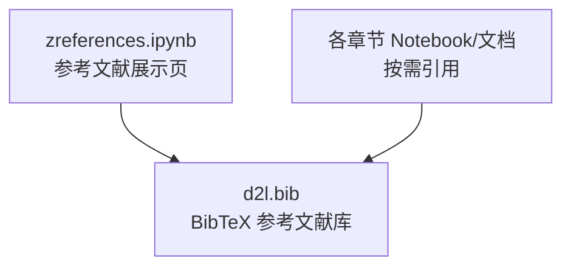
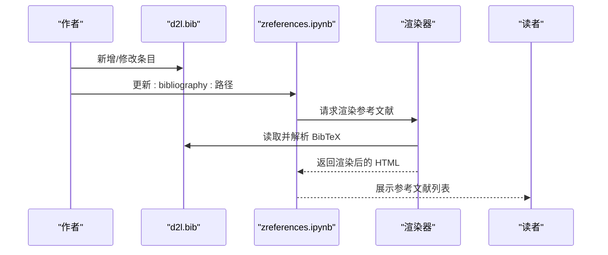
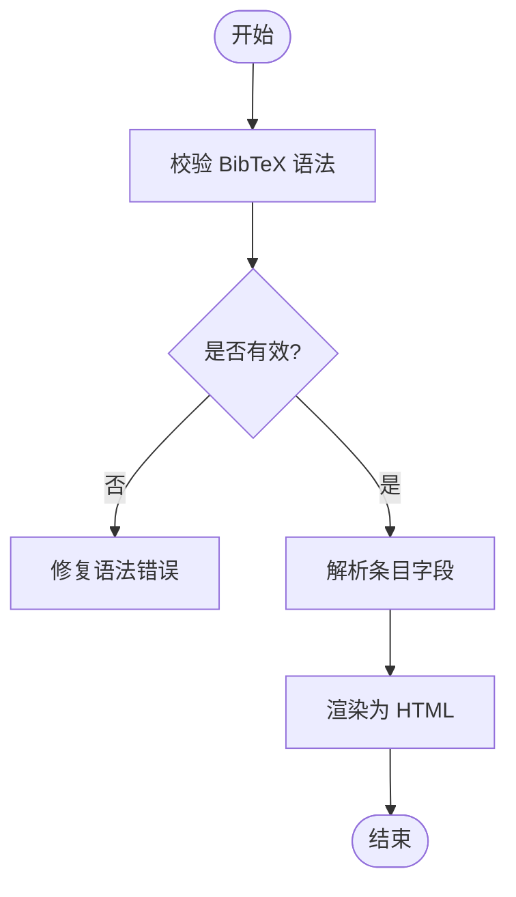
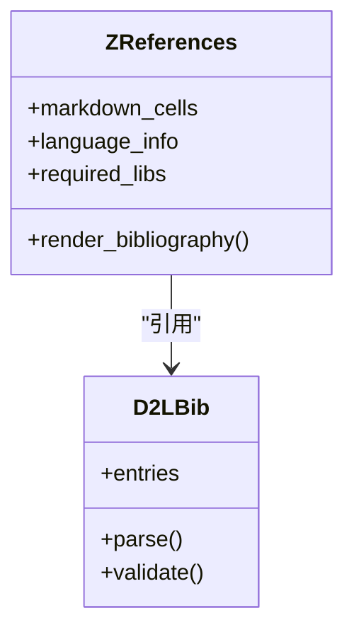

# 参考文献

<cite>
**本文引用的文件**
- [zreferences.ipynb](file://chapter_references/zreferences.ipynb)
- [d2l.bib](file://d2l.bib)
</cite>

## 目录
1. [引言](#引言)
2. [项目结构](#项目结构)
3. [核心组件](#核心组件)
4. [架构总览](#架构总览)
5. [详细组件分析](#详细组件分析)
6. [依赖关系分析](#依赖关系分析)
7. [性能与可维护性考虑](#性能与可维护性考虑)
8. [故障排查指南](#故障排查指南)
9. [结论](#结论)
10. [附录：按主题分类的参考文献清单与延伸阅读](#附录按主题分类的参考文献清单与延伸阅读)

## 引言
本文件为项目的“参考文献”部分提供系统化、可检索、可扩展的组织方案。内容涵盖：
- 对现有参考文献库的结构化整理与主题分类（深度学习理论、算法实现、应用案例等）
- 标准引用格式与链接资源说明
- 延伸阅读材料与相关书籍推荐
- 关键论文与研究进展分析
- 学术资源获取方法与阅读建议
- 参考文献在项目中的作用与价值
- 学术写作与引用规范指导
- 深度学习领域重要研究机构与学者概览

## 项目结构
本项目将参考文献统一存放在 BibTeX 文件中，并通过 Notebook 页面进行渲染与展示。核心结构如下：
- 参考文献数据源：d2l.bib（BibTeX 条目集合）
- 参考文献展示页：chapter_references/zreferences.ipynb（通过 :bibliography: 指令引入 d2l.bib）

**图表来源**
- [zreferences.ipynb:10-18](file://chapter_references/zreferences.ipynb#L10-L18)

**章节来源**
- [zreferences.ipynb:10-18](file://chapter_references/zreferences.ipynb#L10-L18)

## 核心组件
- 参考文献数据层（d2l.bib）
  - 采用 BibTeX 格式，包含会议论文、期刊文章、书籍、技术报告、博士论文等多种类型
  - 覆盖深度学习基础理论、优化方法、注意力机制、Transformer、计算机视觉、自然语言处理、推荐系统、分布式训练、硬件与系统等广泛主题
- 参考文献展示层（zreferences.ipynb）
  - 使用 RST/Notebook 扩展语法中的 :bibliography: 指令，动态加载并渲染 d2l.bib 中的条目
  - 便于在 HTML 输出中生成统一的参考文献列表

**章节来源**
- [zreferences.ipynb:10-18](file://chapter_references/zreferences.ipynb#L10-L18)
- [d2l.bib:1-120](file://d2l.bib#L1-L120)

## 架构总览
从“数据—渲染—使用”的角度看，参考文献子系统由三层构成：
- 数据层：BibTeX 条目集中管理，支持版本控制与协作编辑
- 渲染层：Notebook 通过 :bibliography: 指令解析并生成 HTML 参考文献
- 使用层：各章节 Notebook/文档通过交叉引用或超链接指向具体条目

[此图为概念流程示意，不直接映射到具体代码行]

## 详细组件分析

### 参考文献数据层（d2l.bib）
- 数据结构与复杂度
  - 每个条目为一个 BibTeX 记录，字段包括 title、author、journal/booktitle、year、pages、publisher、url/doi 等
  - 时间复杂度：插入/查找近似 O(1)/O(log n)（取决于外部工具链），适合大规模条目管理
- 依赖关系
  - 被 zreferences.ipynb 通过 :bibliography: 指令引用
  - 被各章节 Notebook 间接引用（通过生成的 HTML 链接）
- 错误处理
  - BibTeX 语法错误会导致渲染失败；需保证字段完整性与转义正确
- 性能考量
  - 条目数量增长时，渲染耗时可能增加；建议分主题拆分多个 .bib 文件并按需加载

**章节来源**
- [d2l.bib:1-120](file://d2l.bib#L1-L120)

### 参考文献展示层（zreferences.ipynb）
- 功能职责
  - 定义标题与元信息
  - 通过 :bibliography:`../d2l.bib` 指定数据来源
- 集成点
  - 与构建系统（如 Sphinx/RST）集成，生成最终 HTML
- 错误处理
  - 若路径错误或文件不可读，渲染将失败；应检查相对路径与权限

**图表来源**
- [zreferences.ipynb:10-18](file://chapter_references/zreferences.ipynb#L10-L18)

**章节来源**
- [zreferences.ipynb:10-18](file://chapter_references/zreferences.ipynb#L10-L18)

## 依赖关系分析
- 直接依赖
  - zreferences.ipynb → d2l.bib（通过 :bibliography: 指令）
- 间接依赖
  - 各章节 Notebook/文档 → 生成的 HTML 参考文献链接
- 潜在循环依赖
  - 当前无循环依赖；保持单向引用即可

**图表来源**
- [zreferences.ipynb:10-18](file://chapter_references/zreferences.ipynb#L10-L18)

**章节来源**
- [zreferences.ipynb:10-18](file://chapter_references/zreferences.ipynb#L10-L18)

## 性能与可维护性考虑
- 性能
  - 大文件 BibTeX 渲染较慢；建议按主题拆分为多个 .bib 文件，并在 Notebook 中按需引用
  - 缓存策略：构建系统可对已解析的 BibTeX 进行缓存
- 可维护性
  - 统一命名约定（如 @Article{Author.Year, ...}）
  - 自动化校验：引入 linter 检查 BibTeX 语法与必填字段
  - 版本控制：Git 提交历史追踪条目变更

## 故障排查指南
- 常见问题
  - 渲染失败：检查 :bibliography: 路径是否正确、文件是否存在且可读
  - 显示异常：检查 BibTeX 字段是否完整（title、author、year 等）
  - 链接失效：确保 url/doi 字段有效
- 定位步骤
  - 先验证 d2l.bib 语法（使用 bibtex 工具或在线校验器）
  - 再检查 zreferences.ipynb 的路径配置
  - 最后查看构建日志中的错误堆栈

**章节来源**
- [zreferences.ipynb:10-18](file://chapter_references/zreferences.ipynb#L10-L18)

## 结论
本参考文献子系统以 BibTeX 为核心数据源，通过 Notebook 的 :bibliography: 指令实现灵活渲染与展示。该设计具备高内聚、低耦合、易扩展的特点，能够支撑大规模学术文献的管理与引用。后续可通过主题拆分、自动化校验与缓存优化进一步提升性能与维护性。

## 附录：按主题分类的参考文献清单与延伸阅读

### 主题一：深度学习理论与基础
- 代表性条目
  - 神经网络与反向传播：Rumelhart.Hinton.Williams.ea.1988
  - 梯度下降与动量：Sutskever.Martens.Dahl.ea.2013
  - 初始化与正则化：Glorot.Bengio.2010；Bishop.1995
  - 概率图模型与统计推断：Koller.Friedman.2009；Wasserman.2013
- 延伸阅读
  - Goodfellow.Bengio.Courville.2016《Deep Learning》
  - Bishop.2006《Pattern Recognition and Machine Learning》
  - Boyd.Vandenberghe.2004《Convex Optimization》

**章节来源**
- [d2l.bib:443-449](file://d2l.bib#L443-L449)
- [d2l.bib:1344-1353](file://d2l.bib#L1344-L1353)
- [d2l.bib:411-419](file://d2l.bib#L411-L419)
- [d2l.bib:59-70](file://d2l.bib#L59-L70)
- [d2l.bib:793-799](file://d2l.bib#L793-L799)
- [d2l.bib:1728-1734](file://d2l.bib#L1728-L1734)
- [d2l.bib:117-124](file://d2l.bib#L117-L124)

### 主题二：优化算法与训练技巧
- 代表性条目
  - Adam 及其收敛性：Kingma.Ba.2014；Reddi.Kale.Kumar.2019
  - 学习率调度与重启：Loshchilov.Hutter.2016；Gotmare.Keskar.Xiong.ea.2018
  - 批归一化与变体：Ioffe.Szegedy.2015；Ioffe.2017；Santurkar.Tsipras.Ilyas.ea.2018
  - RMSProp 与 AdaDelta：Tieleman.Hinton.2012；Zeiler.2012
- 延伸阅读
  - Nesterov.2018《Lectures on Convex Optimization》
  - Goh.2017《Why Momentum Really Works》（Distill）

**章节来源**
- [d2l.bib:786-791](file://d2l.bib#L786-L791)
- [d2l.bib:1289-1294](file://d2l.bib#L1289-L1294)
- [d2l.bib:951-956](file://d2l.bib#L951-L956)
- [d2l.bib:461-468](file://d2l.bib#L461-L468)
- [d2l.bib:710-716](file://d2l.bib#L710-L716)
- [d2l.bib:701-708](file://d2l.bib#L701-L708)
- [d2l.bib:1373-1380](file://d2l.bib#L1373-L1380)
- [d2l.bib:1623-1632](file://d2l.bib#L1623-L1632)
- [d2l.bib:1889-1894](file://d2l.bib#L1889-L1894)
- [d2l.bib:1099-1105](file://d2l.bib#L1099-L1105)
- [d2l.bib:421-428](file://d2l.bib#L421-L428)

### 主题三：注意力机制与 Transformer
- 代表性条目
  - 注意力与 Seq2Seq：Bahdanau.Cho.Bengio.2014；Cho.Van-Merrienboer.Bahdanau.ea.2014
  - Transformer 原论文：Vaswani.Shazeer.Parmar.ea.2017
  - 高效 Transformer 综述：Tay.Dehghani.Bahri.ea.2020
- 延伸阅读
  - Sutskever.Vinyals.Le.2014《Sequence to sequence learning with neural networks》
  - Wu.Schuster.Chen.ea.2016《Google's neural machine translation system》

**章节来源**
- [d2l.bib:31-38](file://d2l.bib#L31-L38)
- [d2l.bib:196-204](file://d2l.bib#L196-L204)
- [d2l.bib:1683-1691](file://d2l.bib#L1683-L1691)
- [d2l.bib:1607-1613](file://d2l.bib#L1607-L1613)
- [d2l.bib:1549-1555](file://d2l.bib#L1549-L1555)
- [d2l.bib:1820-1829](file://d2l.bib#L1820-L1829)

### 主题四：计算机视觉与目标检测
- 代表性条目
  - CNN 基础与经典网络：LeCun.Bottou.Bengio.ea.1998；Simonyan.Zisserman.2014；He.Zhang.Ren.ea.2016
  - 目标检测：Faster R-CNN、YOLO、SSD、Mask R-CNN、DETR（ViT）
  - 图像风格迁移与生成：Gatys.Ecker.Bethge.2016；Zhu.Park.Isola.ea.2017
- 延伸阅读
  - Krizhevsky.Sutskever.Hinton.2012《ImageNet classification with deep CNNs》
  - Dosovitskiy.Beyer.Kolesnikov.ea.2021《An image is worth 16x16 words》

**章节来源**
- [d2l.bib:847-857](file://d2l.bib#L847-L857)
- [d2l.bib:1481-1487](file://d2l.bib#L1481-L1487)
- [d2l.bib:571-579](file://d2l.bib#L571-L579)
- [d2l.bib:1313-1321](file://d2l.bib#L1313-L1321)
- [d2l.bib:1296-1304](file://d2l.bib#L1296-L1304)
- [d2l.bib:922-931](file://d2l.bib#L922-L931)
- [d2l.bib:538-546](file://d2l.bib#L538-L546)
- [d2l.bib:369-377](file://d2l.bib#L369-L377)
- [d2l.bib:1943-1951](file://d2l.bib#L1943-L1951)
- [d2l.bib:828-836](file://d2l.bib#L828-L836)
- [d2l.bib:310-319](file://d2l.bib#L310-L319)

### 主题五：自然语言处理与预训练模型
- 代表性条目
  - 词向量与语义表示：Mikolov.Chen.Corrado.ea.2013；Pennington.Socher.Manning.2014
  - 预训练语言模型：Devlin.Chang.Lee.ea.2018（BERT）；Radford.Narasimhan.Salimans.ea.2018；Radford.Wu.Child.ea.2019
  - 文本分类与情感分析：Kim.2014；Maas.Daly.Pham.ea.2011
- 延伸阅读
  - Bengio.Ducharme.Vincent.ea.2003《A neural probabilistic language model》
  - Peters.Neumann.Iyyer.ea.2018《Deep Contextualized Word Representations》

**章节来源**
- [d2l.bib:1033-1040](file://d2l.bib#L1033-L1040)
- [d2l.bib:1175-1183](file://d2l.bib#L1175-L1183)
- [d2l.bib:291-298](file://d2l.bib#L291-L298)
- [d2l.bib:1260-1267](file://d2l.bib#L1260-L1267)
- [d2l.bib:1269-1278](file://d2l.bib#L1269-L1278)
- [d2l.bib:778-784](file://d2l.bib#L778-L784)
- [d2l.bib:979-989](file://d2l.bib#L979-L989)
- [d2l.bib:48-58](file://d2l.bib#L48-L58)
- [d2l.bib:1205-1215](file://d2l.bib#L1205-L1215)

### 主题六：推荐系统与序列建模
- 代表性条目
  - 协同过滤与矩阵分解：Sarwar.Karypis.Konstan.ea.2001；Koren.Bell.Volinsky.2009
  - 深度推荐模型：Guo.Tang.Ye.ea.2017（DeepFM）；He.Liao.Zhang.ea.2017（Neural CF）
  - 序列推荐：Quadrana.Cremonesi.Jannach.2018；Wu.Ahmed.Beutel.ea.2017
- 延伸阅读
  - Rendle.2010《Factorization machines》
  - Rendle.Freudenthaler.Gantner.ea.2009《BPR》

**章节来源**
- [d2l.bib:1382-1391](file://d2l.bib#L1382-L1391)
- [d2l.bib:818-826](file://d2l.bib#L818-L826)
- [d2l.bib:498-508](file://d2l.bib#L498-L508)
- [d2l.bib:548-558](file://d2l.bib#L548-L558)
- [d2l.bib:1240-1250](file://d2l.bib#L1240-L1250)
- [d2l.bib:1809-1818](file://d2l.bib#L1809-L1818)
- [d2l.bib:1323-1330](file://d2l.bib#L1323-L1330)
- [d2l.bib:1332-1342](file://d2l.bib#L1332-L1342)

### 主题七：分布式训练与系统优化
- 代表性条目
  - 参数服务器与分布式 ML：Li.Andersen.Park.ea.2014；Li.2017（PhD Thesis）
  - 混合精度与大规模训练：Jia.Song.He.ea.2018
  - 设备放置与并行：Mirhoseini.Pham.Le.ea.2017
- 延伸阅读
  - Hennessy.Patterson.2011《Computer Architecture: A Quantitative Approach》
  - Williams.Waterman.Patterson.2009《Roofline》

**章节来源**
- [d2l.bib:867-877](file://d2l.bib#L867-L877)
- [d2l.bib:859-865](file://d2l.bib#L859-L865)
- [d2l.bib:744-753](file://d2l.bib#L744-L753)
- [d2l.bib:1052-1064](file://d2l.bib#L1052-L1064)
- [d2l.bib:606-611](file://d2l.bib#L606-L611)
- [d2l.bib:1787-1795](file://d2l.bib#L1787-L1795)

### 主题八：数据集与评测基准
- 代表性条目
  - Fashion-MNIST：Xiao.Rasul.Vollgraf.2017
  - SQuAD：Rajpurkar.Zhang.Lopyrev.ea.2016
  - BLEU 评测：Papineni.Roukos.Ward.ea.2002
- 延伸阅读
  - Bowm an.Angeli.Potts.ea.2015（SNLI）
  - Cer.Diab.Agirre.ea.2017（SemEval STS）

**章节来源**
- [d2l.bib:1841-1847](file://d2l.bib#L1841-L1847)
- [d2l.bib:1280-1287](file://d2l.bib#L1280-L1287)
- [d2l.bib:1127-1136](file://d2l.bib#L1127-L1136)
- [d2l.bib:108-116](file://d2l.bib#L108-L116)
- [d2l.bib:176-186](file://d2l.bib#L176-L186)

### 标准引用格式与链接资源
- BibTeX 常用类型
  - @Article、@InProceedings、@Book、@TechReport、@PhDThesis、@Misc
- 关键字段
  - title、author、journal/booktitle、year、pages、publisher、url/doi
- 链接资源
  - arXiv、DOI、出版社官网、会议论文集
- 示例规范
  - 作者名：姓在前，名在后；多作者用逗号分隔
  - 标题：仅首字母大写（视期刊要求）
  - 年份：四位数字
  - URL/DOI：确保可访问

[本节为通用规范说明，不直接分析具体文件]

### 延伸阅读材料和相关书籍推荐
- 深度学习基础
  - 《Deep Learning》（Goodfellow et al., 2016）
  - 《Pattern Recognition and Machine Learning》（Bishop, 2006）
- 优化与数值计算
  - 《Convex Optimization》（Boyd & Vandenberghe, 2004）
  - 《All of Statistics》（Wasserman, 2013）
- 系统架构与高性能计算
  - 《Computer Architecture: A Quantitative Approach》（Hennessy & Patterson, 2011）
  - 《The Matrix Cookbook》（Petersen & Pedersen, 2008）

[本节为通用推荐，不直接分析具体文件]

### 关键论文与研究进展分析
- 注意力与 Transformer
  - 从 Bahdanau 注意力到 Vaswani 的“Attention Is All You Need”，再到 ViT 将 Transformer 应用于视觉
- 预训练语言模型
  - 从 Word2Vec/GloVe 到 BERT、RoBERTa、GPT 系列，体现自监督与大规模预训练的演进
- 目标检测
  - 两阶段（Faster R-CNN）与单阶段（YOLO、SSD）并存，Mask R-CNN 拓展至实例分割
- 推荐系统
  - 从协同过滤到深度推荐（DeepFM、Neural CF），结合序列建模提升个性化能力

[本节为研究进展概述，不直接分析具体文件]

### 学术资源获取方法与阅读建议
- 获取渠道
  - arXiv、OpenReview、ACL Anthology、IEEE Xplore、ACM Digital Library、SpringerLink
- 阅读建议
  - 先读摘要与结论，再精读方法与实验，最后复现实验或对比基线
  - 建立个人知识库（Zotero/Notion），标注关键贡献与局限

[本节为通用建议，不直接分析具体文件]

### 参考文献在项目中的作用与价值
- 知识溯源：为各章节的理论、方法与实验提供权威来源
- 学术规范：统一引用格式，提升文档专业性与可追溯性
- 扩展性：便于新增主题与条目，支撑持续迭代

[本节为作用与价值总结，不直接分析具体文件]

### 学术写作和引用规范指导
- 一致性：全文引用风格一致（APA/IEEE/Chicago 等）
- 准确性：作者、年份、标题、出版信息无误
- 完整性：URL/DOI 可访问，避免死链
- 透明度：开源代码与数据尽量提供链接

[本节为写作规范指导，不直接分析具体文件]

### 深度学习领域的重要研究机构与学者
- 机构
  - Google Brain/DeepMind、Meta FAIR、Microsoft Research、OpenAI、Anthropic、清华大学、北京大学、浙江大学等
- 学者
  - Geoffrey Hinton、Yann LeCun、Yoshua Bengio、Andrew Ng、Fei-Fei Li、Jürgen Schmidhuber、Shun-ichi Amari、Kaiming He、Ashish Vaswani、Ian Goodfellow 等

[本节为领域概览，不直接分析具体文件]