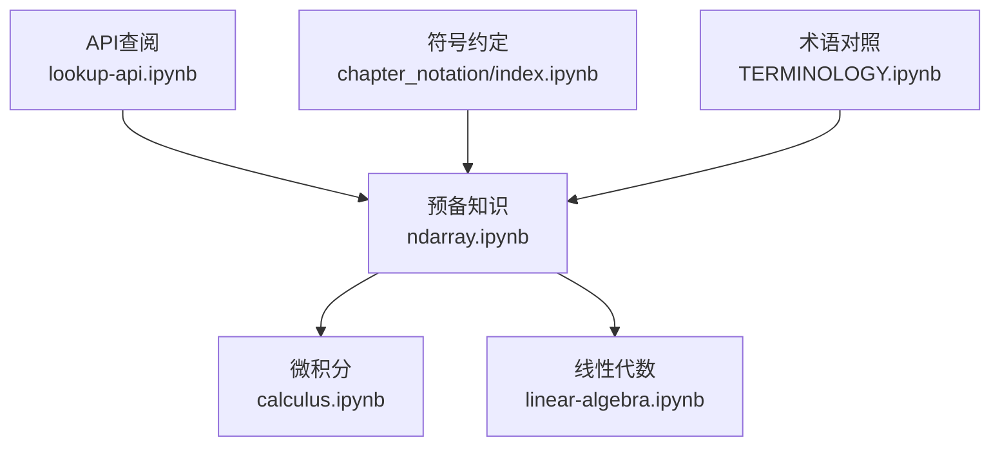
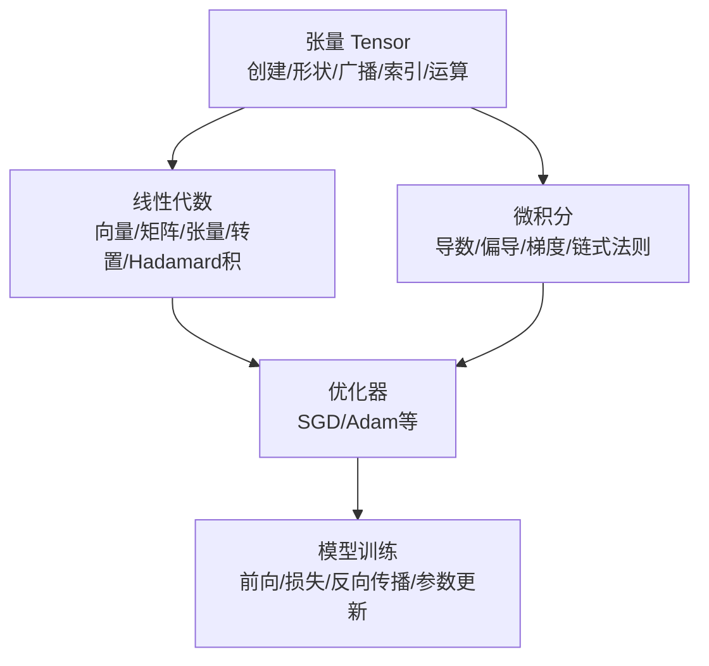
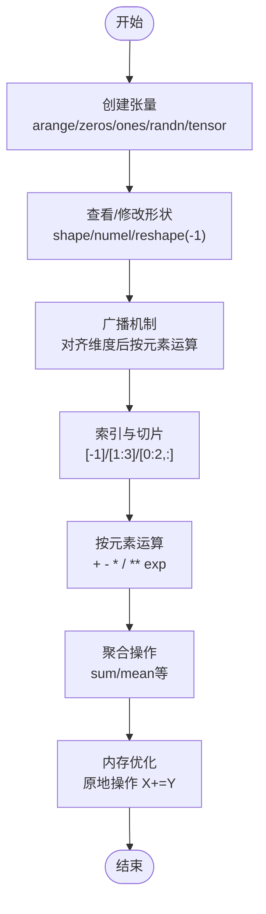
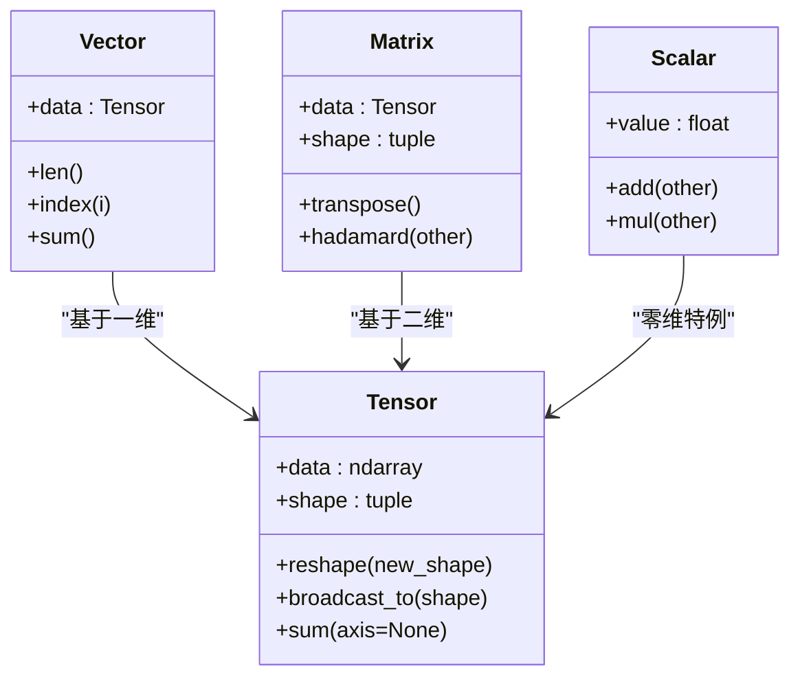
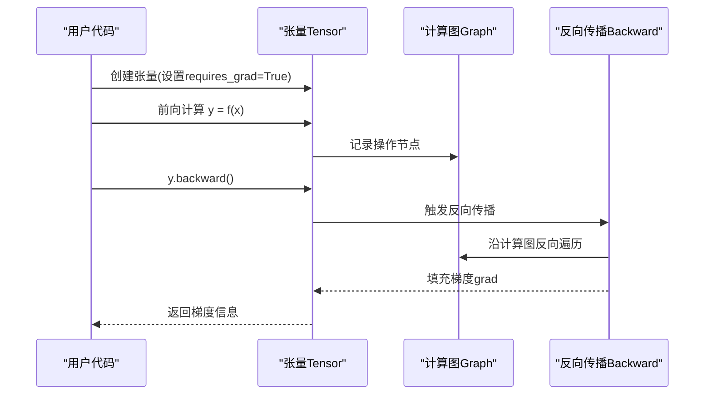
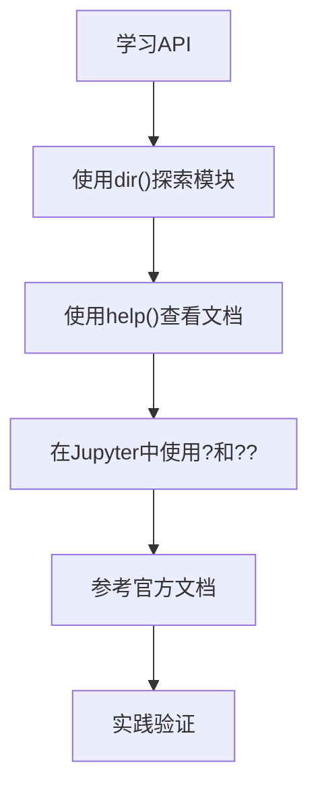
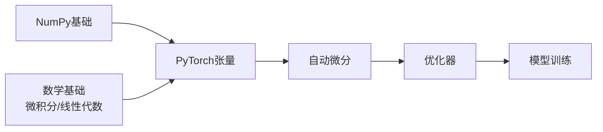

# 基础概念

<cite>
**本文引用的文件**   
- [ndarray.ipynb](file://chapter_preliminaries/ndarray.ipynb)
- [calculus.ipynb](file://chapter_preliminaries/calculus.ipynb)
- [linear-algebra.ipynb](file://chapter_preliminaries/linear-algebra.ipynb)
- [lookup-api.ipynb](file://chapter_preliminaries/lookup-api.ipynb)
- [TERMINOLOGY.ipynb](file://TERMINOLOGY.ipynb)
- [index.ipynb](file://chapter_notation/index.ipynb)
</cite>

## 目录
1. [引言](#引言)
2. [项目结构](#项目结构)
3. [核心组件](#核心组件)
4. [架构总览](#架构总览)
5. [详细组件分析](#详细组件分析)
6. [依赖关系分析](#依赖关系分析)
7. [性能与内存管理](#性能与内存管理)
8. [故障排查指南](#故障排查指南)
9. [结论](#结论)
10. [附录：符号与术语](#附录符号与术语)

## 引言
本章节面向深度学习初学者，系统讲解张量操作、自动微分、线性代数与微积分在深度学习中的核心作用，并结合PyTorch的Tensor数据结构与API进行实践性说明。内容涵盖：
- 张量的创建、形状变换、广播机制、索引切片、按元素运算与聚合
- 微积分基础（导数、偏导数、梯度、链式法则）及其在优化中的作用
- 线性代数对象（标量、向量、矩阵、高阶张量）与常用运算
- 反向传播的数学原理与实现要点（基于自动微分）
- 数值精度问题与内存管理策略
- 常见错误与调试技巧
- 循序渐进的学习路径与代码示例定位

## 项目结构
本仓库以“章节”组织内容，基础概念主要位于“预备知识”与“符号/术语”相关章节：
- 数据与张量操作：chapter_preliminaries/ndarray.ipynb
- 微积分基础：chapter_preliminaries/calculus.ipynb
- 线性代数基础：chapter_preliminaries/linear-algebra.ipynb
- API查阅方法：chapter_preliminaries/lookup-api.ipynb
- 术语对照：TERMINOLOGY.ipynb
- 符号约定：chapter_notation/index.ipynb

**图表来源** 
- [ndarray.ipynb:1-120](file://chapter_preliminaries/ndarray.ipynb#L1-L120)
- [calculus.ipynb:1-120](file://chapter_preliminaries/calculus.ipynb#L1-L120)
- [linear-algebra.ipynb:1-120](file://chapter_preliminaries/linear-algebra.ipynb#L1-L120)
- [lookup-api.ipynb:1-60](file://chapter_preliminaries/lookup-api.ipynb#L1-L60)
- [index.ipynb:1-60](file://chapter_notation/index.ipynb#L1-L60)
- [TERMINOLOGY.ipynb:1-120](file://TERMINOLOGY.ipynb#L1-L120)

**章节来源**
- [ndarray.ipynb:1-120](file://chapter_preliminaries/ndarray.ipynb#L1-L120)
- [calculus.ipynb:1-120](file://chapter_preliminaries/calculus.ipynb#L1-L120)
- [linear-algebra.ipynb:1-120](file://chapter_preliminaries/linear-algebra.ipynb#L1-L120)
- [lookup-api.ipynb:1-60](file://chapter_preliminaries/lookup-api.ipynb#L1-L60)
- [index.ipynb:1-60](file://chapter_notation/index.ipynb#L1-L60)
- [TERMINOLOGY.ipynb:1-120](file://TERMINOLOGY.ipynb#L1-L120)

## 核心组件
- 张量（Tensor）：n维数组，支持GPU加速与自动微分，是深度学习框架的核心数据结构
- 基本操作：创建、形状变换、广播、索引切片、按元素运算、聚合（求和、均值等）
- 微积分工具：导数、偏导数、梯度、链式法则，支撑损失函数与优化算法
- 线性代数：标量、向量、矩阵、高阶张量及转置、Hadamard积等
- 自动微分（Autograd）：通过计算图记录前向操作，调用backward()执行反向传播得到梯度

**章节来源**
- [ndarray.ipynb:1-120](file://chapter_preliminaries/ndarray.ipynb#L1-L120)
- [calculus.ipynb:1-120](file://chapter_preliminaries/calculus.ipynb#L1-L120)
- [linear-algebra.ipynb:1-120](file://chapter_preliminaries/linear-algebra.ipynb#L1-L120)

## 架构总览
下图展示从张量到微积分与线性代数的知识体系，以及它们在深度学习训练流程中的角色。

**图表来源** 
- [ndarray.ipynb:1-120](file://chapter_preliminaries/ndarray.ipynb#L1-L120)
- [linear-algebra.ipynb:1-120](file://chapter_preliminaries/linear-algebra.ipynb#L1-L120)
- [calculus.ipynb:1-120](file://chapter_preliminaries/calculus.ipynb#L1-L120)

## 详细组件分析

### 张量与基本操作
- 张量创建：使用arange、zeros、ones、randn、tensor等函数创建不同初始化的张量
- 形状与大小：shape属性查看维度；numel()获取元素总数；reshape改变形状而不改变元素值
- 广播机制：对不同形状的张量执行按元素运算时，自动扩展至相同形状
- 索引与切片：支持负索引、范围切片、多轴切片与赋值
- 按元素运算：+、-、*、/、**等运算符与exp等一元函数
- 聚合操作：sum等对全张量或指定轴求和
- 内存节省：原地操作（如X += Y）避免额外内存分配

**图表来源** 
- [ndarray.ipynb:90-120](file://chapter_preliminaries/ndarray.ipynb#L90-L120)
- [ndarray.ipynb:220-280](file://chapter_preliminaries/ndarray.ipynb#L220-L280)
- [ndarray.ipynb:730-830](file://chapter_preliminaries/ndarray.ipynb#L730-L830)
- [ndarray.ipynb:830-980](file://chapter_preliminaries/ndarray.ipynb#L830-L980)
- [ndarray.ipynb:980-1130](file://chapter_preliminaries/ndarray.ipynb#L980-L1130)

**章节来源**
- [ndarray.ipynb:90-120](file://chapter_preliminaries/ndarray.ipynb#L90-L120)
- [ndarray.ipynb:220-280](file://chapter_preliminaries/ndarray.ipynb#L220-L280)
- [ndarray.ipynb:730-830](file://chapter_preliminaries/ndarray.ipynb#L730-L830)
- [ndarray.ipynb:830-980](file://chapter_preliminaries/ndarray.ipynb#L830-L980)
- [ndarray.ipynb:980-1130](file://chapter_preliminaries/ndarray.ipynb#L980-L1130)

### 线性代数基础
- 标量：单元素张量，支持基本算术运算
- 向量：一维张量，长度即维度，可通过索引访问元素
- 矩阵：二维张量，行×列，支持转置、对称性检查
- 高阶张量：三维及以上，常用于图像（高×宽×通道）
- 基本性质：按元素运算保持形状不变；Hadamard积为逐元素相乘
- 降维：对任意张量求和、均值等聚合操作

**图表来源** 
- [linear-algebra.ipynb:1-120](file://chapter_preliminaries/linear-algebra.ipynb#L1-L120)
- [linear-algebra.ipynb:280-420](file://chapter_preliminaries/linear-algebra.ipynb#L280-L420)
- [linear-algebra.ipynb:520-600](file://chapter_preliminaries/linear-algebra.ipynb#L520-L600)
- [linear-algebra.ipynb:740-800](file://chapter_preliminaries/linear-algebra.ipynb#L740-L800)

**章节来源**
- [linear-algebra.ipynb:1-120](file://chapter_preliminaries/linear-algebra.ipynb#L1-L120)
- [linear-algebra.ipynb:280-420](file://chapter_preliminaries/linear-algebra.ipynb#L280-L420)
- [linear-algebra.ipynb:520-600](file://chapter_preliminaries/linear-algebra.ipynb#L520-L600)
- [linear-algebra.ipynb:740-800](file://chapter_preliminaries/linear-algebra.ipynb#L740-L800)

### 微积分与自动微分
- 导数：函数在某点的瞬时变化率，几何意义为切线斜率
- 偏导数：多元函数对单个变量的导数，其他变量视为常数
- 梯度：多元函数对所有变量的偏导数组成的向量
- 链式法则：复合函数的导数等于各层导数的乘积
- 自动微分：通过记录计算图，反向传播高效计算梯度

**图表来源** 
- [calculus.ipynb:1-120](file://chapter_preliminaries/calculus.ipynb#L1-L120)
- [calculus.ipynb:1120-1200](file://chapter_preliminaries/calculus.ipynb#L1120-L1200)

**章节来源**
- [calculus.ipynb:1-120](file://chapter_preliminaries/calculus.ipynb#L1-L120)
- [calculus.ipynb:1120-1200](file://chapter_preliminaries/calculus.ipynb#L1120-L1200)

### API查阅与学习路径
- 使用dir()查看模块属性和函数
- 使用help()或?指令查看函数文档
- 在Jupyter中使用??查看源码实现
- 官方文档提供大量示例和详细说明

**图表来源** 
- [lookup-api.ipynb:1-120](file://chapter_preliminaries/lookup-api.ipynb#L1-L120)

**章节来源**
- [lookup-api.ipynb:1-120](file://chapter_preliminaries/lookup-api.ipynb#L1-L120)

## 依赖关系分析
- 张量操作依赖于底层NumPy-like接口，但增加了GPU支持和自动微分
- 微积分概念为优化算法提供理论基础
- 线性代数是神经网络计算的数学基础
- 自动微分连接前向计算与梯度更新

**图表来源** 
- [ndarray.ipynb:1-120](file://chapter_preliminaries/ndarray.ipynb#L1-L120)
- [calculus.ipynb:1-120](file://chapter_preliminaries/calculus.ipynb#L1-L120)
- [linear-algebra.ipynb:1-120](file://chapter_preliminaries/linear-algebra.ipynb#L1-L120)

**章节来源**
- [ndarray.ipynb:1-120](file://chapter_preliminaries/ndarray.ipynb#L1-L120)
- [calculus.ipynb:1-120](file://chapter_preliminaries/calculus.ipynb#L1-L120)
- [linear-algebra.ipynb:1-120](file://chapter_preliminaries/linear-algebra.ipynb#L1-L120)

## 性能与内存管理
- 内存分配：避免不必要的内存分配，使用原地操作减少开销
- 数据类型：选择合适的dtype（float32/float64）平衡精度与速度
- GPU加速：利用CUDA加速大规模张量运算
- 内存共享：torch张量与numpy数组共享底层内存
- 梯度累积：合理使用梯度累积技术处理大批次数据

**章节来源**
- [ndarray.ipynb:980-1130](file://chapter_preliminaries/ndarray.ipynb#L980-L1130)

## 故障排查指南
- 形状不匹配：检查广播规则和张量维度
- 内存不足：减少批次大小或使用原地操作
- 梯度消失/爆炸：检查网络深度和激活函数选择
- 数值不稳定：注意除零、log(0)等边界情况
- 调试技巧：使用print()输出中间结果，逐步验证计算过程

**章节来源**
- [ndarray.ipynb:980-1130](file://chapter_preliminaries/ndarray.ipynb#L980-L1130)
- [calculus.ipynb:1120-1200](file://chapter_preliminaries/calculus.ipynb#L1120-L1200)

## 结论
本章系统介绍了深度学习的基础概念，包括张量操作、微积分基础和线性代数知识。通过这些基础知识，学习者可以：
- 熟练掌握PyTorch张量的创建和操作
- 理解自动微分和反向传播的工作原理
- 应用线性代数知识进行神经网络计算
- 掌握性能优化和内存管理技巧
- 具备独立调试和优化深度学习代码的能力

## 附录：符号与术语
- 数学符号：x(标量)、x(向量)、X(矩阵)、X(张量)
- 集合论：R(实数集)、R^n(n维向量空间)
- 函数与运算符：f(·)(函数)、∇(梯度)、⊙(Hadamard积)
- 微积分：dy/dx(导数)、∂y/∂x(偏导数)、∫(积分)
- 概率与信息论：P(·)(概率分布)、E[f(x)](期望)、H(X)(熵)

**章节来源**
- [index.ipynb:1-94](file://chapter_notation/index.ipynb#L1-L94)
- [TERMINOLOGY.ipynb:1-298](file://TERMINOLOGY.ipynb#L1-L298)