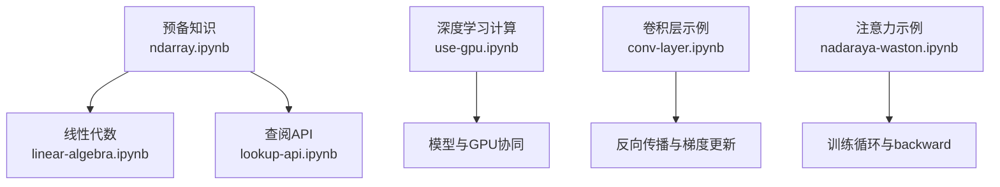
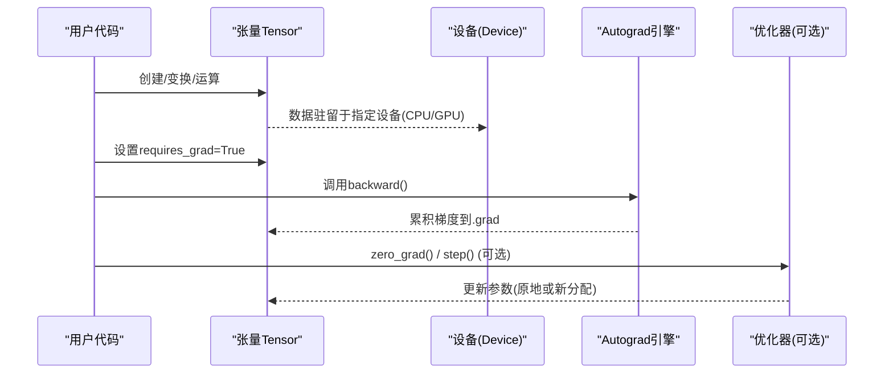
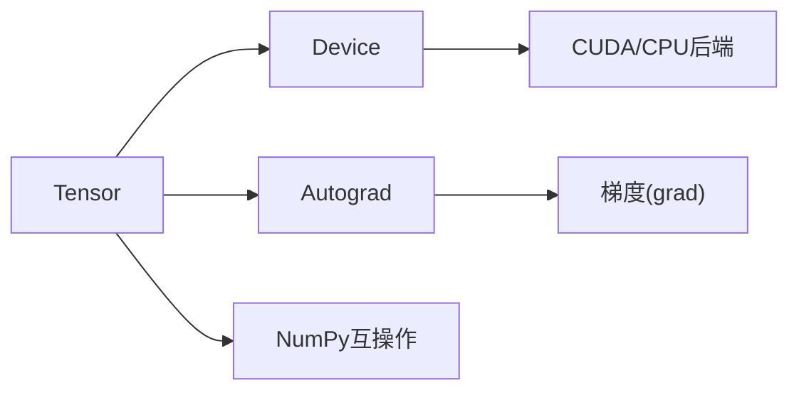

# 张量操作与NDArray

<cite>
**本文引用的文件**
- [ndarray.ipynb](file://chapter_preliminaries/ndarray.ipynb)
- [linear-algebra.ipynb](file://chapter_preliminaries/linear-algebra.ipynb)
- [use-gpu.ipynb](file://chapter_deep-learning-computation/use-gpu.ipynb)
- [lookup-api.ipynb](file://chapter_preliminaries/lookup-api.ipynb)
- [conv-layer.ipynb](file://chapter_convolutional-neural-networks/conv-layer.ipynb)
- [nadaraya-waston.ipynb](file://chapter_attention-mechanisms/nadaraya-waston.ipynb)
</cite>

## 目录
1. [简介](#简介)
2. [项目结构](#项目结构)
3. [核心组件](#核心组件)
4. [架构总览](#架构总览)
5. [详细组件分析](#详细组件分析)
6. [依赖关系分析](#依赖关系分析)
7. [性能考量](#性能考量)
8. [故障排查指南](#故障排查指南)
9. [结论](#结论)
10. [附录](#附录)

## 简介
本文件围绕PyTorch张量（Tensor）操作展开，系统讲解张量的数据结构、内存布局、设备（CPU/GPU）差异、创建方式、形状变换、基本运算、广播机制、索引切片、类型转换、自动微分（autograd）、内存管理与性能优化，以及调试技巧与常见问题。内容基于仓库中的示例Notebook进行归纳与可视化说明，帮助读者从入门到进阶高效使用张量。

## 项目结构
本仓库以“章节”组织，与张量操作相关的核心材料集中在：
- 预备知识：张量基础、线性代数、查阅API
- 深度学习计算：GPU使用与设备管理
- 卷积网络：反向传播与梯度更新示例
- 注意力机制：训练循环中backward与参数更新的实践

**图示来源**
- [ndarray.ipynb:1-120](file://chapter_preliminaries/ndarray.ipynb#L1-L120)
- [linear-algebra.ipynb:1-120](file://chapter_preliminaries/linear-algebra.ipynb#L1-L120)
- [use-gpu.ipynb:120-200](file://chapter_deep-learning-computation/use-gpu.ipynb#L120-L200)
- [conv-layer.ipynb:420-440](file://chapter_convolutional-neural-networks/conv-layer.ipynb#L420-L440)
- [nadaraya-waston.ipynb:3790-3810](file://chapter_attention-mechanisms/nadaraya-waston.ipynb#L3790-L3810)

**章节来源**
- [ndarray.ipynb:1-120](file://chapter_preliminaries/ndarray.ipynb#L1-L120)
- [linear-algebra.ipynb:1-120](file://chapter_preliminaries/linear-algebra.ipynb#L1-L120)
- [use-gpu.ipynb:120-200](file://chapter_deep-learning-computation/use-gpu.ipynb#L120-L200)

## 核心组件
- 张量对象与属性：shape、numel()、dtype、device、requires_grad等
- 创建函数：arange、zeros、ones、randn、tensor等
- 形状操作：reshape、view（概念等价）、transpose/T
- 基本运算：按元素加减乘除幂、exp、矩阵乘法、Hadamard积
- 广播机制：不同形状张量的按元素运算
- 索引与切片：单元素访问、范围切片、批量赋值
- 内存与原地操作：避免不必要分配、in-place更新
- 设备与拷贝：CPU/GPU切换、cuda()、to(device)
- 自动微分：requires_grad、backward()、grad、zero_grad()

**章节来源**
- [ndarray.ipynb:90-130](file://chapter_preliminaries/ndarray.ipynb#L90-L130)
- [ndarray.ipynb:220-280](file://chapter_preliminaries/ndarray.ipynb#L220-L280)
- [ndarray.ipynb:460-530](file://chapter_preliminaries/ndarray.ipynb#L460-L530)
- [ndarray.ipynb:720-830](file://chapter_preliminaries/ndarray.ipynb#L720-L830)
- [ndarray.ipynb:830-970](file://chapter_preliminaries/ndarray.ipynb#L830-L970)
- [ndarray.ipynb:970-1140](file://chapter_preliminaries/ndarray.ipynb#L970-L1140)
- [linear-algebra.ipynb:280-420](file://chapter_preliminaries/linear-algebra.ipynb#L280-L420)
- [use-gpu.ipynb:290-360](file://chapter_deep-learning-computation/use-gpu.ipynb#L290-L360)
- [use-gpu.ipynb:440-520](file://chapter_deep-learning-computation/use-gpu.ipynb#L440-L520)

## 架构总览
下图展示张量在CPU/GPU上的存储与计算流程，以及自动微分的调用链。

**图示来源**
- [use-gpu.ipynb:290-360](file://chapter_deep-learning-computation/use-gpu.ipynb#L290-L360)
- [conv-layer.ipynb:420-440](file://chapter_convolutional-neural-networks/conv-layer.ipynb#L420-L440)
- [nadaraya-waston.ipynb:3790-3810](file://chapter_attention-mechanisms/nadaraya-waston.ipynb#L3790-L3810)

## 详细组件分析

### 张量创建与初始化
- 序列与范围：arange
- 常量填充：zeros、ones
- 随机采样：randn（标准正态）
- 从Python容器构造：tensor(list)
- 指定dtype与device

要点：
- 默认创建在CPU；可通过device参数或后续.to()/cuda()迁移
- dtype影响数值精度与内存占用

**章节来源**
- [ndarray.ipynb:90-130](file://chapter_preliminaries/ndarray.ipynb#L90-L130)
- [ndarray.ipynb:270-320](file://chapter_preliminaries/ndarray.ipynb#L270-L320)
- [ndarray.ipynb:370-420](file://chapter_preliminaries/ndarray.ipynb#L370-L420)
- [ndarray.ipynb:420-460](file://chapter_preliminaries/ndarray.ipynb#L420-L460)

### 形状操作与转置
- reshape：在不改变元素的前提下重排视图
- view：与reshape类似（要求底层连续）
- transpose/T：行列交换

注意：
- reshape/view不复制数据，仅改变步长与偏移
- 某些操作会破坏连续性，导致view失败

**章节来源**
- [ndarray.ipynb:220-280](file://chapter_preliminaries/ndarray.ipynb#L220-L280)
- [linear-algebra.ipynb:360-420](file://chapter_preliminaries/linear-algebra.ipynb#L360-L420)

### 基本运算与广播
- 按元素运算：+ - * / ** 及一元函数如exp
- 矩阵乘法：@或torch.matmul
- Hadamard积：逐元素相乘
- 广播规则：沿长度为1的轴扩展

**章节来源**
- [ndarray.ipynb:460-530](file://chapter_preliminaries/ndarray.ipynb#L460-L530)
- [ndarray.ipynb:720-830](file://chapter_preliminaries/ndarray.ipynb#L720-L830)
- [linear-algebra.ipynb:580-690](file://chapter_preliminaries/linear-algebra.ipynb#L580-L690)

### 索引与切片
- 单元素访问与负索引
- 范围切片与多维切片
- 批量赋值与就地修改

**章节来源**
- [ndarray.ipynb:830-970](file://chapter_preliminaries/ndarray.ipynb#L830-L970)

### 内存管理与原地操作
- 非原地操作可能触发新内存分配
- 原地操作通过切片赋值或+=等减少分配
- 共享内存：torch与numpy之间转换共享底层内存

**章节来源**
- [ndarray.ipynb:970-1140](file://chapter_preliminaries/ndarray.ipynb#L970-L1140)
- [ndarray.ipynb:1140-1200](file://chapter_preliminaries/ndarray.ipynb#L1140-L1200)

### 设备与GPU使用
- device对象表示CPU/GPU
- 查询可用GPU数量
- 将张量移动到GPU：.cuda()或.to(device)
- 同一设备上才能执行运算

**章节来源**
- [use-gpu.ipynb:120-200](file://chapter_deep-learning-computation/use-gpu.ipynb#L120-L200)
- [use-gpu.ipynb:290-360](file://chapter_deep-learning-computation/use-gpu.ipynb#L290-L360)
- [use-gpu.ipynb:440-520](file://chapter_deep-learning-computation/use-gpu.ipynb#L440-L520)

### 自动微分机制
- requires_grad：标记需要梯度的张量
- backward()：反向传播计算梯度
- grad：保存梯度
- zero_grad()：清零梯度（常用于优化器）

典型训练循环：
- 前向计算损失
- 清零梯度
- 反向传播
- 参数更新

**章节来源**
- [conv-layer.ipynb:420-440](file://chapter_convolutional-neural-networks/conv-layer.ipynb#L420-L440)
- [nadaraya-waston.ipynb:3790-3810](file://chapter_attention-mechanisms/nadaraya-waston.ipynb#L3790-L3810)

### 类型转换与标量提取
- torch与numpy互转：.numpy()与torch.tensor(ndarray)
- 标量提取：item()、float()/int()

**章节来源**
- [ndarray.ipynb:1140-1200](file://chapter_preliminaries/ndarray.ipynb#L1140-L1200)

### 查阅API与文档
- dir()列出模块属性
- help()查看函数用法
- Jupyter中?与??快速查看文档与源码

**章节来源**
- [lookup-api.ipynb:30-120](file://chapter_preliminaries/lookup-api.ipynb#L30-L120)
- [lookup-api.ipynb:120-180](file://chapter_preliminaries/lookup-api.ipynb#L120-L180)

## 依赖关系分析
张量操作依赖的核心模块与能力：
- torch.Tensor：数据容器与运算接口
- torch.device：设备抽象（CPU/GPU）
- autograd：自动微分引擎
- numpy：与NumPy互操作

**图示来源**
- [use-gpu.ipynb:120-200](file://chapter_deep-learning-computation/use-gpu.ipynb#L120-L200)
- [ndarray.ipynb:1140-1200](file://chapter_preliminaries/ndarray.ipynb#L1140-L1200)
- [conv-layer.ipynb:420-440](file://chapter_convolutional-neural-networks/conv-layer.ipynb#L420-L440)

**章节来源**
- [use-gpu.ipynb:120-200](file://chapter_deep-learning-computation/use-gpu.ipynb#L120-L200)
- [ndarray.ipynb:1140-1200](file://chapter_preliminaries/ndarray.ipynb#L1140-L1200)

## 性能考量
- 设备间数据传输开销大，应尽量减少频繁拷贝
- 合并小操作为批处理，降低同步与锁竞争
- 优先使用原地操作减少内存分配
- 在GPU上记录日志而非频繁传回CPU
- 合理选择dtype（如float16/bfloat16）以降低显存占用

**章节来源**
- [use-gpu.ipynb:580-620](file://chapter_deep-learning-computation/use-gpu.ipynb#L580-L620)
- [ndarray.ipynb:970-1140](file://chapter_preliminaries/ndarray.ipynb#L970-L1140)

## 故障排查指南
常见问题与解决思路：
- 设备不一致报错：确保参与运算的张量在同一设备
- 内存不足：减少batch size、使用更紧凑dtype、避免不必要的中间变量
- 梯度未更新：检查requires_grad是否开启、是否调用了zero_grad()和backward()
- 视图失败：view要求连续内存，必要时先contiguous()
- 类型不匹配：统一dtype后再运算

定位方法：
- 打印张量的device、dtype、shape
- 使用help()与dir()查阅API
- 逐步缩小问题范围，最小化复现代码

**章节来源**
- [use-gpu.ipynb:440-520](file://chapter_deep-learning-computation/use-gpu.ipynb#L440-L520)
- [lookup-api.ipynb:30-120](file://chapter_preliminaries/lookup-api.ipynb#L30-L120)
- [conv-layer.ipynb:420-440](file://chapter_convolutional-neural-networks/conv-layer.ipynb#L420-L440)

## 结论
张量是深度学习框架的核心数据结构，掌握其创建、形状变换、运算、广播、索引、内存管理、设备迁移与自动微分，是高效构建与优化模型的基础。结合仓库中的示例，读者可快速上手并深入理解张量操作的原理与实践。

## 附录

### 常用操作速查
- 创建：arange、zeros、ones、randn、tensor
- 形状：reshape、view、transpose/T
- 运算：+ - * / **、exp、matmul/@、sum
- 广播：自动扩展长度为1的轴
- 索引：单元素、范围、批量赋值
- 内存：原地操作、共享内存
- 设备：device、.cuda()、.to(device)
- 自动微分：requires_grad、backward()、grad、zero_grad()

**章节来源**
- [ndarray.ipynb:90-130](file://chapter_preliminaries/ndarray.ipynb#L90-L130)
- [ndarray.ipynb:220-280](file://chapter_preliminaries/ndarray.ipynb#L220-L280)
- [ndarray.ipynb:460-530](file://chapter_preliminaries/ndarray.ipynb#L460-L530)
- [ndarray.ipynb:720-830](file://chapter_preliminaries/ndarray.ipynb#L720-L830)
- [ndarray.ipynb:830-970](file://chapter_preliminaries/ndarray.ipynb#L830-L970)
- [ndarray.ipynb:970-1140](file://chapter_preliminaries/ndarray.ipynb#L970-L1140)
- [use-gpu.ipynb:290-360](file://chapter_deep-learning-computation/use-gpu.ipynb#L290-L360)
- [conv-layer.ipynb:420-440](file://chapter_convolutional-neural-networks/conv-layer.ipynb#L420-L440)
- [nadaraya-waston.ipynb:3790-3810](file://chapter_attention-mechanisms/nadaraya-waston.ipynb#L3790-L3810)