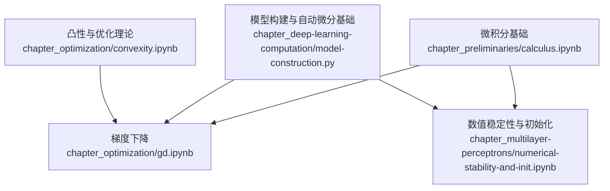
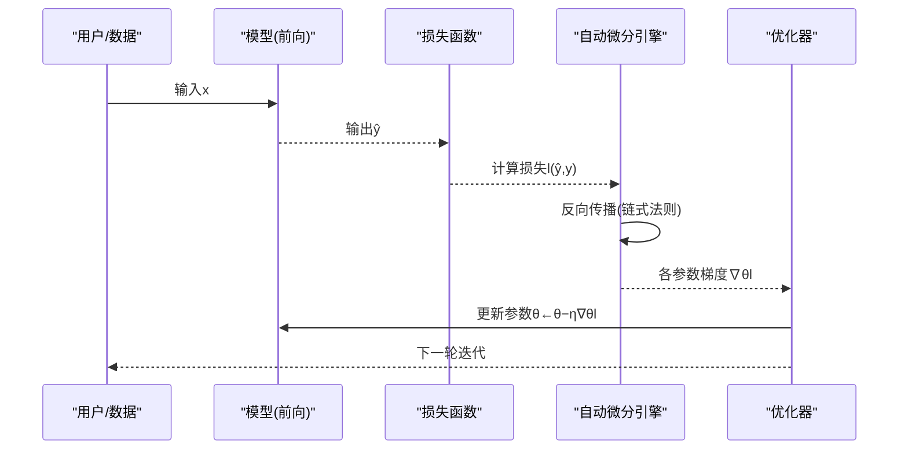
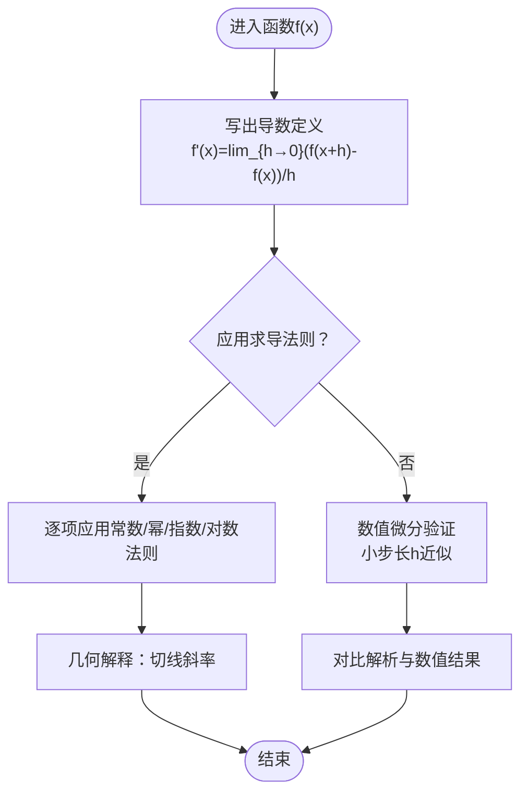
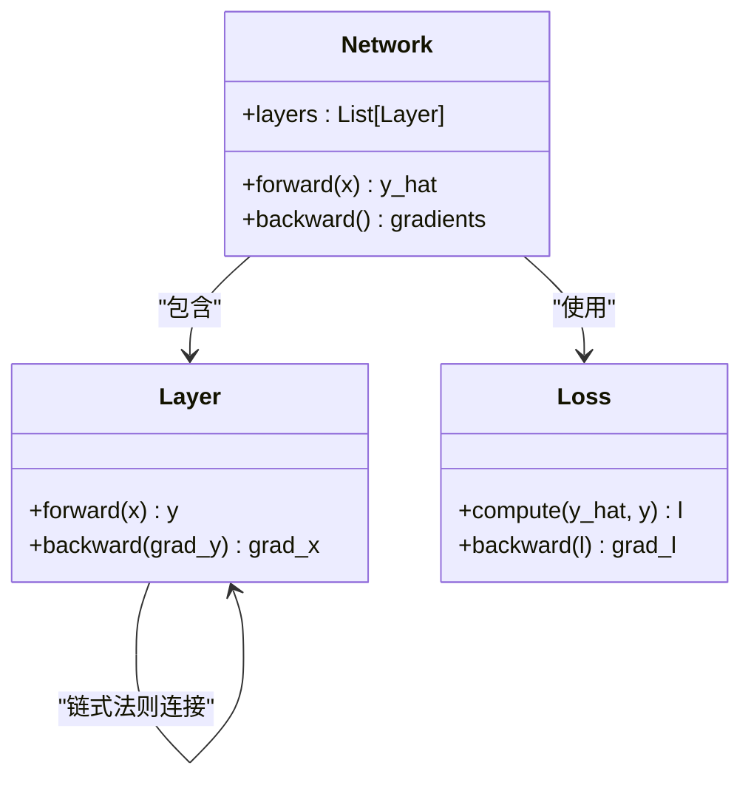
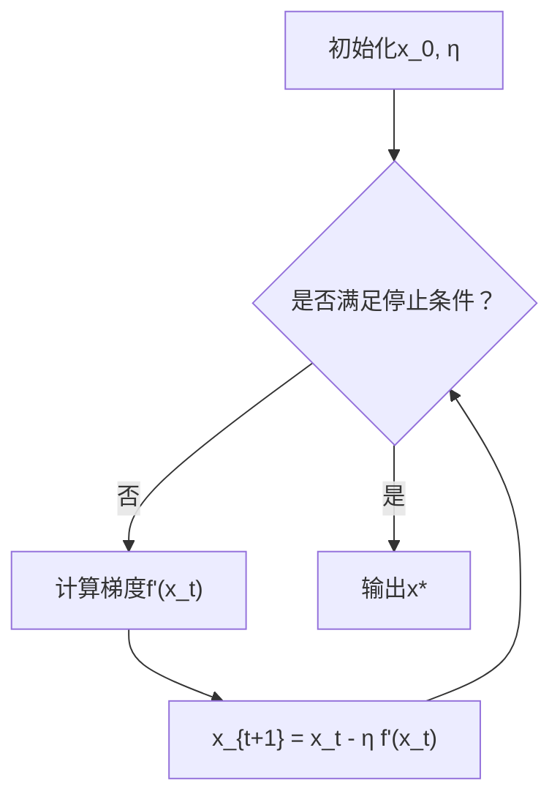
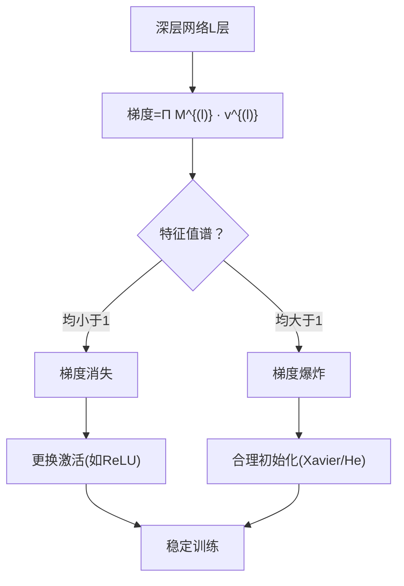
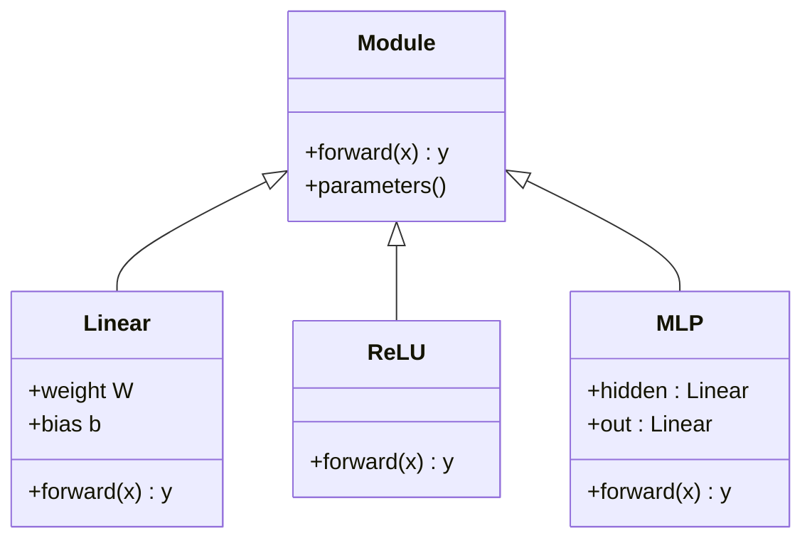
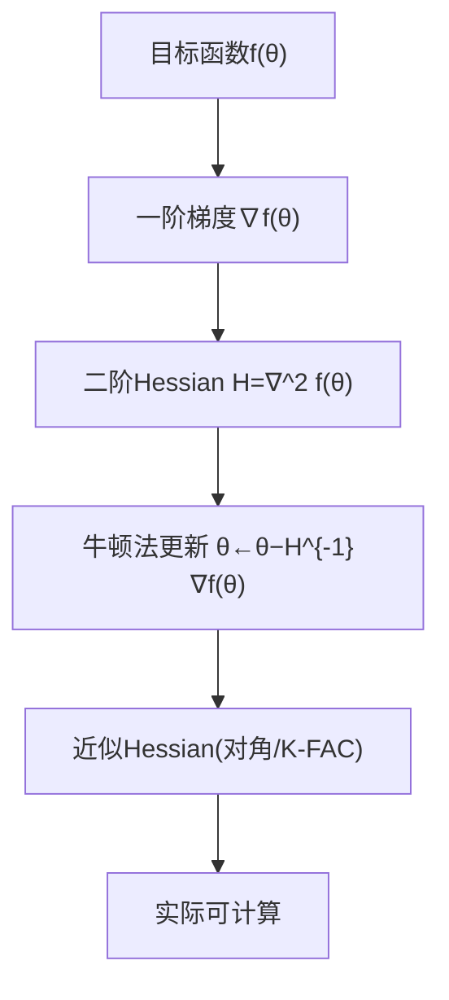
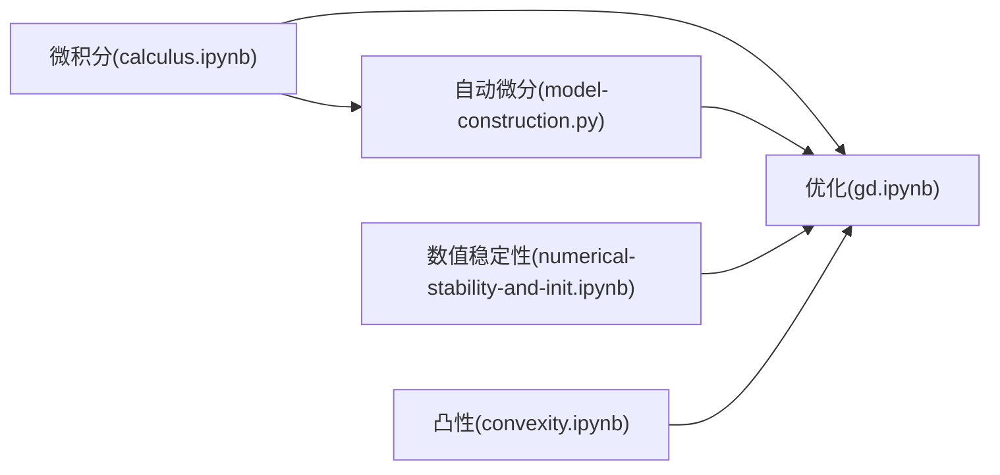

# 微积分基础

<cite>
**本文引用的文件**   
- [calculus.ipynb](file://chapter_preliminaries/calculus.ipynb)
- [gd.ipynb](file://chapter_optimization/gd.ipynb)
- [numerical-stability-and-init.ipynb](file://chapter_multilayer-perceptrons/numerical-stability-and-init.ipynb)
- [model-construction.py](file://chapter_deep-learning-computation/model-construction.py)
- [convexity.ipynb](file://chapter_optimization/convexity.ipynb)
</cite>

## 目录
1. [引言](#引言)
2. [项目结构](#项目结构)
3. [核心组件](#核心组件)
4. [架构总览](#架构总览)
5. [详细组件分析](#详细组件分析)
6. [依赖关系分析](#依赖关系分析)
7. [性能与数值稳定性](#性能与数值稳定性)
8. [故障排查指南](#故障排查指南)
9. [结论](#结论)
10. [附录：公式与可视化清单](#附录公式与可视化清单)

## 引言
本文件围绕深度学习中的微积分概念，系统阐述导数、偏导数、梯度、链式法则与反向传播的数学基础，并扩展到向量/矩阵梯度、高阶导数与Hessian矩阵。结合仓库中的Jupyter Notebook与Python示例，给出数值微分与符号微分的验证思路，解释数值稳定性问题（梯度消失/爆炸）及其缓解策略，并通过损失函数求导与优化算法的应用场景串联理论与实践。

## 项目结构
本项目以章节组织内容，其中与微积分和训练相关的关键材料包括：
- 预备知识：微积分基础（导数、偏导、梯度、链式法则）
- 优化：梯度下降、凸性
- 多层感知机：数值稳定性与初始化（梯度消失/爆炸、Xavier初始化）
- 深度学习计算：模型构建（前向/反向自动微分的基础）

图表来源
- [calculus.ipynb:1-1224](file://chapter_preliminaries/calculus.ipynb#L1-L1224)
- [gd.ipynb:1-800](file://chapter_optimization/gd.ipynb#L1-L800)
- [numerical-stability-and-init.ipynb:1-318](file://chapter_multilayer-perceptrons/numerical-stability-and-init.ipynb#L1-L318)
- [model-construction.py:1-95](file://chapter_deep-learning-computation/model-construction.py#L1-L95)
- [convexity.ipynb:1-200](file://chapter_optimization/convexity.ipynb#L1-L200)

章节来源
- [calculus.ipynb:1-1224](file://chapter_preliminaries/calculus.ipynb#L1-L1224)
- [gd.ipynb:1-800](file://chapter_optimization/gd.ipynb#L1-L800)
- [numerical-stability-and-init.ipynb:1-318](file://chapter_multilayer-perceptrons/numerical-stability-and-init.ipynb#L1-L318)
- [model-construction.py:1-95](file://chapter_deep-learning-computation/model-construction.py#L1-L95)
- [convexity.ipynb:1-200](file://chapter_optimization/convexity.ipynb#L1-L200)

## 核心组件
- 导数与偏导数：单变量导数的极限定义、等价记号与基本求导法则；多元函数的偏导数与梯度向量。
- 链式法则：单变量与多变量的链式法则，为反向传播提供理论基础。
- 梯度下降：基于泰勒展开的一阶近似与迭代更新规则。
- 数值稳定性：梯度消失/爆炸的成因与缓解方法（激活函数选择、参数初始化）。
- 自动微分与模型构建：PyTorch中通过模块与前向计算图实现反向传播。

章节来源
- [calculus.ipynb:40-1199](file://chapter_preliminaries/calculus.ipynb#L40-L1199)
- [gd.ipynb:10-155](file://chapter_optimization/gd.ipynb#L10-L155)
- [numerical-stability-and-init.ipynb:23-287](file://chapter_multilayer-perceptrons/numerical-stability-and-init.ipynb#L23-L287)
- [model-construction.py:14-95](file://chapter_deep-learning-computation/model-construction.py#L14-L95)

## 架构总览
下图展示从“微积分基础”到“优化与训练”的整体流程：微积分提供导数与链式法则，自动微分在前向图中记录操作，反向传播利用链式法则计算梯度，优化器据此更新参数。

图表来源
- [model-construction.py:14-95](file://chapter_deep-learning-computation/model-construction.py#L14-L95)
- [gd.ipynb:10-155](file://chapter_optimization/gd.ipynb#L10-L155)
- [calculus.ipynb:1169-1199](file://chapter_preliminaries/calculus.ipynb#L1169-L1199)

## 详细组件分析

### 导数与偏导数
- 单变量导数：极限定义与几何意义（切线斜率），常用求导法则（常数、幂、指数、对数）及四则运算法则。
- 偏导数：固定其他变量对某一变量求导；等价记号与计算方法。
- 梯度：将各偏导数组合成向量，指向函数增长最快的方向。

图表来源
- [calculus.ipynb:40-1199](file://chapter_preliminaries/calculus.ipynb#L40-L1199)

章节来源
- [calculus.ipynb:40-1199](file://chapter_preliminaries/calculus.ipynb#L40-L1199)

### 链式法则与反向传播
- 单变量链式法则：dy/dx = (dy/du)(du/dx)。
- 多变量链式法则：∂y/∂xi = Σ_j (∂y/∂uj)(∂uj/∂xi)，构成反向传播的核心。
- 在神经网络中，每层的雅可比矩阵相乘形成整体梯度，易导致数值不稳定。

图表来源
- [calculus.ipynb:1169-1199](file://chapter_preliminaries/calculus.ipynb#L1169-L1199)
- [model-construction.py:14-95](file://chapter_deep-learning-computation/model-construction.py#L14-L95)

章节来源
- [calculus.ipynb:1169-1199](file://chapter_preliminaries/calculus.ipynb#L1169-L1199)
- [model-construction.py:14-95](file://chapter_deep-learning-computation/model-construction.py#L14-L95)

### 梯度下降与优化
- 一维梯度下降：基于泰勒展开的一阶近似，沿负梯度方向更新。
- 学习率选择与收敛条件：步长过大导致发散，过小导致收敛缓慢。
- 凸性与非凸性：凸问题保证全局最优，深度学习中多为非凸但局部凸性常见。

图表来源
- [gd.ipynb:10-155](file://chapter_optimization/gd.ipynb#L10-L155)
- [convexity.ipynb:1-200](file://chapter_optimization/convexity.ipynb#L1-L200)

章节来源
- [gd.ipynb:10-155](file://chapter_optimization/gd.ipynb#L10-L155)
- [convexity.ipynb:1-200](file://chapter_optimization/convexity.ipynb#L1-L200)

### 数值稳定性与梯度消失/爆炸
- 深层网络中，梯度由多层雅可比矩阵连乘得到，特征值分布决定放大或缩小。
- sigmoid等饱和激活函数导致梯度接近零（消失）；随机矩阵连乘可能使梯度爆炸。
- 缓解策略：ReLU类激活、Xavier/He初始化、梯度裁剪、归一化技术。

图表来源
- [numerical-stability-and-init.ipynb:23-287](file://chapter_multilayer-perceptrons/numerical-stability-and-init.ipynb#L23-L287)

章节来源
- [numerical-stability-and-init.ipynb:23-287](file://chapter_multilayer-perceptrons/numerical-stability-and-init.ipynb#L23-L287)

### 自动微分与模型构建
- PyTorch中通过nn.Module定义前向计算图，框架自动记录操作并在backward时按链式法则计算梯度。
- 自定义块与嵌套块展示了复杂计算图的构建方式，支持控制流与共享参数。

图表来源
- [model-construction.py:14-95](file://chapter_deep-learning-computation/model-construction.py#L14-L95)

章节来源
- [model-construction.py:14-95](file://chapter_deep-learning-computation/model-construction.py#L14-L95)

### 高阶导数与Hessian矩阵
- Hessian矩阵是二阶偏导数组成的方阵，描述曲率信息，可用于牛顿法等二阶优化。
- 在深度学习中，直接计算Hessian代价高，常采用近似（如K-FAC、对角Hessian）。

图表来源
- [convexity.ipynb:1-200](file://chapter_optimization/convexity.ipynb#L1-L200)

章节来源
- [convexity.ipynb:1-200](file://chapter_optimization/convexity.ipynb#L1-L200)

## 依赖关系分析
- 微积分基础为优化与自动微分提供数学支撑。
- 自动微分依赖前向计算图记录，反向传播依赖链式法则。
- 数值稳定性影响优化收敛，需通过初始化与激活函数设计保障。

图表来源
- [calculus.ipynb:1-1224](file://chapter_preliminaries/calculus.ipynb#L1-L1224)
- [gd.ipynb:1-800](file://chapter_optimization/gd.ipynb#L1-L800)
- [model-construction.py:1-95](file://chapter_deep-learning-computation/model-construction.py#L1-L95)
- [numerical-stability-and-init.ipynb:1-318](file://chapter_multilayer-perceptrons/numerical-stability-and-init.ipynb#L1-L318)
- [convexity.ipynb:1-200](file://chapter_optimization/convexity.ipynb#L1-L200)

章节来源
- [calculus.ipynb:1-1224](file://chapter_preliminaries/calculus.ipynb#L1-L1224)
- [gd.ipynb:1-800](file://chapter_optimization/gd.ipynb#L1-L800)
- [model-construction.py:1-95](file://chapter_deep-learning-computation/model-construction.py#L1-L95)
- [numerical-stability-and-init.ipynb:1-318](file://chapter_multilayer-perceptrons/numerical-stability-and-init.ipynb#L1-L318)
- [convexity.ipynb:1-200](file://chapter_optimization/convexity.ipynb#L1-L200)

## 性能与数值稳定性
- 数值微分：通过有限差分近似导数，用于验证解析梯度，但计算开销大且受步长选择影响。
- 符号微分：通过代数变换得到精确表达式，适合简单函数，难以处理复杂控制流。
- 自动微分：结合两者优点，高效精确地计算梯度，是深度学习训练的核心。
- 稳定性建议：选择合适的激活函数、初始化方案、学习率调度与正则化。

章节来源
- [calculus.ipynb:40-1199](file://chapter_preliminaries/calculus.ipynb#L40-L1199)
- [numerical-stability-and-init.ipynb:23-287](file://chapter_multilayer-perceptrons/numerical-stability-and-init.ipynb#L23-L287)

## 故障排查指南
- 梯度消失：检查激活函数是否饱和（如sigmoid）、权重初始化是否过小、网络过深。
- 梯度爆炸：检查权重初始化是否过大、是否存在未归一化的中间表示、考虑梯度裁剪。
- 不收敛：调整学习率、检查损失函数是否可微、确认数据预处理与标签一致性。
- 数值溢出：使用log-sum-exp技巧、避免极端数值范围、启用混合精度时需监控NaN。

章节来源
- [numerical-stability-and-init.ipynb:23-287](file://chapter_multilayer-perceptrons/numerical-stability-and-init.ipynb#L23-L287)
- [gd.ipynb:10-155](file://chapter_optimization/gd.ipynb#L10-L155)

## 结论
微积分为深度学习提供了导数、梯度与链式法则等核心工具，配合自动微分与优化算法，实现了高效的模型训练。理解数值稳定性问题（梯度消失/爆炸）并采取合适的初始化与激活策略，是训练深层网络的关键。高阶导数与Hessian矩阵为更高级的优化方法奠定基础。通过数值与符号微分验证理论，有助于加深理解与调试实践。

## 附录：公式与可视化清单
- 导数定义与几何意义：切线斜率、数值极限演示
- 偏导数与梯度：向量形式与矩阵求导规则
- 链式法则：单变量与多变量形式
- 梯度下降：一阶泰勒展开与迭代更新
- 数值稳定性：sigmoid梯度曲线、矩阵连乘爆炸演示
- 自动微分：模块构建与前向/反向流程

章节来源
- [calculus.ipynb:40-1199](file://chapter_preliminaries/calculus.ipynb#L40-L1199)
- [gd.ipynb:10-155](file://chapter_optimization/gd.ipynb#L10-L155)
- [numerical-stability-and-init.ipynb:23-287](file://chapter_multilayer-perceptrons/numerical-stability-and-init.ipynb#L23-L287)
- [model-construction.py:14-95](file://chapter_deep-learning-computation/model-construction.py#L14-L95)