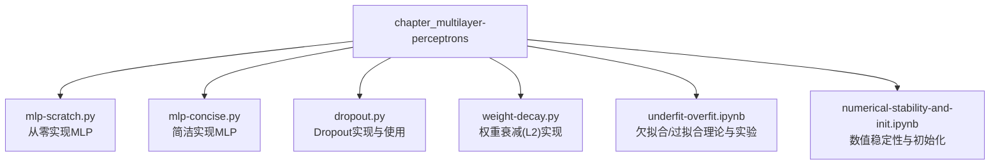
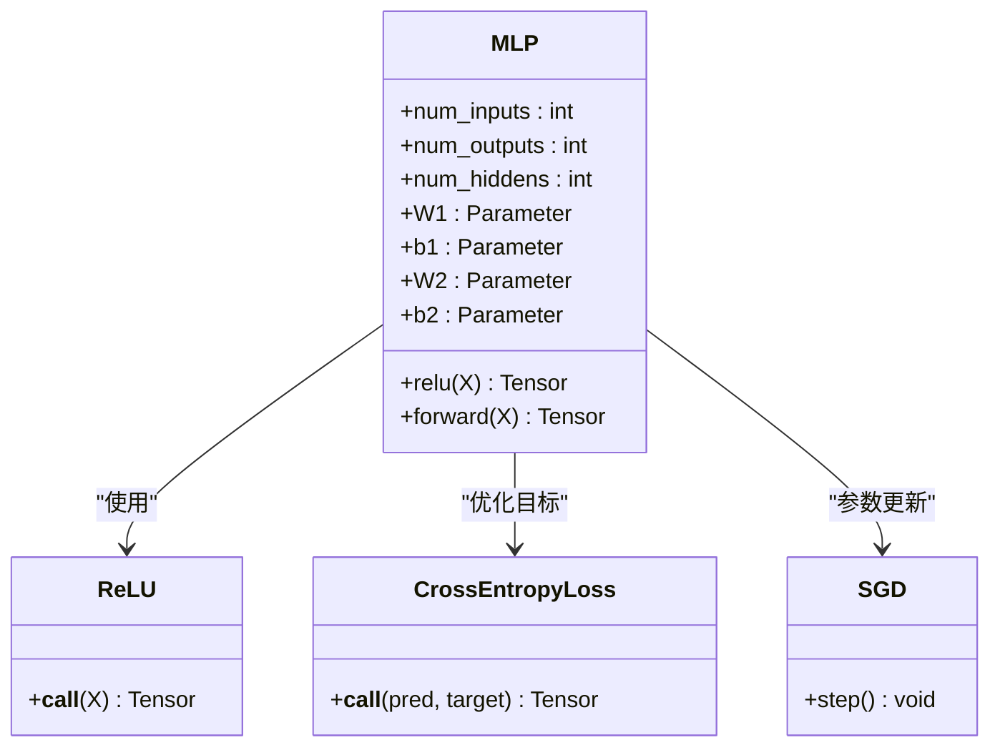
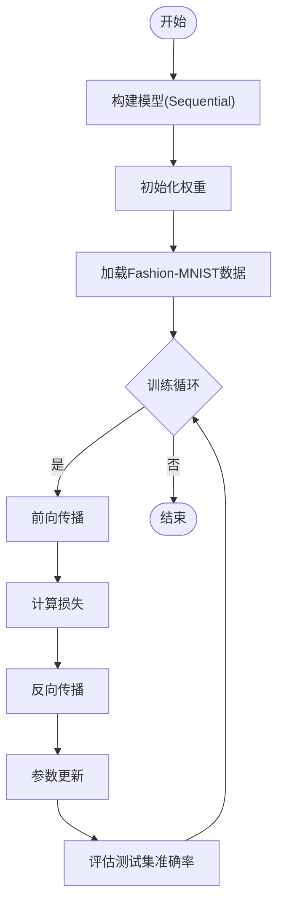
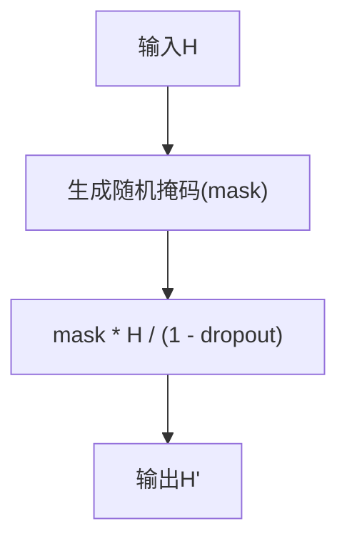
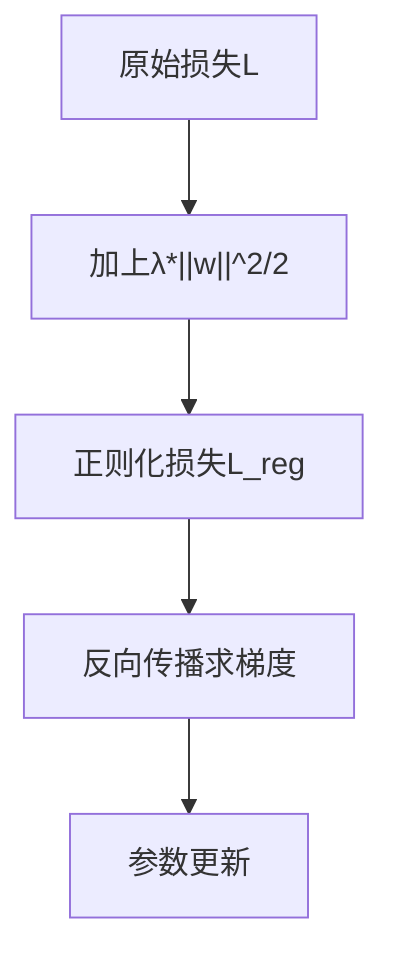
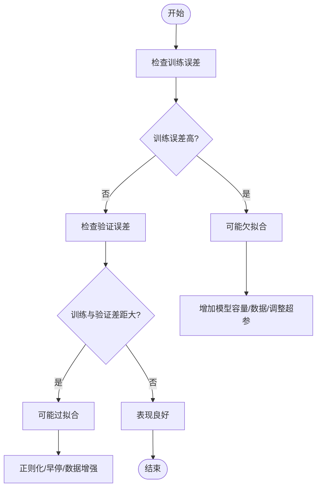
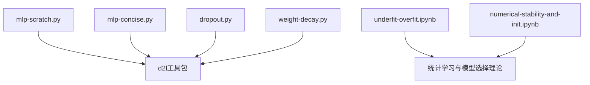

# 多层感知机

<cite>
**本文引用的文件**   
- [mlp-scratch.py](file://chapter_multilayer-perceptrons/mlp-scratch.py)
- [mlp-concise.py](file://chapter_multilayer-perceptrons/mlp-concise.py)
- [dropout.py](file://chapter_multilayer-perceptrons/dropout.py)
- [weight-decay.py](file://chapter_multilayer-perceptrons/weight-decay.py)
- [underfit-overfit.ipynb](file://chapter_multilayer-perceptrons/underfit-overfit.ipynb)
- [numerical-stability-and-init.ipynb](file://chapter_multilayer-perceptrons/numerical-stability-and-init.ipynb)
</cite>

## 目录
1. [引言](#引言)
2. [项目结构](#项目结构)
3. [核心组件](#核心组件)
4. [架构总览](#架构总览)
5. [详细组件分析](#详细组件分析)
6. [依赖关系分析](#依赖关系分析)
7. [性能与数值稳定性](#性能与数值稳定性)
8. [故障排查指南](#故障排查指南)
9. [结论](#结论)
10. [附录：训练流程、监控与可视化](#附录训练流程监控与可视化)

## 引言
本章节围绕多层感知机（MLP）展开，系统讲解网络架构、激活函数选择与作用机制、从零实现前向传播/反向传播/参数更新、Dropout正则化原理与实现、欠拟合与过拟合的诊断与对策、权重衰减（L2正则化）的实现与应用、不同激活函数的对比与适用场景、完整训练过程与性能监控、调参建议与最佳实践，以及数值稳定性问题与初始化策略的重要性。内容基于仓库中的示例代码与实验笔记进行提炼与整合，力求既深入又易于理解。

## 项目结构
本主题涉及的代码与实验位于 chapter_multilayer-perceptrons 目录下，包含从零实现与简洁实现的MLP、Dropout与权重衰减的示例，以及关于欠拟合/过拟合与数值稳定性的理论说明与实践演示。



**图表来源** 
- [mlp-scratch.py:1-69](file://chapter_multilayer-perceptrons/mlp-scratch.py#L1-L69)
- [mlp-concise.py:1-59](file://chapter_multilayer-perceptrons/mlp-concise.py#L1-L59)
- [dropout.py:1-96](file://chapter_multilayer-perceptrons/dropout.py#L1-L96)
- [weight-decay.py:1-100](file://chapter_multilayer-perceptrons/weight-decay.py#L1-L100)
- [underfit-overfit.ipynb:1-800](file://chapter_multilayer-perceptrons/underfit-overfit.ipynb#L1-L800)
- [numerical-stability-and-init.ipynb:1-318](file://chapter_multilayer-perceptrons/numerical-stability-and-init.ipynb#L1-L318)

**章节来源**
- [mlp-scratch.py:1-69](file://chapter_multilayer-perceptrons/mlp-scratch.py#L1-L69)
- [mlp-concise.py:1-59](file://chapter_multilayer-perceptrons/mlp-concise.py#L1-L59)
- [dropout.py:1-96](file://chapter_multilayer-perceptrons/dropout.py#L1-L96)
- [weight-decay.py:1-100](file://chapter_multilayer-perceptrons/weight-decay.py#L1-L100)
- [underfit-overfit.ipynb:1-800](file://chapter_multilayer-perceptrons/underfit-overfit.ipynb#L1-L800)
- [numerical-stability-and-init.ipynb:1-318](file://chapter_multilayer-perceptrons/numerical-stability-and-init.ipynb#L1-L318)

## 核心组件
- 模型定义与参数初始化：包括输入维度、隐藏层维度、输出维度的设定；权重矩阵与偏置向量的随机初始化。
- 激活函数：以ReLU为例，展示非线性变换的作用与实现方式。
- 损失函数：分类任务常用交叉熵损失。
- 优化器与训练循环：小批量SGD迭代更新参数，记录训练损失、训练准确率与测试准确率。
- Dropout正则化：在训练时按概率丢弃神经元，抑制共适应，提升泛化能力。
- 权重衰减（L2正则化）：对权重施加范数惩罚，限制模型复杂度，缓解过拟合。

**章节来源**
- [mlp-scratch.py:19-40](file://chapter_multilayer-perceptrons/mlp-scratch.py#L19-L40)
- [mlp-concise.py:15-32](file://chapter_multilayer-perceptrons/mlp-concise.py#L15-L32)
- [dropout.py:6-16](file://chapter_multilayer-perceptrons/dropout.py#L6-L16)
- [weight-decay.py:23-25](file://chapter_multilayer-perceptrons/weight-decay.py#L23-L25)

## 架构总览
MLP由若干全连接层堆叠而成，每层包含线性变换与非线性激活。典型结构为：输入层→隐藏层(含激活)→…→输出层（分类任务常接Softmax或交叉熵）。



**图表来源** 
- [mlp-scratch.py:29-37](file://chapter_multilayer-perceptrons/mlp-satch.py#L29-L37)
- [mlp-concise.py:16-19](file://chapter_multilayer-perceptrons/mlp-concise.py#L16-L19)

**章节来源**
- [mlp-scratch.py:19-40](file://chapter_multilayer-perceptrons/mlp-scratch.py#L19-L40)
- [mlp-concise.py:15-32](file://chapter_multilayer-perceptrons/mlp-concise.py#L15-L32)

## 详细组件分析

### 从零实现MLP：前向传播、反向传播与参数更新
- 前向传播：将图像展平为一维向量，依次经过线性层与ReLU激活，得到未归一化的类别分数。
- 损失计算：使用交叉熵损失衡量预测与真实标签的差异。
- 反向传播：框架自动计算梯度，通过优化器执行参数更新。
- 训练循环：每个epoch遍历数据批次，累积指标并可视化。

```mermaid
sequenceDiagram
participant Data as "数据批次"
participant Net as "MLP模型"
participant Loss as "交叉熵损失"
participant Opt as "SGD优化器"
Data->>Net : "前向传播(展平+线性+ReLU)"
Net-->>Data : "未归一化分数"
Data->>Loss : "计算损失"
Loss-->>Opt : "反向传播求梯度"
Opt-->>Net : "更新参数(W,b)"
```

**图表来源** 
- [mlp-scratch.py:34-45](file://chapter_multilayer-perceptrons/mlp-scratch.py#L34-L45)

**章节来源**
- [mlp-scratch.py:19-45](file://chapter_multilayer-perceptrons/mlp-scratch.py#L19-L45)

### 简洁实现MLP：模块化构建与训练
- 使用Sequential组合Flatten、Linear、ReLU等模块，简化模型定义。
- 统一训练流程：加载数据、定义损失与优化器、迭代训练并记录指标。



**图表来源** 
- [mlp-concise.py:16-32](file://chapter_multilayer-perceptrons/mlp-concise.py#L16-L32)

**章节来源**
- [mlp-concise.py:15-59](file://chapter_multilayer-perceptrons/mlp-concise.py#L15-L59)

### Dropout正则化：原理与实现
- 原理：训练时按概率随机屏蔽部分神经元，打破特征间的共适应，提高泛化能力；推理时不使用Dropout，并对输出按比例缩放以保持期望一致。
- 实现要点：生成随机掩码、乘以输入并按比例缩放；仅在训练模式启用。



**图表来源** 
- [dropout.py:6-16](file://chapter_multilayer-perceptrons/dropout.py#L6-L16)

**章节来源**
- [dropout.py:6-16](file://chapter_multilayer-perceptrons/dropout.py#L6-L16)
- [dropout.py:35-58](file://chapter_multilayer-perceptrons/dropout.py#L35-L58)

### 权重衰减（L2正则化）：原理与实现
- 原理：在损失函数中加入权重的L2范数项，约束权重大小，降低模型复杂度，缓解过拟合。
- 实现要点：自定义L2惩罚项或在优化器中设置weight_decay；注意通常不对偏置进行衰减。



**图表来源** 
- [weight-decay.py:23-38](file://chapter_multilayer-perceptrons/weight-decay.py#L23-L38)

**章节来源**
- [weight-decay.py:23-38](file://chapter_multilayer-perceptrons/weight-decay.py#L23-L38)
- [weight-decay.py:46-68](file://chapter_multilayer-perceptrons/weight-decay.py#L46-L68)

### 欠拟合与过拟合：诊断与解决方案
- 欠拟合：训练误差与验证误差均较高且差距小，模型表达能力不足。
- 过拟合：训练误差低而验证误差高，模型记忆训练数据而非学习泛化规律。
- 诊断方法：观察训练/验证曲线趋势、比较两者差距、检查模型复杂度与数据量。
- 解决方案：增加模型容量（更多层/单元）、增加数据量、引入正则化（Dropout、权重衰减）、早停法、数据增强等。



**图表来源** 
- [underfit-overfit.ipynb:206-270](file://chapter_multilayer-perceptrons/underfit-overfit.ipynb#L206-L270)

**章节来源**
- [underfit-overfit.ipynb:206-270](file://chapter_multilayer-perceptrons/underfit-overfit.ipynb#L206-L270)

### 激活函数对比与适用场景
- ReLU：计算简单、缓解梯度消失，适合大多数隐藏层。
- Sigmoid：早期常用但易导致梯度消失，现多用于二分类输出或特定场景。
- Tanh：零均值输出，有时比Sigmoid更利于收敛，但仍存在梯度饱和问题。
- 选择原则：隐藏层优先ReLU或其变体（LeakyReLU、ELU等），输出层根据任务选择（分类用Softmax/LogSoftmax，回归用恒等映射）。

**章节来源**
- [mlp-scratch.py:29-31](file://chapter_multilayer-perceptrons/mlp-scratch.py#L29-L31)
- [numerical-stability-and-init.ipynb:58-110](file://chapter_multilayer-perceptrons/numerical-stability-and-init.ipynb#L58-L110)

## 依赖关系分析
- mlp-scratch.py与mlp-concise.py依赖d2l工具包进行数据加载与训练辅助。
- dropout.py与weight-decay.py分别展示了正则化技术的两种常见形式。
- underfit-overfit.ipynb与numerical-stability-and-init.ipynb提供理论基础与实验支撑。



**图表来源** 
- [mlp-scratch.py:1-14](file://chapter_multilayer-perceptrons/mlp-scratch.py#L1-L14)
- [mlp-concise.py:1-14](file://chapter_multilayer-perceptrons/mlp-concise.py#L1-L14)
- [dropout.py:1-4](file://chapter_multilayer-perceptrons/dropout.py#L1-L4)
- [weight-decay.py:1-4](file://chapter_multilayer-perceptrons/weight-decay.py#L1-L4)

**章节来源**
- [mlp-scratch.py:1-14](file://chapter_multilayer-perceptrons/mlp-scratch.py#L1-L14)
- [mlp-concise.py:1-14](file://chapter_multilayer-perceptrons/mlp-concise.py#L1-L14)
- [dropout.py:1-4](file://chapter_multilayer-perceptrons/dropout.py#L1-L4)
- [weight-decay.py:1-4](file://chapter_multilayer-perceptrons/weight-decay.py#L1-L4)

## 性能与数值稳定性
- 数值稳定性：深层网络中梯度相乘可能导致梯度消失或爆炸，需选择合适的激活函数与初始化策略。
- 初始化策略：Xavier初始化保持前向与反向传播的方差稳定，避免梯度异常。
- 性能监控：记录训练损失、训练准确率与测试准确率，绘制曲线观察收敛情况。
- 调参建议：学习率、批大小、隐藏层维度、Dropout比率、权重衰减系数等需协同调整。

**章节来源**
- [numerical-stability-and-init.ipynb:23-110](file://chapter_multilayer-perceptrons/numerical-stability-and-init.ipynb#L23-L110)
- [mlp-scratch.py:47-53](file://chapter_multilayer-perceptrons/mlp-scratch.py#L47-L53)
- [mlp-concise.py:38-44](file://chapter_multilayer-perceptrons/mlp-concise.py#L38-L44)

## 故障排查指南
- 训练不收敛：检查学习率是否过大/过小、损失函数是否正确、数据是否标准化。
- 过拟合严重：增加Dropout比率、增大权重衰减、收集更多数据或使用数据增强。
- 欠拟合明显：增加模型容量（更多层/单元）、延长训练时间、调整激活函数。
- 梯度异常：检查初始化策略、激活函数选择、是否存在数值溢出。

**章节来源**
- [underfit-overfit.ipynb:206-270](file://chapter_multilayer-perceptrons/underfit-overfit.ipynb#L206-L270)
- [numerical-stability-and-init.ipynb:174-280](file://chapter_multilayer-perceptrons/numerical-stability-and-init.ipynb#L174-L280)

## 结论
多层感知机作为基础而强大的模型，其成功依赖于合理的架构设计、激活函数选择、正则化技术与数值稳定性保障。通过从零实现与简洁实现两种方式，可以深入理解前向/反向传播与参数更新机制。Dropout与权重衰减是应对过拟合的有效手段，而欠拟合则需要提升模型容量或数据量。在实践中，应结合训练曲线与验证性能进行调参与诊断，确保模型具有良好的泛化能力。

## 附录：训练流程、监控与可视化
- 训练流程：数据加载→前向传播→损失计算→反向传播→参数更新→指标记录。
- 监控指标：训练损失、训练准确率、测试准确率。
- 可视化：使用Animator或matplotlib绘制训练曲线，直观观察收敛情况。

```mermaid
sequenceDiagram
participant Loop as "训练循环"
participant Batch as "数据批次"
participant Model as "MLP模型"
participant Loss as "损失函数"
participant Optimizer as "优化器"
Loop->>Batch : "获取批次数据"
Batch->>Model : "前向传播"
Model-->>Batch : "预测结果"
Batch->>Loss : "计算损失"
Loss-->>Optimizer : "反向传播"
Optimizer-->>Model : "更新参数"
Loop->>Loop : "记录指标并可视化"
```

**图表来源** 
- [mlp-scratch.py:47-53](file://chapter_multilayer-perceptrons/mlp-scratch.py#L47-L53)
- [mlp-concise.py:38-44](file://chapter_multilayer-perceptrons/mlp-concise.py#L38-L44)

**章节来源**
- [mlp-scratch.py:47-53](file://chapter_multilayer-perceptrons/mlp-scratch.py#L47-L53)
- [mlp-concise.py:38-44](file://chapter_multilayer-perceptrons/mlp-concise.py#L38-L44)