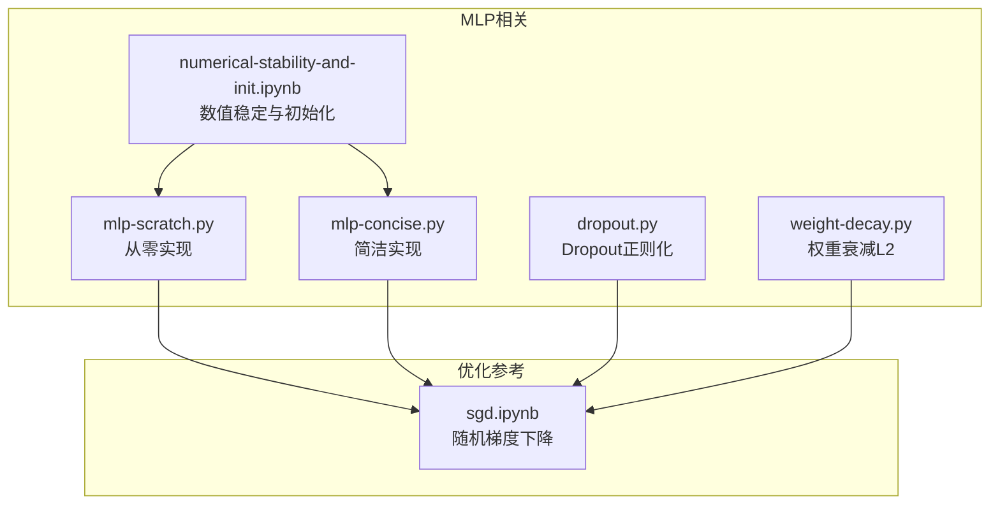
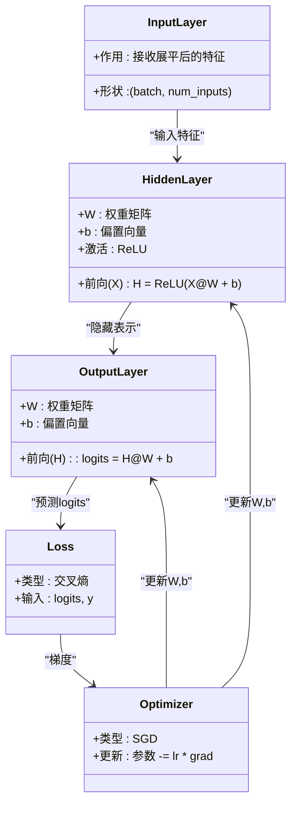
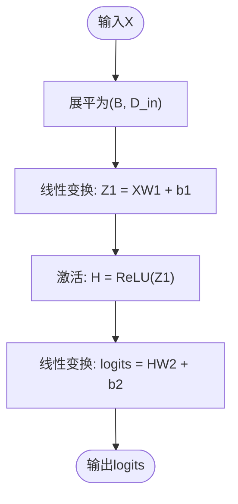
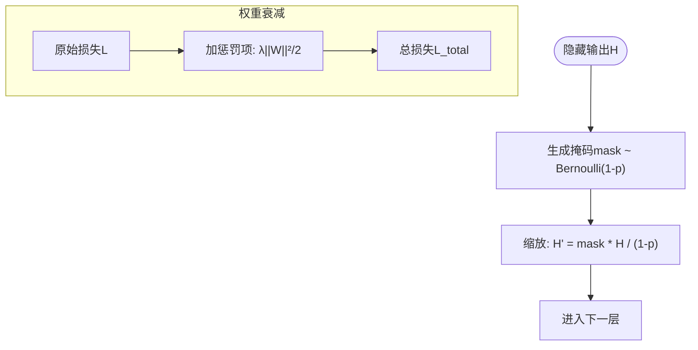
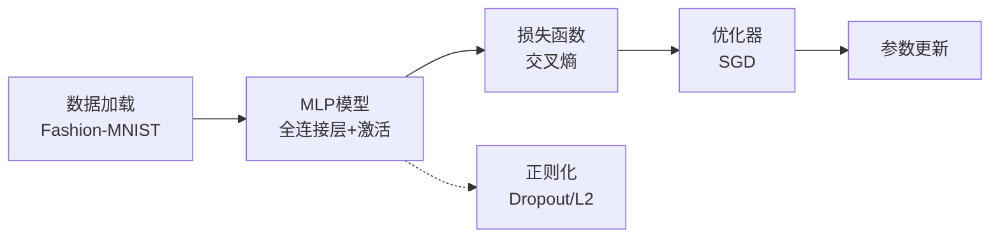

# 多层感知机基础

<cite>
**本文引用的文件**   
- [mlp-scratch.py](file://chapter_multilayer-perceptrons/mlp-scratch.py)
- [mlp-concise.py](file://chapter_multilayer-perceptrons/mlp-concise.py)
- [dropout.py](file://chapter_multilayer-perceptrons/dropout.py)
- [weight-decay.py](file://chapter_multilayer-perceptrons/weight-decay.py)
- [numerical-stability-and-init.ipynb](file://chapter_multilayer-perceptrons/numerical-stability-and-init.ipynb)
- [sgd.ipynb](file://chapter_optimization/sgd.ipynb)
</cite>

## 目录
1. [引言](#引言)
2. [项目结构](#项目结构)
3. [核心组件](#核心组件)
4. [架构总览](#架构总览)
5. [详细组件分析](#详细组件分析)
6. [依赖关系分析](#依赖关系分析)
7. [性能与数值稳定性](#性能与数值稳定性)
8. [故障排查指南](#故障排查指南)
9. [结论](#结论)
10. [附录：从零实现MLP的要点清单](#附录从零实现mlp的要点清单)

## 引言
本章节聚焦于多层感知机（Multilayer Perceptron, MLP）的基础部分，系统阐述其网络架构设计、前向传播的数学原理与计算过程、反向传播的梯度推导与链式法则、权重与偏置更新机制，并给出从零实现的完整流程与代码路径。同时结合数值稳定性与初始化策略，帮助读者在理解理论的同时掌握工程实践中的关键细节。

## 项目结构
本仓库以“按主题分章”的方式组织内容，MLP相关内容集中在 chapter_multilayer-perceptrons 目录下，包含从零实现、简洁实现、正则化（Dropout、权重衰减）、数值稳定性与初始化等配套材料；优化相关参考位于 chapter_optimization 下的随机梯度下降示例。



图表来源 
- [mlp-scratch.py:1-69](file://chapter_multilayer-perceptrons/mlp-scratch.py#L1-L69)
- [mlp-concise.py:1-59](file://chapter_multilayer-perceptrons/mlp-concise.py#L1-L59)
- [dropout.py:1-96](file://chapter_multilayer-perceptrons/dropout.py#L1-L96)
- [weight-decay.py:1-100](file://chapter_multilayer-perceptrons/weight-decay.py#L1-L100)
- [numerical-stability-and-init.ipynb:1-200](file://chapter_multilayer-perceptrons/numerical-stability-and-init.ipynb#L1-L200)
- [sgd.ipynb:1-200](file://chapter_optimization/sgd.ipynb#L1-L200)

章节来源
- [mlp-scratch.py:1-69](file://chapter_multilayer-perceptrons/mlp-scratch.py#L1-L69)
- [mlp-concise.py:1-59](file://chapter_multilayer-perceptrons/mlp-concise.py#L1-L59)

## 核心组件
- 输入层与数据展平：将图像像素展平为一维向量，作为MLP的输入特征。
- 隐藏层与激活函数：全连接线性变换后接非线性激活（如ReLU），引入非线性表达能力。
- 输出层：根据任务选择输出维度与激活（分类常用交叉熵损失，无需显式softmax）。
- 参数初始化：权重通常采用小方差正态分布或Xavier/He初始化，偏置常初始化为零。
- 损失函数：多分类使用交叉熵损失，自动处理logits到概率的对数似然。
- 优化器：随机梯度下降（SGD）及其变体用于参数更新。
- 正则化：Dropout与权重衰减（L2）抑制过拟合。

章节来源
- [mlp-scratch.py:19-40](file://chapter_multilayer-perceptrons/mlp-scratch.py#L19-L40)
- [mlp-concise.py:15-32](file://chapter_multilayer-perceptrons/mlp-concise.py#L15-L32)
- [dropout.py:6-16](file://chapter_multilayer-perceptrons/dropout.py#L6-L16)
- [weight-decay.py:23-25](file://chapter_multilayer-perceptrons/weight-decay.py#L23-L25)

## 架构总览
MLP由若干全连接层堆叠而成，典型结构为：输入层 → 隐藏层（含激活）→ 输出层。前向传播通过矩阵乘法与逐元素激活组合完成；反向传播利用链式法则逐层回传梯度，优化器据此更新参数。



图表来源 
- [mlp-scratch.py:34-37](file://chapter_multilayer-perceptrons/mlp-scratch.py#L34-L37)
- [mlp-concise.py:16-19](file://chapter_multilayer-perceptrons/mlp-concise.py#L16-L19)

## 详细组件分析

### 前向传播：数学原理与计算过程
- 单隐藏层MLP的前向公式：
  - 隐藏层：H = σ(XW1 + b1)，其中σ为激活函数（如ReLU）。
  - 输出层：logits = HW2 + b2。
- 矩阵运算：
  - X ∈ R^{B×D_in}，W1 ∈ R^{D_in×D_h}，b1 ∈ R^{D_h}，得到H ∈ R^{B×D_h}。
  - W2 ∈ R^{D_h×D_out}，b2 ∈ R^{D_out}，得到logits ∈ R^{B×D_out}。
- 激活函数：
  - ReLU：逐元素取max(0, x)，引入非线性且避免饱和区梯度消失问题。
- 数值细节：
  - 使用广播机制对偏置进行加法。
  - 矩阵乘法的内存布局与批大小影响性能，建议保持合理的batch size。



图表来源 
- [mlp-scratch.py:34-37](file://chapter_multilayer-perceptrons/mlp-scratch.py#L34-L37)
- [mlp-concise.py:16-19](file://chapter_multilayer-perceptrons/mlp-concise.py#L16-L19)

章节来源
- [mlp-scratch.py:29-37](file://chapter_multilayer-perceptrons/mlp-scratch.py#L29-L37)
- [mlp-concise.py:16-19](file://chapter_multilayer-perceptrons/mlp-concise.py#L16-L19)

### 反向传播：梯度计算与链式法则
- 目标：最小化损失L(logits, y)。
- 输出层梯度：
  - ∂L/∂logits 由损失函数提供（交叉熵对logits的导数）。
  - ∂L/∂W2 = H^T @ ∂L/∂logits
  - ∂L/∂b2 = sum(∂L/∂logits, axis=0)
- 隐藏层梯度：
  - ∂L/∂H = ∂L/∂logits @ W2^T
  - ∂L/∂Z1 = ∂L/∂H ⊙ σ'(Z1)（ReLU导数为指示函数）
  - ∂L/∂W1 = X^T @ ∂L/∂Z1
  - ∂L/∂b1 = sum(∂L/∂Z1, axis=0)
- 链式法则：逐层从输出到输入应用复合函数求导规则。

```mermaid
sequenceDiagram
participant X as "输入X"
participant L1 as "隐藏层"
participant L2 as "输出层"
participant Loss as "损失函数"
participant Opt as "优化器"
X->>L1 : "前向 : Z1 = XW1 + b1"
L1-->>L2 : "H = ReLU(Z1)"
L2-->>Loss : "logits = HW2 + b2"
Loss-->>L2 : "∂L/∂logits"
L2-->>L1 : "∂L/∂H = ∂L/∂logits @ W2^T"
L1-->>X : "∂L/∂X = ... (可选)"
L2->>Opt : "梯度(W2,b2)"
L1->>Opt : "梯度(W1,b1)"
Opt-->>L1 : "更新W1,b1"
Opt-->>L2 : "更新W2,b2"
```

图表来源 
- [mlp-scratch.py:34-37](file://chapter_multilayer-perceptrons/mlp-scratch.py#L34-L37)
- [mlp-concise.py:16-19](file://chapter_multilayer-perceptrons/mlp-concise.py#L16-L19)

章节来源
- [mlp-scratch.py:34-37](file://chapter_multilayer-perceptrons/mlp-scratch.py#L34-L37)
- [mlp-concise.py:16-19](file://chapter_multilayer-perceptrons/mlp-concise.py#L16-L19)

### 参数初始化与数值稳定性
- 初始化策略：
  - 权重：小方差正态分布（如std=0.01）或He/Xavier初始化，避免梯度爆炸/消失。
  - 偏置：通常初始化为零。
- 数值稳定性：
  - 激活函数选择：ReLU相比sigmoid更不易饱和，减少梯度消失风险。
  - 损失函数：交叉熵与logits配合，内部数值稳定实现。
- 常见问题：
  - 梯度爆炸：可通过梯度裁剪或合理初始化缓解。
  - 梯度消失：选择合适激活与初始化，或使用残差连接（非本章节范围）。

章节来源
- [mlp-scratch.py:22-25](file://chapter_multilayer-perceptrons/mlp-scratch.py#L22-L25)
- [mlp-concise.py:21-25](file://chapter_multilayer-perceptrons/mlp-concise.py#L21-L25)
- [numerical-stability-and-init.ipynb:10-66](file://chapter_multilayer-perceptrons/numerical-stability-and-init.ipynb#L10-L66)

### 正则化：Dropout与权重衰减
- Dropout：
  - 训练时按概率随机丢弃神经元输出，测试时保留全部。
  - 缩放因子：除以(1-p)以保持期望不变。
- 权重衰减（L2正则化）：
  - 在损失中加入λ||W||²/2项，限制权重幅度，缓解过拟合。
  - 实践中常对权重而非偏置进行衰减。



图表来源 
- [dropout.py:6-16](file://chapter_multilayer-perceptrons/dropout.py#L6-L16)
- [weight-decay.py:23-25](file://chapter_multilayer-perceptrons/weight-decay.py#L23-L25)

章节来源
- [dropout.py:6-16](file://chapter_multilayer-perceptrons/dropout.py#L6-L16)
- [weight-decay.py:23-25](file://chapter_multilayer-perceptrons/weight-decay.py#L23-L25)

### 优化器与参数更新
- 随机梯度下降（SGD）：
  - 每次迭代基于一个样本或小批量估计梯度。
  - 更新规则：θ ← θ - η·∇_θ L。
- 学习率调度：
  - 固定学习率或随时间衰减，平衡收敛速度与稳定性。

章节来源
- [sgd.ipynb:47-66](file://chapter_optimization/sgd.ipynb#L47-L66)
- [mlp-scratch.py:44-45](file://chapter_multilayer-perceptrons/mlp-scratch.py#L44-L45)
- [mlp-concise.py:30-32](file://chapter_multilayer-perceptrons/mlp-concise.py#L30-L32)

## 依赖关系分析
MLP实现依赖以下核心模块：
- 张量操作与自动微分（PyTorch）
- 数据加载与预处理（Fashion-MNIST）
- 损失函数（交叉熵）
- 优化器（SGD）
- 正则化工具（Dropout、L2）



图表来源 
- [mlp-scratch.py:16-17](file://chapter_multilayer-perceptrons/mlp-scratch.py#L16-L17)
- [mlp-concise.py:35-36](file://chapter_multilayer-perceptrons/mlp-concise.py#L35-L36)

章节来源
- [mlp-scratch.py:16-17](file://chapter_multilayer-perceptrons/mlp-scratch.py#L16-L17)
- [mlp-concise.py:35-36](file://chapter_multilayer-perceptrons/mlp-concise.py#L35-L36)

## 性能与数值稳定性
- 性能优化：
  - 使用GPU加速矩阵运算。
  - 合理设置batch size，平衡内存与收敛速度。
  - 避免不必要的Python循环，尽量使用向量化操作。
- 数值稳定性：
  - 选择合适的激活函数（ReLU优于sigmoid）。
  - 权重初始化避免过大或过小方差。
  - 使用数值稳定的损失实现（如交叉熵内置稳定版本）。

章节来源
- [numerical-stability-and-init.ipynb:10-66](file://chapter_multilayer-perceptrons/numerical-stability-and-init.ipynb#L10-L66)

## 故障排查指南
- 训练不收敛：
  - 检查学习率是否过大或过小。
  - 验证权重初始化是否合理。
  - 确认数据归一化是否正确。
- 梯度爆炸/消失：
  - 添加梯度裁剪。
  - 更换激活函数或调整初始化策略。
- 过拟合：
  - 增加Dropout或权重衰减。
  - 收集更多数据或简化模型。

章节来源
- [mlp-scratch.py:60-63](file://chapter_multilayer-perceptrons/mlp-scratch.py#L60-L63)
- [mlp-concise.py:51-54](file://chapter_multilayer-perceptrons/mlp-concise.py#L51-L54)

## 结论
多层感知机是深度学习的基础模型，通过全连接层与非线性激活的组合，能够学习复杂的输入输出映射。理解其前向传播、反向传播、参数更新与正则化机制，是构建更复杂神经网络的前提。在实际工程中，需关注数值稳定性、初始化策略与优化器配置，以获得稳定高效的训练效果。

## 附录：从零实现MLP的要点清单
- 数据准备：展平图像为向量，划分训练/测试集。
- 参数初始化：权重小方差正态分布，偏置为零。
- 前向传播：线性变换 + ReLU激活 + 输出层线性变换。
- 损失函数：交叉熵损失。
- 反向传播：手动计算梯度或使用自动微分。
- 参数更新：SGD或其他优化器。
- 正则化：Dropout与权重衰减。
- 评估指标：训练/测试准确率与损失曲线。

章节来源
- [mlp-scratch.py:19-40](file://chapter_multilayer-perceptrons/mlp-scratch.py#L19-L40)
- [mlp-concise.py:15-32](file://chapter_multilayer-perceptrons/mlp-concise.py#L15-L32)
- [dropout.py:30-58](file://chapter_multilayer-perceptrons/dropout.py#L30-L58)
- [weight-decay.py:18-42](file://chapter_multilayer-perceptrons/weight-decay.py#L18-L42)