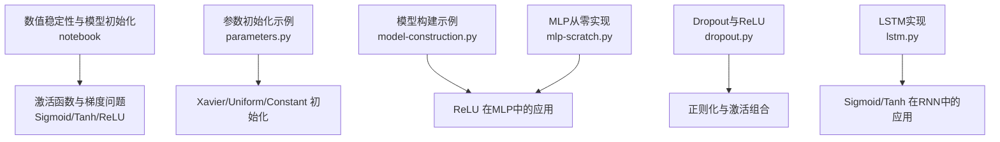
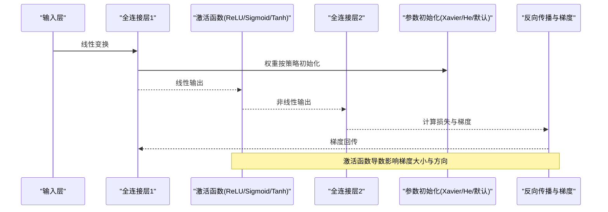
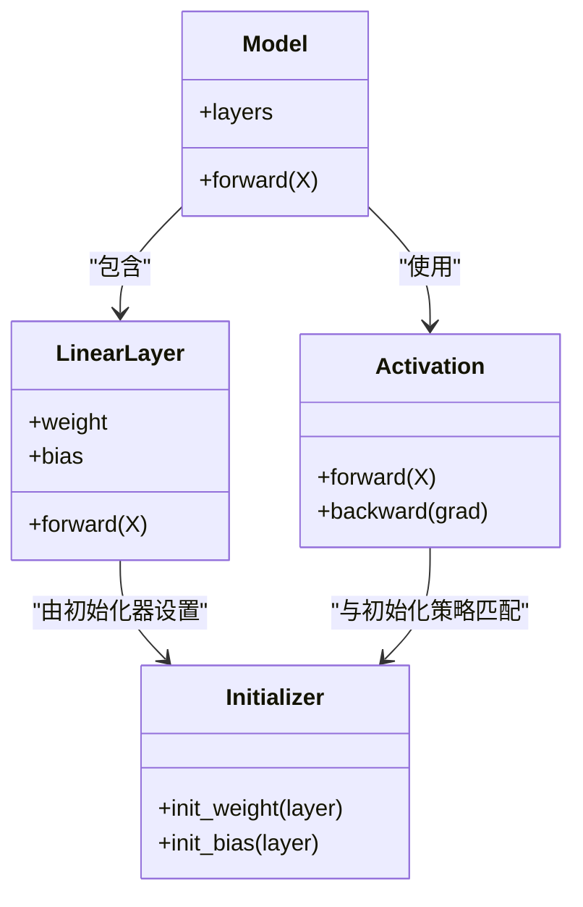

# 激活函数与初始化

<cite>
**本文引用的文件**
- [数值稳定性与模型初始化.ipynb](file://chapter_multilayer-perceptrons/numerical-stability-and-init.ipynb)
- [parameters.py](file://chapter_deep-learning-computation/parameters.py)
- [model-construction.py](file://chapter_deep-learning-computation/model-construction.py)
- [mlp-scratch.py](file://chapter_multilayer-perceptrons/mlp-scratch.py)
- [dropout.py](file://chapter_multilayer-perceptrons/dropout.py)
- [lstm.py](file://chapter_recurrent-modern/lstm.py)
</cite>

## 目录
1. [引言](#引言)
2. [项目结构](#项目结构)
3. [核心组件](#核心组件)
4. [架构总览](#架构总览)
5. [详细组件分析](#详细组件分析)
6. [依赖关系分析](#依赖关系分析)
7. [性能考量](#性能考量)
8. [故障排查指南](#故障排查指南)
9. [结论](#结论)
10. [附录：可视化与测试建议](#附录可视化与测试建议)

## 引言
本章节聚焦于深度学习中两个关键主题：激活函数与参数初始化。我们将系统阐述常见激活函数的数学原理、特性与适用场景，解释梯度消失与梯度爆炸的成因及应对策略；深入讲解Xavier与He等初始化方法及其与激活函数的匹配原则；并给出数值稳定性问题、调试技巧与最佳实践。文中所有分析与示例均基于仓库中的代码与Notebook内容，确保可复现与可追溯。

## 项目结构
与“激活函数与初始化”直接相关的代码与文档主要分布在以下位置：
- 数值稳定性与初始化理论及演示：chapter_multilayer-perceptrons/numerical-stability-and-init.ipynb
- 参数初始化方法与自定义初始化：chapter_deep-learning-computation/parameters.py
- 使用ReLU等激活函数的模型构建示例：chapter_deep-learning-computation/model-construction.py
- 从零实现MLP并使用ReLU：chapter_multilayer-perceptrons/mlp-scratch.py
- 含Dropout与ReLU的MLP训练示例：chapter_multilayer-perceptrons/dropout.py
- LSTM中使用sigmoid与tanh的序列模型：chapter_recurrent-modern/lstm.py

图表来源
- [数值稳定性与模型初始化.ipynb:1-318](file://chapter_multilayer-perceptrons/numerical-stability-and-init.ipynb#L1-L318)
- [parameters.py:1-98](file://chapter_deep-learning-computation/parameters.py#L1-L98)
- [model-construction.py:1-95](file://chapter_deep-learning-computation/model-construction.py#L1-L95)
- [mlp-scratch.py:1-69](file://chapter_multilayer-perceptrons/mlp-scratch.py#L1-L69)
- [dropout.py:1-96](file://chapter_multilayer-perceptrons/dropout.py#L1-L96)
- [lstm.py:1-345](file://chapter_recurrent-modern/lstm.py#L1-L345)

章节来源
- [数值稳定性与模型初始化.ipynb:1-318](file://chapter_multilayer-perceptrons/numerical-stability-and-init.ipynb#L1-L318)
- [parameters.py:1-98](file://chapter_deep-learning-computation/parameters.py#L1-L98)

## 核心组件
- 激活函数
  - Sigmoid：将输入映射到(0,1)，导数在两端接近0，易导致梯度消失。
  - Tanh：将输入映射到(-1,1)，中心对称，导数同样在两端趋于0。
  - ReLU：f(x)=max(0,x)，缓解梯度消失，但存在“死神经元”风险（负区间梯度为0）。
  - Leaky ReLU/ELU/GELU：对负区间的改进，避免完全截断，提升训练稳定性。
- 参数初始化
  - 默认随机初始化：框架默认正态或均匀分布，适用于中等难度任务。
  - Xavier初始化：保持前向与反向方差稳定，适合Sigmoid/Tanh。
  - He初始化：针对ReLU系列，按输出通道数缩放方差，缓解ReLU导致的方差衰减。
  - 其他：常数初始化、自定义初始化（如均匀分布裁剪）。

章节来源
- [数值稳定性与模型初始化.ipynb:23-110](file://chapter_multilayer-perceptrons/numerical-stability-and-init.ipynb#L23-L110)
- [parameters.py:39-78](file://chapter_deep-learning-computation/parameters.py#L39-L78)

## 架构总览
下图展示激活函数与初始化在典型网络中的交互关系，以及它们如何影响前向传播与反向传播的数值稳定性。

图表来源
- [model-construction.py:14-27](file://chapter_deep-learning-computation/model-construction.py#L14-L27)
- [parameters.py:39-78](file://chapter_deep-learning-computation/parameters.py#L39-L78)

## 详细组件分析

### 激活函数：数学原理与特性
- Sigmoid
  - 定义域与值域：(-∞, +∞) → (0, 1)
  - 导数：σ'(x)=σ(x)(1-σ(x))，两端趋近0，易造成梯度消失
  - 适用场景：二分类输出层、早期网络；现代网络中较少用于隐藏层
- Tanh
  - 定义域与值域：(-∞, +∞) → (-1, 1)
  - 导数：tanh'(x)=1-tanh^2(x)，两端也趋近0
  - 适用场景：RNN隐藏状态、注意力机制中的评分函数
- ReLU与变体
  - ReLU：f(x)=max(0,x)，导数为1或0，缓解梯度消失，但可能产生死神经元
  - Leaky ReLU：负区间赋予小斜率，减少死神经元概率
  - ELU/GELU：平滑负区间，改善训练稳定性与收敛速度

章节来源
- [数值稳定性与模型初始化.ipynb:58-110](file://chapter_multilayer-perceptrons/numerical-stability-and-init.ipynb#L58-L110)
- [lstm.py:56-63](file://chapter_recurrent-modern/lstm.py#L56-L63)

### 梯度消失与梯度爆炸
- 梯度消失
  - 原因：深层网络中多层导数连乘，若每层导数小于1，则整体梯度指数级衰减
  - 表现：靠近输入层的权重几乎不更新，训练停滞
  - 解决：使用ReLU系列、合适的初始化、残差连接、归一化
- 梯度爆炸
  - 原因：矩阵连乘导致梯度指数级增长，优化不稳定
  - 表现：损失发散、权重NaN
  - 解决：梯度裁剪、合理初始化、学习率调度

章节来源
- [数值稳定性与模型初始化.ipynb:23-66](file://chapter_multilayer-perceptrons/numerical-stability-and-init.ipynb#L23-L66)

### 参数初始化策略
- 默认初始化
  - 框架默认正态分布，适用于多数中等复杂度任务
- Xavier初始化
  - 目标：保持前向与反向方差稳定
  - 公式：方差=2/(n_in+n_out)，均匀分布时取值范围±√(6/(n_in+n_out))
  - 适用：Sigmoid/Tanh等饱和型激活
- He初始化
  - 目标：适配ReLU系列，补偿ReLU导致的方差减半
  - 公式：方差=2/n_in
- 自定义初始化
  - 均匀分布、常数初始化、按阈值裁剪等

章节来源
- [数值稳定性与模型初始化.ipynb:207-256](file://chapter_multilayer-perceptrons/numerical-stability-and-init.ipynb#L207-L256)
- [parameters.py:39-78](file://chapter_deep-learning-computation/parameters.py#L39-L78)

### 数值稳定性问题与调试技巧
- 常见问题
  - 数值下溢/上溢：log-sum-exp、softmax、exp激活等需小心处理
  - 梯度异常：检查激活函数选择、初始化策略、学习率
- 调试技巧
  - 监控各层激活值的均值与方差
  - 打印梯度范数，定位异常层
  - 逐步简化网络，验证基础模块正确性

章节来源
- [数值稳定性与模型初始化.ipynb:1-22](file://chapter_multilayer-perceptrons/numerical-stability-and-init.ipynb#L1-L22)

### 激活函数与初始化的匹配原则
- Sigmoid/Tanh + Xavier：保持方差稳定，避免梯度消失
- ReLU/Leaky ReLU/ELU/GELU + He：补偿ReLU的方差衰减，加速收敛
- RNN/LSTM：Tanh作为候选记忆元，Sigmoid作为门控，配合适当初始化

章节来源
- [lstm.py:56-63](file://chapter_recurrent-modern/lstm.py#L56-L63)
- [parameters.py:56-59](file://chapter_deep-learning-computation/parameters.py#L56-L59)

### 代码示例路径
- ReLU在MLP中的应用：[model-construction.py:24-27](file://chapter_deep-learning-computation/model-construction.py#L24-L27)
- 从零实现ReLU与MLP：[mlp-scratch.py:28-37](file://chapter_multilayer-perceptrons/mlp-scratch.py#L28-L37)
- Dropout与ReLU组合：[dropout.py:44-57](file://chapter_multilayer-perceptrons/dropout.py#L44-L57)
- LSTM中Sigmoid/Tanh使用：[lstm.py:56-63](file://chapter_recurrent-modern/lstm.py#L56-L63)
- Xavier初始化示例：[parameters.py:56-59](file://chapter_deep-learning-computation/parameters.py#L56-L59)

## 依赖关系分析
激活函数与初始化在模型中的依赖关系如下：

图表来源
- [model-construction.py:14-27](file://chapter_deep-learning-computation/model-construction.py#L14-L27)
- [parameters.py:39-78](file://chapter_deep-learning-computation/parameters.py#L39-L78)

章节来源
- [model-construction.py:14-27](file://chapter_deep-learning-computation/model-construction.py#L14-L27)
- [parameters.py:39-78](file://chapter_deep-learning-computation/parameters.py#L39-L78)

## 性能考量
- 激活函数选择
  - ReLU系列通常更快、更稳定，适合大多数隐藏层
  - Sigmoid/Tanh在输出层或特定结构中仍有价值
- 初始化策略
  - Xavier适合饱和型激活，He适合ReLU系列
  - 不当初始化会导致收敛慢或不收敛
- 数值稳定性
  - 使用稳定的数值实现（如log-sum-exp）
  - 监控梯度范数与激活分布

## 故障排查指南
- 训练不收敛
  - 检查激活函数是否合适（避免Sigmoid在深层）
  - 确认初始化策略与激活函数匹配
  - 调整学习率或使用梯度裁剪
- 梯度异常
  - 打印各层梯度范数，定位问题层
  - 检查数据预处理与归一化
- 数值溢出
  - 使用数值稳定的函数实现
  - 限制激活值范围（如clip）

章节来源
- [数值稳定性与模型初始化.ipynb:23-66](file://chapter_multilayer-perceptrons/numerical-stability-and-init.ipynb#L23-L66)

## 结论
激活函数与参数初始化是深度学习训练的基石。选择合适的激活函数（如ReLU系列）与匹配的初始化策略（如He初始化）能显著提升训练稳定性与收敛速度。理解梯度消失与爆炸的成因，掌握数值稳定性技巧，是构建高效可靠模型的关键。

## 附录：可视化与测试建议
- 可视化对比
  - 绘制Sigmoid、Tanh、ReLU的函数图像与导数曲线
  - 比较不同初始化下激活值的分布变化
- 性能测试
  - 在不同数据集上比较激活函数与初始化的效果
  - 记录训练时间、收敛步数、最终精度

章节来源
- [数值稳定性与模型初始化.ipynb:83-94](file://chapter_multilayer-perceptrons/numerical-stability-and-init.ipynb#L83-L94)