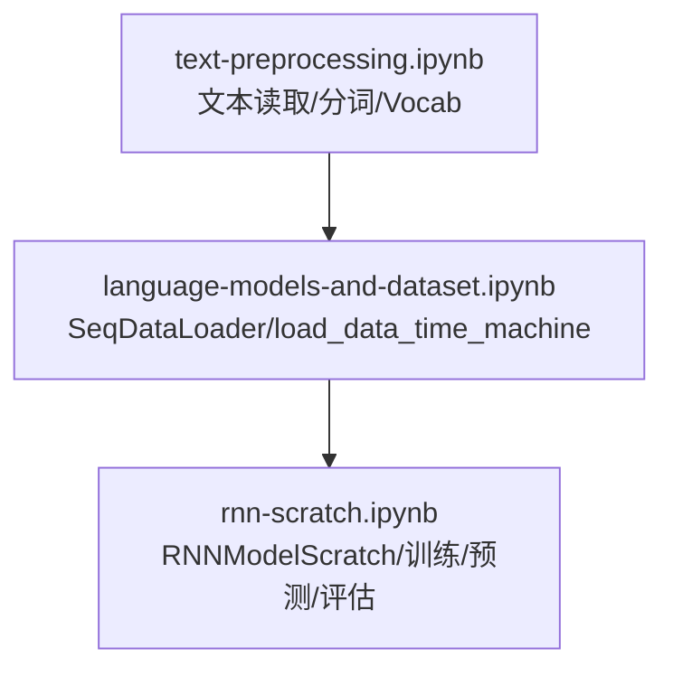
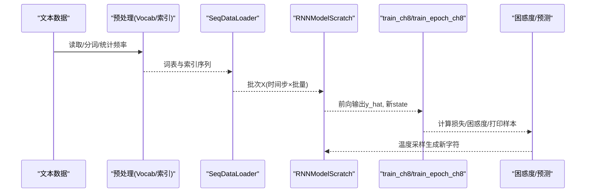
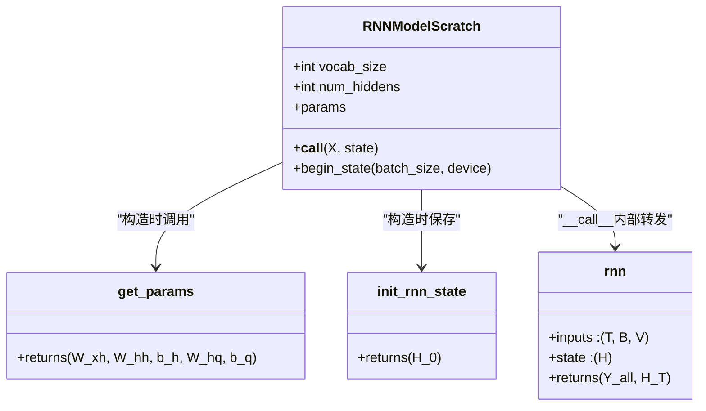
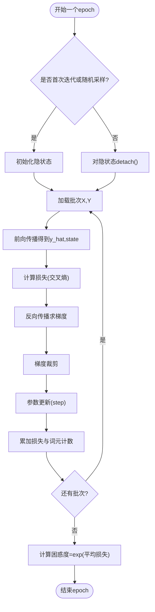

# RNN从零实现

<cite>
**本文引用的文件**   
- [rnn-scratch.ipynb](file://chapter_recurrent-neural-networks/rnn-scratch.ipynb)
- [text-preprocessing.ipynb](file://chapter_recurrent-neural-networks/text-preprocessing.ipynb)
- [language-models-and-dataset.ipynb](file://chapter_recurrent-neural-networks/language-models-and-dataset.ipynb)
</cite>

## 目录
1. [简介](#简介)
2. [项目结构](#项目结构)
3. [核心组件](#核心组件)
4. [架构总览](#架构总览)
5. [详细组件分析](#详细组件分析)
6. [依赖关系分析](#依赖关系分析)
7. [性能与数值稳定性](#性能与数值稳定性)
8. [训练流程与调试指南](#训练流程与调试指南)
9. [结论](#结论)
10. [附录：关键函数与类速查](#附录关键函数与类速查)

## 简介
本章节基于PyTorch框架，从零实现一个字符级语言模型。内容涵盖：
- 文本预处理（词元化、构建词表、索引映射）
- 独热编码的数据表示
- 模型参数初始化
- RNN前向传播与隐状态管理
- 反向传播与梯度裁剪
- 训练循环设计（损失函数、优化器、困惑度评估）
- 预测采样策略（温度采样）

通过RNNModelScratch类将上述功能封装，便于理解RNN的内部工作机制，并给出完整的训练示例与调试技巧。

## 项目结构
本实现主要位于“循环神经网络”章节的Notebook中，围绕以下三个文件组织：
- text-preprocessing.ipynb：文本读取、分词、构建Vocab、生成索引序列
- language-models-and-dataset.ipynb：提供SeqDataLoader与load_data_time_machine，用于按时间步切分数据与批量迭代
- rnn-scratch.ipynb：从零实现RNN模型、训练与预测、梯度裁剪、困惑度评估

图表来源
- [text-preprocessing.ipynb](file://chapter_recurrent-neural-networks/text-preprocessing.ipynb)
- [language-models-and-dataset.ipynb](file://chapter_recurrent-neural-networks/language-models-and-dataset.ipynb)
- [rnn-scratch.ipynb](file://chapter_recurrent-neural-networks/rnn-scratch.ipynb)

章节来源
- [text-preprocessing.ipynb](file://chapter_recurrent-neural-networks/text-preprocessing.ipynb)
- [language-models-and-dataset.ipynb](file://chapter_recurrent-neural-networks/language-models-and-dataset.ipynb)
- [rnn-scratch.ipynb](file://chapter_recurrent-neural-networks/rnn-scratch.ipynb)

## 核心组件
- 文本预处理与词表
  - Vocab：统计词频、建立token到索引的映射，支持未知词元处理
  - tokenize：按字符或单词进行分词
  - load_corpus_time_machine：整合读取、分词、建表、转索引
- 数据加载与迭代
  - SeqDataLoader：按时间步切分序列，支持随机采样与顺序分区两种模式
  - load_data_time_machine：返回迭代器与词表
- RNN模型（从零实现）
  - get_params：初始化输入-隐藏、隐藏-隐藏权重与偏置，以及输出层权重与偏置
  - init_rnn_state：初始化隐状态为全零张量
  - rnn：单步RNN前向计算，逐时间步更新隐状态并拼接输出
  - RNNModelScratch：封装独热编码、前向调用与隐状态初始化
- 训练与评估
  - grad_clipping：梯度裁剪，防止梯度爆炸
  - train_epoch_ch8：一个epoch的训练循环，支持自定义updater与设备
  - train_ch8：完整训练流程，包含损失函数、优化器、可视化与周期性预测
  - predict_ch8：基于温度采样的字符级文本生成

章节来源
- [text-preprocessing.ipynb](file://chapter_recurrent-neural-networks/text-preprocessing.ipynb)
- [language-models-and-dataset.ipynb](file://chapter_recurrent-neural-networks/language-models-and-dataset.ipynb)
- [rnn-scratch.ipynb](file://chapter_recurrent-neural-networks/rnn-scratch.ipynb)

## 架构总览
下图展示了从原始文本到模型训练与预测的整体数据流与控制流。

图表来源
- [text-preprocessing.ipynb](file://chapter_recurrent-neural-networks/text-preprocessing.ipynb)
- [language-models-and-dataset.ipynb](file://chapter_recurrent-neural-networks/language-models-and-dataset.ipynb)
- [rnn-scratch.ipynb](file://chapter_recurrent-neural-networks/rnn-scratch.ipynb)

## 详细组件分析

### 文本预处理与词表
- 读取与清洗：去除标点与大写，统一小写
- 分词：支持按字符或单词拆分
- 词表构建：统计词频，按频率排序，分配索引；未知词元使用特殊索引
- 索引转换：将文本行转换为数字索引列表，供模型使用

章节来源
- [text-preprocessing.ipynb](file://chapter_recurrent-neural-networks/text-preprocessing.ipynb)

### 数据加载与迭代
- SeqDataLoader：根据batch_size与num_steps对长序列进行切分，支持use_random_iter控制采样方式
- load_data_time_machine：封装SeqDataLoader实例化，返回迭代器与vocab

章节来源
- [language-models-and-dataset.ipynb](file://chapter_recurrent-neural-networks/language-models-and-dataset.ipynb)

### RNN模型（从零实现）
- 参数初始化get_params
  - 输入-隐藏权重W_xh、隐藏-隐藏权重W_hh、隐藏偏置b_h
  - 输出层权重W_hq、输出偏置b_q
  - 所有参数开启requires_grad
- 隐状态初始化init_rnn_state
  - 返回形状为(batch_size, num_hiddens)的全零张量（以元组形式便于扩展）
- 前向传播rnn
  - 输入X形状：(时间步数量, 批量大小, 词表大小)
  - 每个时间步：H = f(X_t @ W_xh + H_{t-1} @ W_hh + b_h)，Y_t = H_t @ W_hq + b_q
  - 输出拼接后形状：(时间步数量 × 批量大小, 输出大小)
- RNNModelScratch类
  - __call__：将输入的索引序列转换为独热编码，再调用forward_fn
  - begin_state：返回初始隐状态

图表来源
- [rnn-scratch.ipynb](file://chapter_recurrent-neural-networks/rnn-scratch.ipynb)

章节来源
- [rnn-scratch.ipynb](file://chapter_recurrent-neural-networks/rnn-scratch.ipynb)

### 预测与采样
- predict_ch8
  - 预热期：用prefix中的字符逐步更新隐状态，不产生输出
  - 采样阶段：对logits进行温度缩放，softmax得到概率分布，multinomial随机采样下一个字符索引
  - 温度系数temperature控制输出的多样性与确定性

章节来源
- [rnn-scratch.ipynb](file://chapter_recurrent-neural-networks/rnn-scratch.ipynb)

### 梯度裁剪
- grad_clipping
  - 计算所有参数的梯度L2范数
  - 若超过阈值theta，则按比例缩放各参数的梯度，保持方向不变
  - 适用于从零实现的模型与高级API模型（自动识别参数来源）

章节来源
- [rnn-scratch.ipynb](file://chapter_recurrent-neural-networks/rnn-scratch.ipynb)

### 训练循环与评估
- train_epoch_ch8
  - 支持随机抽样与顺序分区两种模式
  - 在顺序分区模式下，跨mini-batch共享隐状态，并在每个mini-batch前detach以限制梯度计算范围
  - 计算交叉熵损失（mean），执行backward、梯度裁剪、参数更新
  - 统计总损失与词元数，返回困惑度与速度
- train_ch8
  - 选择CrossEntropyLoss作为损失函数
  - 根据模型类型选择优化器（torch.optim.SGD或自定义d2l.sgd）
  - 每若干epoch打印预测结果并记录困惑度曲线

图表来源
- [rnn-scratch.ipynb](file://chapter_recurrent-neural-networks/rnn-scratch.ipynb)

章节来源
- [rnn-scratch.ipynb](file://chapter_recurrent-neural-networks/rnn-scratch.ipynb)

## 依赖关系分析
- 文本预处理模块为数据加载模块提供词表与索引序列
- 数据加载模块为RNN模型提供批次的输入张量与目标标签
- RNN模型在前向过程中依赖独热编码与参数矩阵乘法
- 训练循环依赖损失函数、优化器与梯度裁剪
- 预测模块依赖模型的前向接口与词表映射

图表来源
- [text-preprocessing.ipynb](file://chapter_recurrent-neural-networks/text-preprocessing.ipynb)
- [language-models-and-dataset.ipynb](file://chapter_recurrent-neural-networks/language-models-and-dataset.ipynb)
- [rnn-scratch.ipynb](file://chapter_recurrent-neural-networks/rnn-scratch.ipynb)

章节来源
- [text-preprocessing.ipynb](file://chapter_recurrent-neural-networks/text-preprocessing.ipynb)
- [language-models-and-dataset.ipynb](file://chapter_recurrent-neural-networks/language-models-and-dataset.ipynb)
- [rnn-scratch.ipynb](file://chapter_recurrent-neural-networks/rnn-scratch.ipynb)

## 性能与数值稳定性
- 数值稳定性
  - 长序列的反向传播会产生较长的矩阵乘法链，容易导致梯度爆炸或消失
  - 使用梯度裁剪限制梯度范数，避免参数更新过大导致发散
- 训练效率
  - 顺序分区模式可复用隐状态，减少重复计算，但需注意detach隔离梯度范围
  - 合理设置batch_size与num_steps平衡内存与收敛速度
- 评估指标
  - 困惑度PPL=exp(L)，越小表示模型对数据的拟合越好，且对不同长度序列具有可比性

章节来源
- [rnn-scratch.ipynb](file://chapter_recurrent-neural-networks/rnn-scratch.ipynb)

## 训练流程与调试指南
- 配置与准备
  - 导入必要的库：torch、torch.nn.functional、d2l等
  - 加载数据集与词表：load_data_time_machine(batch_size, num_steps)
- 模型实例化
  - 使用RNNModelScratch包装get_params、init_rnn_state、rnn
  - 检查输出形状与隐状态维度是否符合预期
- 训练设置
  - 选择损失函数：CrossEntropyLoss
  - 选择优化器：SGD或其他内置优化器
  - 设置学习率、epoch数、设备（CPU/GPU）
- 训练循环
  - 在每个epoch内，按批次迭代，执行前向、反向、裁剪、更新
  - 记录困惑度与速度，定期打印预测样例
- 调试技巧
  - 验证独热编码形状：确保(T,B,V)符合RNN输入要求
  - 检查隐状态形状：(B,H)在各时间步保持一致
  - 观察梯度范数：若异常增大，调整梯度裁剪阈值
  - 降低复杂度：先在小规模数据上验证流程正确性
  - 可视化困惑度曲线：确认收敛趋势

章节来源
- [rnn-scratch.ipynb](file://chapter_recurrent-neural-networks/rnn-scratch.ipynb)

## 结论
通过从零实现RNN字符级语言模型，我们深入理解了：
- 文本预处理与词表构建的重要性
- 独热编码与RNN前向计算的细节
- 隐状态管理与梯度裁剪对稳定训练的必要性
- 训练循环设计与困惑度评估的实践方法
- 预测采样策略对生成多样性的影响

该实现为后续更复杂的序列模型（如GRU、LSTM、Transformer）提供了坚实的基础。

## 附录：关键函数与类速查
- 文本预处理
  - read_time_machine：读取并清洗文本
  - tokenize：按字符或单词分词
  - Vocab：词表类，支持索引映射与未知词元处理
  - load_corpus_time_machine：整合预处理流程
- 数据加载
  - SeqDataLoader：序列数据加载器
  - load_data_time_machine：返回迭代器与词表
- RNN模型
  - get_params：参数初始化
  - init_rnn_state：隐状态初始化
  - rnn：前向传播
  - RNNModelScratch：模型封装类
- 训练与评估
  - grad_clipping：梯度裁剪
  - train_epoch_ch8：单epoch训练
  - train_ch8：完整训练流程
  - predict_ch8：温度采样预测

章节来源
- [text-preprocessing.ipynb](file://chapter_recurrent-neural-networks/text-preprocessing.ipynb)
- [language-models-and-dataset.ipynb](file://chapter_recurrent-neural-networks/language-models-and-dataset.ipynb)
- [rnn-scratch.ipynb](file://chapter_recurrent-neural-networks/rnn-scratch.ipynb)