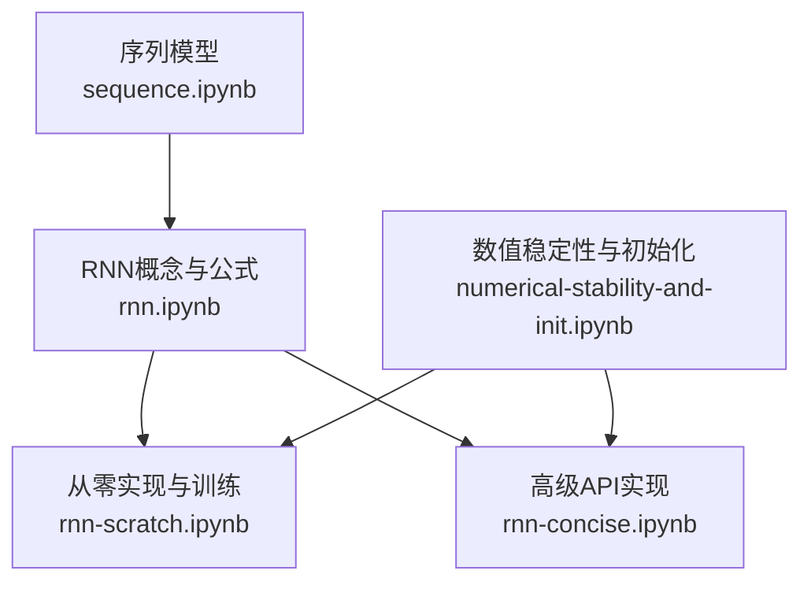
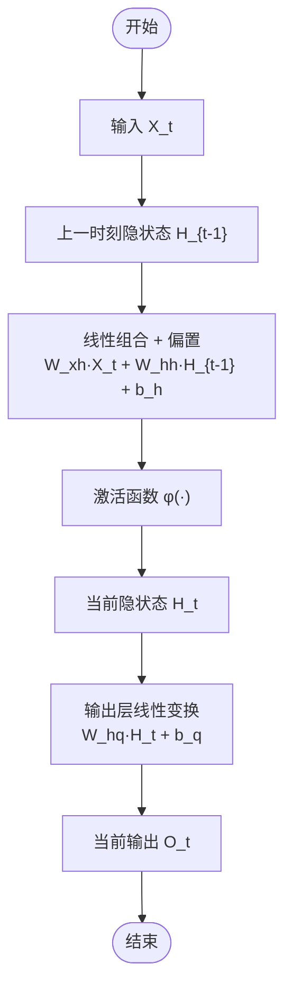
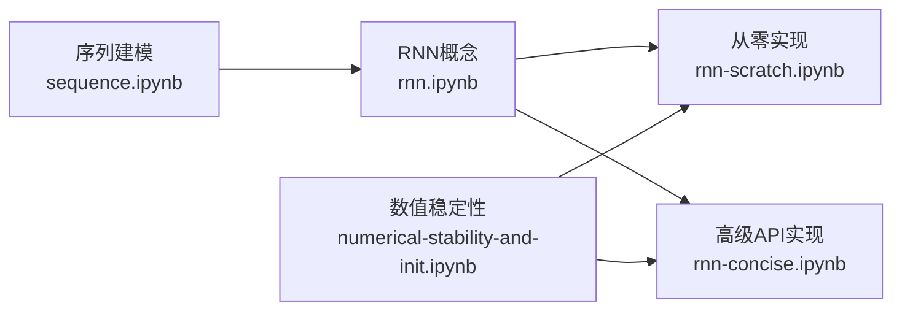
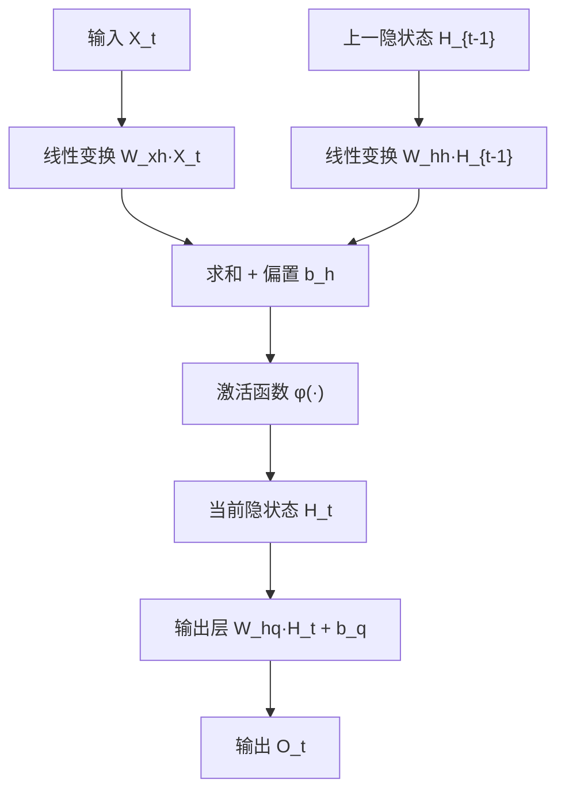

# RNN基础原理

<cite>
**本文引用的文件**   
- [rnn.ipynb](file://chapter_recurrent-neural-networks/rnn.ipynb)
- [rnn-scratch.ipynb](file://chapter_recurrent-neural-networks/rnn-scratch.ipynb)
- [rnn-concise.ipynb](file://chapter_recurrent-neural-networks/rnn-concise.ipynb)
- [sequence.ipynb](file://chapter_recurrent-neural-networks/sequence.ipynb)
- [numerical-stability-and-init.ipynb](file://chapter_multilayer-perceptrons/numerical-stability-and-init.ipynb)
</cite>

## 目录
1. [引言](#引言)
2. [项目结构](#项目结构)
3. [核心组件](#核心组件)
4. [架构总览](#架构总览)
5. [详细组件分析](#详细组件分析)
6. [依赖关系分析](#依赖关系分析)
7. [性能与数值稳定性](#性能与数值稳定性)
8. [故障排查指南](#故障排查指南)
9. [结论](#结论)
10. [附录：数学推导与可视化示例](#附录数学推导与可视化示例)

## 引言
本章节聚焦循环神经网络（RNN）的基础原理，系统阐述隐藏状态的概念、时序数据的处理方式以及信息在时间步之间的传递机制。重点解释RNN的前向传播过程（输入层到隐藏层的映射、隐藏状态更新公式和输出计算），对比传统神经网络的差异与优势，并深入剖析梯度消失与梯度爆炸的数学原理及其对训练的影响。文档结合仓库中的Jupyter教程与代码实现，提供清晰的图示与可追溯的来源定位，帮助读者从直觉到数学再到工程实践全面掌握RNN。

## 项目结构
围绕RNN的内容主要分布在“循环神经网络”与“序列模型”两个章节，辅以“数值稳定性与初始化”章节对梯度问题的理论支撑。关键文件如下：
- 概念与公式推导：[rnn.ipynb](file://chapter_recurrent-neural-networks/rnn.ipynb)
- 从零实现与训练流程：[rnn-scratch.ipynb](file://chapter_recurrent-neural-networks/rnn-scratch.ipynb)
- 高级API简洁实现：[rnn-concise.ipynb](file://chapter_recurrent-neural-networks/rnn-concise.ipynb)
- 序列建模背景与自回归思想：[sequence.ipynb](file://chapter_recurrent-neural-networks/sequence.ipynb)
- 梯度消失/爆炸与参数初始化：[numerical-stability-and-init.ipynb](file://chapter_multilayer-perceptrons/numerical-stability-and-init.ipynb)



图表来源
- [sequence.ipynb:1-174](file://chapter_recurrent-neural-networks/sequence.ipynb#L1-L174)
- [rnn.ipynb:1-158](file://chapter_recurrent-neural-networks/rnn.ipynb#L1-L158)
- [rnn-scratch.ipynb:1-120](file://chapter_recurrent-neural-networks/rnn-scratch.ipynb#L1-L120)
- [rnn-concise.ipynb:1-120](file://chapter_recurrent-neural-networks/rnn-concise.ipynb#L1-L120)
- [numerical-stability-and-init.ipynb:1-120](file://chapter_multilayer-perceptrons/numerical-stability-and-init.ipynb#L1-L120)

章节来源
- [sequence.ipynb:1-174](file://chapter_recurrent-neural-networks/sequence.ipynb#L1-L174)
- [rnn.ipynb:1-158](file://chapter_recurrent-neural-networks/rnn.ipynb#L1-L158)

## 核心组件
- 隐状态（Hidden State）：RNN在每个时间步维护一个向量，用于编码到目前为止的序列历史信息，作为当前步计算的“记忆”。
- 循环层（Recurrent Layer）：通过共享权重在不同时间步重复使用同一组参数，将当前输入与上一时刻隐状态融合，得到当前隐状态。
- 输出层（Output Layer）：基于当前隐状态计算每个时间步的输出（如词表上的概率分布）。
- 训练与评估：包括交叉熵损失、困惑度（Perplexity）、梯度裁剪等关键技术。

章节来源
- [rnn.ipynb:82-158](file://chapter_recurrent-neural-networks/rnn.ipynb#L82-L158)
- [rnn-scratch.ipynb:248-329](file://chapter_recurrent-neural-networks/rnn-scratch.ipynb#L248-L329)
- [rnn-concise.ipynb:206-246](file://chapter_recurrent-neural-networks/rnn-concise.ipynb#L206-L246)

## 架构总览
下图展示了RNN在三个相邻时间步的计算逻辑：输入X_t与上一时刻隐状态H_{t-1}共同作用，经激活函数得到当前隐状态H_t；随后由输出层生成O_t。该图直观体现了“循环”的本质——同一组参数在不同时间步复用。



图表来源
- [rnn.ipynb:98-146](file://chapter_recurrent-neural-networks/rnn.ipynb#L98-L146)

章节来源
- [rnn.ipynb:82-158](file://chapter_recurrent-neural-networks/rnn.ipynb#L82-L158)

## 详细组件分析

### 隐藏状态与时序处理
- 隐状态的定义与作用：隐状态存储了截至当前时间步的序列信息，使得模型具备“记忆”能力，从而能够基于历史上下文预测未来。
- 时间步迭代：RNN沿时间步展开，逐时刻更新隐状态，形成一条“时间链”，信息在时间步之间传递。
- 与传统MLP的差异：MLP无隐状态，无法显式建模时序依赖；RNN通过循环计算引入时间维度，适合序列任务。

章节来源
- [rnn.ipynb:22-44](file://chapter_recurrent-neural-networks/rnn.ipynb#L22-L44)
- [sequence.ipynb:88-110](file://chapter_recurrent-neural-networks/sequence.ipynb#L88-L110)

### 前向传播过程
- 输入到隐藏层映射：当前输入X_t与上一隐状态H_{t-1}分别乘以权重矩阵W_xh与W_hh，再相加并加偏置b_h。
- 隐藏状态更新：经过激活函数φ（如ReLU或tanh）得到当前隐状态H_t。
- 输出计算：基于H_t进行线性变换得到O_t，通常接softmax得到概率分布。

```mermaid
classDiagram
class RNNCell {
+输入 X_t
+上一隐状态 H_{t-1}
+权重 W_xh, W_hh, b_h
+激活 φ(·)
+输出 H_t
}
class OutputLayer {
+权重 W_hq, b_q
+输入 H_t
+输出 O_t
}
RNNCell --> OutputLayer : "H_t 作为输入"
```

图表来源
- [rnn.ipynb:98-128](file://chapter_recurrent-neural-networks/rnn.ipynb#L98-L128)
- [rnn-scratch.ipynb:314-329](file://chapter_recurrent-neural-networks/rnn-scratch.ipynb#L314-L329)

章节来源
- [rnn.ipynb:98-128](file://chapter_recurrent-neural-networks/rnn.ipynb#L98-L128)
- [rnn-scratch.ipynb:314-329](file://chapter_recurrent-neural-networks/rnn-scratch.ipynb#L314-L329)

### 字符级语言模型与困惑度
- 语言建模目标：根据历史词元预测下一个词元的条件概率。
- 训练方式：对每个时间步输出做softmax，用交叉熵损失衡量预测与真实标签的差异。
- 困惑度（Perplexity）：平均交叉熵的指数，越小表示模型对序列的压缩能力越强，预测越准确。

章节来源
- [rnn.ipynb:273-373](file://chapter_recurrent-neural-networks/rnn.ipynb#L273-L373)

### 从零实现与训练流程
- 数据预处理：词元索引转独热编码，张量形状为（时间步数，批量大小，词表大小）。
- 模型封装：定义RNNModelScratch类，包含参数初始化、前向传播与状态管理。
- 训练循环：支持随机采样与顺序分区两种策略；使用梯度裁剪稳定训练；以困惑度评估模型。

```mermaid
sequenceDiagram
participant Data as "数据加载器"
participant Model as "RNNModelScratch"
participant Loss as "交叉熵损失"
participant Opt as "优化器"
participant Clip as "梯度裁剪"
Data->>Model : 输入X_t与标签Y_t
Model->>Model : 前向传播计算H_t与O_t
Model-->>Loss : 输出O_t
Loss-->>Opt : 计算损失并反向传播
Opt->>Clip : 获取梯度并裁剪
Clip-->>Opt : 返回裁剪后的梯度
Opt-->>Model : 更新参数
```

图表来源
- [rnn-scratch.ipynb:248-329](file://chapter_recurrent-neural-networks/rnn-scratch.ipynb#L248-L329)
- [rnn-scratch.ipynb:688-724](file://chapter_recurrent-neural-networks/rnn-scratch.ipynb#L688-L724)

章节来源
- [rnn-scratch.ipynb:248-329](file://chapter_recurrent-neural-networks/rnn-scratch.ipynb#L248-L329)
- [rnn-scratch.ipynb:688-724](file://chapter_recurrent-neural-networks/rnn-scratch.ipynb#L688-L724)

### 高级API简洁实现
- 使用框架内置RNN层（如nn.RNN），简化模型构建。
- 输出层独立于RNN层，负责将隐状态映射到词表空间。
- 训练流程与从零实现类似，但代码更简洁。

章节来源
- [rnn-concise.ipynb:206-246](file://chapter_recurrent-neural-networks/rnn-concise.ipynb#L206-L246)

## 依赖关系分析
- 概念依赖：序列建模背景（自回归、马尔可夫假设）为RNN提供理论基础。
- 实现依赖：从零实现与高级API实现均依赖相同的数学公式与前向/反向传播逻辑。
- 稳定性依赖：数值稳定性与初始化方法直接影响训练效果，尤其是长序列下的梯度问题。



图表来源
- [sequence.ipynb:1-174](file://chapter_recurrent-neural-networks/sequence.ipynb#L1-L174)
- [rnn.ipynb:1-158](file://chapter_recurrent-neural-networks/rnn.ipynb#L1-L158)
- [rnn-scratch.ipynb:1-120](file://chapter_recurrent-neural-networks/rnn-scratch.ipynb#L1-L120)
- [rnn-concise.ipynb:1-120](file://chapter_recurrent-neural-networks/rnn-concise.ipynb#L1-L120)
- [numerical-stability-and-init.ipynb:1-120](file://chapter_multilayer-perceptrons/numerical-stability-and-init.ipynb#L1-L120)

章节来源
- [sequence.ipynb:1-174](file://chapter_recurrent-neural-networks/sequence.ipynb#L1-L174)
- [numerical-stability-and-init.ipynb:1-120](file://chapter_multilayer-perceptrons/numerical-stability-and-init.ipynb#L1-L120)

## 性能与数值稳定性
- 梯度消失与爆炸：RNN在长序列上反向传播时，梯度会沿时间步连乘，导致数值不稳定。
- 解决方案：梯度裁剪限制梯度范数，避免爆炸；合适的激活函数（如ReLU）缓解消失；合理的参数初始化（如Xavier）保持梯度尺度。
- 训练技巧：随机采样与顺序分区影响隐状态初始化和梯度计算范围；困惑度作为评估指标保证不同长度序列的可比性。

章节来源
- [rnn-scratch.ipynb:545-628](file://chapter_recurrent-neural-networks/rnn-scratch.ipynb#L545-L628)
- [numerical-stability-and-init.ipynb:23-118](file://chapter_multilayer-perceptrons/numerical-stability-and-init.ipynb#L23-L118)

## 故障排查指南
- 训练不收敛或发散：检查是否启用梯度裁剪；确认学习率与初始化方法；观察困惑度是否异常升高。
- 梯度消失迹象：损失长期不下降；尝试更换激活函数（如ReLU）；调整网络深度或隐藏单元数。
- 梯度爆炸迹象：损失出现NaN或极大值；加强梯度裁剪阈值；检查数据预处理（如独热编码维度）。
- 评估指标异常：确认困惑度计算是否正确；确保标签与预测形状一致。

章节来源
- [rnn-scratch.ipynb:545-628](file://chapter_recurrent-neural-networks/rnn-scratch.ipynb#L545-L628)
- [numerical-stability-and-init.ipynb:23-118](file://chapter_multilayer-perceptrons/numerical-stability-and-init.ipynb#L23-L118)

## 结论
RNN通过隐状态实现了时序信息的持久化与传递，使其在处理序列数据时具备独特优势。其前向传播过程清晰且可解释，但在长序列训练中面临梯度消失与爆炸的挑战。通过梯度裁剪、合适的激活函数与参数初始化等技术，可以有效提升训练的稳定性与效率。结合从零实现与高级API两种方式，读者可以灵活选择实现路径，并在实践中不断优化模型性能。

## 附录：数学推导与可视化示例

### 隐藏状态更新公式
- 基本形式：H_t = φ(X_t · W_xh + H_{t-1} · W_hh + b_h)
- 等价拼接形式：将X_t与H_{t-1}沿特征维拼接，W_xh与W_hh沿输入维拼接，再进行线性变换。

章节来源
- [rnn.ipynb:98-158](file://chapter_recurrent-neural-networks/rnn.ipynb#L98-L158)

### 前向传播流程图


图表来源
- [rnn.ipynb:98-128](file://chapter_recurrent-neural-networks/rnn.ipynb#L98-L128)

### 梯度消失与爆炸的数学原理
- 深层网络梯度：梯度是多层雅可比矩阵的连乘，特征值过小导致消失，过大导致爆炸。
- RNN时间步连乘：反向传播沿时间步展开，梯度同样经历连乘，加剧不稳定。
- 缓解策略：选择合适的激活函数、参数初始化与梯度裁剪。

章节来源
- [numerical-stability-and-init.ipynb:23-118](file://chapter_multilayer-perceptrons/numerical-stability-and-init.ipynb#L23-L118)

### 困惑度计算
- 定义：困惑度是平均交叉熵的指数，衡量模型对序列的压缩能力。
- 意义：困惑度越低，模型预测越准确，序列建模能力越强。

章节来源
- [rnn.ipynb:306-373](file://chapter_recurrent-neural-networks/rnn.ipynb#L306-L373)