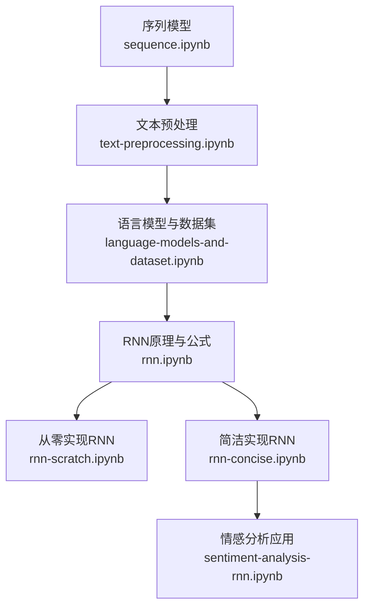
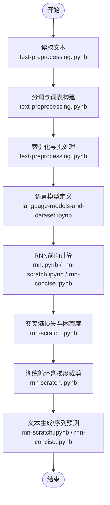
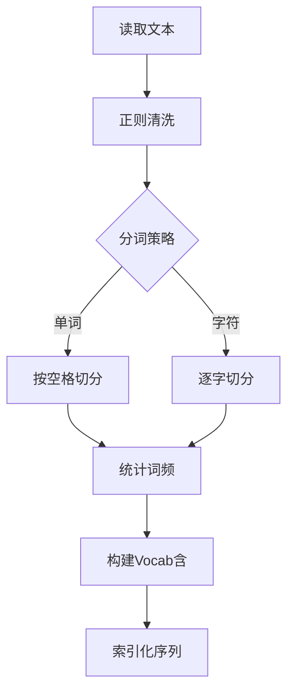
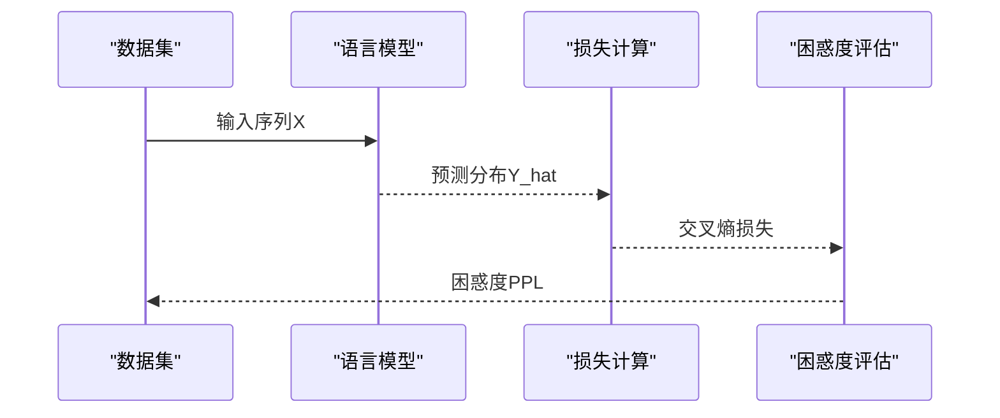
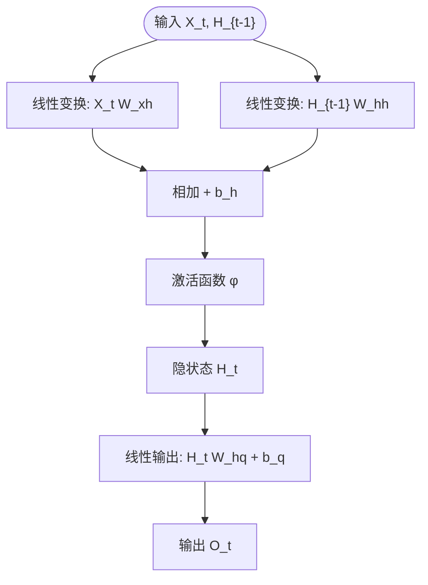
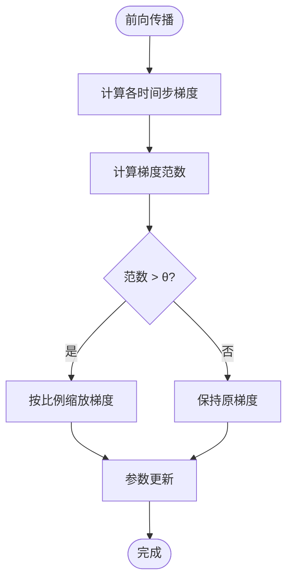
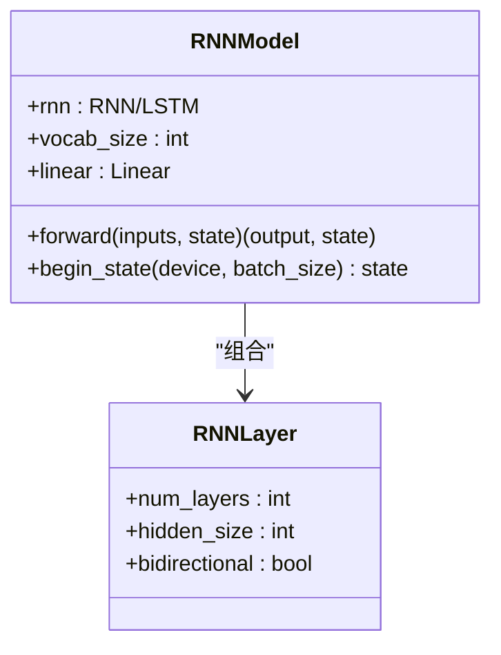
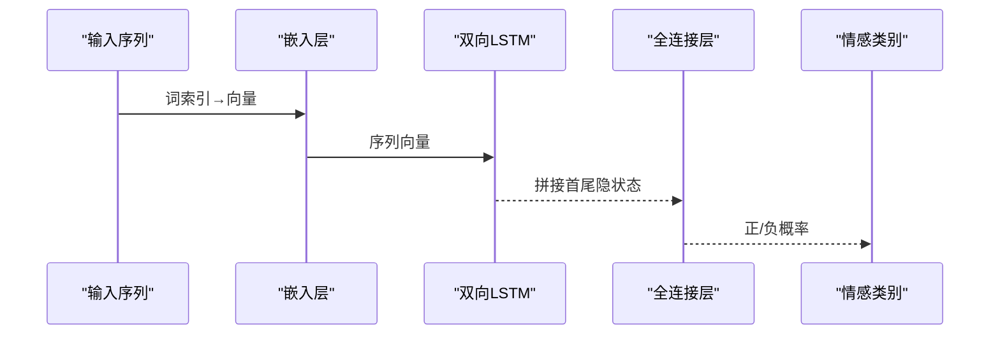
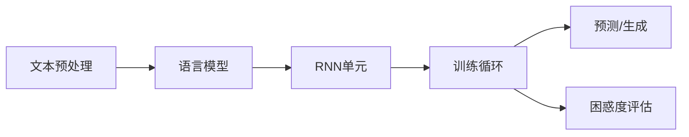

# 循环神经网络

<cite>
**本文引用的文件**   
- [chapter_recurrent-neural-networks/index.ipynb](file://chapter_recurrent-neural-networks/index.ipynb)
- [chapter_recurrent-neural-networks/sequence.ipynb](file://chapter_recurrent-neural-networks/sequence.ipynb)
- [chapter_recurrent-neural-networks/text-preprocessing.ipynb](file://chapter_recurrent-neural-networks/text-preprocessing.ipynb)
- [chapter_recurrent-neural-networks/language-models-and-dataset.ipynb](file://chapter_recurrent-neural-networks/language-models-and-dataset.ipynb)
- [chapter_recurrent-neural-networks/rnn.ipynb](file://chapter_recurrent-neural-networks/rnn.ipynb)
- [chapter_recurrent-neural-networks/rnn-scratch.ipynb](file://chapter_recurrent-neural-networks/rnn-scratch.ipynb)
- [chapter_recurrent-neural-networks/rnn-concise.ipynb](file://chapter_recurrent-neural-networks/rnn-concise.ipynb)
- [chapter_natural-language-processing-applications/sentiment-analysis-rnn.ipynb](file://chapter_natural-language-processing-applications/sentiment-analysis-rnn.ipynb)
</cite>

## 目录
1. [引言](#引言)
2. [项目结构](#项目结构)
3. [核心组件](#核心组件)
4. [架构总览](#架构总览)
5. [详细组件分析](#详细组件分析)
6. [依赖关系分析](#依赖关系分析)
7. [性能与稳定性](#性能与稳定性)
8. [故障排查指南](#故障排查指南)
9. [结论](#结论)
10. [附录](#附录)

## 引言
本章节围绕循环神经网络（RNN）展开，系统讲解其基本原理、时序数据处理能力、隐藏状态与信息传递机制；从零实现RNN的前向传播与反向传播；构建语言模型并进行训练；完整阐述文本预处理流程（词汇表构建、序列编码与批处理）；分析梯度消失与爆炸问题及其解决方案；提供文本生成与序列预测的实现思路；给出序列数据的可视化与分析方法；并总结RNN在NLP任务中的应用模式。

## 项目结构
本仓库的“循环神经网络”相关内容集中在 chapter_recurrent-neural-networks 目录，辅以情感分析示例展示RNN在下游任务中的使用。关键文件职责如下：
- sequence.ipynb：序列数据建模基础与统计工具介绍
- text-preprocessing.ipynb：文本预处理（读取、分词、词表、索引化）
- language-models-and-dataset.ipynb：语言模型定义与数据集准备
- rnn.ipynb：RNN理论推导与公式说明
- rnn-scratch.ipynb：从零实现RNN（前向、训练、预测、梯度裁剪）
- rnn-concise.ipynb：基于高级API的简洁实现
- sentiment-analysis-rnn.ipynb：RNN在情感分析中的应用（双向LSTM+预训练词向量）



**图表来源** 
- [chapter_recurrent-neural-networks/sequence.ipynb](file://chapter_recurrent-neural-networks/sequence.ipynb)
- [chapter_recurrent-neural-networks/text-preprocessing.ipynb](file://chapter_recurrent-neural-networks/text-preprocessing.ipynb)
- [chapter_recurrent-neural-networks/language-models-and-dataset.ipynb](file://chapter_recurrent-neural-networks/language-models-and-dataset.ipynb)
- [chapter_recurrent-neural-networks/rnn.ipynb](file://chapter_recurrent-neural-networks/rnn.ipynb)
- [chapter_recurrent-neural-networks/rnn-scratch.ipynb](file://chapter_recurrent-neural-networks/rnn-scratch.ipynb)
- [chapter_recurrent-neural-networks/rnn-concise.ipynb](file://chapter_recurrent-neural-networks/rnn-concise.ipynb)
- [chapter_natural-language-processing-applications/sentiment-analysis-rnn.ipynb](file://chapter_natural-language-processing-applications/sentiment-analysis-rnn.ipynb)

**章节来源**
- [chapter_recurrent-neural-networks/index.ipynb:1-62](file://chapter_recurrent-neural-networks/index.ipynb#L1-L62)

## 核心组件
- 序列建模与隐状态：通过隐变量自回归模型将历史压缩为固定维度的隐状态，用于当前时间步预测。
- 文本预处理：读取文本→分词→构建词表→索引化，形成模型可处理的数字序列。
- 语言模型：以条件概率连乘形式建模序列联合概率，训练目标为最小化交叉熵损失（困惑度评估）。
- RNN单元：输入与前一时刻隐状态共同更新当前隐状态，并通过输出层得到预测分布。
- 训练与优化：支持随机采样或顺序分区；引入梯度裁剪稳定训练；使用困惑度监控收敛。
- 预测与生成：预热期后按温度采样生成字符级序列。
- 应用模式：分类任务（如情感分析）采用双向RNN/LSTM聚合首尾隐状态作为序列表示。

**章节来源**
- [chapter_recurrent-neural-networks/sequence.ipynb:1-174](file://chapter_recurrent-neural-networks/sequence.ipynb#L1-L174)
- [chapter_recurrent-neural-networks/text-preprocessing.ipynb:1-454](file://chapter_recurrent-neural-networks/text-preprocessing.ipynb#L1-L454)
- [chapter_recurrent-neural-networks/language-models-and-dataset.ipynb:1-800](file://chapter_recurrent-neural-networks/language-models-and-dataset.ipynb#L1-L800)
- [chapter_recurrent-neural-networks/rnn.ipynb:1-200](file://chapter_recurrent-neural-networks/rnn.ipynb#L1-L200)
- [chapter_recurrent-neural-networks/rnn-scratch.ipynb:1-800](file://chapter_recurrent-neural-networks/rnn-scratch.ipynb#L1-L800)
- [chapter_recurrent-neural-networks/rnn-concise.ipynb:1-800](file://chapter_recurrent-neural-networks/rnn-concise.ipynb#L1-L800)
- [chapter_natural-language-processing-applications/sentiment-analysis-rnn.ipynb:1-200](file://chapter_natural-language-processing-applications/sentiment-analysis-rnn.ipynb#L1-L200)

## 架构总览
下图展示了从原始文本到RNN语言模型的端到端流程，包括预处理、模型前向、训练与预测。



**图表来源** 
- [chapter_recurrent-neural-networks/text-preprocessing.ipynb](file://chapter_recurrent-neural-networks/text-preprocessing.ipynb)
- [chapter_recurrent-neural-networks/language-models-and-dataset.ipynb](file://chapter_recurrent-neural-networks/language-models-and-dataset.ipynb)
- [chapter_recurrent-neural-networks/rnn.ipynb](file://chapter_recurrent-neural-networks/rnn.ipynb)
- [chapter_recurrent-neural-networks/rnn-scratch.ipynb](file://chapter_recurrent-neural-networks/rnn-scratch.ipynb)
- [chapter_recurrent-neural-networks/rnn-concise.ipynb](file://chapter_recurrent-neural-networks/rnn-concise.ipynb)

## 详细组件分析

### 序列建模与隐状态
- 隐变量自回归模型：用固定维度隐状态 h_t 近似 P(x_t | x_{t-1}, ..., x_1)，降低参数规模。
- 马尔可夫近似：当依赖长度有限时可用n元语法近似，但深度模型更灵活。
- 因果性：时间方向不可逆，正向建模更符合自然语义。

```mermaid
classDiagram
class SequenceModel {
+h_t : 隐状态
+x_t : 当前输入
+f() : 隐状态更新函数
+g() : 输出预测函数
}
class RNNCell {
+W_xh : 输入权重
+W_hh : 隐状态权重
+b_h : 偏置
+phi : 激活函数
+forward(X_t, H_{t-1}) H_t
}
SequenceModel --> RNNCell : "使用"
```

**图表来源** 
- [chapter_recurrent-neural-networks/sequence.ipynb:1-174](file://chapter_recurrent-neural-networks/sequence.ipynb#L1-L174)
- [chapter_recurrent-neural-networks/rnn.ipynb:1-200](file://chapter_recurrent-neural-networks/rnn.ipynb#L1-L200)

**章节来源**
- [chapter_recurrent-neural-networks/sequence.ipynb:1-174](file://chapter_recurrent-neural-networks/sequence.ipynb#L1-L174)
- [chapter_recurrent-neural-networks/rnn.ipynb:1-200](file://chapter_recurrent-neural-networks/rnn.ipynb#L1-L200)

### 文本预处理流程
- 读取与清洗：加载文本行，去除标点与大写，统一小写。
- 分词：支持单词级与字符级分词。
- 词表构建：统计频率，设置min_freq过滤低频词，保留特殊标记（如<unk>）。
- 索引化：将文本映射为整数索引序列，便于模型输入。



**图表来源** 
- [chapter_recurrent-neural-networks/text-preprocessing.ipynb:1-454](file://chapter_recurrent-neural-networks/text-preprocessing.ipynb#L1-L454)

**章节来源**
- [chapter_recurrent-neural-networks/text-preprocessing.ipynb:1-454](file://chapter_recurrent-neural-networks/text-preprocessing.ipynb#L1-L454)

### 语言模型与数据集
- 语言模型目标：估计序列联合概率 P(x_1,...,x_T)=∏P(x_t|x_{<t})。
- 数据集准备：对语料库进行分词与索引化，构造训练迭代器。
- 评估指标：困惑度（PPL=exp(平均交叉熵)），越小越好。



**图表来源** 
- [chapter_recurrent-neural-networks/language-models-and-dataset.ipynb:1-800](file://chapter_recurrent-neural-networks/language-models-and-dataset.ipynb#L1-L800)
- [chapter_recurrent-neural-networks/rnn-scratch.ipynb:1-800](file://chapter_recurrent-neural-networks/rnn-scratch.ipynb#L1-L800)

**章节来源**
- [chapter_recurrent-neural-networks/language-models-and-dataset.ipynb:1-800](file://chapter_recurrent-neural-networks/language-models-and-dataset.ipynb#L1-L800)

### RNN前向传播（从零实现）
- 输入形状：(时间步数, 批量大小, 词表大小)
- 隐状态更新：H_t = φ(X_t W_xh + H_{t-1} W_hh + b_h)
- 输出计算：O_t = H_t W_hq + b_q
- 拼接所有时间步输出用于损失计算



**图表来源** 
- [chapter_recurrent-neural-networks/rnn-scratch.ipynb:1-800](file://chapter_recurrent-neural-networks/rnn-scratch.ipynb#L1-L800)
- [chapter_recurrent-neural-networks/rnn.ipynb:1-200](file://chapter_recurrent-neural-networks/rnn.ipynb#L1-L200)

**章节来源**
- [chapter_recurrent-neural-networks/rnn-scratch.ipynb:1-800](file://chapter_recurrent-neural-networks/rnn-scratch.ipynb#L1-L800)
- [chapter_recurrent-neural-networks/rnn.ipynb:1-200](file://chapter_recurrent-neural-networks/rnn.ipynb#L1-L200)

### RNN反向传播（BPTT）与梯度裁剪
- 通过时间反向传播（BPTT）沿时间步展开计算图，累积梯度。
- 长序列易导致梯度爆炸或消失，需梯度裁剪限制范数。
- 训练循环中在每个小批量后执行梯度裁剪，保证数值稳定。



**图表来源** 
- [chapter_recurrent-neural-networks/rnn-scratch.ipynb:1-800](file://chapter_recurrent-neural-networks/rnn-scratch.ipynb#L1-L800)

**章节来源**
- [chapter_recurrent-neural-networks/rnn-scratch.ipynb:1-800](file://chapter_recurrent-neural-networks/rnn-scratch.ipynb#L1-L800)

### 训练与预测（从零实现）
- 训练：支持随机采样与顺序分区；每步分离隐状态梯度；使用困惑度监控。
- 预测：预热期后按温度采样生成字符序列，避免贪心导致的重复。

```mermaid
sequenceDiagram
participant Loop as "训练循环"
participant Net as "RNN模型"
participant Loss as "损失"
participant Opt as "优化器"
Loop->>Net : 输入X, 初始状态state
Net-->>Loop : 输出Y_hat, 新状态state
Loop->>Loss : 计算交叉熵
Loss-->>Opt : 反向传播
Opt->>Net : 梯度裁剪与参数更新
Loop-->>Loop : 记录困惑度
```

**图表来源** 
- [chapter_recurrent-neural-networks/rnn-scratch.ipynb:1-800](file://chapter_recurrent-neural-networks/rnn-scratch.ipynb#L1-L800)

**章节来源**
- [chapter_recurrent-neural-networks/rnn-scratch.ipynb:1-800](file://chapter_recurrent-neural-networks/rnn-scratch.ipynb#L1-L800)

### 简洁实现（高级API）
- 使用 nn.RNN 或 nn.LSTM 构建多层循环层。
- 封装 RNNModel：包含嵌入/独热编码、循环层、全连接输出层。
- begin_state 根据RNN类型返回不同形状的隐状态。



**图表来源** 
- [chapter_recurrent-neural-networks/rnn-concise.ipynb:1-800](file://chapter_recurrent-neural-networks/rnn-concise.ipynb#L1-L800)

**章节来源**
- [chapter_recurrent-neural-networks/rnn-concise.ipynb:1-800](file://chapter_recurrent-neural-networks/rnn-concise.ipynb#L1-L800)

### 情感分析应用（双向RNN）
- 使用预训练词向量（如GloVe）初始化嵌入。
- 双向LSTM编码序列，拼接首尾隐状态作为全局表示。
- 全连接层进行分类输出（正/负情感）。



**图表来源** 
- [chapter_natural-language-processing-applications/sentiment-analysis-rnn.ipynb:1-200](file://chapter_natural-language-processing-applications/sentiment-analysis-rnn.ipynb#L1-L200)

**章节来源**
- [chapter_natural-language-processing-applications/sentiment-analysis-rnn.ipynb:1-200](file://chapter_natural-language-processing-applications/sentiment-analysis-rnn.ipynb#L1-L200)

## 依赖关系分析
- 文本预处理模块为语言模型与RNN提供标准化输入。
- 语言模型定义依赖RNN单元进行序列建模。
- 训练循环依赖损失函数与优化器，同时调用梯度裁剪保障稳定。
- 预测模块复用训练好的模型与词表进行生成。



**图表来源** 
- [chapter_recurrent-neural-networks/text-preprocessing.ipynb](file://chapter_recurrent-neural-networks/text-preprocessing.ipynb)
- [chapter_recurrent-neural-networks/language-models-and-dataset.ipynb](file://chapter_recurrent-neural-networks/language-models-and-dataset.ipynb)
- [chapter_recurrent-neural-networks/rnn-scratch.ipynb](file://chapter_recurrent-neural-networks/rnn-scratch.ipynb)

**章节来源**
- [chapter_recurrent-neural-networks/text-preprocessing.ipynb:1-454](file://chapter_recurrent-neural-networks/text-preprocessing.ipynb#L1-L454)
- [chapter_recurrent-neural-networks/language-models-and-dataset.ipynb:1-800](file://chapter_recurrent-neural-networks/language-models-and-dataset.ipynb#L1-L800)
- [chapter_recurrent-neural-networks/rnn-scratch.ipynb:1-800](file://chapter_recurrent-neural-networks/rnn-scratch.ipynb#L1-L800)

## 性能与稳定性
- 梯度裁剪：限制梯度范数，缓解梯度爆炸，提升训练稳定性。
- 序列采样策略：随机采样打破时间相关性，顺序分区保留上下文但需分离梯度。
- 困惑度监控：指数化交叉熵，跨序列长度可比，指导超参调优。
- 数值稳定性：选择合适的激活函数（如ReLU/tanh）、初始化方法与学习率调度。

[本节为通用指导，不直接分析具体文件]

## 故障排查指南
- 训练发散：检查是否启用梯度裁剪；调整学习率；确认输入归一化。
- 困惑度不降：增加数据量或训练轮次；检查词表质量与分词策略；尝试更大隐藏维度。
- 生成文本重复：调整温度参数；使用采样而非贪心；增加预热步数。
- 显存不足：减小批量大小或序列长度；使用顺序分区并分离梯度。

**章节来源**
- [chapter_recurrent-neural-networks/rnn-scratch.ipynb:1-800](file://chapter_recurrent-neural-networks/rnn-scratch.ipynb#L1-L800)

## 结论
RNN通过隐状态有效建模序列依赖，结合文本预处理与语言模型训练，可实现字符级文本生成与序列预测。实践中需关注梯度稳定性（裁剪）、评估指标（困惑度）与采样策略（温度）。在分类任务中，双向RNN/LSTM能更好捕获上下文信息。整体流程清晰、模块化强，便于扩展至更多NLP任务。

[本节为总结性内容，不直接分析具体文件]

## 附录
- 术语对照：隐状态、困惑度、BPTT、梯度裁剪、温度采样等。
- 实践建议：从小规模数据集起步，逐步增加复杂度；可视化训练曲线与生成样例。

[本节为补充信息，不直接分析具体文件]