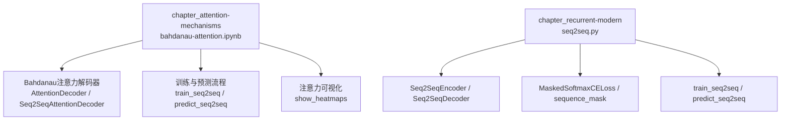
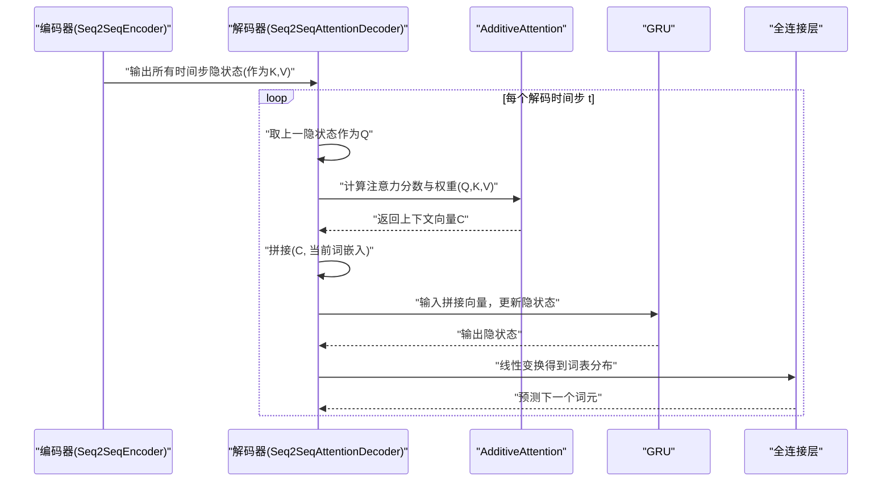
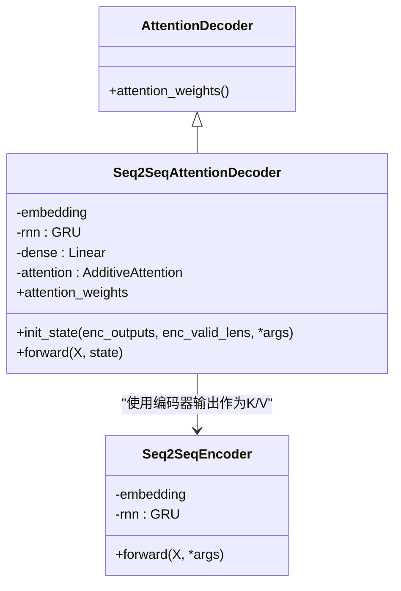
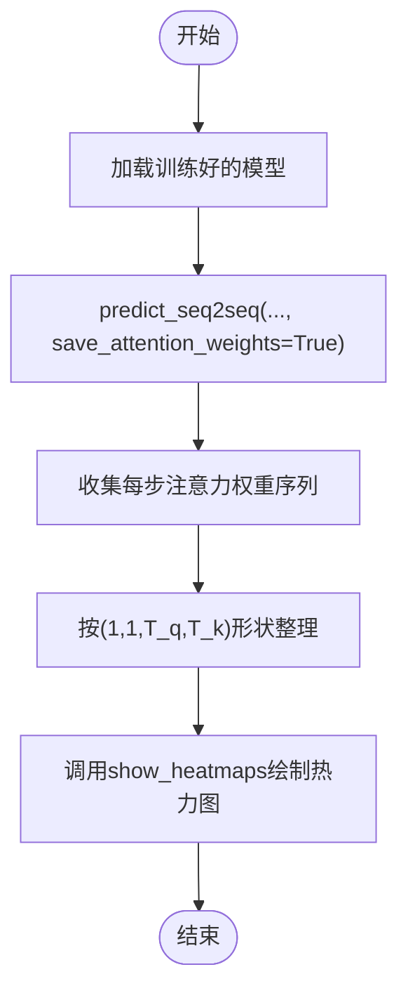
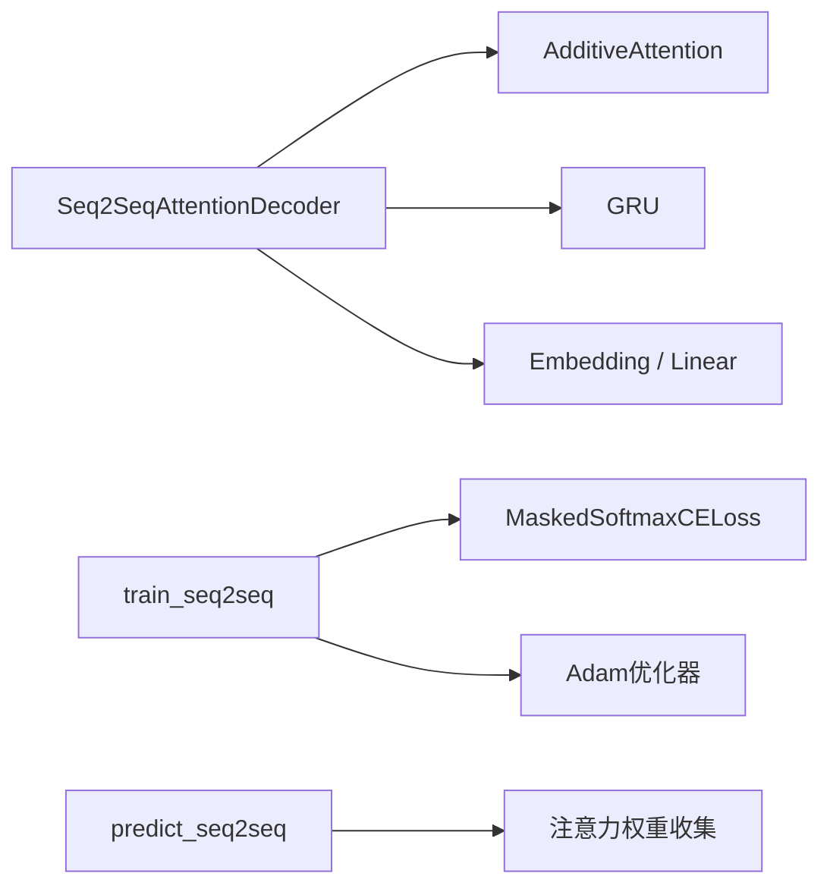

# Bahdanau注意力机制

<cite>
**本文引用的文件**   
- [bahdanau-attention.ipynb](file://chapter_attention-mechanisms/bahdanau-attention.ipynb)
- [index.ipynb](file://chapter_attention-mechanisms/index.ipynb)
- [seq2seq.py](file://chapter_recurrent-modern/seq2seq.py)
</cite>

## 目录
1. [引言](#引言)
2. [项目结构](#项目结构)
3. [核心组件](#核心组件)
4. [架构总览](#架构总览)
5. [详细组件分析](#详细组件分析)
6. [依赖关系分析](#依赖关系分析)
7. [性能与复杂度](#性能与复杂度)
8. [故障排查指南](#故障排查指南)
9. [结论](#结论)
10. [附录：三种注意力打分函数对比](#附录三种注意力打分函数对比)

## 引言
本文件围绕Bahdanau注意力机制，系统阐述其数学原理、计算流程以及在机器翻译中的典型应用。内容涵盖查询（Query）、键（Key）、值（Value）的角色定义，注意力权重的计算方法，以及加性注意力（Bahdanau原始形式）、点积注意力和一般注意力的区别与适用场景。同时给出基于PyTorch的完整实现要点、训练流程、注意力权重可视化与分析方法，并讨论与传统RNN结合的使用模式、计算复杂度与优化策略。

## 项目结构
本项目在“注意力机制”章节中提供了Bahdanau注意力的完整教程与示例代码，并在“现代循环网络”章节提供Seq2Seq基础实现与训练工具。关键文件如下：
- chapter_attention-mechanisms/bahdanau-attention.ipynb：Bahdanau注意力模型定义、训练、预测与注意力可视化。
- chapter_attention-mechanisms/index.ipynb：注意力机制章节导言与导航。
- chapter_recurrent-modern/seq2seq.py：Seq2Seq编码器/解码器、遮蔽损失、训练与预测流程等通用工具。



图表来源 
- [bahdanau-attention.ipynb:1-200](file://chapter_attention-mechanisms/bahdanau-attention.ipynb#L1-L200)
- [seq2seq.py:66-172](file://chapter_recurrent-modern/seq2seq.py#L66-L172)

章节来源
- [index.ipynb:10-46](file://chapter_attention-mechanisms/index.ipynb#L10-L46)
- [bahdanau-attention.ipynb:1-200](file://chapter_attention-mechanisms/bahdanau-attention.ipynb#L1-L200)
- [seq2seq.py:66-172](file://chapter_recurrent-modern/seq2seq.py#L66-L172)

## 核心组件
- AttentionDecoder：带注意力机制的解码器基类，暴露注意力权重接口。
- Seq2SeqAttentionDecoder：基于GRU的Bahdanau注意力解码器，内部使用AdditiveAttention计算上下文向量，并将上下文与当前词嵌入拼接后输入GRU。
- Seq2SeqEncoder：编码器，输出所有时间步的隐状态作为注意力的键和值。
- MaskedSoftmaxCELoss：屏蔽填充位置的交叉熵损失。
- train_seq2seq / predict_seq2seq：训练与自回归预测流程，支持保存注意力权重用于可视化。

章节来源
- [bahdanau-attention.ipynb:112-207](file://chapter_attention-mechanisms/bahdanau-attention.ipynb#L112-L207)
- [seq2seq.py:66-131](file://chapter_recurrent-modern/seq2seq.py#L66-L131)
- [seq2seq.py:138-172](file://chapter_recurrent-modern/seq2seq.py#L138-L172)
- [seq2seq.py:179-276](file://chapter_recurrent-modern/seq2seq.py#L179-L276)

## 架构总览
Bahdanau注意力将解码器上一时间步的隐状态作为查询Q，编码器所有时间步的隐状态同时作为键K与值V，通过加性注意力打分得到注意力权重，再对V加权求和得到上下文C，最后将C与当前词嵌入拼接送入GRU进行下一步预测。



图表来源 
- [bahdanau-attention.ipynb:160-207](file://chapter_attention-mechanisms/bahdanau-attention.ipynb#L160-L207)
- [seq2seq.py:66-131](file://chapter_recurrent-modern/seq2seq.py#L66-L131)

## 详细组件分析

### 注意力解码器类图


图表来源 
- [bahdanau-attention.ipynb:112-207](file://chapter_attention-mechanisms/bahdanau-attention.ipynb#L112-L207)
- [seq2seq.py:66-131](file://chapter_recurrent-modern/seq2seq.py#L66-L131)

章节来源
- [bahdanau-attention.ipynb:112-207](file://chapter_attention-mechanisms/bahdanau-attention.ipynb#L112-L207)
- [seq2seq.py:66-131](file://chapter_recurrent-modern/seq2seq.py#L66-L131)

### 训练流程时序
```mermaid
sequenceDiagram
participant Data as "数据迭代器"
participant Net as "EncoderDecoder"
participant Loss as "MaskedSoftmaxCELoss"
participant Opt as "Adam优化器"
loop 每个epoch
Data-->>Net : "批次(X, X_valid_len, Y, Y_valid_len)"
Net->>Net : "前向传播(Y_hat)"
Net-->>Data : "Y_hat"
Data->>Loss : "计算屏蔽交叉熵损失"
Loss-->>Opt : "反向传播梯度"
Opt->>Net : "参数更新"
end
```

图表来源 
- [seq2seq.py:179-234](file://chapter_recurrent-modern/seq2seq.py#L179-L234)

章节来源
- [seq2seq.py:179-234](file://chapter_recurrent-modern/seq2seq.py#L179-L234)

### 注意力权重可视化流程


图表来源 
- [bahdanau-attention.ipynb:932-961](file://chapter_attention-mechanisms/bahdanau-attention.ipynb#L932-L961)
- [bahdanau-attention.ipynb:1715-1720](file://chapter_attention-mechanisms/bahdanau-attention.ipynb#L1715-L1720)

章节来源
- [bahdanau-attention.ipynb:932-961](file://chapter_attention-mechanisms/bahdanau-attention.ipynb#L932-L961)
- [bahdanau-attention.ipynb:1715-1720](file://chapter_attention-mechanisms/bahdanau-attention.ipynb#L1715-L1720)

## 依赖关系分析
- Bahdanau注意力解码器依赖d2l.AdditiveAttention（加性注意力打分），并使用GRU作为序列建模单元。
- 训练流程依赖MaskedSoftmaxCELoss处理变长序列的屏蔽损失。
- 预测流程支持自回归生成与注意力权重收集，便于可解释性分析。



图表来源 
- [bahdanau-attention.ipynb:160-207](file://chapter_attention-mechanisms/bahdanau-attention.ipynb#L160-L207)
- [seq2seq.py:138-172](file://chapter_recurrent-modern/seq2seq.py#L138-L172)
- [seq2seq.py:179-276](file://chapter_recurrent-modern/seq2seq.py#L179-L276)

章节来源
- [bahdanau-attention.ipynb:160-207](file://chapter_attention-mechanisms/bahdanau-attention.ipynb#L160-L207)
- [seq2seq.py:138-172](file://chapter_recurrent-modern/seq2seq.py#L138-L172)
- [seq2seq.py:179-276](file://chapter_recurrent-modern/seq2seq.py#L179-L276)

## 性能与复杂度
- 时间复杂度：单步注意力计算为O(T·d)，其中T为源序列长度，d为隐藏维度；整个解码过程为O(T_tgt·T_src·d)。
- 空间复杂度：注意力权重矩阵为O(T_tgt·T_src)，显存占用随序列长度平方增长。
- 优化策略：
  - 使用批内并行与GPU加速（已在实现中使用）。
  - 合理设置num_steps与batch_size以平衡内存与吞吐。
  - 采用梯度裁剪与Xavier初始化提升训练稳定性。
  - 若需更高效率，可将加性注意力替换为缩放点积注意力（见练习建议）。

章节来源
- [bahdanau-attention.ipynb:880-891](file://chapter_attention-mechanisms/bahdanau-attention.ipynb#L880-L891)
- [seq2seq.py:179-234](file://chapter_recurrent-modern/seq2seq.py#L179-L234)

## 故障排查指南
- 编码/解码形状不匹配：检查嵌入与GRU输入维度的拼接顺序与维度对齐。
- 训练不稳定：确认使用了梯度裁剪与合适的学习率；必要时调整dropout或初始化方式。
- 注意力可视化异常：确保在predict时开启save_attention_weights，并按(1,1,T_q,T_k)整理张量后再绘图。
- 数据集读取编码错误：参考seq2seq.py中对fra.txt读取的编码修复。

章节来源
- [seq2seq.py:11-16](file://chapter_recurrent-modern/seq2seq.py#L11-L16)
- [seq2seq.py:179-234](file://chapter_recurrent-modern/seq2seq.py#L179-L234)
- [bahdanau-attention.ipynb:932-961](file://chapter_attention-mechanisms/bahdanau-attention.ipynb#L932-L961)

## 结论
Bahdanau注意力通过可微的对齐机制显著提升了序列到序列任务的性能与可解释性。在本项目中，注意力解码器与Seq2Seq训练/预测流程配合良好，能够完成英法翻译任务并可视化注意力权重。未来可通过替换注意力打分函数（如缩放点积）进一步提升效率，并结合多头注意力与Transformer架构拓展能力。

## 附录：三种注意力打分函数对比
- 加性注意力（Bahdanau）：使用一个可学习的非线性映射计算分数，适合较小维度与需要更强表达能力的场景。
- 点积注意力：直接计算Q与K的点积，简单高效，常配合缩放因子使用。
- 一般注意力：对Q与K分别做线性变换后再点积，介于加性与点积之间。

章节来源
- [bahdanau-attention.ipynb:1733-1737](file://chapter_attention-mechanisms/bahdanau-attention.ipynb#L1733-L1737)