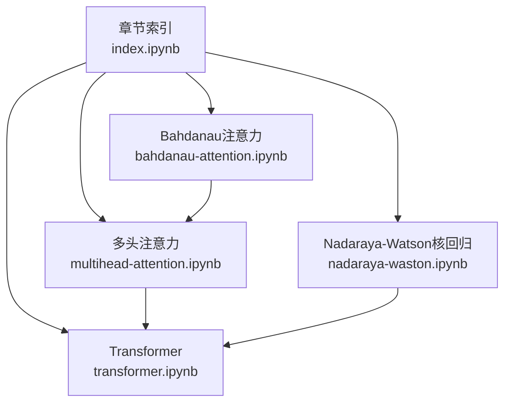
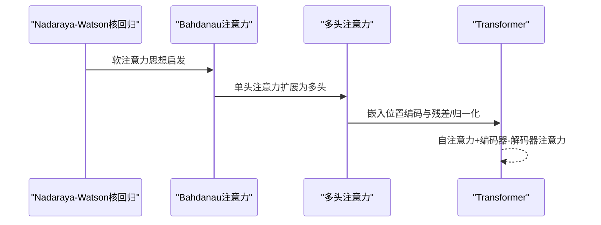
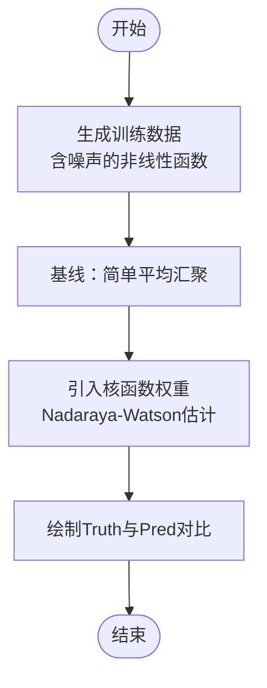
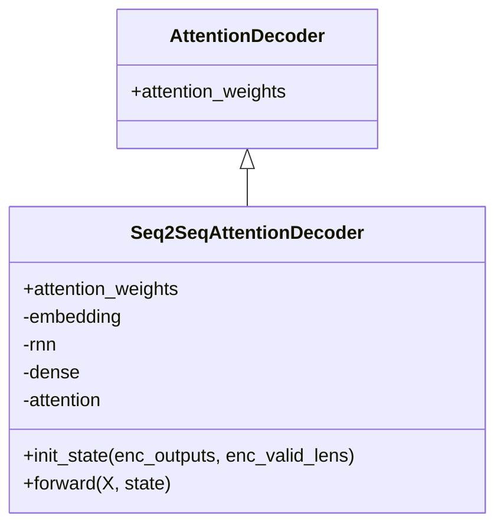
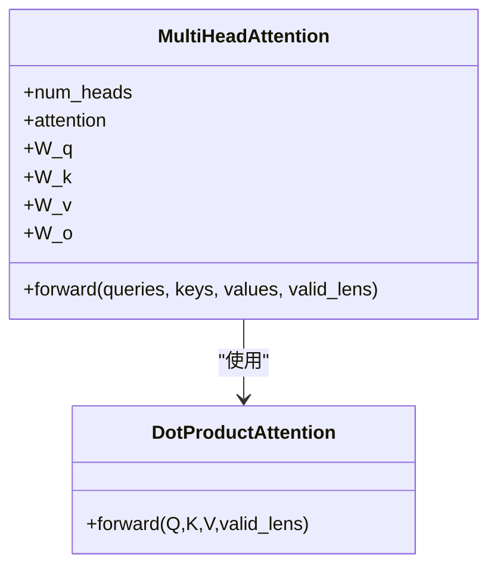
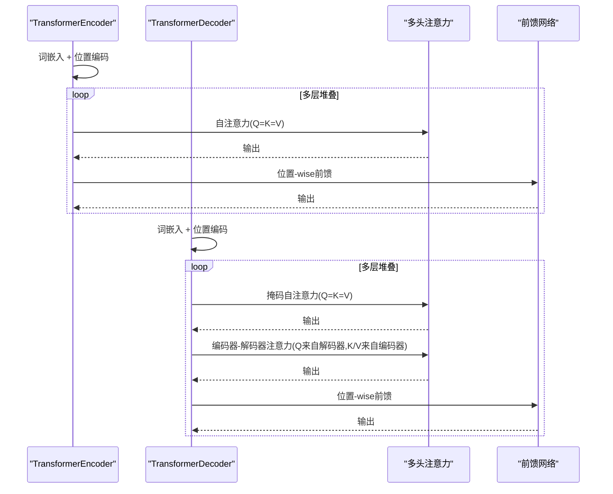
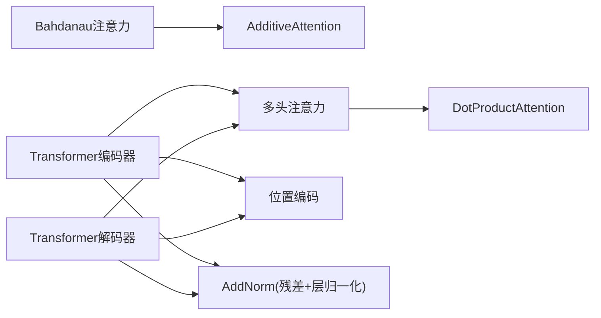

# 注意力机制

<cite>
**本文引用的文件**   
- [chapter_attention-mechanisms/index.ipynb](file://chapter_attention-mechanisms/index.ipynb)
- [chapter_attention-mechanisms/nadaraya-waston.ipynb](file://chapter_attention-mechanisms/nadaraya-waston.ipynb)
- [chapter_attention-mechanisms/bahdanau-attention.ipynb](file://chapter_attention-mechanisms/bahdanau-attention.ipynb)
- [chapter_attention-mechanisms/multihead-attention.ipynb](file://chapter_attention-mechanisms/multihead-attention.ipynb)
- [chapter_attention-mechanisms/transformer.ipynb](file://chapter_attention-mechanisms/transformer.ipynb)
</cite>

## 目录
1. [引言](#引言)
2. [项目结构](#项目结构)
3. [核心组件](#核心组件)
4. [架构总览](#架构总览)
5. [详细组件分析](#详细组件分析)
6. [依赖关系分析](#依赖关系分析)
7. [性能与复杂度](#性能与复杂度)
8. [可解释性与可视化](#可解释性与可视化)
9. [训练流程与实现要点](#训练流程与实现要点)
10. [应用案例与实践建议](#应用案例与实践建议)
11. [故障排查](#故障排查)
12. [结论](#结论)

## 引言
本章节围绕注意力机制展开，系统阐述软注意力、Bahdanau注意力、Nadaraya-Watson核回归中的注意力思想、多头注意力与Transformer的自注意力及位置编码。文档同时给出计算复杂度分析与优化建议，并总结在大模型中的关键作用与实践经验。

## 项目结构
注意力相关代码以Jupyter Notebook形式组织在 chapter_attention-mechanisms 目录下，按主题分文件：
- index.ipynb：章节导览与知识脉络
- nadaraya-waston.ipynb：核回归视角下的注意力汇聚
- bahdanau-attention.ipynb：基于RNN的编码器-解码器与加性注意力
- multihead-attention.ipynb：多头注意力的并行化实现
- transformer.ipynb：完整的Transformer编码器-解码器、位置编码与训练

**图表来源** 
- [chapter_attention-mechanisms/index.ipynb:1-58](file://chapter_attention-mechanisms/index.ipynb#L1-L58)

**章节来源**
- [chapter_attention-mechanisms/index.ipynb:1-58](file://chapter_attention-mechanisms/index.ipynb#L1-L58)

## 核心组件
- 注意力汇聚（Attention Pooling）：通过查询-键相似度加权求和值，形成上下文表示
- Bahdanau注意力（加性注意力）：将解码器上一时刻隐状态作为查询，编码器各步隐状态作为键/值，使用可微对齐函数计算权重
- Nadaraya-Watson核回归：以核函数为权重的加权平均，体现“软”注意力思想
- 多头注意力：对Q/K/V进行多组线性投影，并行计算多个头后拼接再线性变换
- Transformer：全注意力架构，包含位置编码、残差连接与层归一化、掩码自注意力与编码器-解码器注意力

**章节来源**
- [chapter_attention-mechanisms/nadaraya-waston.ipynb:1-120](file://chapter_attention-mechanisms/nadaraya-waston.ipynb#L1-L120)
- [chapter_attention-mechanisms/bahdanau-attention.ipynb:1-120](file://chapter_attention-mechanisms/bahdanau-attention.ipynb#L1-L120)
- [chapter_attention-mechanisms/multihead-attention.ipynb:1-120](file://chapter_attention-mechanisms/multihead-attention.ipynb#L1-L120)
- [chapter_attention-mechanisms/transformer.ipynb:1-120](file://chapter_attention-mechanisms/transformer.ipynb#L1-L120)

## 架构总览
下图展示从核回归到Bahdanau再到Transformer的演进路径，以及多头注意力在Transformer中的核心地位。

**图表来源** 
- [chapter_attention-mechanisms/nadaraya-waston.ipynb:1-120](file://chapter_attention-mechanisms/nadaraya-waston.ipynb#L1-L120)
- [chapter_attention-mechanisms/bahdanau-attention.ipynb:1-120](file://chapter_attention-mechanisms/bahdanau-attention.ipynb#L1-L120)
- [chapter_attention-mechanisms/multihead-attention.ipynb:1-120](file://chapter_attention-mechanisms/multihead-attention.ipynb#L1-L120)
- [chapter_attention-mechanisms/transformer.ipynb:1-120](file://chapter_attention-mechanisms/transformer.ipynb#L1-L120)

## 详细组件分析

### Nadaraya-Watson核回归中的注意力
- 核心思想：用核函数衡量输入x与训练样本xi的相似度，得到权重αi(x)，输出为y的加权平均
- 优点：直观、可解释；缺点：计算开销随样本数增长，难以端到端学习复杂映射
- 在本仓库中用于演示注意力汇聚的基本形态与可视化

**图表来源** 
- [chapter_attention-mechanisms/nadaraya-waston.ipynb:1-170](file://chapter_attention-mechanisms/nadaraya-waston.ipynb#L1-L170)

**章节来源**
- [chapter_attention-mechanisms/nadaraya-waston.ipynb:1-170](file://chapter_attention-mechanisms/nadaraya-waston.ipynb#L1-L170)

### Bahdanau注意力（加性注意力）
- 设计要点：
  - 解码器上一时刻隐状态s_{t'-1}作为查询q
  - 编码器所有步隐状态h_t作为键k与值v
  - 使用可微打分函数计算注意力权重α(q,k)，并对v加权求和得到上下文c_{t'}
- 解码器实现：
  - AttentionDecoder接口暴露attention_weights属性便于可视化
  - Seq2SeqAttentionDecoder将context与当前词嵌入拼接后送入GRU，逐时步生成输出

**图表来源** 
- [chapter_attention-mechanisms/bahdanau-attention.ipynb:110-210](file://chapter_attention-mechanisms/bahdanau-attention.ipynb#L110-L210)

**章节来源**
- [chapter_attention-mechanisms/bahdanau-attention.ipynb:110-210](file://chapter_attention-mechanisms/bahdanau-attention.ipynb#L110-L210)

### 多头注意力（Multi-Head Attention）
- 动机：让模型在不同子空间中并行关注不同位置，融合短程与长程依赖
- 实现要点：
  - 对Q/K/V分别做线性投影，拆分为num_heads个子空间
  - 每个头独立执行缩放点积注意力
  - 将多头输出拼接后再经线性变换W_o得到最终输出
  - 通过transpose_qkv/transpose_output实现张量重排以支持并行

**图表来源** 
- [chapter_attention-mechanisms/multihead-attention.ipynb:120-170](file://chapter_attention-mechanisms/multihead-attention.ipynb#L120-L170)

**章节来源**
- [chapter_attention-mechanisms/multihead-attention.ipynb:120-170](file://chapter_attention-mechanisms/multihead-attention.ipynb#L120-L170)

### Transformer：自注意力与位置编码
- 编码器块：多头自注意力 + 前馈网络，均带残差连接与层归一化
- 解码器块：掩码自注意力 + 编码器-解码器注意力 + 前馈网络，同样带残差与归一化
- 位置编码：固定正弦/余弦或可学习的位置向量，与词嵌入相加
- 训练：英语-法语机器翻译任务，记录每层注意力权重以便可视化

**图表来源** 
- [chapter_attention-mechanisms/transformer.ipynb:280-430](file://chapter_attention-mechanisms/transformer.ipynb#L280-L430)
- [chapter_attention-mechanisms/transformer.ipynb:510-670](file://chapter_attention-mechanisms/transformer.ipynb#L510-L670)

**章节来源**
- [chapter_attention-mechanisms/transformer.ipynb:280-430](file://chapter_attention-mechanisms/transformer.ipynb#L280-L430)
- [chapter_attention-mechanisms/transformer.ipynb:510-670](file://chapter_attention-mechanisms/transformer.ipynb#L510-L670)

## 依赖关系分析
- Bahdanau注意力依赖d2l.AdditiveAttention与RNN解码器
- 多头注意力依赖d2l.DotProductAttention与张量转置工具
- Transformer依赖多头注意力、位置编码、AddNorm与前馈网络模块
- 训练流程统一使用PyTorch与d2l工具库

**图表来源** 
- [chapter_attention-mechanisms/bahdanau-attention.ipynb:160-210](file://chapter_attention-mechanisms/bahdanau-attention.ipynb#L160-L210)
- [chapter_attention-mechanisms/multihead-attention.ipynb:120-170](file://chapter_attention-mechanisms/multihead-attention.ipynb#L120-L170)
- [chapter_attention-mechanisms/transformer.ipynb:280-430](file://chapter_attention-mechanisms/transformer.ipynb#L280-L430)

**章节来源**
- [chapter_attention-mechanisms/bahdanau-attention.ipynb:160-210](file://chapter_attention-mechanisms/bahdanau-attention.ipynb#L160-L210)
- [chapter_attention-mechanisms/multihead-attention.ipynb:120-170](file://chapter_attention-mechanisms/multihead-attention.ipynb#L120-L170)
- [chapter_attention-mechanisms/transformer.ipynb:280-430](file://chapter_attention-mechanisms/transformer.ipynb#L280-L430)

## 性能与复杂度
- 注意力复杂度：
  - 缩放点积注意力：O(L^2·d)，其中L为序列长度，d为特征维度
  - 多头注意力：H个头的并行计算，整体仍为O(H·L^2·d)，但可通过矩阵并行加速
  - Bahdanau加性注意力：涉及可微对齐打分，通常比缩放点积更慢
- 优化建议：
  - 使用有效的张量形状变换（如transpose_qkv）提升并行度
  - 合理设置num_hiddens与num_heads，平衡表达能力与计算成本
  - 对于长序列，考虑稀疏注意力、分块注意力或KV缓存等策略

[本节为通用指导，不直接分析具体文件]

## 可解释性与可视化
- Bahdanau注意力：解码器每步保存attention_weights，可观察源序列各位置的贡献
- 多头注意力：不同头可能关注不同语义或句法模式，可分别可视化
- Transformer：记录每层的自注意力与编码器-解码器注意力权重，辅助理解跨层信息流动

实践方法：
- 在解码循环中收集attention_weights列表
- 使用热力图或条形图展示权重分布
- 比较不同头之间的注意力模式差异

**章节来源**
- [chapter_attention-mechanisms/bahdanau-attention.ipynb:180-210](file://chapter_attention-mechanisms/bahdanau-attention.ipynb#L180-L210)
- [chapter_attention-mechanisms/multihead-attention.ipynb:310-340](file://chapter_attention-mechanisms/multihead-attention.ipynb#L310-L340)
- [chapter_attention-mechanisms/transformer.ipynb:650-670](file://chapter_attention-mechanisms/transformer.ipynb#L650-L670)

## 训练流程与实现要点
- 数据准备：构建源/目标语料，处理变长序列与填充
- 模型初始化：配置编码器/解码器层数、头数、隐藏维、dropout等
- 训练循环：
  - 前向传播：编码器输出上下文，解码器逐步生成目标序列
  - 损失计算：交叉熵损失，结合有效长度mask
  - 反向传播与参数更新：使用合适的优化器与学习率调度
- 评估与可视化：记录loss曲线、注意力权重，检查对齐质量

参考实现路径：
- Bahdanau训练：见对应Notebook的训练单元
- Transformer训练：见对应Notebook的训练单元，包含英语-法语翻译示例

**章节来源**
- [chapter_attention-mechanisms/bahdanau-attention.ipynb:260-320](file://chapter_attention-mechanisms/bahdanau-attention.ipynb#L260-L320)
- [chapter_attention-mechanisms/transformer.ipynb:680-760](file://chapter_attention-mechanisms/transformer.ipynb#L680-L760)

## 应用案例与实践建议
- 机器翻译：Bahdanau与Transformer的经典应用
- 文本摘要与问答：利用自注意力聚合全局信息
- 视觉任务：Vision Transformer将图像分块视为序列，使用自注意力建模关系
- 语音与强化学习：Transformer在多模态与决策任务中广泛应用

实践建议：
- 小数据集优先尝试Bahdanau注意力，易于调试与可视化
- 大数据集与长序列建议使用Transformer，配合位置编码与掩码策略
- 根据任务选择合适头数与隐藏维，避免过参导致过拟合

[本节为通用指导，不直接分析具体文件]

## 故障排查
常见问题与解决思路：
- 注意力权重全集中在少数位置：检查有效长度mask是否正确，调整温度或打分函数
- 训练不稳定：确认层归一化与残差连接的顺序，适当降低学习率或增加dropout
- 长序列内存不足：减少batch size、序列长度或使用分块注意力
- 多头注意力形状错误：核对transpose_qkv/transpose_output的维度变换

**章节来源**
- [chapter_attention-mechanisms/multihead-attention.ipynb:190-220](file://chapter_attention-mechanisms/multihead-attention.ipynb#L190-L220)
- [chapter_attention-mechanisms/transformer.ipynb:220-240](file://chapter_attention-mechanisms/transformer.ipynb#L220-L240)

## 结论
注意力机制从核回归的思想出发，逐步发展为Bahdanau注意力、多头注意力与Transformer的核心组件。其强大的并行计算能力与全局建模特性使其成为现代大模型的基石。实践中需权衡复杂度与表达能力，结合可视化手段进行调试与解释，以获得更好的性能与可解释性。