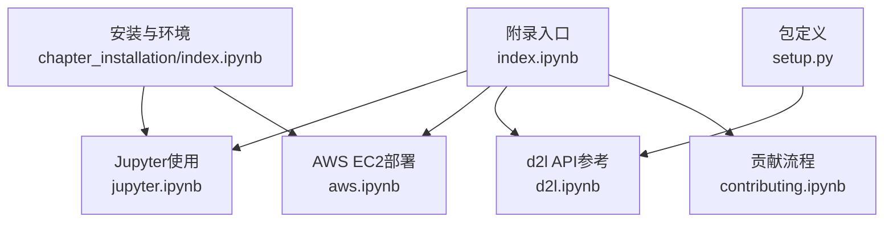
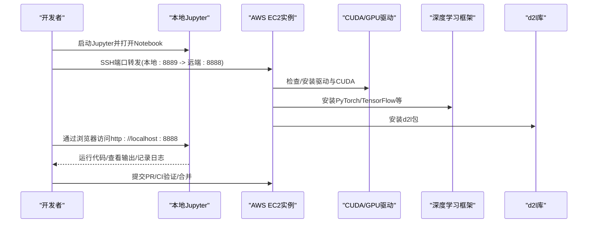
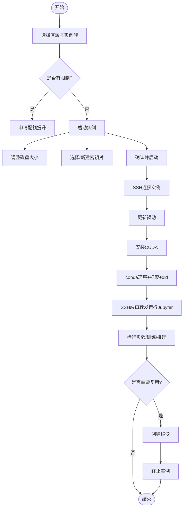
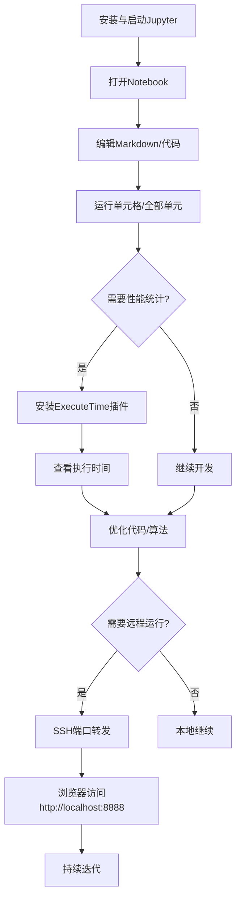
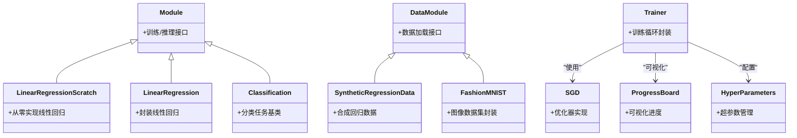
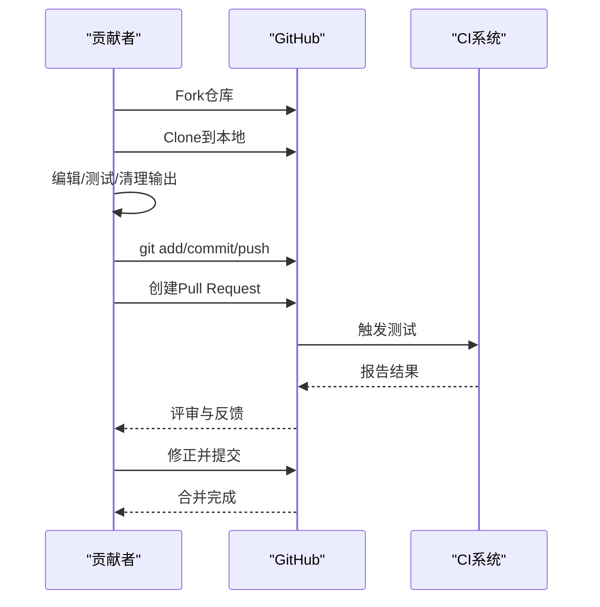
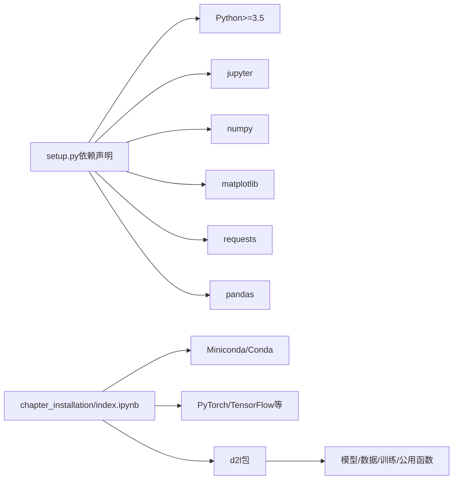

# 深度学习工具附录

<cite>
**本文引用的文件**   
- [chapter_appendix-tools-for-deep-learning/index.ipynb](file://chapter_appendix-tools-for-deep-learning/index.ipynb)
- [chapter_appendix-tools-for-deep-learning/aws.ipynb](file://chapter_appendix-tools-for-deep-learning/aws.ipynb)
- [chapter_appendix-tools-for-deep-learning/jupyter.ipynb](file://chapter_appendix-tools-for-deep-learning/jupyter.ipynb)
- [chapter_appendix-tools-for-deep-learning/d2l.ipynb](file://chapter_appendix-tools-for-deep-learning/d2l.ipynb)
- [chapter_appendix-tools-for-deep-learning/contributing.ipynb](file://chapter_appendix-tools-for-deep-learning/contributing.ipynb)
- [chapter_installation/index.ipynb](file://chapter_installation/index.ipynb)
- [setup.py](file://setup.py)
</cite>

## 目录
1. [简介](#简介)
2. [项目结构](#项目结构)
3. [核心组件](#核心组件)
4. [架构总览](#架构总览)
5. [详细组件分析](#详细组件分析)
6. [依赖关系分析](#依赖关系分析)
7. [性能与工程化实践](#性能与工程化实践)
8. [故障排除指南](#故障排除指南)
9. [结论](#结论)
10. [附录：常用工具安装与配置速查](#附录常用工具安装与配置速查)

## 简介
本附录聚焦于深度学习工程化的工具链与实践，涵盖在AWS上搭建GPU环境、使用Jupyter Notebook高效开发与远程协作、d2l库的功能与用法、贡献代码的规范流程，以及性能监控、日志记录、调试技巧与版本控制最佳实践。内容以仓库中的教程文档为依据，帮助读者快速构建可复现、可扩展、可协作的深度学习工作流。

## 项目结构
附录部分由一组相互关联的Notebook组成，分别覆盖工具使用、云平台部署、API参考与贡献流程；同时配套安装指南与包定义，形成从“本地开发—云端训练—模型部署—协作维护”的闭环。

图表来源
- [chapter_appendix-tools-for-deep-learning/index.ipynb:1-35](file://chapter_appendix-tools-for-deep-learning/index.ipynb#L1-L35)
- [chapter_installation/index.ipynb:1-159](file://chapter_installation/index.ipynb#L1-L159)
- [setup.py:1-24](file://setup.py#L1-L24)

章节来源
- [chapter_appendix-tools-for-deep-learning/index.ipynb:1-35](file://chapter_appendix-tools-for-deep-learning/index.ipynb#L1-L35)

## 核心组件
- Jupyter Notebook 高效使用与扩展（本地/远程、Markdown编辑、执行时间统计）
- AWS EC2 GPU实例创建、CUDA安装、远程Jupyter运行与实例生命周期管理
- d2l库API概览（模型、数据、训练器、公用函数等）
- 贡献代码规范（Git工作流、Pull Request、多框架代码块标记）

章节来源
- [chapter_appendix-tools-for-deep-learning/jupyter.ipynb:1-133](file://chapter_appendix-tools-for-deep-learning/jupyter.ipynb#L1-L133)
- [chapter_appendix-tools-for-deep-learning/aws.ipynb:1-226](file://chapter_appendix-tools-for-deep-learning/aws.ipynb#L1-L226)
- [chapter_appendix-tools-for-deep-learning/d2l.ipynb:1-105](file://chapter_appendix-tools-for-deep-learning/d2l.ipynb#L1-L105)
- [chapter_appendix-tools-for-deep-learning/contributing.ipynb:1-182](file://chapter_appendix-tools-for-deep-learning/contributing.ipynb#L1-L182)

## 架构总览
下图展示从本地到云端的端到端工作流：本地通过Jupyter进行实验与文档编写，云端EC2提供GPU算力与CUDA环境，d2l库统一封装常用能力，贡献流程保障代码质量与可维护性。

图表来源
- [chapter_appendix-tools-for-deep-learning/jupyter.ipynb:90-110](file://chapter_appendix-tools-for-deep-learning/jupyter.ipynb#L90-L110)
- [chapter_appendix-tools-for-deep-learning/aws.ipynb:95-189](file://chapter_appendix-tools-for-deep-learning/aws.ipynb#L95-L189)
- [chapter_installation/index.ipynb:52-134](file://chapter_installation/index.ipynb#L52-L134)
- [setup.py:1-24](file://setup.py#L1-L24)

## 详细组件分析

### AWS EC2深度学习环境搭建与部署
- 实例选择与配额：根据区域延迟与GPU类型选择合适的实例族，必要时申请配额提升。
- AMI与存储：选择Ubuntu镜像，适当增大系统盘容量以满足CUDA与数据集需求。
- 密钥与安全组：生成或选择密钥对，设置SSH权限，确保安全组放行必要端口。
- CUDA与驱动：更新驱动后按官方步骤安装CUDA，并将库路径加入环境变量。
- 环境与框架：通过Miniconda创建环境，安装PyTorch/TensorFlow等框架及d2l包。
- 远程Jupyter：使用SSH端口转发将远端8888映射到本地8889，通过浏览器访问。
- 实例生命周期：停止可重启但计费磁盘；终止会删除所有数据。建议制作镜像复用环境。

图表来源
- [chapter_appendix-tools-for-deep-learning/aws.ipynb:21-121](file://chapter_appendix-tools-for-deep-learning/aws.ipynb#L21-L121)
- [chapter_appendix-tools-for-deep-learning/aws.ipynb:123-168](file://chapter_appendix-tools-for-deep-learning/aws.ipynb#L123-L168)
- [chapter_appendix-tools-for-deep-learning/aws.ipynb:169-206](file://chapter_appendix-tools-for-deep-learning/aws.ipynb#L169-L206)

章节来源
- [chapter_appendix-tools-for-deep-learning/aws.ipynb:1-226](file://chapter_appendix-tools-for-deep-learning/aws.ipynb#L1-L226)

### Jupyter Notebook高效使用与扩展
- 基础操作：打开Notebook、编辑Markdown与代码单元格、运行单元格与全部单元。
- Markdown编辑：通过notedown插件直接编辑md源文件，便于Git协作与合并。
- 远程运行：通过SSH端口转发在远程服务器运行Jupyter，本地浏览器访问。
- 执行时间统计：安装ExecuteTime插件，自动记录每个单元格的执行耗时，辅助性能分析。
- 快捷键与配置：自定义快捷键，生成配置文件默认加载插件。

图表来源
- [chapter_appendix-tools-for-deep-learning/jupyter.ipynb:15-60](file://chapter_appendix-tools-for-deep-learning/jupyter.ipynb#L15-L60)
- [chapter_appendix-tools-for-deep-learning/jupyter.ipynb:65-88](file://chapter_appendix-tools-for-deep-learning/jupyter.ipynb#L65-L88)
- [chapter_appendix-tools-for-deep-learning/jupyter.ipynb:90-110](file://chapter_appendix-tools-for-deep-learning/jupyter.ipynb#L90-L110)

章节来源
- [chapter_appendix-tools-for-deep-learning/jupyter.ipynb:1-133](file://chapter_appendix-tools-for-deep-learning/jupyter.ipynb#L1-L133)

### d2l库功能特性与使用方法
- 模型模块：提供线性回归、分类等示例类，便于快速上手与对比实现。
- 数据模块：内置合成数据与常见数据集封装，简化数据加载与预处理。
- 训练模块：统一的Trainer与优化器接口，降低样板代码。
- 公用函数：设备管理、进度条、超参数管理等实用工具。
- 文档生成：通过eval_rst与autoclass/autofunction自动生成API文档。

图表来源
- [chapter_appendix-tools-for-deep-learning/d2l.ipynb:38-93](file://chapter_appendix-tools-for-deep-learning/d2l.ipynb#L38-L93)

章节来源
- [chapter_appendix-tools-for-deep-learning/d2l.ipynb:1-105](file://chapter_appendix-tools-for-deep-learning/d2l.ipynb#L1-L105)

### 贡献代码的规范与流程
- 微小修改：直接在GitHub上编辑Markdown源文件并提交Pull Request。
- 大量修改：Fork仓库→克隆本地→分支开发→测试→推送→创建PR。
- 多框架代码块：使用`#@tab pytorch/tensorflow/paddle/all`标记不同框架实现。
- CI与自动化：提交后触发自动集成测试，确保输出一致性与代码质量。
- 最佳实践：拆分小PR、清晰描述变更、及时响应评审反馈。

图表来源
- [chapter_appendix-tools-for-deep-learning/contributing.ipynb:24-59](file://chapter_appendix-tools-for-deep-learning/contributing.ipynb#L24-L59)
- [chapter_appendix-tools-for-deep-learning/contributing.ipynb:61-155](file://chapter_appendix-tools-for-deep-learning/contributing.ipynb#L61-L155)

章节来源
- [chapter_appendix-tools-for-deep-learning/contributing.ipynb:1-182](file://chapter_appendix-tools-for-deep-learning/contributing.ipynb#L1-L182)

## 依赖关系分析
- 运行时依赖：Python、Jupyter、NumPy、Matplotlib、Requests、Pandas等。
- 深度学习框架：PyTorch/TensorFlow/PaddlePaddle（按需选择）。
- d2l包：统一封装常用API，降低样板代码。
- 环境管理：Miniconda/Conda用于隔离与依赖管理。

图表来源
- [setup.py:1-24](file://setup.py#L1-L24)
- [chapter_installation/index.ipynb:15-134](file://chapter_installation/index.ipynb#L15-L134)

章节来源
- [setup.py:1-24](file://setup.py#L1-L24)
- [chapter_installation/index.ipynb:1-159](file://chapter_installation/index.ipynb#L1-L159)

## 性能与工程化实践
- 性能监控
  - 使用ExecuteTime插件统计单元格执行时间，定位瓶颈。
  - 在云端利用nvidia-smi监控GPU利用率与显存占用。
  - 结合框架内置Profiler（如PyTorch Profiler）进行算子级分析。
- 日志记录
  - 使用标准logging模块分级输出，区分INFO/WARNING/ERROR。
  - 训练过程记录损失、指标、学习率调度与早停条件。
  - 将关键日志持久化至对象存储或集中式日志服务以便回溯。
- 调试技巧
  - 逐步断点调试（pdb/IPython debugger），打印中间张量形状与数值范围。
  - 使用梯度检查与数值稳定性技巧（如归一化、初始化策略）。
  - 最小化复现实例，隔离问题域。
- 版本控制与协作
  - 遵循语义化版本与分支策略（feature/release/hotfix）。
  - 提交信息清晰、PR小而精，附带测试与文档更新。
  - 使用CI/CD自动化测试与构建，保证主分支稳定。
- 工程化关键要素
  - 环境可复现（conda环境、requirements锁定版本）。
  - 模块化设计（数据、模型、训练、评估分离）。
  - 配置管理（YAML/JSON集中化，支持多环境切换）。
  - 模型部署（导出ONNX/TorchScript，容器化与服务化）。

[本节为通用指导，不直接分析具体文件]

## 故障排除指南
- 无法连接EC2实例
  - 检查密钥权限（chmod 400）、安全组规则、网络连通性。
  - 确认SSH命令正确，包含-i参数指定私钥路径。
- CUDA不可用或驱动不匹配
  - 更新NVIDIA驱动，重新安装CUDA，检查LD_LIBRARY_PATH。
  - 使用nvidia-smi验证驱动状态，框架版本需与CUDA兼容。
- Jupyter无法访问
  - 确认端口转发命令正确（本地端口映射到远端8888）。
  - 检查防火墙与浏览器URL端口替换（8888→8889）。
- 依赖冲突或导入错误
  - 使用独立conda环境，锁定依赖版本。
  - 优先安装框架后再安装d2l包，避免ABI不兼容。
- 训练内存不足
  - 减小batch size、启用梯度累积、使用混合精度训练。
  - 检查数据加载与预处理是否造成额外内存峰值。

章节来源
- [chapter_appendix-tools-for-deep-learning/aws.ipynb:95-168](file://chapter_appendix-tools-for-deep-learning/aws.ipynb#L95-L168)
- [chapter_appendix-tools-for-deep-learning/jupyter.ipynb:90-110](file://chapter_appendix-tools-for-deep-learning/jupyter.ipynb#L90-L110)
- [chapter_installation/index.ipynb:52-134](file://chapter_installation/index.ipynb#L52-L134)

## 结论
通过本附录的实践指南，读者可以掌握在AWS上搭建GPU深度学习环境、使用Jupyter高效开发与远程协作、借助d2l库加速原型开发，并遵循规范的贡献流程与工程化实践。结合性能监控、日志记录与调试技巧，能够显著提升研发效率与系统稳定性，为后续模型部署与生产落地奠定坚实基础。

## 附录：常用工具安装与配置速查
- Miniconda与Python环境
  - 下载对应平台的Miniconda脚本，执行安装并初始化Shell。
  - 创建并激活名为d2l的环境，安装所需Python版本。
- 深度学习框架
  - 根据GPU可用性选择CPU或GPU版本的PyTorch/TensorFlow。
  - 验证安装成功（import与device检测）。
- d2l包
  - 使用pip安装指定版本的d2l包，确保与框架版本兼容。
- Jupyter与扩展
  - 启动Jupyter Notebook，安装notedown与ExecuteTime插件。
  - 配置默认加载插件，启用Markdown编辑模式。
- AWS EC2
  - 选择合适区域与实例族，调整磁盘大小，配置密钥与安全组。
  - 安装CUDA与驱动，配置环境变量，远程运行Jupyter。

章节来源
- [chapter_installation/index.ipynb:15-134](file://chapter_installation/index.ipynb#L15-L134)
- [chapter_appendix-tools-for-deep-learning/jupyter.ipynb:65-110](file://chapter_appendix-tools-for-deep-learning/jupyter.ipynb#L65-L110)
- [chapter_appendix-tools-for-deep-learning/aws.ipynb:123-189](file://chapter_appendix-tools-for-deep-learning/aws.ipynb#L123-L189)