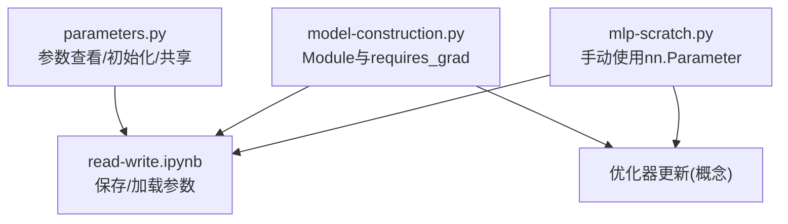
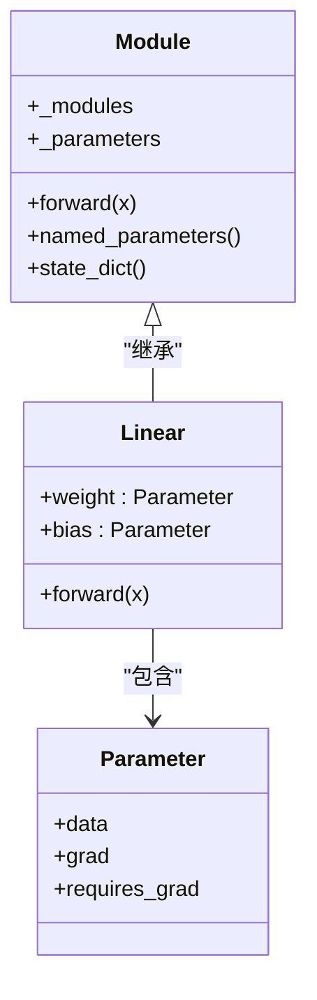
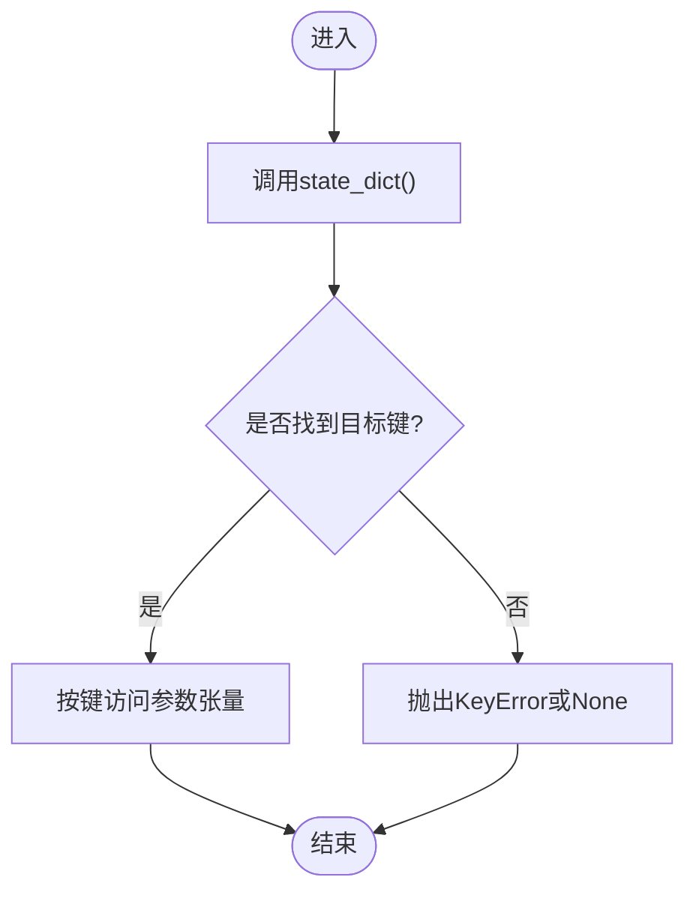
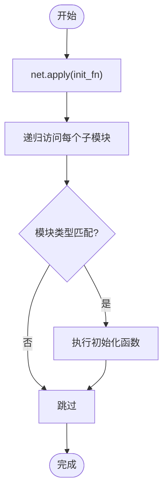
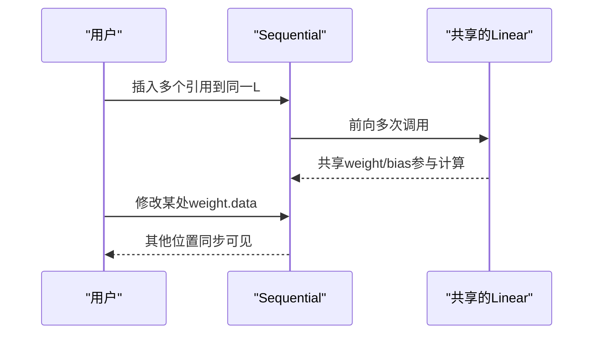
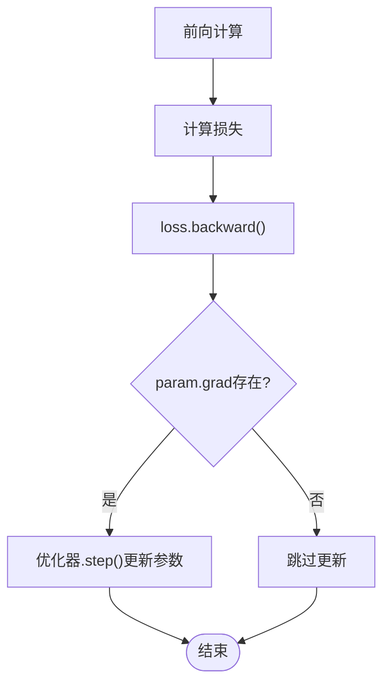
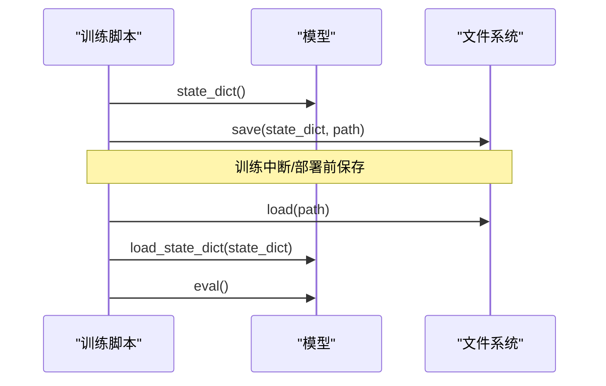
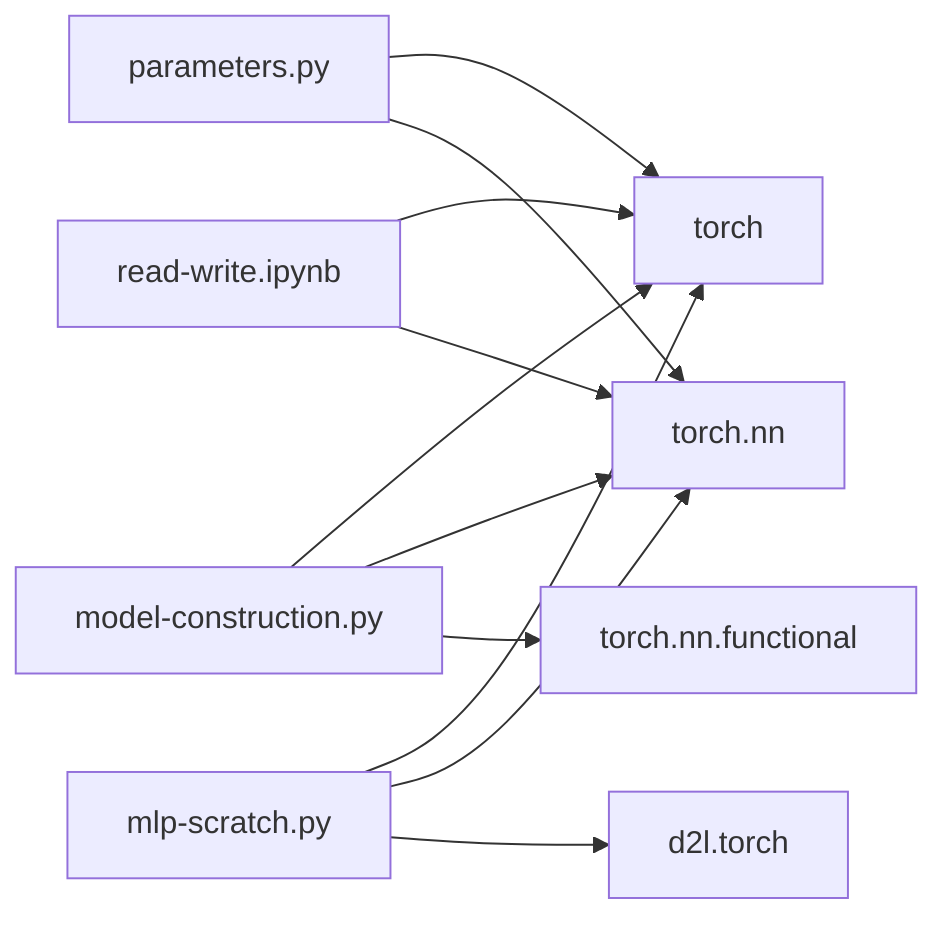

# 参数管理

<cite>
**本文引用的文件**   
- [parameters.py](file://chapter_deep-learning-computation/parameters.py)
- [model-construction.py](file://chapter_deep-learning-computation/model-construction.py)
- [read-write.ipynb](file://chapter_deep-learning-computation/read-write.ipynb)
- [mlp-scratch.py](file://chapter_multilayer-perceptrons/mlp-scratch.py)
</cite>

## 目录
1. [简介](#简介)
2. [项目结构](#项目结构)
3. [核心组件](#核心组件)
4. [架构总览](#架构总览)
5. [详细组件分析](#详细组件分析)
6. [依赖关系分析](#依赖关系分析)
7. [性能考虑](#性能考虑)
8. [故障排查指南](#故障排查指南)
9. [结论](#结论)
10. [附录](#附录)

## 简介
本章节聚焦PyTorch中的“参数管理”，系统阐述参数的生命周期与管理机制，包括创建、注册、访问与更新；深入讲解Parameter类特性及其与普通张量的区别；详述默认初始化与自定义初始化策略；说明参数共享机制；全面介绍序列化（保存/加载）方法；并提供参数监控与调试技巧，涵盖梯度检查与数值稳定性处理。内容基于仓库中的示例代码进行归纳与提炼，帮助读者从概念到实践全面掌握参数管理。

## 项目结构
围绕参数管理的核心材料主要分布在以下文件：
- chapter_deep-learning-computation/parameters.py：展示Sequential模型中参数的查看、state_dict、命名遍历、apply初始化、直接修改、参数共享等。
- chapter_deep-learning-computation/model-construction.py：通过自定义Module与固定随机权重演示requires_grad对梯度的影响以及参数复用。
- chapter_deep-learning-computation/read-write.ipynb：演示torch.save/torch.load与state_dict的保存/加载流程。
- chapter_multilayer-perceptrons/mlp-scratch.py：从零实现MLP时直接使用nn.Parameter构建可训练参数并参与优化器更新。



图示来源 
- [parameters.py:1-98](file://chapter_deep-learning-computation/parameters.py#L1-L98)
- [model-construction.py:1-95](file://chapter_deep-learning-computation/model-construction.py#L1-L95)
- [read-write.ipynb:1-408](file://chapter_deep-learning-computation/read-write.ipynb#L1-L408)
- [mlp-scratch.py:1-69](file://chapter_multilayer-perceptrons/mlp-scratch.py#L1-L69)

章节来源
- [parameters.py:1-98](file://chapter_deep-learning-computation/parameters.py#L1-L98)
- [model-construction.py:1-95](file://chapter_deep-learning-computation/model-construction.py#L1-L95)
- [read-write.ipynb:1-408](file://chapter_deep-learning-computation/read-write.ipynb#L1-L408)
- [mlp-scratch.py:1-69](file://chapter_multilayer-perceptrons/mlp-scratch.py#L1-L69)

## 核心组件
- 参数对象与注册
  - nn.Parameter是包装了Tensor的可训练参数，自动被所属Module收集并纳入优化器。
  - Module在__init__中将子模块或参数以属性形式赋值后，会被自动注册到_modules/_parameters/_buffers中。
- 参数访问与状态字典
  - state_dict()返回参数字典，键为层名+参数名（如"2.bias"），值为对应张量。
  - named_parameters()提供按名称遍历所有可训练参数。
- 参数初始化
  - 使用apply(module_fn)递归地对各层应用初始化函数，常见有正态、零、Xavier、常数等。
- 参数共享
  - 将同一个nn.Linear实例多次插入不同位置，可实现权重共享（同一内存地址）。
- 参数更新
  - 反向传播后由优化器根据梯度更新参数；也可直接通过.data修改（不推荐用于训练循环）。
- 序列化
  - torch.save(net.state_dict(), path)与clone.load_state_dict(torch.load(path))完成参数持久化与恢复。

章节来源
- [parameters.py:1-98](file://chapter_deep-learning-computation/parameters.py#L1-L98)
- [model-construction.py:1-95](file://chapter_deep-learning-computation/model-construction.py#L1-L95)
- [read-write.ipynb:200-320](file://chapter_deep-learning-computation/read-write.ipynb#L200-L320)
- [mlp-scratch.py:20-27](file://chapter_multilayer-perceptrons/mlp-scratch.py#L20-L27)

## 架构总览
下图展示了参数在模型中的创建、注册、访问、初始化、共享、更新与序列化的整体流程。

```mermaid
sequenceDiagram
participant User as "用户代码"
participant Net as "nn.Module/Sequential"
participant Param as "nn.Parameter"
participant Opt as "优化器"
participant IO as "磁盘IO"
User->>Net : 定义网络结构(构造Layer/Module)
Net->>Param : __init__中声明参数(自动注册)
User->>Net : 前向计算 net(X)
Net-->>User : 输出Y
User->>Net : loss.backward()
Net->>Param : 累积梯度 grad
Opt->>Param : param.grad != None 则更新
User->>Net : state_dict() / load_state_dict()
Net->>IO : save/load 参数文件
```

图示来源 
- [parameters.py:1-98](file://chapter_deep-learning-computation/parameters.py#L1-L98)
- [read-write.ipynb:200-320](file://chapter_deep-learning-computation/read-write.ipynb#L200-L320)
- [model-construction.py:56-78](file://chapter_deep-learning-computation/model-construction.py#L56-L78)

## 详细组件分析

### 参数创建与注册
- 通过nn.Linear等层在__init__中声明weight/bias，这些属性即为nn.Parameter，自动注册到Module。
- 自定义Module中可直接用nn.Parameter包裹张量，使其成为可训练参数。
- 普通张量若未设为requires_grad=True，不会参与梯度计算与更新。



图示来源 
- [model-construction.py:14-27](file://chapter_deep-learning-computation/model-construction.py#L14-L27)
- [mlp-scratch.py:20-27](file://chapter_multilayer-perceptrons/mlp-scratch.py#L20-L27)

章节来源
- [model-construction.py:14-27](file://chapter_deep-learning-computation/model-construction.py#L14-L27)
- [mlp-scratch.py:20-27](file://chapter_multilayer-perceptrons/mlp-scratch.py#L20-L27)

### 参数访问与状态字典
- state_dict()返回键值对映射，键形如"layer_name.weight/bias"，便于定位与读写。
- named_parameters()可按层级名称遍历所有参数，常用于打印形状或统计。
- 通过net[2].bias.data可直接读取底层数据视图。



图示来源 
- [parameters.py:7-20](file://chapter_deep-learning-computation/parameters.py#L7-L20)

章节来源
- [parameters.py:7-20](file://chapter_deep-learning-computation/parameters.py#L7-L20)

### 参数初始化策略
- 默认初始化：各层在构造时按框架默认规则初始化（如Linear的weight/bias）。
- 自定义初始化：使用apply(fn)对指定类型层应用初始化函数，支持正态、零、Xavier、均匀分布、常数等。
- 局部初始化：对不同层分别apply不同的初始化函数，实现差异化策略。



图示来源 
- [parameters.py:39-67](file://chapter_deep-learning-computation/parameters.py#L39-L67)

章节来源
- [parameters.py:39-67](file://chapter_deep-learning-computation/parameters.py#L39-L67)

### 参数共享机制
- 将同一个nn.Linear实例多次放入网络的不同位置，即可实现权重共享（同一内存对象）。
- 验证共享：比较两个位置的weight.data是否指向同一内存（id相同或逐元素相等且原地修改可见）。



图示来源 
- [parameters.py:85-98](file://chapter_deep-learning-computation/parameters.py#L85-L98)

章节来源
- [parameters.py:85-98](file://chapter_deep-learning-computation/parameters.py#L85-L98)

### 参数更新与梯度
- requires_grad控制是否参与梯度计算；False的张量不参与反向传播。
- 反向传播后，优化器依据param.grad更新参数；也可通过.data直接修改（仅用于特定场景，非标准训练流）。
- 自定义训练中，可将nn.Parameter列表传入优化器进行更新。



图示来源 
- [model-construction.py:56-78](file://chapter_deep-learning-computation/model-construction.py#L56-L78)
- [mlp-scratch.py:44-46](file://chapter_multilayer-perceptrons/mlp-scratch.py#L44-L46)

章节来源
- [model-construction.py:56-78](file://chapter_deep-learning-computation/model-construction.py#L56-L78)
- [mlp-scratch.py:44-46](file://chapter_multilayer-perceptrons/mlp-scratch.py#L44-L46)

### 参数序列化（保存/加载）
- 保存：torch.save(net.state_dict(), path)
- 加载：clone = Model(); clone.load_state_dict(torch.load(path)); clone.eval()
- 注意：只保存参数，不保存模型结构与代码；恢复时需先重建模型结构。



图示来源 
- [read-write.ipynb:200-320](file://chapter_deep-learning-computation/read-write.ipynb#L200-L320)

章节来源
- [read-write.ipynb:200-320](file://chapter_deep-learning-computation/read-write.ipynb#L200-L320)

### 参数监控与调试
- 梯度检查：确认param.grad是否为None；必要时使用torch.autograd.set_detect_anomaly(True)辅助定位问题。
- 数值稳定性：合理选择初始化（如Xavier/He）、学习率调度、梯度裁剪（grad clipping）避免爆炸/消失。
- 可视化/日志：定期打印参数范数、均值、方差，观察训练动态。

章节来源
- [parameters.py:14-17](file://chapter_deep-learning-computation/parameters.py#L14-L17)
- [parameters.py:39-67](file://chapter_deep-learning-computation/parameters.py#L39-L67)

## 依赖关系分析
- parameters.py依赖torch与torch.nn，用于构建Sequential、Linear、ReLU及参数操作。
- model-construction.py依赖torch、torch.nn与torch.nn.functional，展示Module与Function的使用差异。
- read-write.ipynb依赖torch与torch.nn，演示state_dict的持久化。
- mlp-scratch.py依赖torch、torch.nn与d2l工具库，展示从零实现时的参数管理与优化器集成。



图示来源 
- [parameters.py:1-3](file://chapter_deep-learning-computation/parameters.py#L1-L3)
- [model-construction.py:1-4](file://chapter_deep-learning-computation/model-construction.py#L1-L4)
- [read-write.ipynb:44-48](file://chapter_deep-learning-computation/read-write.ipynb#L44-L48)
- [mlp-scratch.py:11-14](file://chapter_multilayer-perceptrons/mlp-scratch.py#L11-L14)

章节来源
- [parameters.py:1-3](file://chapter_deep-learning-computation/parameters.py#L1-L3)
- [model-construction.py:1-4](file://chapter_deep-learning-computation/model-construction.py#L1-L4)
- [read-write.ipynb:44-48](file://chapter_deep-learning-computation/read-write.ipynb#L44-L48)
- [mlp-scratch.py:11-14](file://chapter_multilayer-perceptrons/mlp-scratch.py#L11-L14)

## 性能考虑
- 参数共享可减少显存占用与计算冗余，但需注意梯度累加与更新的一致性。
- 批量初始化apply()开销较小，适合在模型构建后一次性完成。
- 频繁state_dict()与save/load会产生I/O开销，建议仅在断点保存或部署时使用。
- 使用.requires_grad=False可冻结部分参数，减少不必要的梯度计算。

## 故障排查指南
- 梯度为None
  - 检查输入是否requires_grad或中间计算是否与参数图断开。
  - 确认没有使用.detach()或with torch.no_grad()阻断计算图。
- 参数未更新
  - 确认优化器已正确接收参数列表，且step()被调用。
  - 检查param.grad是否存在且非零。
- 初始化异常
  - 检查apply()中的类型判断是否正确，避免误伤非目标层。
- 序列化不一致
  - 确保加载前模型结构与保存时一致；必要时使用strict=False谨慎加载。

章节来源
- [parameters.py:14-17](file://chapter_deep-learning-computation/parameters.py#L14-L17)
- [read-write.ipynb:200-320](file://chapter_deep-learning-computation/read-write.ipynb#L200-L320)

## 结论
通过本章节的系统梳理，读者应能熟练掌握PyTorch中参数的创建、注册、访问、初始化、共享、更新与序列化全流程，并能运用梯度检查与数值稳定性技巧进行有效调试。结合仓库中的示例代码路径，可在实际项目中快速落地最佳实践。

## 附录
- 常用API速查（基于仓库示例）
  - 参数查看：state_dict()、named_parameters()、.data
  - 初始化：apply(init_fn)、nn.init.*
  - 共享：重复使用同一nn.Linear实例
  - 序列化：torch.save/net.state_dict()/load_state_dict()
  - 梯度控制：requires_grad、.grad、优化器.step()