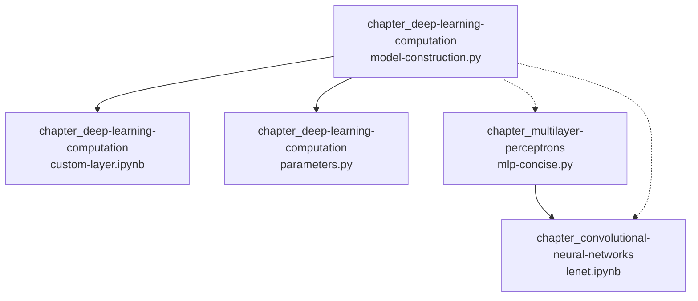
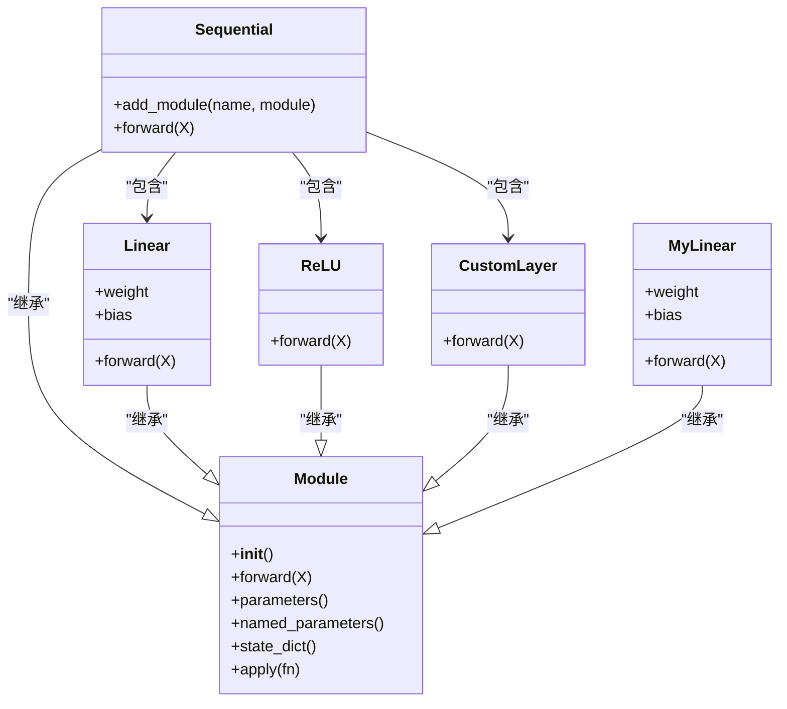
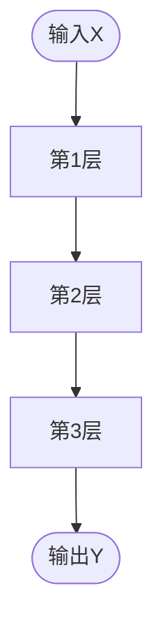
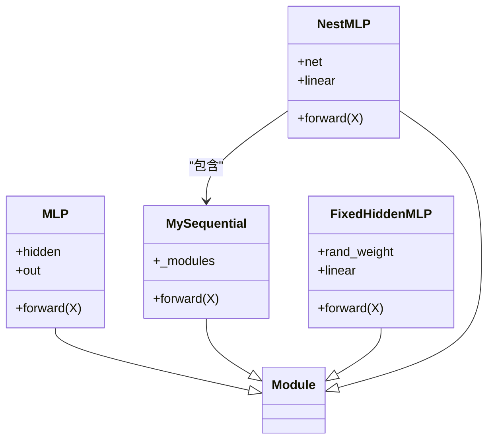
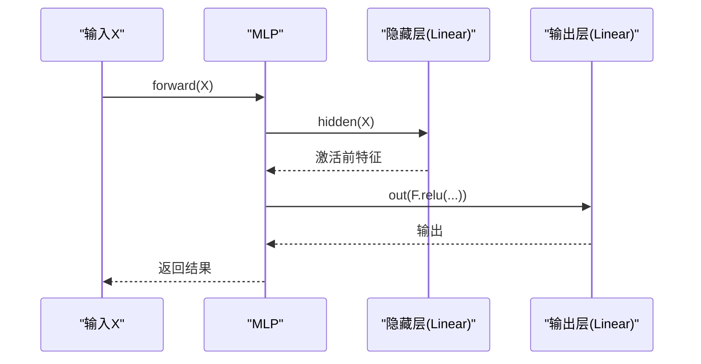
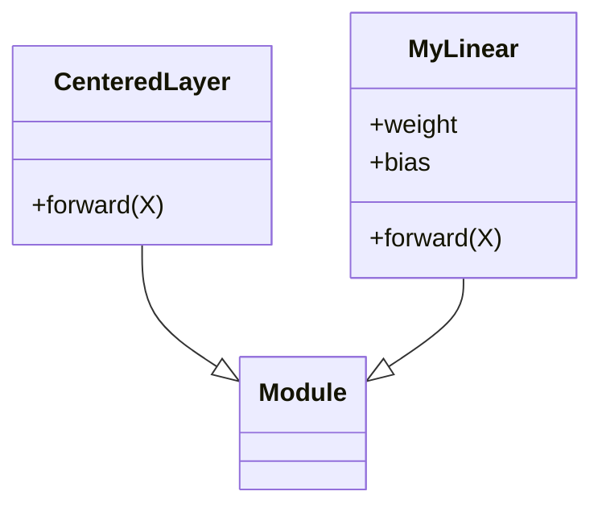
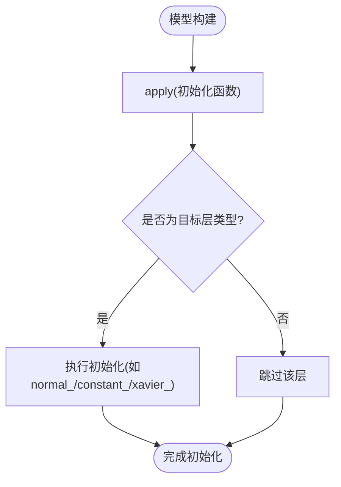
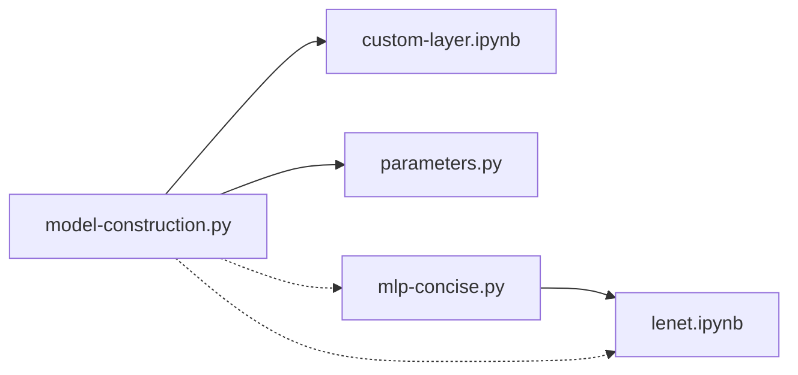

# 模型构建

<cite>
**本文引用的文件**   
- [model-construction.py](file://chapter_deep-learning-computation/model-construction.py)
- [custom-layer.ipynb](file://chapter_deep-learning-computation/custom-layer.ipynb)
- [parameters.py](file://chapter_deep-learning-computation/parameters.py)
- [mlp-concise.py](file://chapter_multilayer-perceptrons/mlp-concise.py)
- [lenet.ipynb](file://chapter_convolutional-neural-networks/lenet.ipynb)
</cite>

## 目录
1. [简介](#简介)
2. [项目结构](#项目结构)
3. [核心组件](#核心组件)
4. [架构总览](#架构总览)
5. [详细组件分析](#详细组件分析)
6. [依赖关系分析](#依赖关系分析)
7. [性能与调试建议](#性能与调试建议)
8. [故障排查指南](#故障排查指南)
9. [结论](#结论)
10. [附录：常用操作速查](#附录常用操作速查)

## 简介
本章节聚焦PyTorch中模型的两种主要构建方式：Sequential容器与自定义nn.Module类。内容涵盖：
- Sequential容器的使用场景、限制与顺序组合方法
- 继承nn.Module的完整流程：__init__参数定义、forward前向逻辑、子模块注册与层次嵌套
- 实际示例对比不同方式的优缺点与适用场景
- 模型初始化、参数访问与调试技巧

## 项目结构
围绕“模型构建”的核心代码集中在深度学习计算章节，辅以多层感知机与卷积网络中的典型用法示例：
- 基础构建与自定义块：model-construction.py
- 自定义层（无参/有参）：custom-layer.ipynb
- 参数管理、初始化与共享：parameters.py
- 简洁MLP示例：mlp-concise.py
- 经典卷积网络示例（LeNet）：lenet.ipynb

图表来源
- [model-construction.py:1-95](file://chapter_deep-learning-computation/model-construction.py#L1-L95)
- [custom-layer.ipynb:1-404](file://chapter_deep-learning-computation/custom-layer.ipynb#L1-L404)
- [parameters.py:1-98](file://chapter_deep-learning-computation/parameters.py#L1-L98)
- [mlp-concise.py:1-59](file://chapter_multilayer-perceptrons/mlp-concise.py#L1-L59)
- [lenet.ipynb:80-98](file://chapter_convolutional-neural-networks/lenet.ipynb#L80-L98)

章节来源
- [model-construction.py:1-95](file://chapter_deep-learning-computation/model-construction.py#L1-L95)
- [custom-layer.ipynb:1-404](file://chapter_deep-learning-computation/custom-layer.ipynb#L1-L404)
- [parameters.py:1-98](file://chapter_deep-learning-computation/parameters.py#L1-L98)
- [mlp-concise.py:1-59](file://chapter_multilayer-perceptrons/mlp-concise.py#L1-L59)
- [lenet.ipynb:80-98](file://chapter_convolutional-neural-networks/lenet.ipynb#L80-L98)

## 核心组件
- Sequential容器：按序组合多个层，适合线性堆叠的前向流程
- nn.Module基类：通过继承实现任意复杂度的模型或层，支持参数管理、子模块注册、可定制前向逻辑
- 自定义层：无参层与有参层的实现范式
- 参数管理与初始化：state_dict、named_parameters、apply初始化、参数共享与绑定

章节来源
- [model-construction.py:1-95](file://chapter_deep-learning-computation/model-construction.py#L1-L95)
- [custom-layer.ipynb:1-404](file://chapter_deep-learning-computation/custom-layer.ipynb#L1-L404)
- [parameters.py:1-98](file://chapter_deep-learning-computation/parameters.py#L1-L98)

## 架构总览
下图展示了Sequential与Module在模型构建中的角色与交互关系，以及数据在前向过程中的流向。

图表来源
- [model-construction.py:1-95](file://chapter_deep-learning-computation/model-construction.py#L1-L95)
- [custom-layer.ipynb:1-404](file://chapter_deep-learning-computation/custom-layer.ipynb#L1-L404)
- [parameters.py:1-98](file://chapter_deep-learning-computation/parameters.py#L1-L98)

## 详细组件分析

### 1) Sequential容器：顺序组合与限制
- 使用场景
  - 简单、线性的层堆叠（如MLP、CNN主干）
  - 快速原型验证与教学示例
- 使用方法
  - 将多个层作为参数传入，内部按序执行
  - 可通过索引访问子层，便于检查形状与参数
- 限制
  - 不支持分支、条件控制流、循环等动态逻辑
  - 不适合需要复用同一层实例的参数共享场景（需显式引用同一对象）
- 示例参考
  - 基础Sequential构造与调用
  - 在LeNet中用Sequential串联卷积、池化、全连接层

章节来源
- [model-construction.py:1-11](file://chapter_deep-learning-computation/model-construction.py#L1-L11)
- [lenet.ipynb:80-98](file://chapter_convolutional-neural-networks/lenet.ipynb#L80-L98)
- [mlp-concise.py:16-19](file://chapter_multilayer-perceptrons/mlp-concise.py#L16-L19)

#### 前向序列流程图（Sequential）

图表来源
- [model-construction.py:6-11](file://chapter_deep-learning-computation/model-construction.py#L6-L11)
- [lenet.ipynb:80-98](file://chapter_convolutional-neural-networks/lenet.ipynb#L80-L98)

### 2) 自定义nn.Module：灵活建模与层次嵌套
- 基本步骤
  - __init__中声明所有子模块与可学习参数
  - forward中定义前向传播逻辑，可包含控制流、函数调用、中间变量
- 子模块注册
  - 将子模块赋值给self.xxx，PyTorch自动注册到_modules
  - 也可手动维护有序字典以模拟Sequential行为
- 层次嵌套
  - 可在Module内嵌入Sequential或其他Module，形成树状结构
  - 便于模块化设计与复用
- 示例参考
  - 自定义MLP类（隐藏层+输出层）
  - 自定义Sequential块（基于_modules的顺序遍历）
  - 固定权重与复用层的FixedHiddenMLP
  - 嵌套块NestMLP与复合模型Chimera

章节来源
- [model-construction.py:14-32](file://chapter_deep-learning-computation/model-construction.py#L14-L32)
- [model-construction.py:35-53](file://chapter_deep-learning-computation/model-construction.py#L35-L53)
- [model-construction.py:56-78](file://chapter_deep-learning-computation/model-construction.py#L56-L78)
- [model-construction.py:81-95](file://chapter_deep-learning-computation/model-construction.py#L81-L95)

#### 类图（自定义MLP与MySequential）

图表来源
- [model-construction.py:14-32](file://chapter_deep-learning-computation/model-construction.py#L14-L32)
- [model-construction.py:35-53](file://chapter_deep-learning-computation/model-construction.py#L35-L53)
- [model-construction.py:56-78](file://chapter_deep-learning-computation/model-construction.py#L56-L78)
- [model-construction.py:81-95](file://chapter_deep-learning-computation/model-construction.py#L81-L95)

#### 前向调用时序（MLP）

图表来源
- [model-construction.py:14-32](file://chapter_deep-learning-computation/model-construction.py#L14-L32)

### 3) 自定义层：无参与有参
- 无参层
  - 仅实现forward，不引入可训练参数
  - 常用于预处理、归一化、形状变换等
- 有参层
  - 在__init__中使用Parameter或内置层创建参数
  - forward中完成张量运算并返回结果
- 示例参考
  - CenteredLayer（无参）
  - MyLinear（有参，仿全连接层）

章节来源
- [custom-layer.ipynb:44-56](file://chapter_deep-learning-computation/custom-layer.ipynb#L44-L56)
- [custom-layer.ipynb:214-223](file://chapter_deep-learning-computation/custom-layer.ipynb#L214-L223)

#### 自定义层类图

图表来源
- [custom-layer.ipynb:44-56](file://chapter_deep-learning-computation/custom-layer.ipynb#L44-L56)
- [custom-layer.ipynb:214-223](file://chapter_deep-learning-computation/custom-layer.ipynb#L214-L223)

### 4) 参数管理、初始化与共享
- 参数访问
  - state_dict获取命名参数映射
  - named_parameters遍历参数名与张量
  - 直接通过属性访问权值与偏置
- 初始化
  - apply(fn)对指定类型层应用统一初始化策略
  - 常见初始化：正态、常数、Xavier、自定义
- 参数共享
  - 将同一层实例多次放入Sequential以实现参数共享
  - 修改一处即影响所有引用位置
- 示例参考
  - 打印state_dict、访问bias.data
  - 批量初始化与逐层覆盖初始化
  - 共享层权重一致性校验

章节来源
- [parameters.py:1-98](file://chapter_deep-learning-computation/parameters.py#L1-L98)

#### 参数初始化流程图

图表来源
- [parameters.py:40-54](file://chapter_deep-learning-computation/parameters.py#L40-L54)

## 依赖关系分析
- model-construction.py依赖torch.nn与functional接口，展示Sequential与Module两种范式
- custom-layer.ipynb演示无参/有参层的实现与组合
- parameters.py集中展示参数访问、初始化与共享
- mlp-concise.py与lenet.ipynb提供工程化示例，体现Sequential在真实任务中的使用

图表来源
- [model-construction.py:1-95](file://chapter_deep-learning-computation/model-construction.py#L1-L95)
- [custom-layer.ipynb:1-404](file://chapter_deep-learning-computation/custom-layer.ipynb#L1-L404)
- [parameters.py:1-98](file://chapter_deep-learning-computation/parameters.py#L1-L98)
- [mlp-concise.py:1-59](file://chapter_multilayer-perceptrons/mlp-concise.py#L1-L59)
- [lenet.ipynb:80-98](file://chapter_convolutional-neural-networks/lenet.ipynb#L80-L98)

## 性能与调试建议
- 选择策略
  - 简单线性堆叠优先Sequential，减少样板代码
  - 复杂控制流、分支、循环、状态保持等必须使用Module
- 调试技巧
  - 使用print或日志打印每层输出形状，确保维度匹配
  - 利用named_parameters定位参数名称与形状
  - 对关键层单独apply初始化，便于复现实验
- 性能优化
  - 避免在forward中进行不必要的Python控制流开销
  - 合理使用缓存与中间变量，减少重复计算
  - 对于大规模模型，注意内存占用与显存分配

[本节为通用指导，不直接分析具体文件]

## 故障排查指南
- 维度不匹配
  - 检查各层输入输出形状，尤其是卷积后展平前的通道数
  - 参考示例中对每一层输出形状的打印与断言
- 参数未更新
  - 确认参数requires_grad=True且被优化器纳入
  - 检查是否错误地将参数设为requires_grad=False
- 共享参数异常
  - 确保共享的是同一实例而非复制后的副本
  - 通过比较张量地址或数值一致性进行验证

章节来源
- [lenet.ipynb:132-136](file://chapter_convolutional-neural-networks/lenet.ipynb#L132-L136)
- [parameters.py:86-98](file://chapter_deep-learning-computation/parameters.py#L86-L98)

## 结论
- Sequential适用于简单、顺序化的模型构建，开发效率高
- nn.Module提供最大灵活性，适合复杂逻辑、参数共享与层次化设计
- 掌握参数管理、初始化与调试技巧，有助于稳定高效地训练模型
- 根据任务复杂度选择合适的构建方式，并在必要时混合使用

[本节为总结性内容，不直接分析具体文件]

## 附录：常用操作速查
- 构建Sequential
  - 参考：[model-construction.py:6-11](file://chapter_deep-learning-computation/model-construction.py#L6-L11)、[lenet.ipynb:80-98](file://chapter_convolutional-neural-networks/lenet.ipynb#L80-L98)、[mlp-concise.py:16-19](file://chapter_multilayer-perceptrons/mlp-concise.py#L16-L19)
- 自定义Module
  - 参考：[model-construction.py:14-32](file://chapter_deep-learning-computation/model-construction.py#L14-L32)、[model-construction.py:35-53](file://chapter_deep-learning-computation/model-construction.py#L35-L53)
- 自定义层（无参/有参）
  - 参考：[custom-layer.ipynb:44-56](file://chapter_deep-learning-computation/custom-layer.ipynb#L44-L56)、[custom-layer.ipynb:214-223](file://chapter_deep-learning-computation/custom-layer.ipynb#L214-L223)
- 参数访问与初始化
  - 参考：[parameters.py:1-98](file://chapter_deep-learning-computation/parameters.py#L1-L98)
- 参数共享
  - 参考：[parameters.py:86-98](file://chapter_deep-learning-computation/parameters.py#L86-L98)