# 深度学习计算

<cite>
**本文引用的文件**   
- [model-construction.py](file://chapter_deep-learning-computation/model-construction.py)
- [parameters.py](file://chapter_deep-learning-computation/parameters.py)
- [custom-layer.ipynb](file://chapter_deep-learning-computation/custom-layer.ipynb)
- [use-gpu.ipynb](file://chapter_deep-learning-computation/use-gpu.ipynb)
- [read-write.ipynb](file://chapter_deep-learning-computation/read-write.ipynb)
- [deferred-init.ipynb](file://chapter_deep-learning-computation/deferred-init.ipynb)
- [multiple-gpus.ipynb](file://chapter_computational-performance/multiple-gpus.ipynb)
- [parameterserver.ipynb](file://chapter_computational-performance/parameterserver.ipynb)
- [auto-parallelism.ipynb](file://chapter_computational-performance/auto-parallelism.ipynb)
- [async-computation.ipynb](file://chapter_computational-performance/async-computation.ipynb)
</cite>

## 目录
1. [引言](#引言)
2. [项目结构](#项目结构)
3. [核心组件](#核心组件)
4. [架构总览](#架构总览)
5. [详细组件分析](#详细组件分析)
6. [依赖关系分析](#依赖关系分析)
7. [性能考量](#性能考量)
8. [故障排查指南](#故障排查指南)
9. [结论](#结论)
10. [附录](#附录)

## 引言
本章节围绕PyTorch深度学习计算的核心主题，系统讲解模型构建（Sequential与自定义Module）、参数管理与生命周期、GPU加速与内存管理、模型保存与加载、自定义层实现、序列化最佳实践、性能优化技巧以及分布式训练基础。内容基于仓库中的示例代码与教程，旨在帮助读者从入门到进阶掌握PyTorch在工程实践中的关键能力。

## 项目结构
本节聚焦“深度学习计算”相关源码与教程的组织方式：
- 模型构建与参数管理：model-construction.py、parameters.py
- 自定义层：custom-layer.ipynb
- GPU使用与设备切换：use-gpu.ipynb
- 读写与序列化：read-write.ipynb
- 延后初始化机制：deferred-init.ipynb
- 多GPU与分布式训练：multiple-gpus.ipynb、parameterserver.ipynb
- 自动并行与异步执行：auto-parallelism.ipynb、async-computation.ipynb

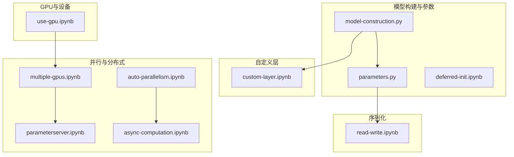

**图表来源** 
- [model-construction.py:1-95](file://chapter_deep-learning-computation/model-construction.py#L1-L95)
- [parameters.py:1-98](file://chapter_deep-learning-computation/parameters.py#L1-L98)
- [custom-layer.ipynb:1-404](file://chapter_deep-learning-computation/custom-layer.ipynb#L1-L404)
- [use-gpu.ipynb:1-768](file://chapter_deep-learning-computation/use-gpu.ipynb#L1-L768)
- [read-write.ipynb:1-408](file://chapter_deep-learning-computation/read-write.ipynb#L1-L408)
- [deferred-init.ipynb:1-103](file://chapter_deep-learning-computation/deferred-init.ipynb#L1-L103)
- [multiple-gpus.ipynb:1-800](file://chapter_computational-performance/multiple-gpus.ipynb#L1-L800)
- [parameterserver.ipynb:1-124](file://chapter_computational-performance/parameterserver.ipynb#L1-L124)
- [auto-parallelism.ipynb:1-200](file://chapter_computational-performance/auto-parallelism.ipynb#L1-L200)
- [async-computation.ipynb:1-200](file://chapter_computational-performance/async-computation.ipynb#L1-L200)

**章节来源**
- [model-construction.py:1-95](file://chapter_deep-learning-computation/model-construction.py#L1-L95)
- [parameters.py:1-98](file://chapter_deep-learning-computation/parameters.py#L1-L98)
- [custom-layer.ipynb:1-404](file://chapter_deep-learning-computation/custom-layer.ipynb#L1-L404)
- [use-gpu.ipynb:1-768](file://chapter_deep-learning-computation/use-gpu.ipynb#L1-L768)
- [read-write.ipynb:1-408](file://chapter_deep-learning-computation/read-write.ipynb#L1-L408)
- [deferred-init.ipynb:1-103](file://chapter_deep-learning-computation/deferred-init.ipynb#L1-L103)
- [multiple-gpus.ipynb:1-800](file://chapter_computational-performance/multiple-gpus.ipynb#L1-L800)
- [parameterserver.ipynb:1-124](file://chapter_computational-performance/parametersserver.ipynb#L1-L124)
- [auto-parallelism.ipynb:1-200](file://chapter_computational-performance/auto-parallelism.ipynb#L1-L200)
- [async-computation.ipynb:1-200](file://chapter_computational-performance/async-computation.ipynb#L1-L200)

## 核心组件
- Sequential容器与自定义Module类：用于快速搭建网络与扩展复杂逻辑
- 参数注册、访问与更新：state_dict、named_parameters、apply初始化、直接修改data
- GPU设备与张量迁移：device对象、to()、cuda()、跨设备一致性
- 模型保存与加载：torch.save/load、state_dict的持久化与恢复
- 自定义层：无参层与带参层的forward定义
- 延后初始化：首次前向推断时动态确定形状并初始化参数
- 多GPU数据并行与同步：split_batch、allreduce、梯度聚合与参数更新
- 参数服务器与环同步：push/pull语义、NVLink拓扑与通信策略
- 自动并行与异步执行：计算图调度、CUDA流、synchronize时机

**章节来源**
- [model-construction.py:1-95](file://chapter_deep-learning-computation/model-construction.py#L1-L95)
- [parameters.py:1-98](file://chapter_deep-learning-computation/parameters.py#L1-L98)
- [custom-layer.ipynb:1-404](file://chapter_deep-learning-computation/custom-layer.ipynb#L1-L404)
- [use-gpu.ipynb:1-768](file://chapter_deep-learning-computation/use-gpu.ipynb#L1-L768)
- [read-write.ipynb:1-408](file://chapter_deep-learning-computation/read-write.ipynb#L1-L408)
- [deferred-init.ipynb:1-103](file://chapter_deep-learning-computation/deferred-init.ipynb#L1-L103)
- [multiple-gpus.ipynb:1-800](file://chapter_computational-performance/multiple-gpus.ipynb#L1-L800)
- [parameterserver.ipynb:1-124](file://chapter_computational-performance/parameterserver.ipynb#L1-L124)
- [auto-parallelism.ipynb:1-200](file://chapter_computational-performance/auto-parallelism.ipynb#L1-L200)
- [async-computation.ipynb:1-200](file://chapter_computational-performance/async-computation.ipynb#L1-L200)

## 架构总览
下图展示了从模型构建到训练与部署的关键流程，包括参数管理、GPU加速、序列化与分布式训练等核心环节。

```mermaid
sequenceDiagram
participant Dev as "开发者代码"
participant Model as "nn.Module/Sequential"
param as "参数(state_dict)"
gpu as "GPU设备"
saver as "保存/加载(torch.save/load)"
dist as "多GPU/参数服务器"
Dev->>Model : 实例化(可含自定义层)
Dev->>Model : 前向(X) -> 输出
Model->>param : 注册/访问/更新
Dev->>gpu : 模型与数据.to(device)
Dev->>saver : save(state_dict) / load(state_dict)
Dev->>dist : split_batch + allreduce + 更新
Note over Model,gpu : 设备一致性与异步执行
```

**图表来源** 
- [model-construction.py:1-95](file://chapter_deep-learning-computation/model-construction.py#L1-L95)
- [parameters.py:1-98](file://chapter_deep-learning-computation/parameters.py#L1-L98)
- [use-gpu.ipynb:1-768](file://chapter_deep-learning-computation/use-gpu.ipynb#L1-L768)
- [read-write.ipynb:1-408](file://chapter_deep-learning-computation/read-write.ipynb#L1-L408)
- [multiple-gpus.ipynb:1-800](file://chapter_computational-performance/multiple-gpus.ipynb#L1-L800)
- [parameterserver.ipynb:1-124](file://chapter_computational-performance/parameterserver.ipynb#L1-L124)

## 详细组件分析

### 模型构建：Sequential与自定义Module
- Sequential容器：按顺序组合层，适合线性堆叠的前馈网络
- 自定义Module：通过继承nn.Module并重写__init__与forward，实现灵活控制流、共享参数、固定权重等高级特性
- 嵌套块与复用：可在forward中调用子模块，支持模块化设计与组合

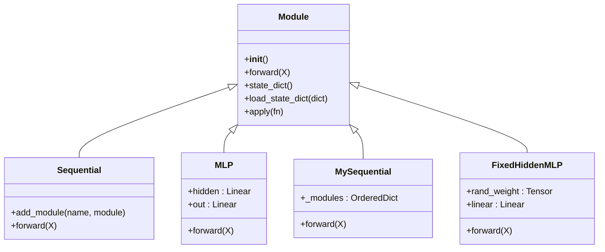

**图表来源** 
- [model-construction.py:1-95](file://chapter_deep-learning-computation/model-construction.py#L1-L95)

**章节来源**
- [model-construction.py:1-95](file://chapter_deep-learning-computation/model-construction.py#L1-L95)

### 参数管理与生命周期
- 参数注册：通过nn.Linear等内置层自动注册；自定义层使用nn.Parameter显式声明
- 访问与遍历：state_dict获取命名参数映射；named_parameters迭代名称与形状
- 初始化：apply配合初始化函数批量设置权重与偏置；支持Xavier、Uniform、Constant等
- 直接修改：通过.data进行原地修改（注意梯度追踪）
- 参数绑定：共享同一层实例实现参数共享

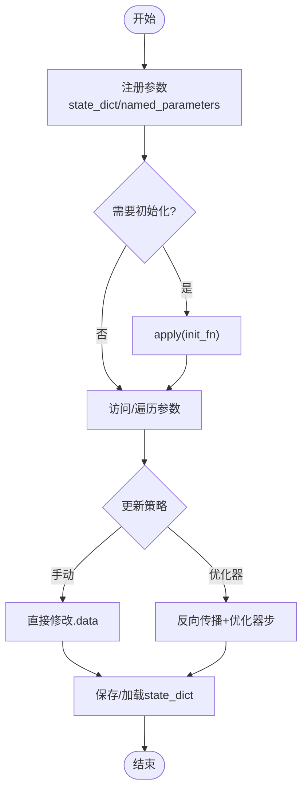

**图表来源** 
- [parameters.py:1-98](file://chapter_deep-learning-computation/parameters.py#L1-L98)

**章节来源**
- [parameters.py:1-98](file://chapter_deep-learning-computation/parameters.py#L1-L98)

### GPU加速与内存管理
- 设备对象：torch.device('cpu'/'cuda'/'cuda:i')
- 查询与工具：torch.cuda.device_count()、try_gpu()、try_all_gpus()
- 张量与模型迁移：.to(device)、.cuda(i)、确保同设备运算
- 内存与性能：避免频繁跨设备拷贝；打印或转NumPy会触发隐式拷贝；使用synchronize精确计时
- 多GPU：scatter拆分数据，allreduce聚合梯度，保持批大小与学习率适配

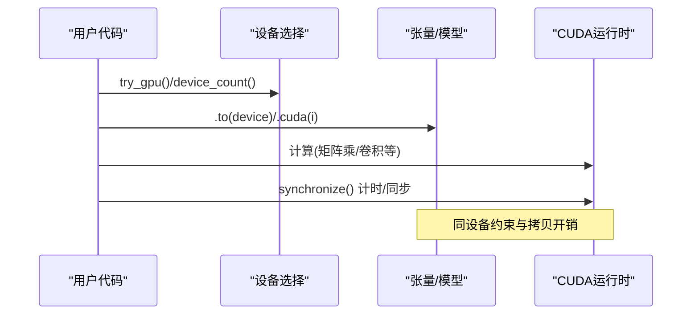

**图表来源** 
- [use-gpu.ipynb:1-768](file://chapter_deep-learning-computation/use-gpu.ipynb#L1-L768)
- [auto-parallelism.ipynb:1-200](file://chapter_computational-performance/auto-parallelism.ipynb#L1-L200)
- [async-computation.ipynb:1-200](file://chapter_computational-performance/async-computation.ipynb#L1-L200)

**章节来源**
- [use-gpu.ipynb:1-768](file://chapter_deep-learning-computation/use-gpu.ipynb#L1-L768)
- [auto-parallelism.ipynb:1-200](file://chapter_computational-performance/auto-parallelism.ipynb#L1-L200)
- [async-computation.ipynb:1-200](file://chapter_computational-performance/async-computation.ipynb#L1-L200)

### 模型保存与加载（序列化与反序列化）
- 张量级：torch.save/torch.load支持单张量、列表、字典
- 模型级：保存state_dict（仅参数），恢复时需重建架构再load_state_dict
- 版本控制：文件名约定、校验一致性、部署时冻结推理模式eval()

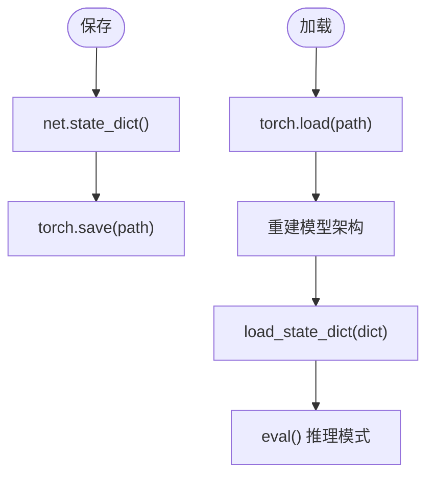

**图表来源** 
- [read-write.ipynb:1-408](file://chapter_deep-learning-computation/read-write.ipynb#L1-L408)

**章节来源**
- [read-write.ipynb:1-408](file://chapter_deep-learning-computation/read-write.ipynb#L1-L408)

### 自定义层实现（前向与反向传播）
- 无参层：仅实现forward，如CenteredLayer对输入去均值
- 带参层：使用nn.Parameter声明权重与偏置，forward中进行线性变换与激活
- 集成：可直接放入Sequential或作为子模块被其他Module调用

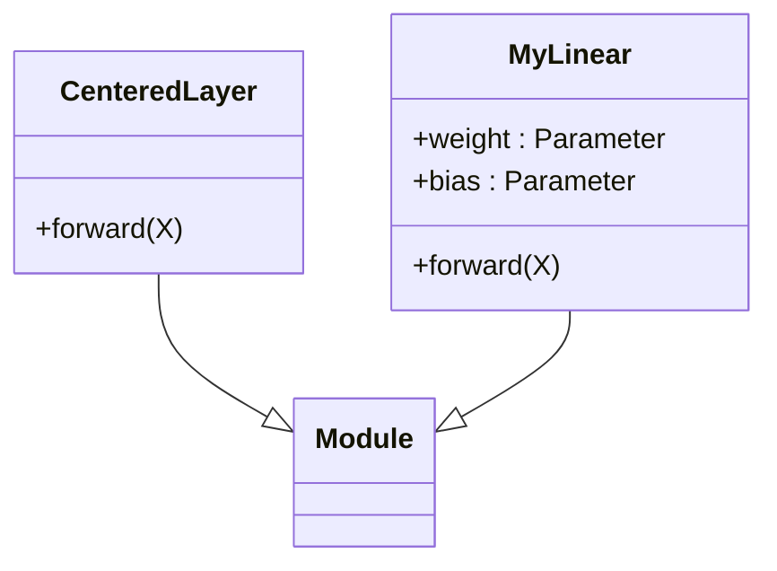

**图表来源** 
- [custom-layer.ipynb:1-404](file://chapter_deep-learning-computation/custom-layer.ipynb#L1-L404)

**章节来源**
- [custom-layer.ipynb:1-404](file://chapter_deep-learning-computation/custom-layer.ipynb#L1-L404)

### 延后初始化
- 机制：首次前向推断时根据输入维度动态推断各层形状并完成参数初始化
- 优势：简化架构定义，减少维度错误；便于修改输入分辨率

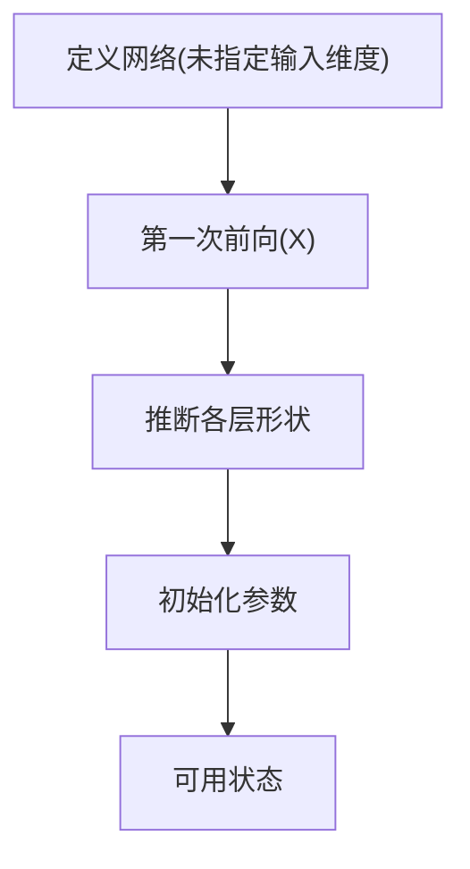

**图表来源** 
- [deferred-init.ipynb:1-103](file://chapter_deep-learning-computation/deferred-init.ipynb#L1-L103)

**章节来源**
- [deferred-init.ipynb:1-103](file://chapter_deep-learning-computation/deferred-init.ipynb#L1-L103)

### 多GPU数据并行与同步
- 数据分发：split_batch将X与y均匀切分到多个GPU
- 损失与梯度：每个GPU独立计算loss并backward
- 梯度聚合：allreduce将各GPU梯度相加并广播回所有设备
- 参数更新：在每个GPU上以全尺寸小批量更新参数

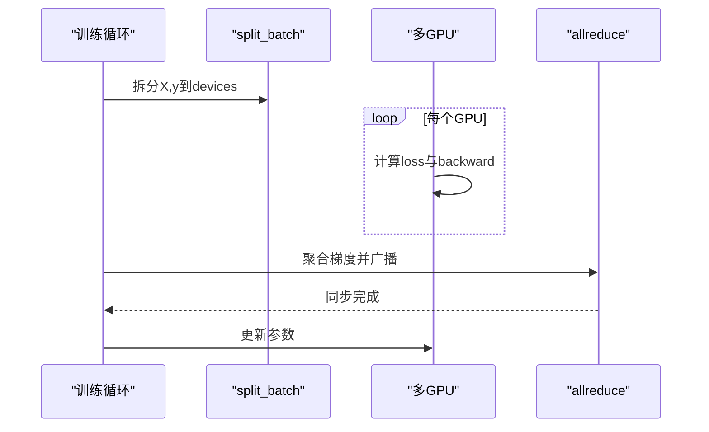

**图表来源** 
- [multiple-gpus.ipynb:1-800](file://chapter_computational-performance/multiple-gpus.ipynb#L1-L800)

**章节来源**
- [multiple-gpus.ipynb:1-800](file://chapter_computational-performance/multiple-gpus.ipynb#L1-L800)

### 参数服务器与环同步
- 参数服务器：集中式或分布式聚合梯度，pull/push语义抽象键值存储操作
- 环同步：将网络拓扑分解为环，分块传输梯度，提升带宽利用率（NVLink）
- 多机训练：工作节点本地GPU聚合后上传至参数服务器，再广播更新

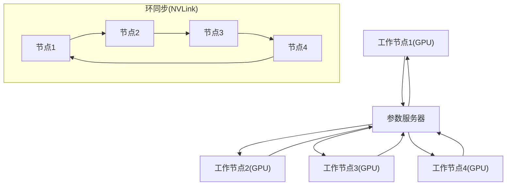

**图表来源** 
- [parameterserver.ipynb:1-124](file://chapter_computational-performance/parameterserver.ipynb#L1-L124)

**章节来源**
- [parameterserver.ipynb:1-124](file://chapter_computational-performance/parameterserver.ipynb#L1-L124)

### 自动并行与异步执行
- 自动并行：框架基于计算图调度不依赖任务，利用多GPU/CPU资源
- 异步执行：GPU操作默认异步，需synchronize精确计时或强制完成
- 通信与计算重叠：合理组织批次与算子，减少阻塞

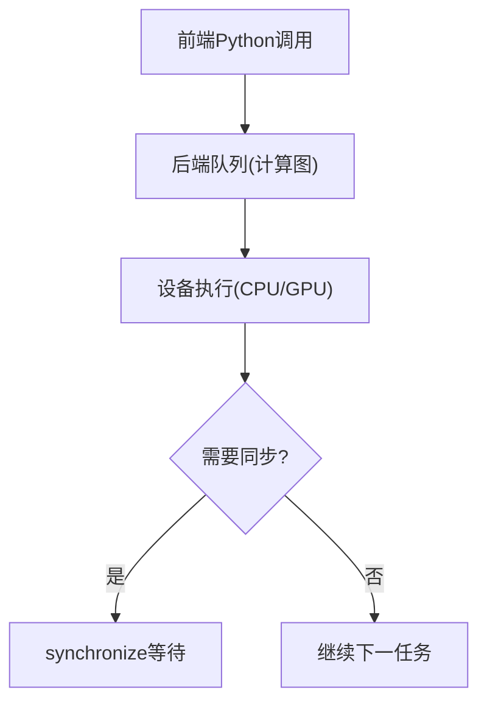

**图表来源** 
- [auto-parallelism.ipynb:1-200](file://chapter_computational-performance/auto-parallelism.ipynb#L1-L200)
- [async-computation.ipynb:1-200](file://chapter_computational-performance/async-computation.ipynb#L1-L200)

**章节来源**
- [auto-parallelism.ipynb:1-200](file://chapter_computational-performance/auto-parallelism.ipynb#L1-L200)
- [async-computation.ipynb:1-200](file://chapter_computational-performance/async-computation.ipynb#L1-L200)

## 依赖关系分析
- 模块内聚性：Sequential与Module提供高内聚的构建单元；参数管理集中在state_dict与apply
- 耦合点：设备一致性（张量与参数必须在同一设备）；序列化依赖架构代码
- 外部依赖：torch.nn.functional、torch.cuda、torch.save/load、nn.parallel.scatter
- 潜在循环：自定义层应避免在forward中创建新的Module导致注册问题

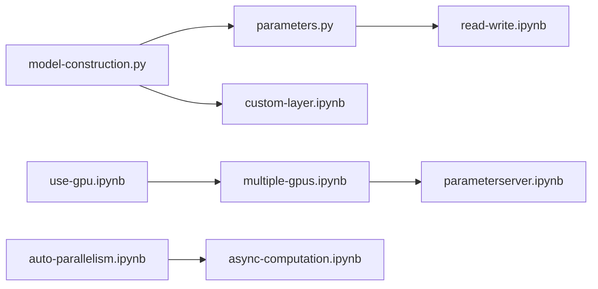

**图表来源** 
- [model-construction.py:1-95](file://chapter_deep-learning-computation/model-construction.py#L1-L95)
- [parameters.py:1-98](file://chapter_deep-learning-computation/parameters.py#L1-L98)
- [custom-layer.ipynb:1-404](file://chapter_deep-learning-computation/custom-layer.ipynb#L1-L404)
- [use-gpu.ipynb:1-768](file://chapter_deep-learning-computation/use-gpu.ipynb#L1-L768)
- [read-write.ipynb:1-408](file://chapter_deep-learning-computation/read-write.ipynb#L1-L408)
- [multiple-gpus.ipynb:1-800](file://chapter_computational-performance/multiple-gpus.ipynb#L1-L800)
- [parameterserver.ipynb:1-124](file://chapter_computational-performance/parametersserver.ipynb#L1-L124)
- [auto-parallelism.ipynb:1-200](file://chapter_computational-performance/auto-parallelism.ipynb#L1-L200)
- [async-computation.ipynb:1-200](file://chapter_computational-performance/async-computation.ipynb#L1-L200)

**章节来源**
- [model-construction.py:1-95](file://chapter_deep-learning-computation/model-construction.py#L1-L95)
- [parameters.py:1-98](file://chapter_deep-learning-computation/parameters.py#L1-L98)
- [custom-layer.ipynb:1-404](file://chapter_deep-learning-computation/custom-layer.ipynb#L1-L404)
- [use-gpu.ipynb:1-768](file://chapter_deep-learning-computation/use-gpu.ipynb#L1-L768)
- [read-write.ipynb:1-408](file://chapter_deep-learning-computation/read-write.ipynb#L1-L408)
- [multiple-gpus.ipynb:1-800](file://chapter_computational-performance/multiple-gpus.ipynb#L1-L800)
- [parameterserver.ipynb:1-124](file://chapter_computational-performance/parametersserver.ipynb#L1-L124)
- [auto-parallelism.ipynb:1-200](file://chapter_computational-performance/auto-parallelism.ipynb#L1-L200)
- [async-computation.ipynb:1-200](file://chapter_computational-performance/async-computation.ipynb#L1-L200)

## 性能考量
- 设备与内存
  - 尽量将模型与数据置于同一设备，避免不必要的拷贝
  - 使用synchronize进行准确计时；避免频繁print或转NumPy造成隐式拷贝
  - 批大小与学习率随GPU数量调整，保证吞吐与收敛稳定
- 并行与异步
  - 利用计算图的自动并行，减少显式同步点
  - 将小操作合并为大操作，降低内核启动开销
  - 在通信密集场景采用环同步或分层参数服务器
- 序列化
  - 仅保存state_dict，减小体积并提高兼容性
  - 部署时使用eval()关闭dropout/batchnorm的训练行为

[本节为通用指导，不直接分析具体文件]

## 故障排查指南
- 设备不一致错误
  - 现象：不同设备上的张量无法运算
  - 处理：统一使用.to(device)或.cuda(i)，检查中间变量设备
- 内存溢出
  - 现象：CUDA out of memory
  - 处理：减小批大小、释放中间变量、避免隐式拷贝
- 序列化不匹配
  - 现象：load_state_dict失败
  - 处理：确认架构一致、参数名匹配、版本兼容
- 多GPU同步问题
  - 现象：精度异常或训练不稳定
  - 处理：检查allreduce实现、学习率缩放、batch norm统计

**章节来源**
- [use-gpu.ipynb:1-768](file://chapter_deep-learning-computation/use-gpu.ipynb#L1-L768)
- [read-write.ipynb:1-408](file://chapter_deep-learning-computation/read-write.ipynb#L1-L408)
- [multiple-gpus.ipynb:1-800](file://chapter_computational-performance/multiple-gpus.ipynb#L1-L800)

## 结论
通过本章节的系统梳理，读者可以掌握PyTorch在模型构建、参数管理、GPU加速、序列化、自定义层、性能优化与分布式训练方面的核心技能。建议在实际项目中结合延迟初始化、设备一致性、异步执行与合适的同步策略，以获得稳定高效的训练与部署体验。

[本节为总结，不直接分析具体文件]

## 附录
- 常用API速查
  - 设备：torch.device、torch.cuda.device_count、try_gpu
  - 参数：state_dict、named_parameters、apply、Parameter
  - 序列化：torch.save、torch.load、load_state_dict
  - 并行：nn.parallel.scatter、allreduce、synchronize
- 最佳实践清单
  - 始终明确设备上下文，避免隐式拷贝
  - 使用state_dict进行模型持久化，架构代码与参数分离
  - 多GPU训练时按比例扩大批大小与学习率
  - 使用eval()进行推理，确保确定性输出

[本节为补充信息，不直接分析具体文件]