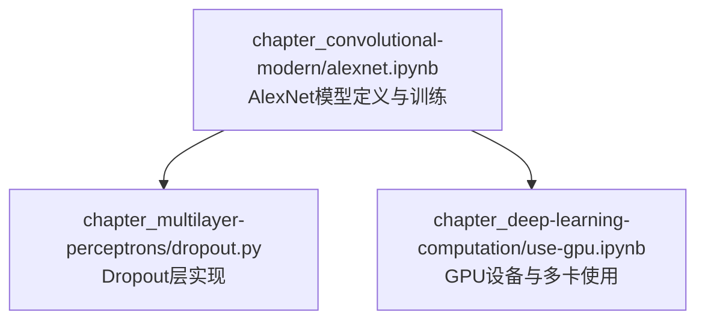
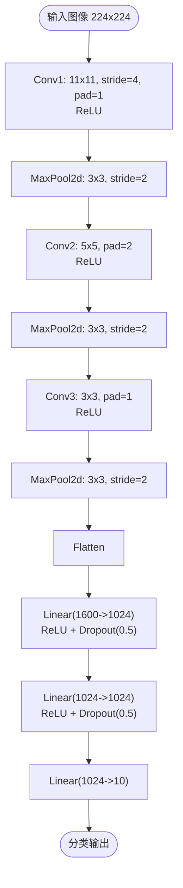
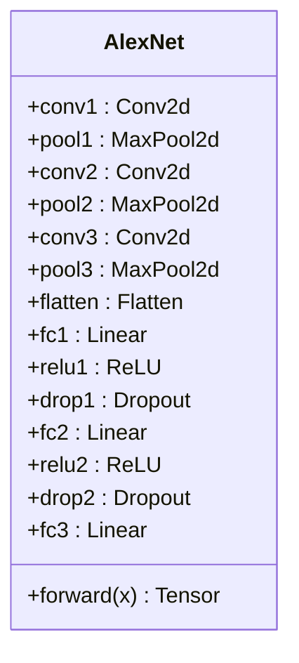
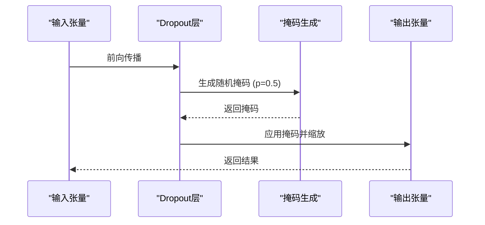
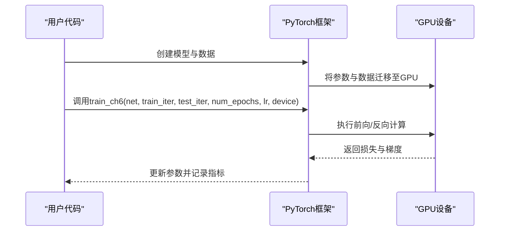
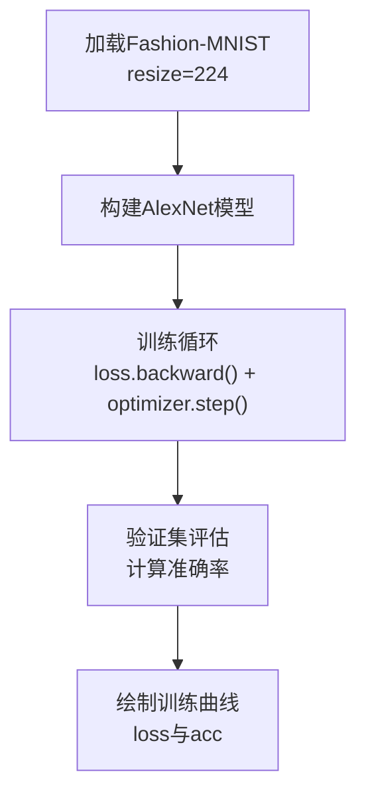
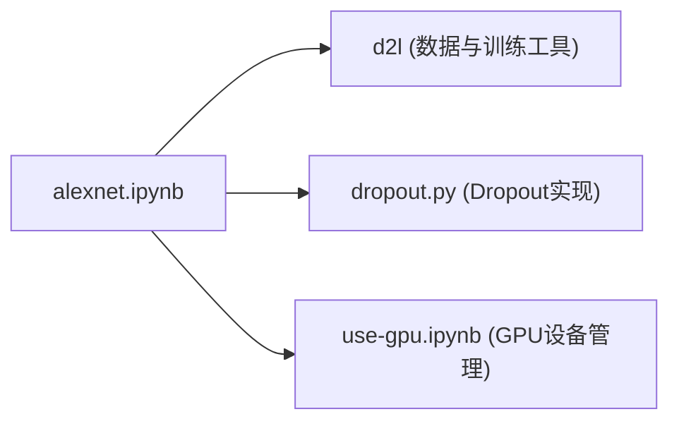

# AlexNet网络架构

<cite>
**本文引用的文件**   
- [alexnet.ipynb](file://chapter_convolutional-modern/alexnet.ipynb)
- [dropout.py](file://chapter_multilayer-perceptrons/dropout.py)
- [use-gpu.ipynb](file://chapter_deep-learning-computation/use-gpu.ipynb)
</cite>

## 目录
1. [简介](#简介)
2. [项目结构](#项目结构)
3. [核心组件](#核心组件)
4. [架构总览](#架构总览)
5. [详细组件分析](#详细组件分析)
6. [依赖关系分析](#依赖关系分析)
7. [性能考量](#性能考量)
8. [故障排查指南](#故障排查指南)
9. [结论](#结论)
10. [附录](#附录)

## 简介
本文件围绕AlexNet在2012年ImageNet竞赛中的突破性贡献，系统讲解其网络结构与训练要点，包括ReLU激活、Dropout正则化、数据增强与GPU并行训练等关键要素。文档同时给出基于PyTorch的构建、训练与评估流程说明，并提供调参与优化建议，帮助读者从原理到实践全面掌握AlexNet。

## 项目结构
本项目以Jupyter Notebook形式组织深度学习内容，其中AlexNet的实现位于“现代卷积神经网络”章节；Dropout实现位于“多层感知机”章节；GPU使用示例位于“深度学习计算”章节。这些文件共同构成了AlexNet的理论、实现与工程实践支撑。

**图表来源** 
- [alexnet.ipynb](file://chapter_convolutional-modern/alexnet.ipynb)
- [dropout.py](file://chapter_multilayer-perceptrons/dropout.py)
- [use-gpu.ipynb](file://chapter_deep-learning-computation/use-gpu.ipynb)

**章节来源**
- [alexnet.ipynb](file://chapter_convolutional-modern/alexnet.ipynb)
- [dropout.py](file://chapter_multilayer-perceptrons/dropout.py)
- [use-gpu.ipynb](file://chapter_deep-learning-computation/use-gpu.ipynb)

## 核心组件
- 网络结构：8层卷积-全连接（5个卷积层+2个全连接隐藏层+输出层），配合最大池化与扁平化操作。
- 激活函数：ReLU替代sigmoid，提升训练稳定性与收敛速度。
- 正则化：Dropout用于全连接层后，缓解过拟合。
- 数据增强：训练时引入翻转、裁剪、色彩变化等增强手段，提高泛化能力。
- GPU加速：利用CUDA与多GPU进行大规模矩阵运算与并行训练。

**章节来源**
- [alexnet.ipynb](file://chapter_convolutional-modern/alexnet.ipynb)
- [dropout.py](file://chapter_multilayer-perceptrons/dropout.py)
- [use-gpu.ipynb](file://chapter_deep-learning-computation/use-gpu.ipynb)

## 架构总览
下图展示AlexNet的数据流与模块顺序，包括卷积、池化、ReLU、Dropout与全连接的组合方式。

**图表来源** 
- [alexnet.ipynb](file://chapter_convolutional-modern/alexnet.ipynb)

**章节来源**
- [alexnet.ipynb](file://chapter_convolutional-modern/alexnet.ipynb)

## 详细组件分析

### 模型定义与数据流
- 卷积层：逐步减小空间尺寸并增加通道数，捕获从边缘到语义特征的层次化表示。
- 池化层：采用3x3步幅为2的最大池化，降低特征图分辨率，减少计算量。
- 全连接层：两个大容量的隐藏层（各1024维）配合Dropout，最后接输出层。
- 激活与正则：每层卷积后使用ReLU；全连接层后使用Dropout(p=0.5)。

**图表来源** 
- [alexnet.ipynb](file://chapter_convolutional-modern/alexnet.ipynb)

**章节来源**
- [alexnet.ipynb](file://chapter_convolutional-modern/alexnet.ipynb)

### Dropout实现与使用
- 自定义Dropout层：按概率随机置零，并按比例缩放保持期望不变。
- 集成到模型：在全连接层之后、训练模式下启用Dropout，测试模式关闭。

**图表来源** 
- [dropout.py](file://chapter_multilayer-perceptrons/dropout.py)

**章节来源**
- [dropout.py](file://chapter_multilayer-perceptrons/dropout.py)

### GPU训练与设备管理
- 设备选择：通过torch.device指定CPU或GPU（如cuda:0）。
- 多GPU支持：可使用多个索引访问不同GPU，便于分布式训练。
- 训练循环：将模型与数据移动到GPU，执行前向与反向传播。

**图表来源** 
- [use-gpu.ipynb](file://chapter_deep-learning-computation/use-gpu.ipynb)
- [alexnet.ipynb](file://chapter_convolutional-modern/alexnet.ipynb)

**章节来源**
- [use-gpu.ipynb](file://chapter_deep-learning-computation/use-gpu.ipynb)
- [alexnet.ipynb](file://chapter_convolutional-modern/alexnet.ipynb)

### 训练流程与评估
- 数据集：Fashion-MNIST，调整尺寸为224x224以适配AlexNet输入。
- 训练器：使用d2l.train_ch6进行训练，设置学习率与轮数。
- 评估：监控训练损失与准确率，绘制曲线观察收敛情况。

**图表来源** 
- [alexnet.ipynb](file://chapter_convolutional-modern/alexnet.ipynb)

**章节来源**
- [alexnet.ipynb](file://chapter_convolutional-modern/alexnet.ipynb)

## 依赖关系分析
- alexnet.ipynb依赖d2l库提供的数据加载与训练工具。
- dropout.py提供Dropout层的自定义实现，可被其他模型复用。
- use-gpu.ipynb展示如何在PyTorch中管理与切换设备。

**图表来源** 
- [alexnet.ipynb](file://chapter_convolutional-modern/alexnet.ipynb)
- [dropout.py](file://chapter_multilayer-perceptrons/dropout.py)
- [use-gpu.ipynb](file://chapter_deep-learning-computation/use-gpu.ipynb)

**章节来源**
- [alexnet.ipynb](file://chapter_convolutional-modern/alexnet.ipynb)
- [dropout.py](file://chapter_multilayer-perceptrons/dropout.py)
- [use-gpu.ipynb](file://chapter_deep-learning-computation/use-gpu.ipynb)

## 性能考量
- 计算瓶颈：卷积层与全连接层是主要计算开销来源，尤其是大容量FC层。
- 显存占用：全连接层权重占比较大，需关注显存峰值。
- 带宽压力：高吞吐矩阵乘法对内存带宽要求较高，GPU优势明显。
- 优化建议：
  - 使用混合精度训练降低显存占用。
  - 合理设置batch size平衡速度与稳定性。
  - 采用更高效的卷积算子（如cuDNN优化）。
  - 使用梯度累积应对显存限制。

[本节为通用指导，不直接分析具体文件]

## 故障排查指南
- 训练不收敛：检查学习率是否过大或过小；确认数据预处理是否正确。
- 显存不足：减小batch size或模型规模；启用梯度累积或混合精度。
- GPU未使用：确认设备迁移正确；检查CUDA版本与驱动兼容性。
- 过拟合：增大Dropout比例或增加数据增强强度；引入权重衰减。

**章节来源**
- [alexnet.ipynb](file://chapter_convolutional-modern/alexnet.ipynb)
- [dropout.py](file://chapter_multilayer-perceptrons/dropout.py)
- [use-gpu.ipynb](file://chapter_deep-learning-computation/use-gpu.ipynb)

## 结论
AlexNet通过深度卷积结构、ReLU激活、Dropout正则化与GPU并行训练，显著降低了ImageNet分类错误率，开启了深度学习在计算机视觉领域的突破。其设计思想与工程实践至今仍具重要参考价值。结合本仓库的PyTorch实现，读者可快速复现并优化AlexNet，深入理解现代CNN的训练范式。

[本节为总结性内容，不直接分析具体文件]

## 附录
- 调参建议：
  - 学习率：初始值0.01，随训练衰减。
  - Batch Size：根据显存调整，通常64~256。
  - Dropout：全连接层后使用0.5。
  - 数据增强：随机裁剪、水平翻转、颜色抖动。
- 性能优化技巧：
  - 使用预训练权重微调。
  - 启用AMP（自动混合精度）。
  - 使用TensorRT或ONNX导出加速推理。

[本节为补充信息，不直接分析具体文件]