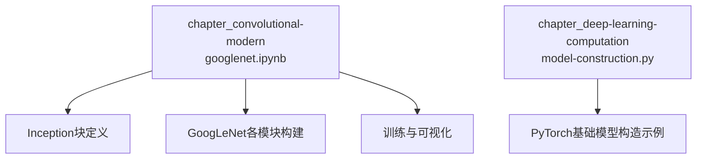
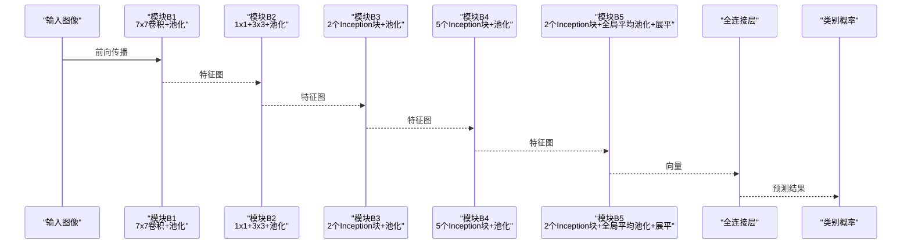
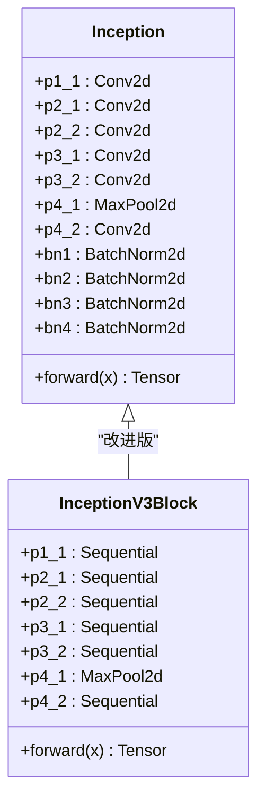
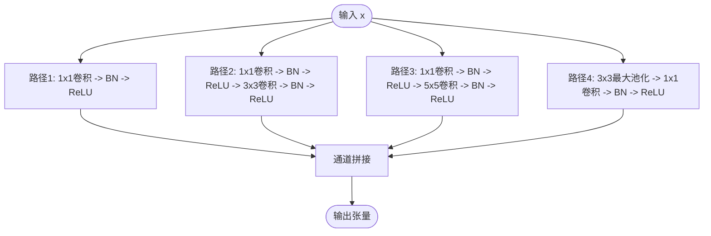
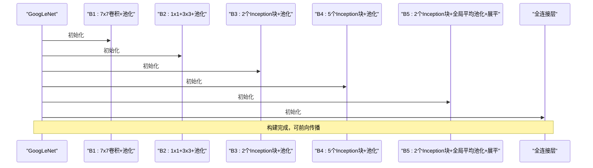
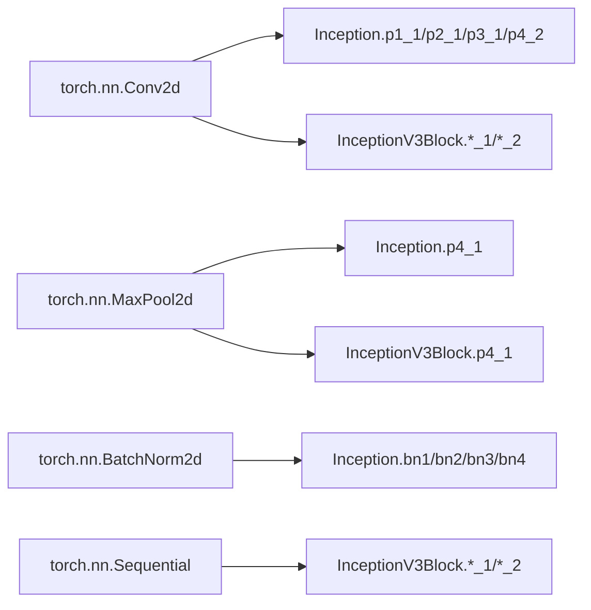

# GoogLeNet与Inception模块

<cite>
**本文档引用的文件**   
- [googlenet.ipynb](file://chapter_convolutional-modern/googlenet.ipynb)
- [model-construction.py](file://chapter_deep-learning-computation/model-construction.py)
</cite>

## 目录
1. [简介](#简介)
2. [项目结构](#项目结构)
3. [核心组件](#核心组件)
4. [架构总览](#架构总览)
5. [详细组件分析](#详细组件分析)
6. [依赖关系分析](#依赖关系分析)
7. [性能考量](#性能考量)
8. [故障排查指南](#故障排查指南)
9. [结论](#结论)
10. [附录](#附录)

## 简介
本章节聚焦于GoogLeNet（Inception v1）的设计思想与实现细节，重点阐述以下方面：
- Inception模块的多尺度特征提取、1x1卷积的降维作用与并行计算效率优势
- GoogLeNet的22层网络结构与辅助分类器的设计目的
- 为何能在保持精度的同时大幅减少参数数量
- 完整的Inception模块与GoogLeNet构建代码路径
- 可视化方法与调试技巧
- 不同版本Inception模块的演进对比

## 项目结构
仓库采用按主题组织的方式，GoogLeNet相关内容位于“现代卷积网络”章节中，以Jupyter Notebook形式呈现，包含概念讲解、代码实现与训练流程。

图表来源
- [googlenet.ipynb:1-120](file://chapter_convolutional-modern/googlenet.ipynb#L1-L120)
- [model-construction.py:1-95](file://chapter_deep-learning-computation/model-construction.py#L1-L95)

章节来源
- [googlenet.ipynb:1-120](file://chapter_convolutional-modern/googlenet.ipynb#L1-L120)
- [model-construction.py:1-95](file://chapter_deep-learning-computation/model-construction.py#L1-L95)

## 核心组件
- Inception块：四条并行路径，分别使用1x1、3x3、5x5卷积与最大池化+1x1卷积，通过1x1卷积控制通道数并引入非线性，最终在通道维度拼接输出
- InceptionV3Block：对Inception进行改进，用1x3/3x1分解3x3、双3x3替代5x5，提升效率与表达能力
- GoogLeNet主体：由多个Inception块串联，配合全局平均池化与全连接层完成分类

章节来源
- [googlenet.ipynb:68-98](file://chapter_convolutional-modern/googlenet.ipynb#L68-L98)
- [googlenet.ipynb:111-146](file://chapter_convolutional-modern/googlenet.ipynb#L111-L146)
- [googlenet.ipynb:158-166](file://chapter_convolutional-modern/googlenet.ipynb#L158-L166)

## 架构总览
GoogLeNet整体由若干Inception块堆叠而成，中间穿插最大池化降低空间尺寸，末端使用全局平均池化替代全连接层以减少参数量。

图表来源
- [googlenet.ipynb:188-191](file://chapter_convolutional-modern/googlenet.ipynb#L188-L191)
- [googlenet.ipynb:222-227](file://chapter_convolutional-modern/googlenet.ipynb#L222-L227)
- [googlenet.ipynb:260-263](file://chapter_convolutional-modern/googlenet.ipynb#L260-L263)
- [googlenet.ipynb:297-303](file://chapter_convolutional-modern/googlenet.ipynb#L297-L303)
- [googlenet.ipynb:336-342](file://chapter_convolutional-modern/googlenet.ipynb#L336-L342)

## 详细组件分析

### Inception块类图

图表来源
- [googlenet.ipynb:68-98](file://chapter_convolutional-modern/googlenet.ipynb#L68-L98)
- [googlenet.ipynb:111-146](file://chapter_convolutional-modern/googlenet.ipynb#L111-L146)

章节来源
- [googlenet.ipynb:68-98](file://chapter_convolutional-modern/googlenet.ipynb#L68-L98)
- [googlenet.ipynb:111-146](file://chapter_convolutional-modern/googlenet.ipynb#L111-L146)

### Inception前向传播流程

图表来源
- [googlenet.ipynb:91-97](file://chapter_convolutional-modern/googlenet.ipynb#L91-L97)

章节来源
- [googlenet.ipynb:91-97](file://chapter_convolutional-modern/googlenet.ipynb#L91-L97)

### GoogLeNet模块构建序列

图表来源
- [googlenet.ipynb:188-191](file://chapter_convolutional-modern/googlenet.ipynb#L188-L191)
- [googlenet.ipynb:222-227](file://chapter_convolutional-modern/googlenet.ipynb#L222-L227)
- [googlenet.ipynb:260-263](file://chapter_convolutional-modern/googlenet.ipynb#L260-L263)
- [googlenet.ipynb:297-303](file://chapter_convolutional-modern/googlenet.ipynb#L297-L303)
- [googlenet.ipynb:336-342](file://chapter_convolutional-modern/googlenet.ipynb#L336-L342)

章节来源
- [googlenet.ipynb:188-191](file://chapter_convolutional-modern/googlenet.ipynb#L188-L191)
- [googlenet.ipynb:222-227](file://chapter_convolutional-modern/googlenet.ipynb#L222-L227)
- [googlenet.ipynb:260-263](file://chapter_convolutional-modern/googlenet.ipynb#L260-L263)
- [googlenet.ipynb:297-303](file://chapter_convolutional-modern/googlenet.ipynb#L297-L303)
- [googlenet.ipynb:336-342](file://chapter_convolutional-modern/googlenet.ipynb#L336-L342)

## 依赖关系分析
- Inception模块依赖PyTorch的Conv2d、MaxPool2d、BatchNorm2d等基础层
- GoogLeNet由多个Inception块组合而成，形成层次化的依赖关系
- 训练过程依赖数据加载器与优化器

图表来源
- [googlenet.ipynb:68-98](file://chapter_convolutional-modern/googlenet.ipynb#L68-L98)
- [googlenet.ipynb:111-146](file://chapter_convolutional-modern/googlenet.ipynb#L111-L146)

章节来源
- [googlenet.ipynb:68-98](file://chapter_convolutional-modern/googlenet.ipynb#L68-L98)
- [googlenet.ipynb:111-146](file://chapter_convolutional-modern/googlenet.ipynb#L111-L146)

## 性能考量
- **多尺度特征提取**：通过不同大小的卷积核并行处理，捕获多尺度信息
- **1x1卷积降维**：显著减少计算量和参数量，同时引入非线性
- **并行计算**：多条路径并行执行，充分利用GPU并行能力
- **全局平均池化**：替代全连接层，大幅减少参数量，防止过拟合
- **通道数分配**：经过大量实验优化的通道比例，平衡表达能力与计算成本

章节来源
- [googlenet.ipynb:154-166](file://chapter_convolutional-modern/googlenet.ipynb#L154-L166)
- [googlenet.ipynb:1403-1405](file://chapter_convolutional-modern/googlenet.ipynb#L1403-L1405)

## 故障排查指南
- **形状不匹配错误**：检查各路径输出的通道数是否正确拼接
- **内存不足**：减小输入图像尺寸或批次大小
- **训练不稳定**：检查批量归一化层的配置
- **收敛缓慢**：调整学习率和优化器参数

章节来源
- [googlenet.ipynb:386-391](file://chapter_convolutional-modern/googlenet.ipynb#L386-L391)

## 结论
GoogLeNet通过Inception模块的创新设计，成功实现了多尺度特征提取与计算效率的平衡。其核心思想包括：
- 并行多尺度卷积捕获丰富特征
- 1x1卷积有效降维和控制复杂度
- 全局平均池化减少参数量
- 精心设计的通道数分配策略

这些设计使得GoogLeNet在保持高精度的同时，显著减少了参数数量和计算复杂度，为后续Inception系列模型的发展奠定了基础。

## 附录

### Inception模块演进对比
- **Inception v1 (GoogLeNet)**：基础四路并行结构
- **Inception v2**：引入Batch Normalization和更高效的卷积分解
- **Inception v3**：使用1x3/3x1分解3x3卷积，双3x3替代5x5
- **Inception v4**：进一步简化结构，提高训练效率

### 调试技巧
- 使用`print()`语句检查各层输出形状
- 利用可视化工具查看网络结构
- 逐步验证每个Inception块的输出
- 监控梯度流动情况

章节来源
- [googlenet.ipynb:1408-1416](file://chapter_convolutional-modern/googlenet.ipynb#L1408-L1416)
- [model-construction.py:1-95](file://chapter_deep-learning-computation/model-construction.py#L1-L95)