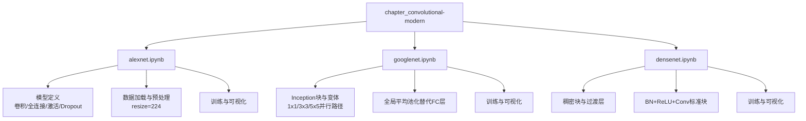
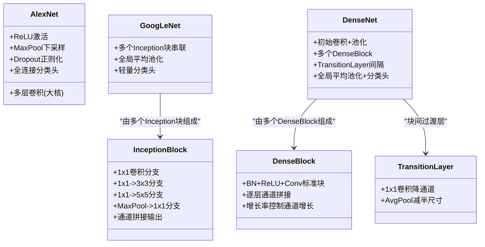
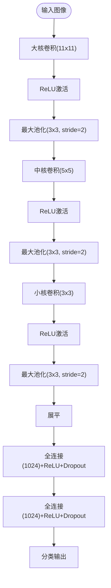
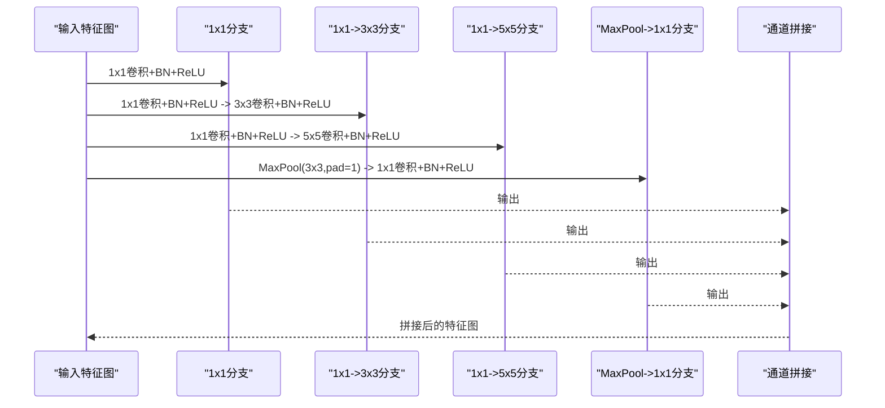
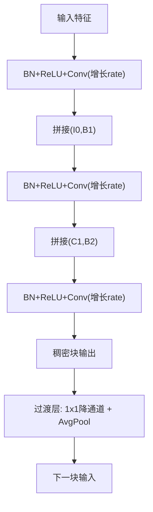
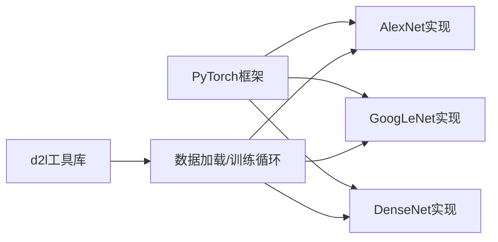

# 现代卷积网络

<cite>
**本文引用的文件**   
- [alexnet.ipynb](file://chapter_convolutional-modern/alexnet.ipynb)
- [googlenet.ipynb](file://chapter_convolutional-modern/googlenet.ipynb)
- [densenet.ipynb](file://chapter_convolutional-modern/densenet.ipynb)
</cite>

## 目录
1. [引言](#引言)
2. [项目结构](#项目结构)
3. [核心组件](#核心组件)
4. [架构总览](#架构总览)
5. [详细组件分析](#详细组件分析)
6. [依赖关系分析](#依赖关系分析)
7. [性能考量](#性能考量)
8. [故障排查指南](#故障排查指南)
9. [结论](#结论)
10. [附录](#附录)

## 引言
本章节聚焦现代卷积网络的三大代表性架构：AlexNet、GoogLeNet（Inception）与DenseNet，系统阐述其创新点、设计动机与工程实现要点。内容涵盖：
- AlexNet的ReLU激活、Dropout与数据增强的历史意义与实践价值；
- GoogLeNet的Inception模块与1x1卷积在通道压缩与非线性引入中的作用；
- DenseNet的密集连接与特征复用机制及其对参数效率与梯度传播的影响；
- 批量归一化（Batch Normalization）在训练稳定性与收敛速度上的作用；
- 不同架构的特点与适用场景对比；
- 完整的网络构建与训练流程参考；
- 迁移学习与微调的实践指导；
- 网络设计的演进趋势与技术要点总结。

## 项目结构
本仓库的现代卷积网络部分位于 chapter_convolutional-modern 目录，包含三个独立Notebook，分别对应AlexNet、GoogLeNet与DenseNet的实现与训练示例。每个Notebook均提供：
- 模型定义（PyTorch nn.Module/Sequential）；
- 数据加载与预处理（含分辨率调整与增强）；
- 训练循环与可视化（损失与准确率曲线）。

**图示来源** 
- [alexnet.ipynb:329-351](file://chapter_convolutional-modern/alexnet.ipynb#L329-L351)
- [googlenet.ipynb:69-98](file://chapter_convolutional-modern/googlenet.ipynb#L69-L98)
- [densenet.ipynb:191-210](file://chapter_convolutional-modern/densenet.ipynb#L191-L210)

**章节来源**
- [alexnet.ipynb:329-351](file://chapter_convolutional-modern/alexnet.ipynb#L329-L351)
- [googlenet.ipynb:69-98](file://chapter_convolutional-modern/googlenet.ipynb#L69-L98)
- [densenet.ipynb:191-210](file://chapter_convolutional-modern/densenet.ipynb#L191-L210)

## 核心组件
- AlexNet：深层卷积+大感受野卷积核、ReLU激活、Dropout正则化、数据增强；使用较大输入尺寸以适配大卷积核。
- GoogLeNet：Inception块多尺度并行分支，1x1卷积用于降维与引入非线性；采用全局平均池化减少参数量。
- DenseNet：稠密块内逐层通道拼接，过渡层控制通道增长；BN+ReLU+Conv标准块提升训练稳定性。

**章节来源**
- [alexnet.ipynb:329-351](file://chapter_convolutional-modern/alexnet.ipynb#L329-L351)
- [googlenet.ipynb:69-98](file://chapter_convolutional-modern/googlenet.ipynb#L69-L98)
- [densenet.ipynb:136-140](file://chapter_convolutional-modern/densenet.ipynb#L136-L140)

## 架构总览
下图展示三类现代CNN的整体结构与关键模块关系。

**图示来源** 
- [googlenet.ipynb:69-98](file://chapter_convolutional-modern/googlenet.ipynb#L69-L98)
- [densenet.ipynb:191-210](file://chapter_convolutional-modern/densenet.ipynb#L191-L210)
- [densenet.ipynb:319-324](file://chapter_convolutional-modern/densenet.ipynb#L319-L324)

## 详细组件分析

### AlexNet：激活函数、正则化与数据增强
- 创新点与历史意义：
  - 首次大规模使用ReLU替代Sigmoid，缓解梯度消失并加速收敛；
  - Dropout在全连接层抑制过拟合；
  - 数据增强（翻转、裁剪、颜色抖动）提升鲁棒性；
  - 大卷积核（11x11、5x5、3x3）配合步幅与池化快速降维。
- 实现要点：
  - 首层大核卷积获取广域感受野；
  - 中间层逐步缩小卷积核并增加通道数；
  - 全连接层后接Dropout；
  - 训练时降低学习率以适应更深更广的网络。

**图示来源** 
- [alexnet.ipynb:329-351](file://chapter_convolutional-modern/alexnet.ipynb#L329-L351)

**章节来源**
- [alexnet.ipynb:329-351](file://chapter_convolutional-modern/alexnet.ipynb#L329-L351)

### GoogLeNet：Inception模块与1x1卷积
- Inception模块：
  - 四条并行路径提取多尺度特征；
  - 1x1卷积用于通道压缩与引入非线性；
  - 最后沿通道维度拼接输出。
- 架构优势：
  - 多尺度融合提升表征能力；
  - 通过1x1降维显著降低计算量；
  - 使用全局平均池化替代全连接层，减少参数。
- 变体：
  - InceptionV3Block将3x3拆分为1x3与3x1，进一步分解计算。

**图示来源** 
- [googlenet.ipynb:69-98](file://chapter_convolutional-modern/googlenet.ipynb#L69-L98)

**章节来源**
- [googlenet.ipynb:69-98](file://chapter_convolutional-modern/googlenet.ipynb#L69-L98)

### DenseNet：密集连接与特征复用
- 稠密块（Dense Block）：
  - 每个卷积块的输入是之前所有层的特征拼接；
  - 增长率（growth rate）控制每层新增通道数；
  - BN+ReLU+Conv标准块保证训练稳定。
- 过渡层（Transition Layer）：
  - 1x1卷积降通道；
  - AvgPool减半空间尺寸，控制复杂度。
- 优势：
  - 特征复用减少冗余；
  - 缓解梯度消失，促进信息流动；
  - 参数量相对更少（因3x3卷积输出通道固定且较小）。

**图示来源** 
- [densenet.ipynb:191-210](file://chapter_convolutional-modern/densenet.ipynb#L191-L210)
- [densenet.ipynb:319-324](file://chapter_convolutional-modern/densenet.ipynb#L319-L324)

**章节来源**
- [densenet.ipynb:191-210](file://chapter_convolutional-modern/densenet.ipynb#L191-L210)
- [densenet.ipynb:319-324](file://chapter_convolutional-modern/densenet.ipynb#L319-L324)

### 批量归一化（Batch Normalization）的作用
- 稳定训练分布，缓解内部协变量偏移；
- 允许更高学习率，加速收敛；
- 具有轻微正则化效果，减少过拟合风险；
- 在AlexNet/GoogLeNet/DenseNet中广泛使用，提升稳定性。

**章节来源**
- [googlenet.ipynb:86-90](file://chapter_convolutional-modern/googlenet.ipynb#L86-L90)
- [densenet.ipynb:136-140](file://chapter_convolutional-modern/densenet.ipynb#L136-L140)

## 依赖关系分析
- 框架依赖：
  - PyTorch（torch.nn, torch.optim等）；
  - d2l工具库（数据加载、训练循环、可视化）。
- 模块依赖：
  - AlexNet依赖基础卷积/池化/全连接/激活/正则化模块；
  - GoogLeNet依赖Inception块与全局平均池化；
  - DenseNet依赖稠密块与过渡层组合。

**图示来源** 
- [alexnet.ipynb:325-328](file://chapter_convolutional-modern/alexnet.ipynb#L325-L328)
- [googlenet.ipynb:63-66](file://chapter_convolutional-modern/googlenet.ipynb#L63-L66)
- [densenet.ipynb:131-133](file://chapter_convolutional-modern/densenet.ipynb#L131-L133)

**章节来源**
- [alexnet.ipynb:325-328](file://chapter_convolutional-modern/alexnet.ipynb#L325-L328)
- [googlenet.ipynb:63-66](file://chapter_convolutional-modern/googlenet.ipynb#L63-L66)
- [densenet.ipynb:131-133](file://chapter_convolutional-modern/densenet.ipynb#L131-L133)

## 性能考量
- AlexNet：
  - 大卷积核与深网络带来较高计算量；
  - 需要GPU加速与合理批大小；
  - 学习率需调低以避免发散。
- GoogLeNet：
  - Inception块多分支并行，计算复杂但参数效率高；
  - 1x1卷积有效降维，平衡精度与速度。
- DenseNet：
  - 特征复用导致显存占用高（长跳跃连接）；
  - 可通过梯度检查点或分块计算优化内存。
- 通用建议：
  - 使用混合精度训练（FP16）提升吞吐；
  - 数据管道优化（多线程、预取）；
  - 模型剪枝与量化部署。

[本节为通用指导，不直接引用具体文件]

## 故障排查指南
- 训练不稳定：
  - 检查学习率是否过高；
  - 确认BN层位置与参数初始化；
  - 验证数据标准化与增强是否合理。
- 显存不足：
  - 减小批大小或输入分辨率；
  - 使用梯度累积或检查点技术；
  - 考虑模型轻量化（如减少通道数）。
- 收敛缓慢：
  - 调整优化器（Adam/SGD with momentum）；
  - 使用学习率调度策略；
  - 检查标签编码与损失函数匹配。

**章节来源**
- [alexnet.ipynb:456-459](file://chapter_convolutional-modern/alexnet.ipynb#L456-L459)
- [googlenet.ipynb:399-402](file://chapter_convolutional-modern/googlenet.ipynb#L399-L402)
- [densenet.ipynb:496-500](file://chapter_convolutional-modern/densenet.ipynb#L496-L500)

## 结论
现代卷积网络从AlexNet的ReLU与正则化实践，到GoogLeNet的多尺度特征融合，再到DenseNet的特征复用机制，体现了深度学习在表征学习上的持续演进。批量归一化成为稳定训练的基石。在实际应用中，应根据任务需求选择合适架构，并结合迁移学习与微调技术快速落地。未来趋势将继续向更高效、更鲁棒的网络设计与训练方法发展。

[本节为总结性内容，不直接引用具体文件]

## 附录

### 迁移学习与微调实践
- 步骤：
  - 加载预训练权重（ImageNet等）；
  - 替换分类头以适配目标类别数；
  - 冻结底层卷积层，仅训练顶层；
  - 逐步解冻更多层进行细粒度调整。
- 注意事项：
  - 学习率分层设置（底层小，顶层大）；
  - 数据增强强度与源域差异匹配；
  - 监控过拟合与泛化能力。

**章节来源**
- [alexnet.ipynb:445-448](file://chapter_convolutional-modern/alexnet.ipynb#L445-L448)
- [googlenet.ipynb:1389-1392](file://chapter_convolutional-modern/googlenet.ipynb#L1389-L1392)
- [densenet.ipynb:1481-1484](file://chapter_convolutional-modern/densenet.ipynb#L1481-L1484)

### 完整训练代码参考
- AlexNet训练：
  - 数据加载：resize=224，batch_size=64；
  - 优化器：SGD/Adam，学习率递减；
  - 评估：训练/测试准确率与损失曲线。
- GoogLeNet训练：
  - 数据加载：resize=96，batch_size=128；
  - 使用全局平均池化替代FC层；
  - 训练循环与可视化。
- DenseNet训练：
  - 数据加载：resize=96，batch_size=256；
  - 稠密块与过渡层组合；
  - 训练监控与调优。

**章节来源**
- [alexnet.ipynb:445-448](file://chapter_convolutional-modern/alexnet.ipynb#L445-L448)
- [googlenet.ipynb:1389-1392](file://chapter_convolutional-modern/googlenet.ipynb#L1389-L1392)
- [densenet.ipynb:1481-1484](file://chapter_convolutional-modern/densenet.ipynb#L1481-L1484)