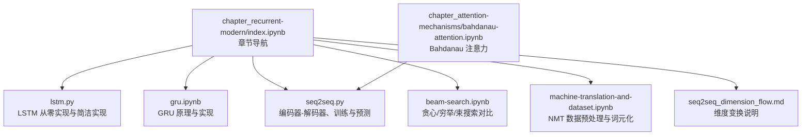
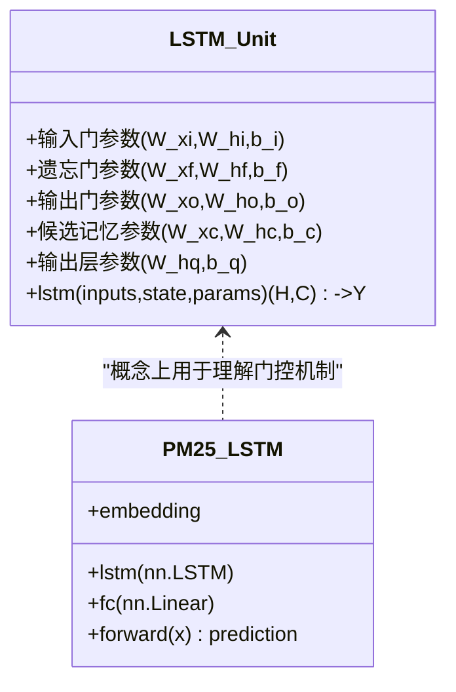
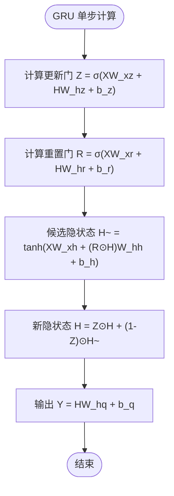
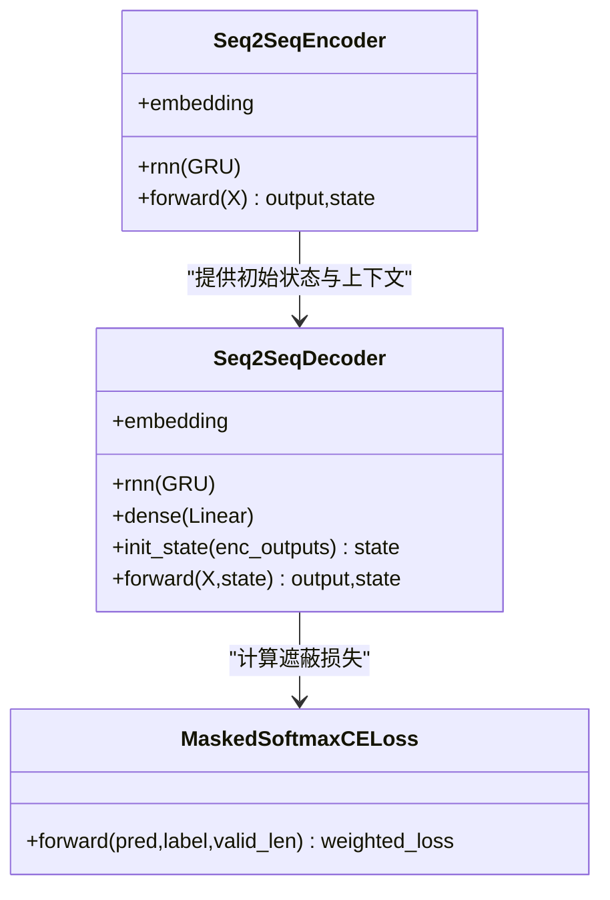
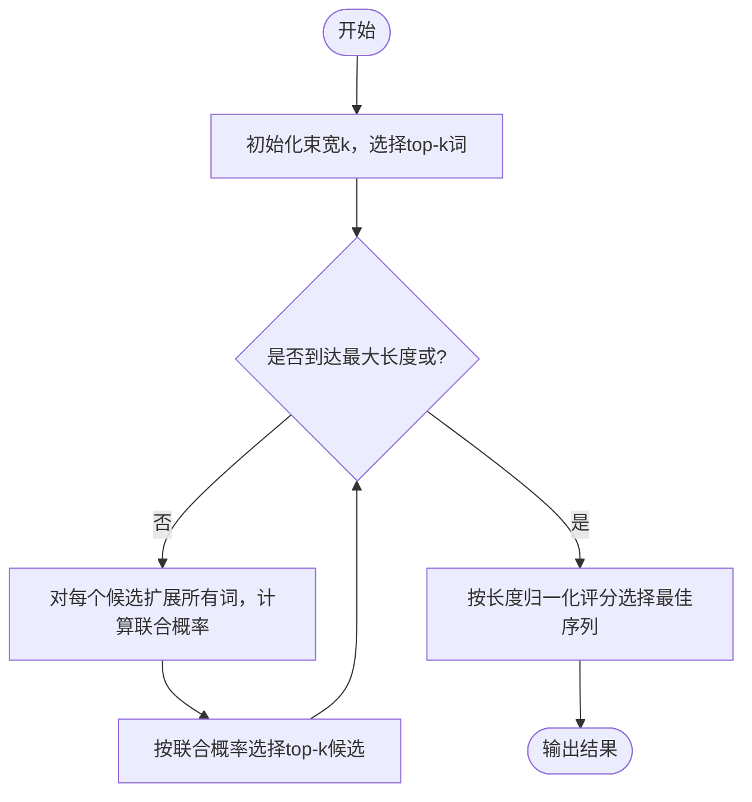
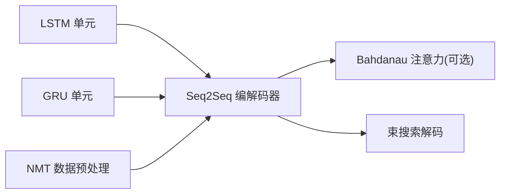

# 现代循环网络

<cite>
**本文引用的文件**   
- [chapter_recurrent-modern/index.ipynb](file://chapter_recent-modern/index.ipynb)
- [chapter_recurrent-modern/lstm.py](file://chapter_recurrent-modern/lstm.py)
- [chapter_recurrent-modern/gru.ipynb](file://chapter_recurrent-modern/gru.ipynb)
- [chapter_recurrent-modern/seq2seq.py](file://chapter_recurrent-modern/seq2seq.py)
- [chapter_recurrent-modern/beam-search.ipynb](file://chapter_recurrent-modern/beam-search.ipynb)
- [chapter_recurrent-modern/machine-translation-and-dataset.ipynb](file://chapter_recurrent-modern/machine-translation-and-dataset.ipynb)
- [chapter_recurrent-modern/seq2seq_dimension_flow.md](file://chapter_recurrent-modern/seq2seq_dimension_flow.md)
- [chapter_attention-mechanisms/bahdanau-attention.ipynb](file://chapter_attention-mechanisms/bahdanau-attention.ipynb)
</cite>

## 目录
1. [引言](#引言)
2. [项目结构](#项目结构)
3. [核心组件](#核心组件)
4. [架构总览](#架构总览)
5. [详细组件分析](#详细组件分析)
6. [依赖关系分析](#依赖关系分析)
7. [性能与优化](#性能与优化)
8. [故障排查指南](#故障排查指南)
9. [结论](#结论)
10. [附录：实践清单与调优技巧](#附录实践清单与调优技巧)

## 引言
本章节聚焦“现代循环网络”，系统讲解 LSTM 的门控机制与长短期记忆单元的工作原理，GRU 的简化门控结构与计算效率优势；并基于编码器-解码器（Seq2Seq）架构阐述机器翻译任务的数据准备、训练与推理流程，包括束搜索解码算法与生成质量优化方法。文档同时提供完整的 LSTM、GRU 和 Seq2Seq 模型实现路径与实践指导，帮助读者从原理到落地全面掌握序列建模的关键技术。

## 项目结构
本章代码组织围绕三大主题展开：
- LSTM 与 GRU 的实现与训练示例
- Seq2Seq 编码器-解码器及损失函数、训练与预测
- 束搜索解码策略与机器翻译数据集处理



**图表来源**
- [chapter_recurrent-modern/index.ipynb](file://chapter_recurrent-modern/index.ipynb)
- [chapter_recurrent-modern/lstm.py](file://chapter_recurrent-modern/lstm.py)
- [chapter_recurrent-modern/gru.ipynb](file://chapter_recurrent-modern/gru.ipynb)
- [chapter_recurrent-modern/seq2seq.py](file://chapter_recurrent-modern/seq2seq.py)
- [chapter_recurrent-modern/beam-search.ipynb](file://chapter_recurrent-modern/beam-search.ipynb)
- [chapter_recurrent-modern/machine-translation-and-dataset.ipynb](file://chapter_recurrent-modern/machine-translation-and-dataset.ipynb)
- [chapter_recurrent-modern/seq2seq_dimension_flow.md](file://chapter_recurrent-modern/seq2seq_dimension_flow.md)
- [chapter_attention-mechanisms/bahdanau-attention.ipynb](file://chapter_attention-mechanisms/bahdanau-attention.ipynb)

**章节来源**
- [chapter_recurrent-modern/index.ipynb](file://chapter_recurrent-modern/index.ipynb)

## 核心组件
- LSTM 模块：包含从零实现的 LSTM 单元、简洁 API 调用、时间序列预测与字符级语言模型等示例。
- GRU 模块：讲解重置门与更新门的数学表达、候选隐状态与最终隐状态更新，并提供从零实现与简洁实现。
- Seq2Seq 模块：编码器（Embedding + GRU）、解码器（Embedding + GRU + Dense）、遮蔽交叉熵损失、训练与预测流程。
- 束搜索：贪心搜索、穷举搜索与束搜索的权衡与评分公式。
- 机器翻译数据：英法语料下载、清洗、分词、构建迭代器。

**章节来源**
- [chapter_recurrent-modern/lstm.py](file://chapter_recurrent-modern/lstm.py)
- [chapter_recurrent-modern/gru.ipynb](file://chapter_recurrent-modern/gru.ipynb)
- [chapter_recurrent-modern/seq2seq.py](file://chapter_recurrent-modern/seq2seq.py)
- [chapter_recurrent-modern/beam-search.ipynb](file://chapter_recurrent-modern/beam-search.ipynb)
- [chapter_recurrent-modern/machine-translation-and-dataset.ipynb](file://chapter_recurrent-modern/machine-translation-and-dataset.ipynb)

## 架构总览
Seq2Seq 编码器-解码器整体流程如下：
- 编码器将源序列编码为上下文向量或完整隐藏状态序列
- 解码器自回归地生成目标序列，每一步结合上一时刻隐状态与上下文信息
- 训练阶段采用教师强制（Teacher Forcing），使用真实标签作为解码输入
- 推理阶段采用贪心或束搜索进行解码

```mermaid
sequenceDiagram
participant Src as "源序列"
participant Enc as "编码器(Embedding+GRU)"
participant Dec as "解码器(Embedding+GRU+Dense)"
participant Loss as "遮蔽交叉熵损失"
participant Opt as "优化器"
Src->>Enc : 输入嵌入并转置为时间步优先
Enc-->>Dec : 输出所有时间步隐藏状态与最终层隐状态
Note over Enc,Dec : 解码器初始状态由编码器最后一层最后时间步隐状态提供
loop 训练阶段(教师强制)
Dec->>Dec : 拼接当前词嵌入与上下文
Dec-->>Loss : 输出词表概率分布
Loss-->>Opt : 计算遮蔽后的平均损失
Opt-->>Enc : 反向传播更新参数
Opt-->>Dec : 反向传播更新参数
end
loop 推理阶段(贪心/束搜索)
Dec->>Dec : 以<bos>开始，逐步生成下一个词
Dec-->>Dec : 根据argmax或束搜索选择下一词
Dec-->>Src : 直到<eos>或达到最大长度
end
```

**图表来源**
- [chapter_recurrent-modern/seq2seq.py](file://chapter_recurrent-modern/seq2seq.py)
- [chapter_attention-mechanisms/bahdanau-attention.ipynb](file://chapter_attention-mechanisms/bahdanau-attention.ipynb)

## 详细组件分析

### LSTM 组件分析
- 设计动机：通过三个门（输入门、遗忘门、输出门）和一个候选记忆单元控制信息的保留与更新，缓解梯度消失问题，捕获长期依赖。
- 关键步骤：
  - 初始化参数与状态
  - 每个时间步计算各门与候选记忆，更新细胞状态与隐状态
  - 输出层映射到词表空间
- 复杂度与特性：
  - 相比标准 RNN，LSTM 增加门控矩阵与偏置，参数量更大但更稳定
  - 适合需要长程依赖的任务（如语言建模、时间序列预测）



**图表来源**
- [chapter_recurrent-modern/lstm.py](file://chapter_recurrent-modern/lstm.py)

**章节来源**
- [chapter_recurrent-modern/lstm.py](file://chapter_recurrent-modern/lstm.py)

### GRU 组件分析
- 设计动机：在保持良好效果的同时减少门控数量，仅用重置门与更新门，提升计算效率。
- 关键步骤：
  - 重置门控制历史隐状态的保留程度
  - 更新门决定新旧状态的凸组合
  - 候选隐状态结合重置后的历史与当前输入
- 复杂度与特性：
  - 参数量少于 LSTM，训练更快
  - 在许多任务中与 LSTM 表现相当甚至更好



**图表来源**
- [chapter_recurrent-modern/gru.ipynb](file://chapter_recurrent-modern/gru.ipynb)

**章节来源**
- [chapter_recurrent-modern/gru.ipynb](file://chapter_recurrent-modern/gru.ipynb)

### Seq2Seq 编码器-解码器与注意力
- 编码器：Embedding + GRU，输出所有时间步隐藏状态与最终层隐状态
- 解码器：Embedding + GRU + Dense，输入为当前词嵌入与上下文拼接，初始状态来自编码器
- 注意力机制（可选增强）：Bahdanau 注意力在每个解码步动态对齐源序列不同位置，提高翻译质量
- 损失函数：遮蔽交叉熵，忽略填充位的影响
- 训练与推理：
  - 训练：教师强制，使用真实标签作为解码输入
  - 推理：贪心或束搜索，逐词生成直至结束符



**图表来源**
- [chapter_recurrent-modern/seq2seq.py](file://chapter_recurrent-modern/seq2seq.py)
- [chapter_attention-mechanisms/bahdanau-attention.ipynb](file://chapter_attention-mechanisms/bahdanau-attention.ipynb)

**章节来源**
- [chapter_recurrent-modern/seq2seq.py](file://chapter_recurrent-modern/seq2seq.py)
- [chapter_attention-mechanisms/bahdanau-attention.ipynb](file://chapter_attention-mechanisms/bahdanau-attention.ipynb)

### 束搜索解码算法
- 贪心搜索：每步选择条件概率最大的词，速度快但可能非最优
- 穷举搜索：评估所有可能序列，精度最高但计算量巨大
- 束搜索：维护 k 个候选序列，每步扩展并剪枝，平衡精度与速度
- 评分公式：对数似然求和除以长度的幂次，惩罚过长序列



**图表来源**
- [chapter_recurrent-modern/beam-search.ipynb](file://chapter_recurrent-modern/beam-search.ipynb)

**章节来源**
- [chapter_recurrent-modern/beam-search.ipynb](file://chapter_recurrent-modern/beam-search.ipynb)

### 机器翻译数据准备与处理
- 数据下载与清洗：英法双语语料，去除不间断空格、统一小写、标点前后加空格
- 词元化：单词级分词，构建源/目标词表
- 批次构建：截断/填充至固定长度，构建 DataLoader
- 训练迭代：加载数据、前向传播、计算损失、反向传播、参数更新

**章节来源**
- [chapter_recurrent-modern/machine-translation-and-dataset.ipynb](file://chapter_recurrent-modern/machine-translation-and-dataset.ipynb)

## 依赖关系分析
- LSTM/GRU 作为基础单元被 Seq2Seq 编码器/解码器复用
- Seq2Seq 依赖 d2l 工具库进行数据加载、训练循环与可视化
- 注意力机制可替换解码器的上下文拼接方式，提升对齐能力
- 束搜索作为解码策略独立于模型结构，可与任意生成模型结合



**图表来源**
- [chapter_recurrent-modern/lstm.py](file://chapter_recurrent-modern/lstm.py)
- [chapter_recurrent-modern/gru.ipynb](file://chapter_recurrent-modern/gru.ipynb)
- [chapter_recurrent-modern/seq2seq.py](file://chapter_recurrent-modern/seq2seq.py)
- [chapter_attention-mechanisms/bahdanau-attention.ipynb](file://chapter_attention-mechanisms/bahdanau-attention.ipynb)
- [chapter_recurrent-modern/machine-translation-and-dataset.ipynb](file://chapter_recurrent-modern/machine-translation-and-dataset.ipynb)

**章节来源**
- [chapter_recurrent-modern/seq2seq.py](file://chapter_recurrent-modern/seq2seq.py)

## 性能与优化
- 数值稳定性：
  - 使用梯度裁剪防止梯度爆炸
  - Xavier/Glorot 初始化权重避免梯度消失
- 训练效率：
  - 使用批处理与 GPU 加速
  - 教师强制加速收敛，但推理时需切换为自回归
- 解码质量：
  - 束搜索优于贪心搜索，需权衡束宽与计算成本
  - 长度惩罚避免生成过长序列
- 数据层面：
  - 合理分词与词表大小影响模型容量与泛化
  - 遮蔽掩码确保只计算有效位置的损失

[本节为通用指导，不直接分析具体文件]

## 故障排查指南
- 数据读取错误：
  - Windows 下 GBK 编码报错：使用 UTF-8 显式打开文件
  - 交互式绘图异常：自定义 Animator 类在非交互模式下打印进度
- 维度不匹配：
  - RNN 默认时间步优先格式，需正确 permute
  - 解码器输入拼接时注意特征维对齐
- 训练不稳定：
  - 检查学习率、梯度裁剪阈值
  - 确认遮蔽掩码与损失函数形状一致

**章节来源**
- [chapter_recurrent-modern/seq2seq.py](file://chapter_recurrent-modern/seq2seq.py)
- [chapter_recurrent-modern/seq2seq_dimension_flow.md](file://chapter_recurrent-modern/seq2seq_dimension_flow.md)

## 结论
现代循环网络通过 LSTM 与 GRU 的门控机制有效解决了传统 RNN 的梯度问题，并在多种序列任务中取得优异表现。Seq2Seq 架构结合注意力机制进一步提升了机器翻译等任务的性能。束搜索解码在保证效率的同时显著改善生成质量。实践中需关注数据预处理、训练稳定性与解码策略的选择，以获得最佳效果。

[本节为总结性内容，不直接分析具体文件]

## 附录：实践清单与调优技巧
- 数据准备：
  - 清洗文本、统一格式、分词构建词表
  - 设置合理的 batch_size 与 num_steps
- 模型选择：
  - 简单任务优先 GRU，复杂长程依赖考虑 LSTM
  - 加入注意力机制提升对齐能力
- 训练技巧：
  - 使用 Adam 优化器，适当学习率调度
  - 梯度裁剪与权重初始化
  - 教师强制训练，推理时切换自回归
- 解码优化：
  - 贪心搜索快速但质量有限
  - 束搜索平衡精度与速度，调整束宽与长度惩罚
- 评估指标：
  - BLEU 分数衡量翻译质量
  - 困惑度评估语言模型

[本节为通用指导，不直接分析具体文件]