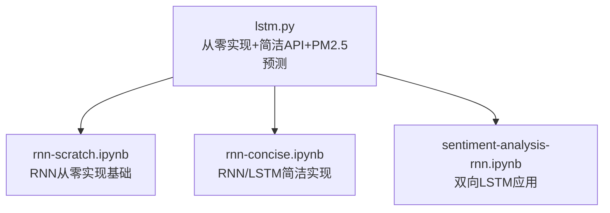
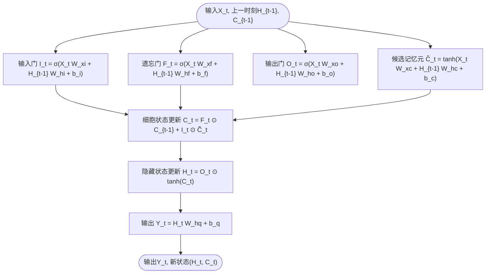
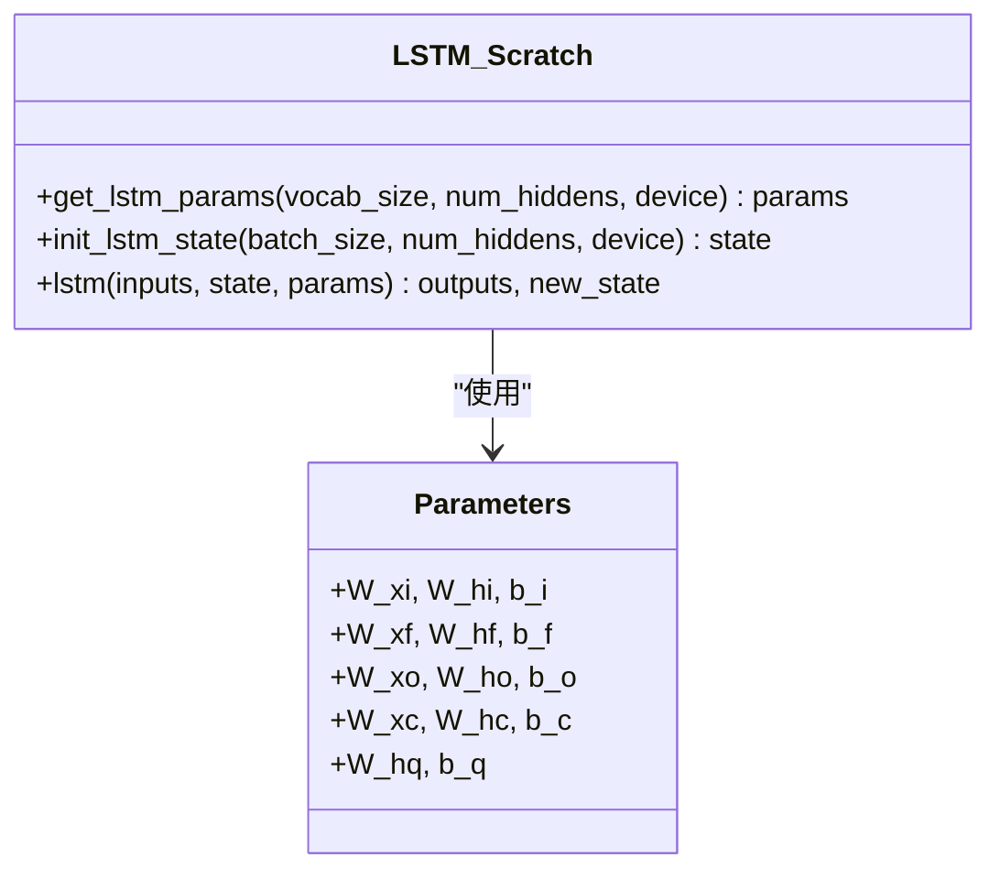
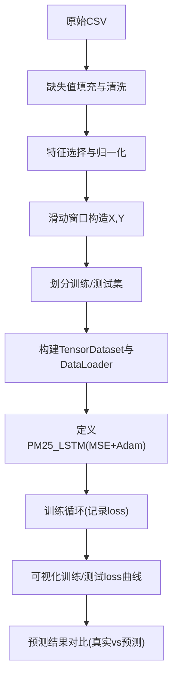
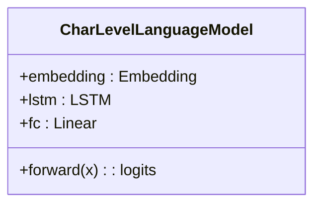
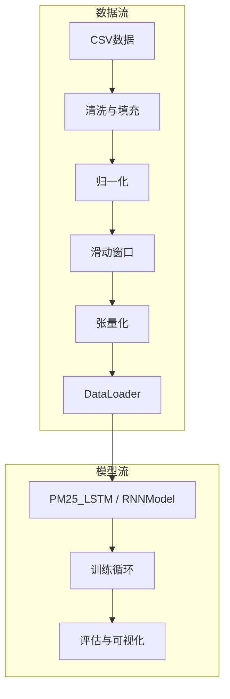

# 长短期记忆网络 (LSTM)

<cite>
**本文引用的文件**   
- [chapter_recurrent-modern/lstm.py](file://chapter_recurrent-modern/lstm.py)
- [chapter_recurrent-neural-networks/rnn-scratch.ipynb](file://chapter_recurrent-neural-networks/rnn-scratch.ipynb)
- [chapter_recurrent-neural-networks/rnn-concise.ipynb](file://chapter_recurrent-neural-networks/rnn-concise.ipynb)
- [chapter_natural-language-processing-applications/sentiment-analysis-rnn.ipynb](file://chapter_natural-language-processing-applications/sentiment-analysis-rnn.ipynb)
</cite>

## 目录
1. [简介](#简介)
2. [项目结构](#项目结构)
3. [核心组件](#核心组件)
4. [架构总览](#架构总览)
5. [详细组件分析](#详细组件分析)
6. [依赖关系分析](#依赖关系分析)
7. [性能与优化](#性能与优化)
8. [故障排查指南](#故障排查指南)
9. [结论](#结论)
10. [附录](#附录)

## 简介
本文件围绕长短期记忆网络（LSTM）展开，系统讲解其门控机制、细胞状态与隐藏状态的更新规则，并基于仓库中的代码实现从零构建LSTM、使用PyTorch的nn.LSTM API进行简洁实现，以及一个时间序列预测的实际案例（北京PM2.5）。文档同时涵盖训练流程、损失函数选择、性能优化技巧，以及与传统RNN相比的优势和适用场景。

## 项目结构
本项目包含多个与循环神经网络相关的章节与示例：
- chapter_recurrent-modern/lstm.py：集中实现了“从零开始”的LSTM、简洁API调用、时间序列PM2.5预测、字符级语言模型等完整流程。
- chapter_recurrent-neural-networks/rnn-scratch.ipynb：从零实现RNN的基础框架（数据加载、参数初始化、前向传播、梯度裁剪、训练循环），为理解LSTM提供基础。
- chapter_recurrent-neural-networks/rnn-concise.ipynb：使用高级API（如nn.RNN/nn.LSTM）的简洁实现，展示如何封装模型、处理隐状态形状、训练与预测。
- chapter_natural-language-processing-applications/sentiment-analysis-rnn.ipynb：展示双向LSTM在文本分类中的应用，体现LSTM在序列建模中的常见用法。



图表来源
- [chapter_recurrent-modern/lstm.py:1-345](file://chapter_recurrent-modern/lstm.py#L1-L345)
- [chapter_recurrent-neural-networks/rnn-scratch.ipynb:1-800](file://chapter_recurrent-neural-networks/rnn-scratch.ipynb#L1-L800)
- [chapter_recurrent-neural-networks/rnn-concise.ipynb:1-800](file://chapter_recurrent-neural-networks/rnn-concise.ipynb#L1-L800)
- [chapter_natural-language-processing-applications/sentiment-analysis-rnn.ipynb:1-200](file://chapter_natural-language-processing-applications/sentiment-analysis-rnn.ipynb#L1-L200)

章节来源
- [chapter_recurrent-modern/lstm.py:1-345](file://chapter_recurrent-modern/lstm.py#L1-L345)
- [chapter_recurrent-neural-networks/rnn-scratch.ipynb:1-800](file://chapter_recurrent-neural-networks/rnn-scratch.ipynb#L1-L800)
- [chapter_recurrent-neural-networks/rnn-concise.ipynb:1-800](file://chapter_recurrent-neural-networks/rnn-concise.ipynb#L1-L800)
- [chapter_natural-language-processing-applications/sentiment-analysis-rnn.ipynb:1-200](file://chapter_natural-language-processing-applications/sentiment-analysis-rnn.ipynb#L1-L200)

## 核心组件
- 从零实现的LSTM：包括参数初始化、状态初始化、逐时间步的门控计算（输入门、遗忘门、输出门、候选记忆元）、细胞状态与隐藏状态更新、输出层映射。
- 简洁实现：使用nn.LSTM封装LSTM单元，配合线性层完成预测或分类任务。
- PM2.5时间序列预测：数据下载与清洗、特征缩放、滑动窗口构造、训练循环、评估与可视化。
- 字符级语言模型：嵌入层+LSTM+全连接层，用于生成文本。

章节来源
- [chapter_recurrent-modern/lstm.py:1-345](file://chapter_recurrent-modern/lstm.py#L1-L345)

## 架构总览
下图展示了LSTM的核心数据结构与前向计算流程，对应从零实现的关键步骤。



图表来源
- [chapter_recurrent-modern/lstm.py:51-65](file://chapter_recurrent-modern/lstm.py#L51-L65)

章节来源
- [chapter_recurrent-modern/lstm.py:20-65](file://chapter_recurrent-modern/lstm.py#L20-L65)

## 详细组件分析

### 从零实现LSTM：参数初始化、状态初始化与前向传播
- 参数初始化：为四个门（输入、遗忘、输出）及候选记忆元分别定义权重矩阵与偏置；输出层权重与偏置独立初始化。所有参数标记为可训练。
- 状态初始化：返回初始化的隐藏状态H与细胞状态C，形状为(batch_size, num_hiddens)。
- 前向传播：对每个时间步依次计算I_t、F_t、O_t、C̃_t，按公式更新C_t与H_t，并通过输出层得到Y_t。



图表来源
- [chapter_recurrent-modern/lstm.py:20-43](file://chapter_recurrent-modern/lstm.py#L20-L43)
- [chapter_recurrent-modern/lstm.py:46-65](file://chapter_recurrent-modern/lstm.py#L46-L65)

章节来源
- [chapter_recurrent-modern/lstm.py:20-65](file://chapter_recurrent-modern/lstm.py#L20-L65)

### 简洁实现：使用nn.LSTM API
- 模型封装：将nn.LSTM作为编码器，后接线性层完成回归或分类。
- 隐状态管理：对于LSTM，begin_state返回元组(H_0, C_0)，形状为(num_layers*num_directions, batch_size, hidden_size)。
- 训练循环：复用统一的训练框架，支持随机抽样或顺序分区，并进行梯度裁剪。

```mermaid
sequenceDiagram
participant Data as "数据迭代器"
participant Model as "RNNModel(nn.LSTM)"
participant Loss as "损失函数"
participant Opt as "优化器"
Data->>Model : 输入X(时间步,批量,词表大小)
Model->>Model : one_hot编码
Model->>Model : nn.LSTM前向(Y, state)
Model-->>Data : 输出logits(时间步*批量, vocab)
Data->>Loss : 计算交叉熵
Loss-->>Opt : 反向传播
Opt->>Model : 参数更新(含梯度裁剪)
```

图表来源
- [chapter_recurrent-neural-networks/rnn-concise.ipynb:206-246](file://chapter_recurrent-neural-networks/rnn-concise.ipynb#L206-L246)
- [chapter_recurrent-neural-networks/rnn-scratch.ipynb:688-778](file://chapter_recurrent-neural-networks/rnn-scratch.ipynb#L688-L778)

章节来源
- [chapter_recurrent-neural-networks/rnn-concise.ipynb:206-246](file://chapter_recurrent-neural-networks/rnn-concise.ipynb#L206-L246)
- [chapter_recurrent-neural-networks/rnn-scratch.ipynb:688-778](file://chapter_recurrent-neural-networks/rnn-scratch.ipynb#L688-L778)

### 时间序列预测：北京PM2.5数据
- 数据准备：从UCI下载CSV，缺失值填充，提取关键数值特征（pm2.5、DEWP、TEMP、PRES、Iws），使用MinMaxScaler归一化到[0,1]。
- 滑动窗口：以time_step=24构建样本X（历史窗口）与标签Y（下一时刻pm2.5）。
- 模型与训练：定义PM25_LSTM（nn.LSTM+Linear），MSE损失，Adam优化器；训练时记录train/test loss，绘制曲线与预测对比图。
- 推理：取测试集最后200小时真实值与预测值进行可视化对比。



图表来源
- [chapter_recurrent-modern/lstm.py:111-236](file://chapter_recurrent-modern/lstm.py#L111-L236)

章节来源
- [chapter_recurrent-modern/lstm.py:111-236](file://chapter_recurrent-modern/lstm.py#L111-L236)

### 字符级语言模型：嵌入+LSTM+全连接
- 构建字符级词汇表与索引映射。
- 使用Embedding将字符索引转为向量，送入LSTM，再经全连接层输出词表概率分布。
- 训练使用交叉熵损失，支持文本生成（温度采样）。



图表来源
- [chapter_recurrent-modern/lstm.py:241-253](file://chapter_recurrent-modern/lstm.py#L241-L253)

章节来源
- [chapter_recurrent-modern/lstm.py:241-327](file://chapter_recurrent-modern/lstm.py#L241-L327)

### 与传统RNN的对比与优势
- RNN存在梯度消失/爆炸问题，难以捕捉长程依赖；LSTM通过门控机制（输入门、遗忘门、输出门）与细胞状态有效缓解这些问题。
- 在序列建模中，LSTM更适合需要长期依赖的任务（如语言建模、时间序列预测、情感分析等）。

章节来源
- [chapter_recurrent-neural-networks/rnn-scratch.ipynb:545-628](file://chapter_recurrent-neural-networks/rnn-scratch.ipynb#L545-L628)
- [chapter_natural-language-processing-applications/sentiment-analysis-rnn.ipynb:75-100](file://chapter_natural-language-processing-applications/sentiment-analysis-rnn.ipynb#L75-L100)

## 依赖关系分析
- 模块耦合：lstm.py内部分为四大部分（从零实现、简洁API、PM2.5预测、字符级语言模型），彼此相对独立，便于按需运行。
- 外部依赖：torch、pandas、numpy、sklearn、matplotlib、d2l工具库。
- 数据流：原始数据→预处理→滑动窗口→张量化→DataLoader→模型训练→评估与可视化。



图表来源
- [chapter_recurrent-modern/lstm.py:111-236](file://chapter_recurrent-modern/lstm.py#L111-L236)
- [chapter_recurrent-neural-networks/rnn-concise.ipynb:206-246](file://chapter_recurrent-neural-networks/rnn-concise.ipynb#L206-L246)

章节来源
- [chapter_recurrent-modern/lstm.py:111-236](file://chapter_recurrent-modern/lstm.py#L111-L236)
- [chapter_recurrent-neural-networks/rnn-concise.ipynb:206-246](file://chapter_recurrent-neural-networks/rnn-concise.ipynb#L206-L246)

## 性能与优化
- 梯度裁剪：在长序列训练中防止梯度爆炸，提升稳定性。
- 学习率调度：根据任务选择合适的优化器（SGD/Adam）与学习率策略。
- 批大小与时间步：增大batch_size提高并行度，但需考虑显存限制；合理设置num_steps平衡上下文长度与计算开销。
- 设备选择：优先使用GPU加速训练。
- 早停与正则化：监控验证集损失，必要时引入Dropout或权重衰减。

章节来源
- [chapter_recurrent-neural-networks/rnn-scratch.ipynb:616-628](file://chapter_recurrent-neural-networks/rnn-scratch.ipynb#L616-L628)
- [chapter_recurrent-neural-networks/rnn-scratch.ipynb:688-778](file://chapter_recurrent-neural-networks/rnn-scratch.ipynb#L688-L778)

## 故障排查指南
- 数据下载失败：检查网络连接与URL有效性，必要时本地缓存数据。
- 维度不匹配：确保输入形状符合LSTM要求（时间步在前，batch在后或设置batch_first=True）。
- 训练发散：启用梯度裁剪、降低学习率、增加正则化。
- 过拟合：增加数据量、使用Dropout、提前停止。
- 内存不足：减小batch_size或num_steps，或使用更小的hidden_size。

章节来源
- [chapter_recurrent-modern/lstm.py:111-124](file://chapter_recurrent-modern/lstm.py#L111-L124)
- [chapter_recurrent-neural-networks/rnn-scratch.ipynb:616-628](file://chapter_recurrent-neural-networks/rnn-scratch.ipynb#L616-L628)

## 结论
本文件系统梳理了LSTM的理论机制与工程实现，结合仓库中的代码展示了从零实现、简洁API使用以及时间序列预测的完整流程。通过合理的训练策略与优化技巧，LSTM能够有效解决长程依赖问题，并在语言建模、时间序列预测、情感分析等任务中取得良好效果。

## 附录

### LSTM数学原理与计算过程
- 输入门：I_t = σ(X_t W_xi + H_{t-1} W_hi + b_i)
- 遗忘门：F_t = σ(X_t W_xf + H_{t-1} W_hf + b_f)
- 输出门：O_t = σ(X_t W_xo + H_{t-1} W_ho + b_o)
- 候选记忆元：C̃_t = tanh(X_t W_xc + H_{t-1} W_hc + b_c)
- 细胞状态更新：C_t = F_t ⊙ C_{t-1} + I_t ⊙ C̃_t
- 隐藏状态更新：H_t = O_t ⊙ tanh(C_t)
- 输出：Y_t = H_t W_hq + b_q

章节来源
- [chapter_recurrent-modern/lstm.py:51-65](file://chapter_recurrent-modern/lstm.py#L51-L65)

### PyTorch nn.LSTM API使用要点
- 输入形状：默认(time_steps, batch, features)，可通过batch_first=True改为(batch, time_steps, features)。
- 隐状态：返回(H_n, C_n)，形状为(num_layers*num_directions, batch, hidden_size)。
- 输出：每个时间步的隐藏状态，形状为(time_steps, batch, hidden_size)或(batch, time_steps, hidden_size)。

章节来源
- [chapter_recurrent-neural-networks/rnn-concise.ipynb:206-246](file://chapter_recurrent-neural-networks/rnn-concise.ipynb#L206-L246)

### 训练流程与损失函数
- 语言模型：交叉熵损失，适合分类任务（预测下一个字符/词）。
- 时间序列预测：均方误差（MSE），适合回归任务（预测连续值）。
- 优化器：Adam常用于复杂任务，SGD适用于简单或大规模数据。

章节来源
- [chapter_recurrent-neural-networks/rnn-scratch.ipynb:755-778](file://chapter_recurrent-neural-networks/rnn-scratch.ipynb#L755-L778)
- [chapter_recurrent-modern/lstm.py:170-188](file://chapter_recurrent-modern/lstm.py#L170-L188)