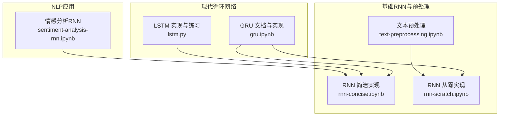
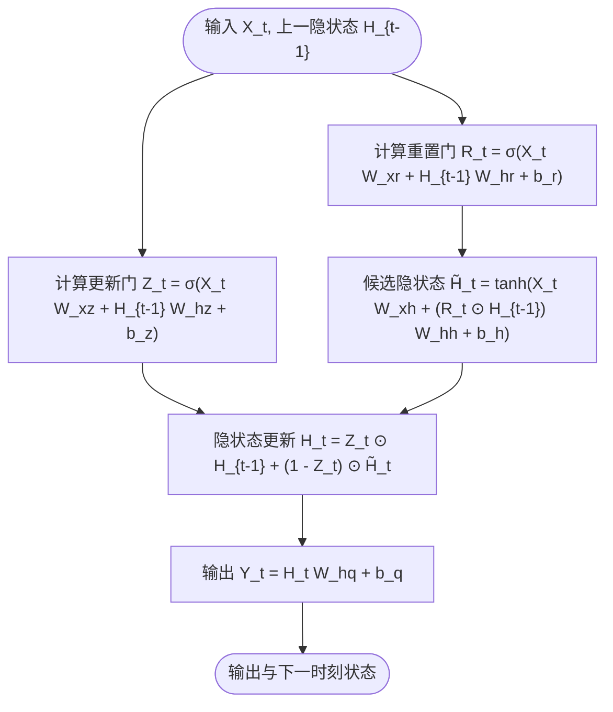
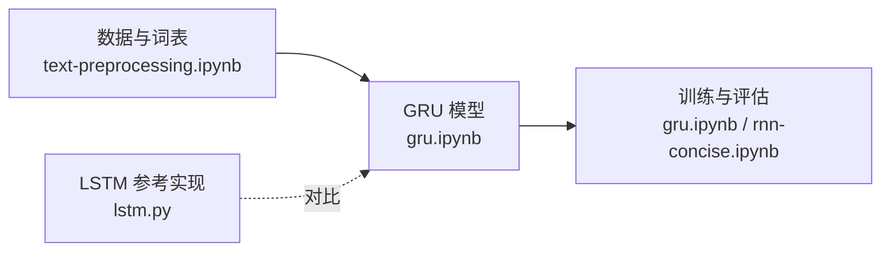
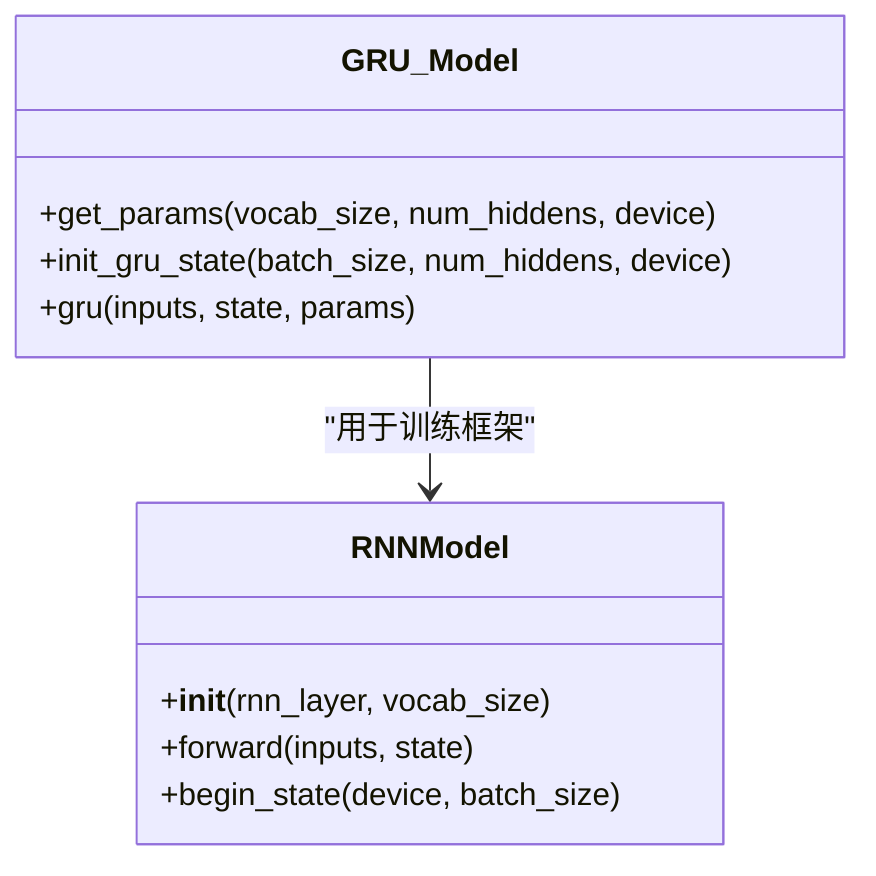
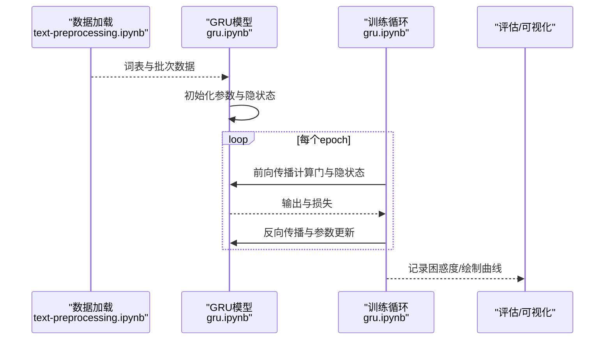

# 门控循环单元 (GRU)

<cite>
**本文引用的文件**   
- [gru.ipynb](file://chapter_recurrent-modern/gru.ipynb)
- [lstm.py](file://chapter_recurrent-modern/lstm.py)
- [rnn-concise.ipynb](file://chapter_recurrent-neural-networks/rnn-concise.ipynb)
- [rnn-scratch.ipynb](file://chapter_recurrent-neural-networks/rnn-scratch.ipynb)
- [text-preprocessing.ipynb](file://chapter_recurrent-neural-networks/text-preprocessing.ipynb)
- [sentiment-analysis-rnn.ipynb](file://chapter_natural-language-processing-applications/sentiment-analysis-rnn.ipynb)
</cite>

## 目录
1. [简介](#简介)
2. [项目结构](#项目结构)
3. [核心组件](#核心组件)
4. [架构总览](#架构总览)
5. [详细组件分析](#详细组件分析)
6. [依赖关系分析](#依赖关系分析)
7. [性能考量](#性能考量)
8. [故障排查指南](#故障排查指南)
9. [结论](#结论)
10. [附录](#附录)

## 简介
本文件围绕门控循环单元（GRU）展开，系统阐述其简化门控结构与计算原理，对比其与LSTM的架构差异与性能特点，并给出在PyTorch中的完整实现示例（数据预处理、模型定义、训练流程）。同时总结GRU在不同任务中的应用场景与调优方法，提供选择GRU而非LSTM的决策依据。

## 项目结构
仓库中与序列建模相关的核心内容分布在以下章节：
- 现代循环网络（含GRU/LSTM/Seq2Seq等）：chapter_recurrent-modern
- 基础RNN与文本预处理：chapter_recurrent-neural-networks
- NLP应用（情感分析等）：chapter_natural-language-processing-applications

图表来源
- [gru.ipynb:1-120](file://chapter_recurrent-modern/gru.ipynb#L1-L120)
- [lstm.py:1-120](file://chapter_recurrent-modern/lstm.py#L1-L120)
- [rnn-concise.ipynb:1-120](file://chapter_recurrent-neural-networks/rnn-concise.ipynb#L1-L120)
- [rnn-scratch.ipynb:1-120](file://chapter_recurrent-neural-networks/rnn-scratch.ipynb#L1-L120)
- [text-preprocessing.ipynb:1-120](file://chapter_recurrent-neural-networks/text-preprocessing.ipynb#L1-L120)
- [sentiment-analysis-rnn.ipynb:1-120](file://chapter_natural-language-processing-applications/sentiment-analysis-rnn.ipynb#L1-L120)

章节来源
- [gru.ipynb:1-120](file://chapter_recurrent-modern/gru.ipynb#L1-L120)
- [lstm.py:1-120](file://chapter_recurrent-modern/lstm.py#L1-L120)
- [rnn-concise.ipynb:1-120](file://chapter_recurrent-neural-networks/rnn-concise.ipynb#L1-L120)
- [rnn-scratch.ipynb:1-120](file://chapter_recurrent-neural-networks/rnn-scratch.ipynb#L1-L120)
- [text-preprocessing.ipynb:1-120](file://chapter_recurrent-neural-networks/text-preprocessing.ipynb#L1-L120)
- [sentiment-analysis-rnn.ipynb:1-120](file://chapter_natural-language-processing-applications/sentiment-analysis-rnn.ipynb#L1-L120)

## 核心组件
- 重置门与更新门：控制“保留多少过去信息”和“用多少候选状态替换旧状态”。
- 候选隐状态：结合当前输入与经重置门缩放后的上一时刻隐状态，得到新的候选表示。
- 隐状态更新：以更新门为权重对旧隐状态与候选隐状态进行凸组合。
- 输出层：将隐状态映射到词表或任务目标空间。

章节来源
- [gru.ipynb:57-160](file://chapter_recurrent-modern/gru.ipynb#L57-L160)

## 架构总览
下图展示GRU单时间步的计算流，包括两个门、候选状态与最终隐状态的生成过程。

图表来源
- [gru.ipynb:83-148](file://chapter_recurrent-modern/gru.ipynb#L83-L148)

章节来源
- [gru.ipynb:83-148](file://chapter_recurrent-modern/gru.ipynb#L83-L148)

## 详细组件分析

### 重置门与更新门的计算原理
- 更新门Z_t：决定多大程度上保留旧隐状态H_{t-1}；接近1时跳过当前输入的影响，利于长期依赖。
- 重置门R_t：控制上一隐状态对候选状态的贡献；接近0时“重置”历史，使候选状态主要取决于当前输入X_t。
- 两者均由全连接层+sigmoid激活得到，值域(0,1)，便于按元素凸组合。

章节来源
- [gru.ipynb:57-96](file://chapter_recurrent-modern/gru.ipynb#L57-L96)

### 候选隐状态与隐状态更新
- 候选隐状态H̃_t：使用tanh非线性，确保数值范围稳定；通过R_t对H_{t-1}进行逐元素缩放，从而选择性遗忘。
- 隐状态更新H_t：由Z_t对H_{t-1}与H̃_t进行凸组合，平衡“记忆旧信息”和“吸收新信息”。

章节来源
- [gru.ipynb:98-148](file://chapter_recurrent-modern/gru.ipynb#L98-L148)

### 从零实现与简洁实现
- 从零实现：显式初始化参数、定义init_gru_state与gru前向函数，逐时间步迭代计算。
- 简洁实现：直接调用框架提供的GRU层，封装了内部优化与内存管理，速度更快。

章节来源
- [gru.ipynb:220-360](file://chapter_recurrent-modern/gru.ipynb#L220-L360)
- [gru.ipynb:406-440](file://chapter_recurrent-modern/gru.ipynb#L406-L440)

### 与LSTM的架构差异与性能特点
- 门数量：GRU仅含更新门与重置门（2个），LSTM含输入门、遗忘门、输出门（3个）及独立细胞状态C_t。
- 状态维度：GRU仅维护单一隐状态H_t；LSTM维护(H_t, C_t)双状态，参数量与计算量更大。
- 计算效率：GRU通常比LSTM更快，因为门数更少、矩阵乘次数更低；在多数任务上可取得相近甚至更优效果。
- 适用性：GRU适合中等长度依赖与资源受限场景；LSTM在极长依赖或复杂时序建模中可能更具优势。

章节来源
- [lstm.py:20-66](file://chapter_recurrent-modern/lstm.py#L20-L66)
- [gru.ipynb:35-43](file://chapter_recurrent-modern/gru.ipynb#L35-L43)

### 数据预处理与训练流程（字符级语言模型）
- 文本读取与分词：加载语料、清洗、切分为词元或字符序列。
- 构建词表：统计唯一词元并映射为索引，处理未知词与特殊标记。
- 批次构造：将序列切分为固定长度的窗口，形成(X, Y)样本对。
- 模型训练：定义损失（交叉熵）、优化器（Adam/SGD）、训练循环与评估指标（困惑度）。

章节来源
- [text-preprocessing.ipynb:94-200](file://chapter_recurrent-neural-networks/text-preprocessing.ipynb#L94-L200)
- [rnn-scratch.ipynb:220-300](file://chapter_recurrent-neural-networks/rnn-scratch.ipynb#L220-L300)
- [gru.ipynb:188-212](file://chapter_recurrent-modern/gru.ipynb#L188-L212)

### 应用场景与调优方法
- 应用场景
  - 文本生成（字符级/词级语言模型）
  - 序列标注（命名实体识别、词性标注）
  - 情感分析（双向RNN/GRU编码序列后分类）
  - 机器翻译（作为编码器/解码器的基本单元）
- 调优要点
  - 隐藏单元数num_hiddens：影响表达能力与计算开销
  - 学习率与优化器：常用Adam，配合梯度裁剪避免爆炸
  - 批大小与序列长度：权衡吞吐与内存占用
  - 正则化：Dropout、权重衰减防止过拟合
  - 预训练嵌入：如GloVe提升小数据泛化

章节来源
- [sentiment-analysis-rnn.ipynb:75-100](file://chapter_natural-language-processing-applications/sentiment-analysis-rnn.ipynb#L75-L100)
- [rnn-concise.ipynb:206-246](file://chapter_recurrent-neural-networks/rnn-concise.ipynb#L206-L246)

### 何时选择GRU而不是LSTM
- 资源受限或需要更高吞吐：GRU参数更少、计算更快
- 依赖长度中等：GRU的更新门已能较好捕捉中长期依赖
- 快速原型验证：GRU实现简洁，易于调试与迭代
- 当任务对精度要求极高且数据充足：可考虑LSTM或Transformer

章节来源
- [gru.ipynb:35-43](file://chapter_recurrent-modern/gru.ipynb#L35-L43)

## 依赖关系分析
GRU的实现依赖于基础的RNN抽象与数据处理工具：
- 数据加载与预处理：d2l工具集提供数据集与词表构建
- 张量运算：PyTorch的线性层、激活函数、广播机制
- 训练循环：统一的train_ch8/trainer接口

图表来源
- [text-preprocessing.ipynb:94-200](file://chapter_recurrent-neural-networks/text-preprocessing.ipynb#L94-L200)
- [gru.ipynb:188-212](file://chapter_recurrent-modern/gru.ipynb#L188-L212)
- [rnn-concise.ipynb:206-246](file://chapter_recurrent-neural-networks/rnn-concise.ipynb#L206-L246)
- [lstm.py:20-66](file://chapter_recurrent-modern/lstm.py#L20-L66)

章节来源
- [text-preprocessing.ipynb:94-200](file://chapter_recurrent-neural-networks/text-preprocessing.ipynb#L94-L200)
- [gru.ipynb:188-212](file://chapter_recurrent-modern/gru.ipynb#L188-L212)
- [rnn-concise.ipynb:206-246](file://chapter_recurrent-neural-networks/rnn-concise.ipynb#L206-L246)
- [lstm.py:20-66](file://chapter_recurrent-modern/lstm.py#L20-L66)

## 性能考量
- 计算复杂度：GRU每时间步包含3次线性变换（更新门、重置门、候选状态）+1次输出层；LSTM包含4次线性变换（三门+候选）+输出层，且需维护C_t。
- 内存占用：GRU仅存储H_t；LSTM需存储(H_t, C_t)，显存占用更高。
- 训练速度：GRU通常更快，尤其在GPU上得益于更少的算子与更好的并行化。
- 精度权衡：在多数NLP任务上GRU与LSTM差距不大，但LSTM在极长依赖或复杂结构中可能略优。

章节来源
- [gru.ipynb:83-148](file://chapter_recurrent-modern/gru.ipynb#L83-L148)
- [lstm.py:20-66](file://chapter_recurrent-modern/lstm.py#L20-L66)

## 故障排查指南
- 梯度消失/爆炸
  - 使用梯度裁剪（clip_grad_norm_）
  - 合理初始化权重（正态分布或小方差）
  - 检查激活函数与归一化策略
- 过拟合
  - 增加Dropout、权重衰减
  - 使用预训练词向量（如GloVe）
  - 增大数据量或增强数据
- 训练不稳定
  - 调整学习率与优化器（Adam常优于SGD）
  - 减小批大小或序列长度
  - 监控损失曲线与困惑度

章节来源
- [rnn-scratch.ipynb:220-300](file://chapter_recurrent-neural-networks/rnn-scratch.ipynb#L220-L300)
- [sentiment-analysis-rnn.ipynb:153-161](file://chapter_natural-language-processing-applications/sentiment-analysis-rnn.ipynb#L153-L161)

## 结论
GRU以简化的双门结构有效缓解了传统RNN的梯度问题，并在保持较高精度的同时显著降低计算与参数开销。对于大多数中等长度依赖的序列任务，GRU是高效且实用的选择；而在极端长依赖或复杂建模需求下，可考虑LSTM或更现代的Transformer架构。实际工程中应结合数据规模、算力约束与任务特性综合选型。

## 附录

### GRU类图（代码层面）

图表来源
- [gru.ipynb:220-360](file://chapter_recurrent-modern/gru.ipynb#L220-L360)
- [rnn-concise.ipynb:206-246](file://chapter_recurrent-neural-networks/rnn-concise.ipynb#L206-L246)

### 训练序列图（GRU语言模型）

图表来源
- [gru.ipynb:188-212](file://chapter_recurrent-modern/gru.ipynb#L188-L212)
- [gru.ipynb:368-398](file://chapter_recurrent-modern/gru.ipynb#L368-L398)

### 情感分析应用（RNN/GRU）
- 使用预训练词向量（GloVe）表示词元
- 双向RNN/GRU编码序列，拼接首尾隐状态进行分类
- 训练时使用交叉熵损失与Adam优化器

章节来源
- [sentiment-analysis-rnn.ipynb:75-100](file://chapter_natural-language-processing-applications/sentiment-analysis-rnn.ipynb#L75-L100)
- [sentiment-analysis-rnn.ipynb:1259-1264](file://chapter_natural-language-processing-applications/sentiment-analysis-rnn.ipynb#L1259-L1264)