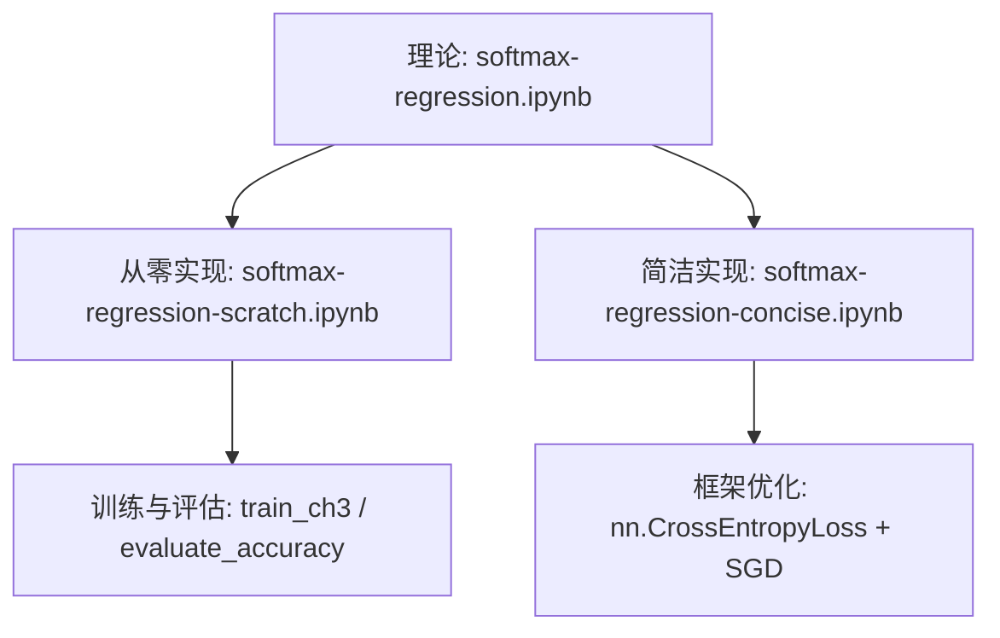
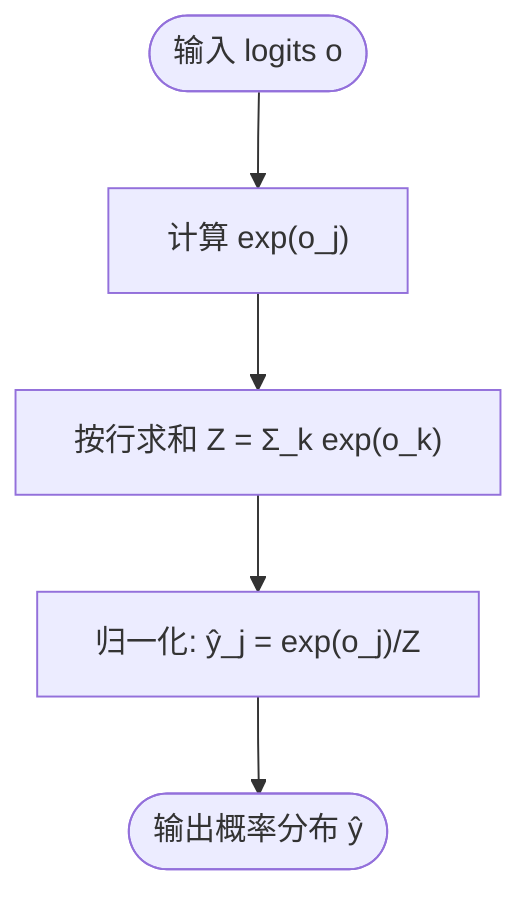
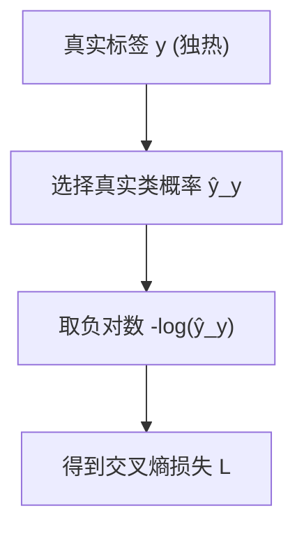
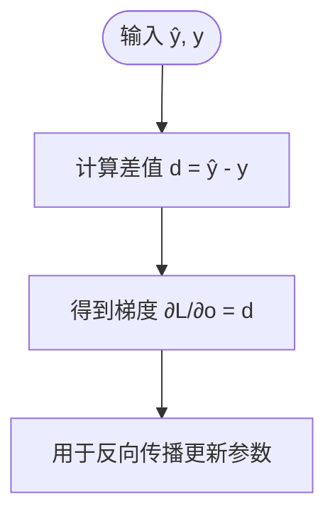
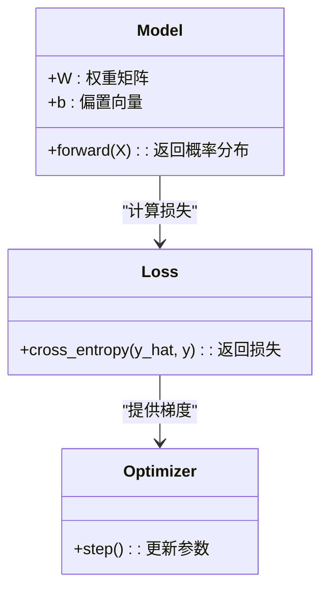
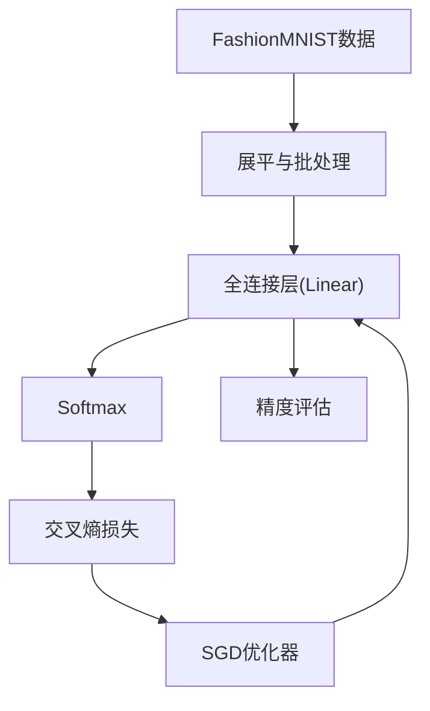
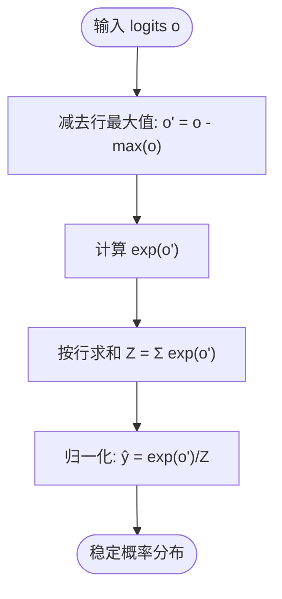
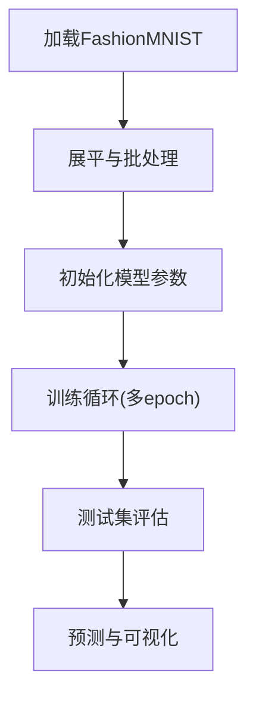

# Softmax回归

<cite>
**本文引用的文件**   
- [chapter_linear-networks/softmax-regression.ipynb](file://chapter_linear-networks/softmax-regression.ipynb)
- [chapter_linear-networks/softmax-regression-scratch.ipynb](file://chapter_linear-networks/softmax-regression-scratch.ipynb)
- [chapter_linear-networks/softmax-regression-concise.ipynb](file://chapter_linear-networks/softmax-regression-concise.ipynb)
</cite>

## 目录
1. [引言](#引言)
2. [项目结构](#项目结构)
3. [核心组件](#核心组件)
4. [架构总览](#架构总览)
5. [详细组件分析](#详细组件分析)
6. [依赖关系分析](#依赖关系分析)
7. [性能与数值稳定性](#性能与数值稳定性)
8. [故障排查指南](#故障排查指南)
9. [结论](#结论)
10. [附录：端到端流程与实战示例](#附录端到端流程与实战示例)

## 引言
本章节围绕Softmax回归展开，系统讲解其数学定义、性质、在多分类问题中的优势，以及交叉熵损失的设计原理与梯度推导。同时提供从零实现（前向传播、损失计算、反向传播）与基于PyTorch高级API的简洁实现，并给出Fashion-MNIST图像分类的完整训练与评估流程。读者将理解为何在分类任务中采用Softmax而非线性输出，以及如何通过LogSumExp技巧保证数值稳定，从而在实际工程中避免溢出与NaN。

## 项目结构
仓库中与Softmax回归相关的材料集中在“chapter_linear-networks”目录下，包含三份互补的Notebook：
- softmax-regression.ipynb：理论推导与概念讲解（Softmax、交叉熵、信息论基础、向量化的批处理）。
- softmax-regression-scratch.ipynb：从零实现（手动定义模型、损失、优化器、训练循环与可视化）。
- softmax-regression-concise.ipynb：使用PyTorch高级API的简洁实现（nn.Linear、CrossEntropyLoss、自动微分）。



**图表来源**
- [chapter_linear-networks/softmax-regression.ipynb:10-335](file://chapter_linear-networks/softmax-regression.ipynb#L10-L335)
- [chapter_linear-networks/softmax-regression-scratch.ipynb:1-1063](file://chapter_linear-networks/softmax-regression-scratch.ipynb#L1-L1063)
- [chapter_linear-networks/softmax-regression-concise.ipynb:1-1102](file://chapter_linear-networks/softmax-regression-concise.ipynb#L1-L1102)

**章节来源**
- [chapter_linear-networks/softmax-regression.ipynb:10-335](file://chapter_linear-networks/softmax-regression.ipynb#L10-L335)
- [chapter_linear-networks/softmax-regression-scratch.ipynb:1-1063](file://chapter_linear-networks/softmax-regression-scratch.ipynb#L1-L1063)
- [chapter_linear-networks/softmax-regression-concise.ipynb:1-1102](file://chapter_linear-networks/softmax-regression-concise.ipynb#L1-L1102)

## 核心组件
- 数据准备与加载：Fashion-MNIST数据集，批量大小256，输入展平为784维向量。
- 模型定义：单层全连接层（输入784，输出10），权重按正态分布初始化，偏置初始化为0。
- Softmax函数：对未规范化的预测o进行指数归一化，得到概率分布。
- 损失函数：交叉熵损失，最大化真实标签的对数似然；在简洁实现中使用框架内置的稳定版本。
- 优化算法：小批量随机梯度下降（SGD），学习率0.1。
- 训练循环：逐epoch迭代，统计训练损失与准确率，并在测试集上评估。
- 评估指标：分类精度（正确预测数/总数）。

**章节来源**
- [chapter_linear-networks/softmax-regression-scratch.ipynb:66-122](file://chapter_linear-networks/softmax-regression-scratch.ipynb#L66-L122)
- [chapter_linear-networks/softmax-regression-scratch.ipynb:227-234](file://chapter_linear-networks/softmax-regression-scratch.ipynb#L227-L234)
- [chapter_linear-networks/softmax-regression-scratch.ipynb:323-328](file://chapter_linear-networks/softmax-regression-scratch.ipynb#L323-L328)
- [chapter_linear-networks/softmax-regression-scratch.ipynb:420-424](file://chapter_linear-networks/softmax-regression-scratch.ipynb#L420-L424)
- [chapter_linear-networks/softmax-regression-scratch.ipynb:489-498](file://chapter_linear-networks/softmax-regression-scratch.ipynb#L489-L498)
- [chapter_linear-networks/softmax-regression-scratch.ipynb:728-751](file://chapter_linear-networks/softmax-regression-scratch.ipynb#L728-L751)
- [chapter_linear-networks/softmax-regression-scratch.ipynb:863-875](file://chapter_linear-networks/softmax-regression-scratch.ipynb#L863-L875)
- [chapter_linear-networks/softmax-regression-concise.ipynb:103-112](file://chapter_linear-networks/softmax-regression-concise.ipynb#L103-L112)
- [chapter_linear-networks/softmax-regression-concise.ipynb:193-195](file://chapter_linear-networks/softmax-regression-concise.ipynb#L193-L195)
- [chapter_linear-networks/softmax-regression-concise.ipynb:227-228](file://chapter_linear-networks/softmax-regression-concise.ipynb#L227-L228)

## 架构总览
Softmax回归的整体流程如下：
- 输入图像被展平为固定长度向量。
- 全连接层生成未规范化的预测logits。
- Softmax将logits转换为概率分布。
- 交叉熵损失衡量预测与真实标签的差异。
- 优化器根据梯度更新参数。
- 训练过程中持续监控损失与准确率。

```mermaid
sequenceDiagram
participant Data as "数据加载"
participant Model as "全连接层(Linear)"
participant Softmax as "Softmax"
participant Loss as "交叉熵损失"
participant Opt as "优化器(SGD)"
participant Eval as "评估(精度)"
Data->>Model : 批次X (展平后)
Model->>Softmax : logits O = XW + b
Softmax-->>Model : 概率 ŷ
Model->>Loss : 计算 L(ŷ, y)
Loss-->>Opt : 反向传播求梯度
Opt->>Model : 更新参数 W, b
Model->>Eval : 预测类别 argmax(ŷ)
Eval-->>Data : 统计准确率
```

**图表来源**
- [chapter_linear-networks/softmax-regression-scratch.ipynb:323-328](file://chapter_linear-networks/softmax-regression-scratch.ipynb#L323-L328)
- [chapter_linear-networks/softmax-regression-scratch.ipynb:420-424](file://chapter_linear-networks/softmax-regression-scratch.ipynb#L420-L424)
- [chapter_linear-networks/softmax-regression-scratch.ipynb:728-751](file://chapter_linear-networks/softmax-regression-scratch.ipynb#L728-L751)
- [chapter_linear-networks/softmax-regression-concise.ipynb:103-112](file://chapter_linear-networks/softmax-regression-concise.ipynb#L103-L112)
- [chapter_linear-networks/softmax-regression-concise.ipynb:193-195](file://chapter_linear-networks/softmax-regression-concise.ipynb#L193-L195)

## 详细组件分析

### 数学基础与Softmax函数
- Softmax将任意实数向量映射为非负且和为1的概率分布，保持argmax不变性，便于选择最可能类别。
- 多分类问题需要概率解释与校准，线性输出无法保证非负与归一化，因此不适合直接作为概率。
- 批处理时，Softmax按行执行，配合广播机制高效计算。



**图表来源**
- [chapter_linear-networks/softmax-regression.ipynb:132-147](file://chapter_linear-networks/softmax-regression.ipynb#L132-L147)
- [chapter_linear-networks/softmax-regression.ipynb:158-172](file://chapter_linear-networks/softmax-regression.ipynb#L158-L172)
- [chapter_linear-networks/softmax-regression-scratch.ipynb:227-234](file://chapter_linear-networks/softmax-regression-scratch.ipynb#L227-L234)

**章节来源**
- [chapter_linear-networks/softmax-regression.ipynb:132-147](file://chapter_linear-networks/softmax-regression.ipynb#L132-L147)
- [chapter_linear-networks/softmax-regression.ipynb:158-172](file://chapter_linear-networks/softmax-regression.ipynb#L158-L172)

### 交叉熵损失与信息论视角
- 交叉熵来源于最大似然估计，最小化负对数似然等价于最大化观测数据的似然。
- 对于独热编码标签，交叉熵退化为选取真实类别对应概率的负对数。
- 从信息论角度，交叉熵衡量用模型分布Q编码真实分布P所需的平均比特数，当P=Q时达到最小。



**图表来源**
- [chapter_linear-networks/softmax-regression.ipynb:193-210](file://chapter_linear-networks/softmax-regression.ipynb#L193-L210)
- [chapter_linear-networks/softmax-regression-scratch.ipynb:420-424](file://chapter_linear-networks/softmax-regression-scratch.ipynb#L420-L424)

**章节来源**
- [chapter_linear-networks/softmax-regression.ipynb:193-210](file://chapter_linear-networks/softmax-regression.ipynb#L193-L210)
- [chapter_linear-networks/softmax-regression.ipynb:259-303](file://chapter_linear-networks/softmax-regression.ipynb#L259-L303)

### 梯度推导与反向传播
- 交叉熵对logits的导数为 ŷ - y，即预测概率与真实标签之差，形式简洁且易于实现。
- 该结果来自指数族分布的性质，使得梯度计算直观且数值稳定。



**图表来源**
- [chapter_linear-networks/softmax-regression.ipynb:224-245](file://chapter_linear-networks/softmax-regression.ipynb#L224-L245)

**章节来源**
- [chapter_linear-networks/softmax-regression.ipynb:224-245](file://chapter_linear-networks/softmax-regression.ipynb#L224-L245)

### 从零实现（前向、损失、反向）
- 前向传播：将图像展平为向量，乘以权重矩阵并加上偏置，再应用Softmax得到概率。
- 损失计算：按真实标签索引概率并取负对数，得到每个样本的损失。
- 反向传播：手动实现或借助框架自动微分计算梯度，并使用自定义或内置优化器更新参数。
- 训练循环：在每个epoch遍历数据，累计损失与准确率，并在测试集上评估。



**图表来源**
- [chapter_linear-networks/softmax-regression-scratch.ipynb:323-328](file://chapter_linear-networks/softmax-regression-scratch.ipynb#L323-L328)
- [chapter_linear-networks/softmax-regression-scratch.ipynb:420-424](file://chapter_linear-networks/softmax-regression-scratch.ipynb#L420-L424)
- [chapter_linear-networks/softmax-regression-scratch.ipynb:728-751](file://chapter_linear-networks/softmax-regression-scratch.ipynb#L728-L751)

**章节来源**
- [chapter_linear-networks/softmax-regression-scratch.ipynb:323-328](file://chapter_linear-networks/softmax-regression-scratch.ipynb#L323-L328)
- [chapter_linear-networks/softmax-regression-scratch.ipynb:420-424](file://chapter_linear-networks/softmax-regression-scratch.ipynb#L420-L424)
- [chapter_linear-networks/softmax-regression-scratch.ipynb:728-751](file://chapter_linear-networks/softmax-regression-scratch.ipynb#L728-L751)

### PyTorch简洁实现（自动微分）
- 使用nn.Sequential组合Flatten与Linear层，简化模型构建。
- 使用nn.CrossEntropyLoss，内部已集成Softmax与数值稳定的LogSumExp技巧。
- 使用torch.optim.SGD进行参数更新，自动微分负责梯度计算。

```mermaid
sequenceDiagram
participant Net as "nn.Sequential(Flatten, Linear)"
participant Loss as "nn.CrossEntropyLoss"
participant Opt as "torch.optim.SGD"
Net->>Net : 前向传播 O = XW + b
Net-->>Loss : 传入未规范化的O
Loss-->>Opt : 计算损失并反向传播
Opt->>Net : 更新参数
```

**图表来源**
- [chapter_linear-networks/softmax-regression-concise.ipynb:103-112](file://chapter_linear-networks/softmax-regression-concise.ipynb#L103-L112)
- [chapter_linear-networks/softmax-regression-concise.ipynb:193-195](file://chapter_linear-networks/softmax-regression-concise.ipynb#L193-L195)
- [chapter_linear-networks/softmax-regression-concise.ipynb:227-228](file://chapter_linear-networks/softmax-regression-concise.ipynb#L227-L228)

**章节来源**
- [chapter_linear-networks/softmax-regression-concise.ipynb:103-112](file://chapter_linear-networks/softmax-regression-concise.ipynb#L103-L112)
- [chapter_linear-networks/softmax-regression-concise.ipynb:193-195](file://chapter_linear-networks/softmax-regression-concise.ipynb#L193-L195)
- [chapter_linear-networks/softmax-regression-concise.ipynb:227-228](file://chapter_linear-networks/softmax-regression-concise.ipynb#L227-L228)

## 依赖关系分析
- 数据依赖：Fashion-MNIST数据集，批量大小256，输入展平为784维。
- 模型依赖：全连接层权重与偏置，需合理初始化。
- 损失依赖：交叉熵损失要求概率分布与独热标签一致。
- 优化依赖：SGD学习率影响收敛速度与稳定性。
- 工具依赖：Accumulator用于累加指标，Animator用于可视化训练曲线。



**图表来源**
- [chapter_linear-networks/softmax-regression-scratch.ipynb:66-122](file://chapter_linear-networks/softmax-regression-scratch.ipynb#L66-L122)
- [chapter_linear-networks/softmax-regression-scratch.ipynb:626-639](file://chapter_linear-networks/softmax-regression-scratch.ipynb#L626-L639)
- [chapter_linear-networks/softmax-regression-scratch.ipynb:786-825](file://chapter_linear-networks/softmax-regression-scratch.ipynb#L786-L825)

**章节来源**
- [chapter_linear-networks/softmax-regression-scratch.ipynb:66-122](file://chapter_linear-networks/softmax-regression-scratch.ipynb#L66-L122)
- [chapter_linear-networks/softmax-regression-scratch.ipynb:626-639](file://chapter_linear-networks/softmax-regression-scratch.ipynb#L626-L639)
- [chapter_linear-networks/softmax-regression-scratch.ipynb:786-825](file://chapter_linear-networks/softmax-regression-scratch.ipynb#L786-L825)

## 性能与数值稳定性
- 直接实现Softmax可能在极端值下出现溢出或下溢，导致NaN。
- 解决方案：LogSumExp技巧，先减去每行的最大值再进行指数运算，保证数值稳定。
- 简洁实现直接使用框架内置的CrossEntropyLoss，内部已集成稳定计算。



**图表来源**
- [chapter_linear-networks/softmax-regression-concise.ipynb:121-173](file://chapter_linear-networks/softmax-regression-concise.ipynb#L121-L173)

**章节来源**
- [chapter_linear-networks/softmax-regression-concise.ipynb:121-173](file://chapter_linear-networks/softmax-regression-concise.ipynb#L121-L173)

## 故障排查指南
- 训练不收敛：检查学习率是否过大或过小，确认数据预处理是否正确（如展平、归一化）。
- 出现NaN：检查Softmax实现是否包含数值稳定技巧，或使用框架内置损失函数。
- 精度低：增加训练轮数、调整超参数、检查数据质量与标签一致性。
- 内存不足：减小批量大小或输入维度。

**章节来源**
- [chapter_linear-networks/softmax-regression-scratch.ipynb:863-875](file://chapter_linear-networks/softmax-regression-scratch.ipynb#L863-L875)
- [chapter_linear-networks/softmax-regression-concise.ipynb:121-173](file://chapter_linear-networks/softmax-regression-concise.ipynb#L121-L173)

## 结论
Softmax回归为多分类问题提供了清晰、可微且数值稳定的建模方式。通过交叉熵损失与梯度推导，模型能够高效学习特征到类别的映射。从零实现有助于深入理解底层机制，而PyTorch简洁实现则提升了开发效率与工程可靠性。结合Fashion-MNIST等实际数据集，可以验证方法的有效性与泛化能力。

## 附录：端到端流程与实战示例
- 数据准备：加载Fashion-MNIST，设置批量大小，展平图像为784维向量。
- 模型定义：全连接层（784→10），权重正态初始化，偏置为零。
- 损失与优化：交叉熵损失，SGD优化器，学习率0.1。
- 训练循环：多epoch迭代，统计损失与准确率，可视化训练过程。
- 评估与预测：在测试集上计算精度，展示预测结果与实际标签对比。



**图表来源**
- [chapter_linear-networks/softmax-regression-scratch.ipynb:66-122](file://chapter_linear-networks/softmax-regression-scratch.ipynb#L66-L122)
- [chapter_linear-networks/softmax-regression-scratch.ipynb:863-875](file://chapter_linear-networks/softmax-regression-scratch.ipynb#L863-L875)
- [chapter_linear-networks/softmax-regression-scratch.ipynb:985-996](file://chapter_linear-networks/softmax-regression-scratch.ipynb#L985-L996)

**章节来源**
- [chapter_linear-networks/softmax-regression-scratch.ipynb:66-122](file://chapter_linear-networks/softmax-regression-scratch.ipynb#L66-L122)
- [chapter_linear-networks/softmax-regression-scratch.ipynb:863-875](file://chapter_linear-networks/softmax-regression-scratch.ipynb#L863-L875)
- [chapter_linear-networks/softmax-regression-scratch.ipynb:985-996](file://chapter_linear-networks/softmax-regression-scratch.ipynb#L985-L996)