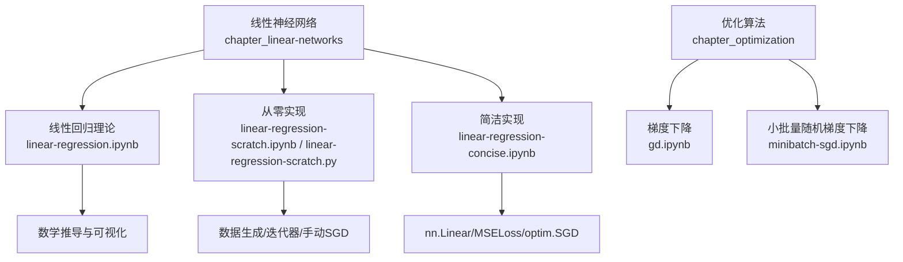
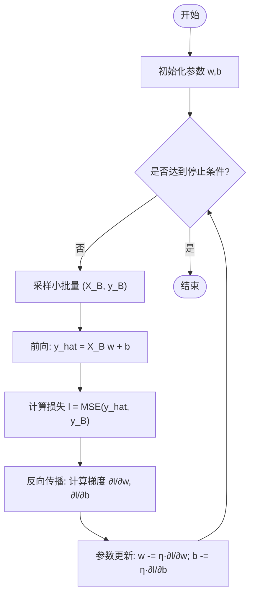
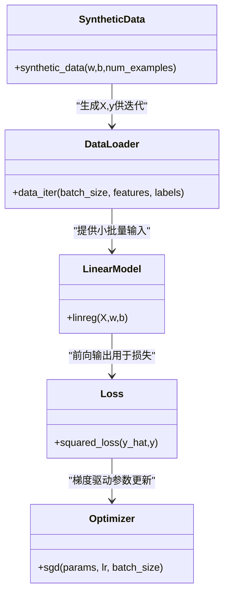

# 线性回归

<cite>
**本文引用的文件**   
- [chapter_linear-networks/linear-regression.ipynb](file://chapter_linear-networks/linear-regression.ipynb)
- [chapter_linear-networks/linear-regression-scratch.ipynb](file://chapter_linear-networks/linear-regression-scratch.ipynb)
- [chapter_linear-networks/linear-regression-concise.ipynb](file://chapter_linear-networks/linear-regression-concise.ipynb)
- [chapter_linear-networks/linear-regression-scratch.py](file://chapter_linear-networks/linear-regression-scratch.py)
- [chapter_optimization/gd.ipynb](file://chapter_optimization/gd.ipynb)
- [chapter_optimization/minibatch-sgd.ipynb](file://chapter_optimization/minibatch-sgd.ipynb)
</cite>

## 目录
1. [引言](#引言)
2. [项目结构](#项目结构)
3. [核心组件](#核心组件)
4. [架构总览](#架构总览)
5. [详细组件分析](#详细组件分析)
6. [依赖关系分析](#依赖关系分析)
7. [性能与实现要点](#性能与实现要点)
8. [超参数调优指南](#超参数调优指南)
9. [实战案例：房价预测](#实战案例房价预测)
10. [故障排查](#故障排查)
11. [结论](#结论)

## 引言
本章节围绕线性回归展开，系统讲解其数学原理（假设函数、损失函数与梯度下降推导）、从零实现与基于PyTorch API的简洁实现对比，并给出数据预处理、训练、评估与可视化的完整流程。同时提供学习率、批量大小等超参数的调优建议，以及一个实际数据集应用示例（房价预测）。

## 项目结构
线性回归相关内容主要位于“线性神经网络”章节，包含理论讲解、从零实现与框架API实现三个部分；优化算法在“优化”章节中补充了梯度下降与小批量随机梯度下降的原理与实践。



图表来源
- [chapter_linear-networks/index.ipynb:1-40](file://chapter_linear-networks/index.ipynb#L1-L40)
- [chapter_linear-networks/linear-regression.ipynb:1-230](file://chapter_linear-networks/linear-regression.ipynb#L1-L230)
- [chapter_linear-networks/linear-regression-scratch.ipynb:1-120](file://chapter_linear-networks/linear-regression-scratch.ipynb#L1-L120)
- [chapter_linear-networks/linear-regression-concise.ipynb:1-120](file://chapter_linear-networks/linear-regression-concise.ipynb#L1-L120)
- [chapter_optimization/gd.ipynb:1-60](file://chapter_optimization/gd.ipynb#L1-L60)
- [chapter_optimization/minibatch-sgd.ipynb:1-64](file://chapter_optimization/minibatch-sgd.ipynb#L1-L64)

章节来源
- [chapter_linear-networks/index.ipynb:1-40](file://chapter_linear-networks/index.ipynb#L1-L40)

## 核心组件
- 假设函数：线性模型 y_hat = w^T x + b
- 损失函数：均方误差（MSE）
- 优化方法：小批量随机梯度下降（Mini-batch SGD）
- 数据流水线：合成数据或真实数据集、批处理迭代器
- 训练循环：前向传播、反向传播、参数更新、指标记录与可视化

章节来源
- [chapter_linear-networks/linear-regression.ipynb:47-100](file://chapter_linear-networks/linear-regression.ipynb#L47-L100)
- [chapter_linear-networks/linear-regression.ipynb:113-144](file://chapter_linear-networks/linear-regression.ipynb#L113-L144)
- [chapter_linear-networks/linear-regression.ipynb:160-202](file://chapter_linear-networks/linear-regression.ipynb#L160-L202)

## 架构总览
下图展示了从数据到模型再到优化的端到端流程，涵盖从零实现与框架API两种路径。

```mermaid
sequenceDiagram
participant Data as "数据源"
participant Loader as "数据加载器"
participant Model as "线性模型"
participant Loss as "损失函数"
participant Opt as "优化器/手动更新"
participant Eval as "评估/可视化"
Data->>Loader : 生成/读取特征X与标签y
loop 每个epoch
Loader-->>Model : 小批量(X_batch, y_batch)
Model->>Loss : 前向计算 y_hat
Loss-->>Opt : 计算损失 l
Opt->>Model : 反向传播求梯度
Opt->>Model : 更新参数(w,b)
Model-->>Eval : 记录loss/绘制拟合曲线
end
```

图表来源
- [chapter_linear-networks/linear-regression-scratch.ipynb:92-124](file://chapter_linear-networks/linear-regression-scratch.ipynb#L92-L124)
- [chapter_linear-networks/linear-regression-concise.ipynb:109-136](file://chapter_linear-networks/linear-regression-concise.ipynb#L109-L136)
- [chapter_linear-networks/linear-regression-concise.ipynb:260-331](file://chapter_linear-networks/linear-regression-concise.ipynb#L260-L331)
- [chapter_linear-networks/linear-regression-concise.ipynb:387-436](file://chapter_linear-networks/linear-regression-concise.ipynb#L387-L436)
- [chapter_linear-networks/linear-regression-concise.ipynb:491-501](file://chapter_linear-networks/linear-regression-concise.ipynb#L491-L501)

## 详细组件分析

### 数学原理与推导
- 假设函数：y_hat = w^T x + b，向量形式便于批量计算与广播。
- 损失函数：均方误差 L(w,b) = (1/n) Σ (y_hat^(i) - y^(i))^2 / 2，常数1/2便于导数简化。
- 解析解：当可逆时，w* = (X^T X)^{-1} X^T y，但深度学习更常用迭代优化。
- 梯度下降更新：对每个小批量B，按负梯度方向更新参数，步长为学习率η。



图表来源
- [chapter_linear-networks/linear-regression.ipynb:113-144](file://chapter_linear-networks/linear-regression.ipynb#L113-L144)
- [chapter_linear-networks/linear-regression.ipynb:160-202](file://chapter_linear-networks/linear-regression.ipynb#L160-L202)
- [chapter_optimization/gd.ipynb:10-56](file://chapter_optimization/gd.ipynb#L10-L56)

章节来源
- [chapter_linear-networks/linear-regression.ipynb:47-100](file://chapter_linear-networks/linear-regression.ipynb#L47-L100)
- [chapter_linear-networks/linear-regression.ipynb:113-144](file://chapter_linear-networks/linear-regression.ipynb#L113-L144)
- [chapter_linear-networks/linear-regression.ipynb:160-202](file://chapter_linear-networks/linear-regression.ipynb#L160-L202)
- [chapter_optimization/gd.ipynb:10-56](file://chapter_optimization/gd.ipynb#L10-L56)

### 从零实现（手动梯度与参数更新）
- 数据生成：y = Xw + b + ε，ε为高斯噪声。
- 数据迭代：随机打乱索引，按batch_size切片。
- 模型与损失：矩阵乘法实现线性层；平方误差/2作为损失。
- 优化：手动计算梯度并更新参数（no_grad上下文避免被追踪）。



图表来源
- [chapter_linear-networks/linear-regression-scratch.ipynb:92-124](file://chapter_linear-networks/linear-regression-scratch.ipynb#L92-L124)
- [chapter_linear-networks/linear-regression-scratch.py:16-52](file://chapter_linear-networks/linear-regression-scratch.py#L16-L52)

章节来源
- [chapter_linear-networks/linear-regression-scratch.ipynb:92-124](file://chapter_linear-networks/linear-regression-scratch.ipynb#L92-L124)
- [chapter_linear-networks/linear-regression-scratch.py:16-52](file://chapter_linear-networks/linear-regression-scratch.py#L16-L52)

### 使用PyTorch API的简洁实现
- 数据：TensorDataset + DataLoader构建迭代器。
- 模型：nn.Sequential + nn.Linear(输入维度, 输出维度)。
- 损失：nn.MSELoss()。
- 优化：torch.optim.SGD(net.parameters(), lr=...)。
- 训练循环：前向→loss→zero_grad→backward→step。

```mermaid
sequenceDiagram
participant DL as "数据加载器"
participant Net as "nn.Linear"
participant Loss as "MSELoss"
participant Opt as "SGD"
loop epoch
DL-->>Net : 小批量(X,y)
Net->>Loss : y_hat = Net(X)
Loss-->>Opt : l = Loss(y_hat, y)
Opt->>Net : zero_grad()
Opt->>Net : backward()
Opt->>Net : step()
end
```

图表来源
- [chapter_linear-networks/linear-regression-concise.ipynb:109-136](file://chapter_linear-networks/linear-regression-concise.ipynb#L109-L136)
- [chapter_linear-networks/linear-regression-concise.ipynb:260-331](file://chapter_linear-networks/linear-regression-concise.ipynb#L260-L331)
- [chapter_linear-networks/linear-regression-concise.ipynb:387-436](file://chapter_linear-networks/linear-regression-concise.ipynb#L387-L436)
- [chapter_linear-networks/linear-regression-concise.ipynb:491-501](file://chapter_linear-networks/linear-regression-concise.ipynb#L491-L501)

章节来源
- [chapter_linear-networks/linear-regression-concise.ipynb:109-136](file://chapter_linear-networks/linear-regression-concise.ipynb#L109-L136)
- [chapter_linear-networks/linear-regression-concise.ipynb:260-331](file://chapter_linear-networks/linear-regression-concise.ipynb#L260-L331)
- [chapter_linear-networks/linear-regression-concise.ipynb:387-436](file://chapter_linear-networks/linear-regression-concise.ipynb#L387-L436)
- [chapter_linear-networks/linear-regression-concise.ipynb:491-501](file://chapter_linear-networks/linear-regression-concise.ipynb#L491-L501)

### 矢量化与性能
- 使用张量运算替代Python for循环，显著提升速度。
- 小批量设计充分利用CPU/GPU缓存与并行能力。

章节来源
- [chapter_linear-networks/linear-regression.ipynb:225-230](file://chapter_linear-networks/linear-regression.ipynb#L225-L230)
- [chapter_optimization/minibatch-sgd.ipynb:1-64](file://chapter_optimization/minibatch-sgd.ipynb#L1-L64)

## 依赖关系分析
- 模块内依赖：数据生成→数据迭代→模型前向→损失→优化更新。
- 外部库依赖：torch、numpy、matplotlib（可视化），可选d2l工具集。
- 无循环依赖，层次清晰。


图表来源
- [chapter_linear-networks/linear-regression-scratch.py:16-52](file://chapter_linear-networks/linear-regression-scratch.py#L16-L52)
- [chapter_linear-networks/linear-regression-concise.ipynb:109-136](file://chapter_linear-networks/linear-regression-concise.ipynb#L109-L136)

章节来源
- [chapter_linear-networks/linear-regression-scratch.py:16-52](file://chapter_linear-networks/linear-regression-scratch.py#L16-L52)
- [chapter_linear-networks/linear-regression-concise.ipynb:109-136](file://chapter_linear-networks/linear-regression-concise.ipynb#L109-L136)

## 性能与实现要点
- 优先使用张量运算与内置迭代器，避免逐元素Python循环。
- 合理设置batch_size以平衡内存占用与计算效率。
- 使用自动微分减少手工求导错误，提升开发效率。
- 监控训练损失收敛情况，必要时调整学习率或批次大小。

章节来源
- [chapter_linear-networks/linear-regression.ipynb:225-230](file://chapter_linear-networks/linear-regression.ipynb#L225-L230)
- [chapter_optimization/minibatch-sgd.ipynb:1-64](file://chapter_optimization/minibatch-sgd.ipynb#L1-L64)

## 超参数调优指南
- 学习率η：过大导致发散，过小收敛慢；可从0.01~0.1范围尝试，结合损失曲线观察。
- 批量大小：较小批次引入噪声有助于跳出局部极小，较大批次更稳定但内存占用大。
- 训练轮数epochs：根据损失收敛趋势决定，避免过拟合。
- 正则化：若出现欠拟合/过拟合，可考虑权重衰减或增加数据。

章节来源
- [chapter_linear-networks/linear-regression.ipynb:160-202](file://chapter_linear-networks/linear-regression.ipynb#L160-L202)
- [chapter_linear-networks/linear-regression-concise.ipynb:491-501](file://chapter_linear-networks/linear-regression-concise.ipynb#L491-L501)

## 实战案例：房价预测
- 数据准备：收集房屋面积、房龄等特征与价格标签，进行缺失值处理与标准化。
- 划分数据集：训练集/验证集/测试集比例常见为7:2:1。
- 模型训练：使用线性回归拟合，记录训练与验证损失。
- 评估指标：MSE、MAE、R²等。
- 可视化：散点图展示拟合直线，损失曲线展示收敛过程。
- 部署：保存模型参数，用于新样本预测。

章节来源
- [chapter_linear-networks/linear-regression.ipynb:13-42](file://chapter_linear-networks/linear-regression.ipynb#L13-L42)

## 故障排查
- 损失不降或发散：检查学习率是否过大；确认数据未异常缩放；核对梯度方向。
- 训练缓慢：确认使用张量运算而非Python循环；增大batch_size或使用GPU。
- 结果偏差：检查数据清洗与标准化步骤；确认标签与特征对齐。
- 代码报错：确保requires_grad正确设置；注意backward前的zero_grad。

章节来源
- [chapter_linear-networks/linear-regression-scratch.py:76-99](file://chapter_linear-networks/linear-regression-scratch.py#L76-L99)
- [chapter_linear-networks/linear-regression-concise.ipynb:491-501](file://chapter_linear-networks/linear-regression-concise.ipynb#L491-L501)

## 结论
线性回归是理解机器学习与深度学习的基石。通过数学推导掌握假设函数、损失函数与梯度下降的核心思想，再结合从零实现与框架API两种路径，既能深入理解底层机制，又能高效完成工程实践。配合合理的超参数调优与可视化评估，可在房价预测等实际问题中获得稳健的基线模型。