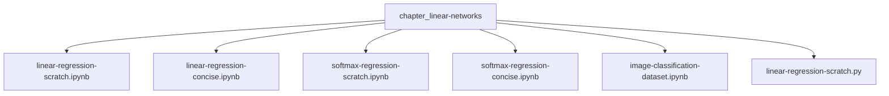
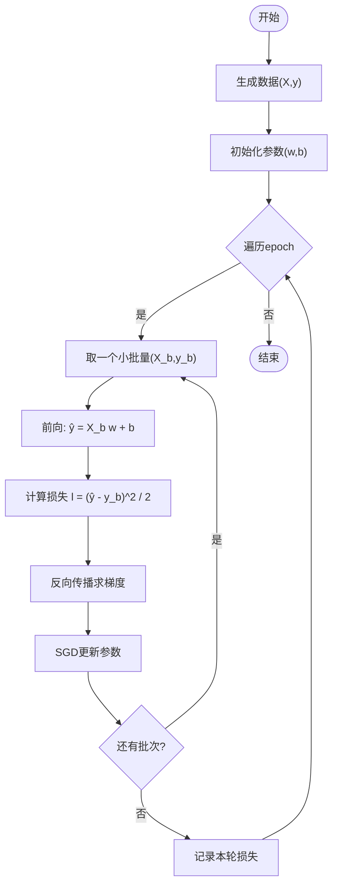
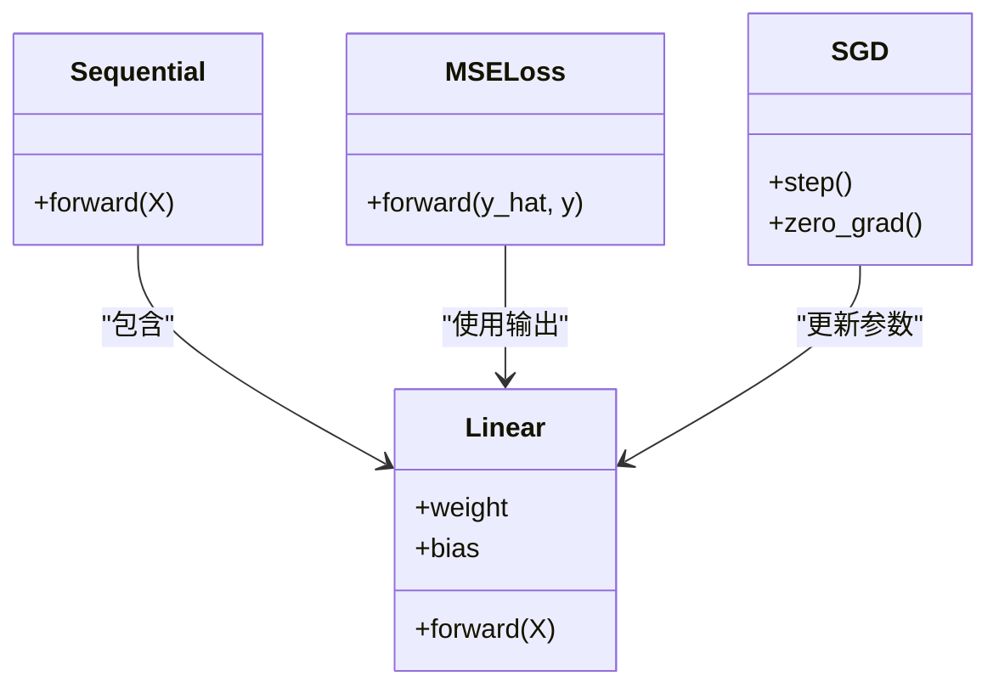
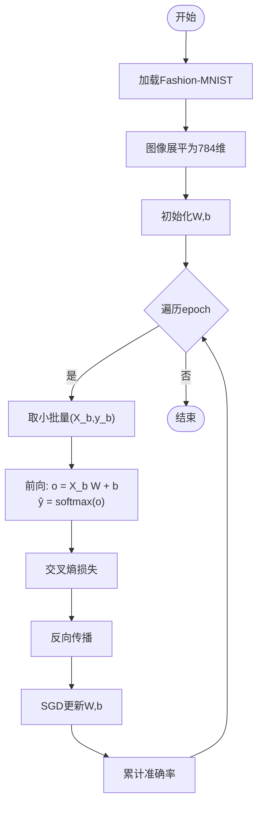
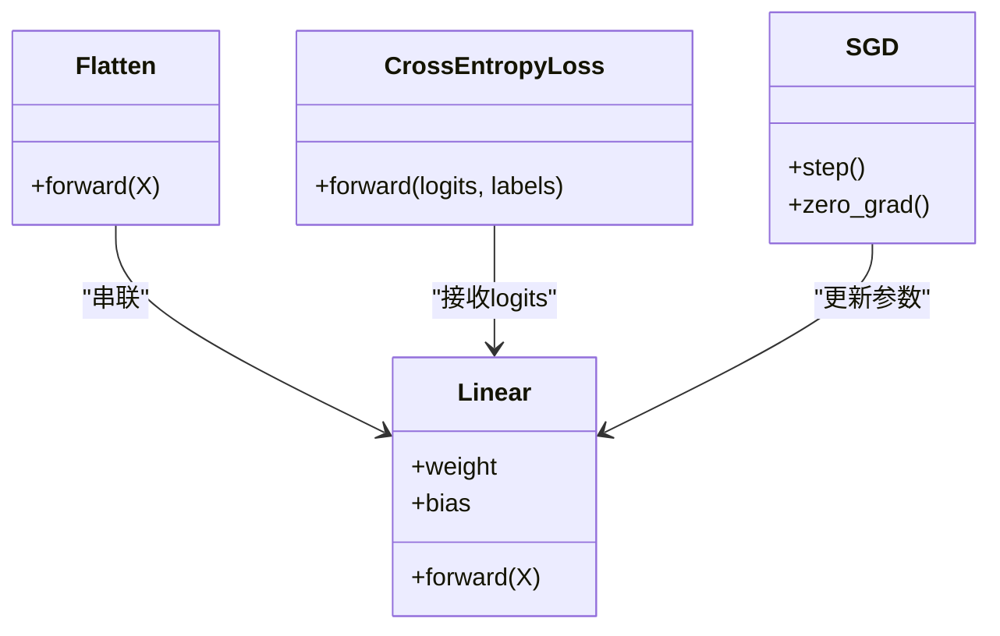
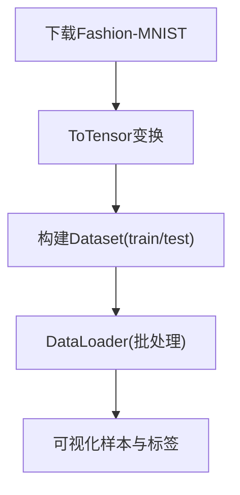
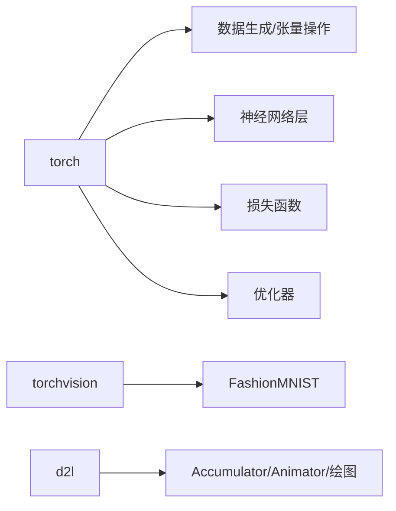
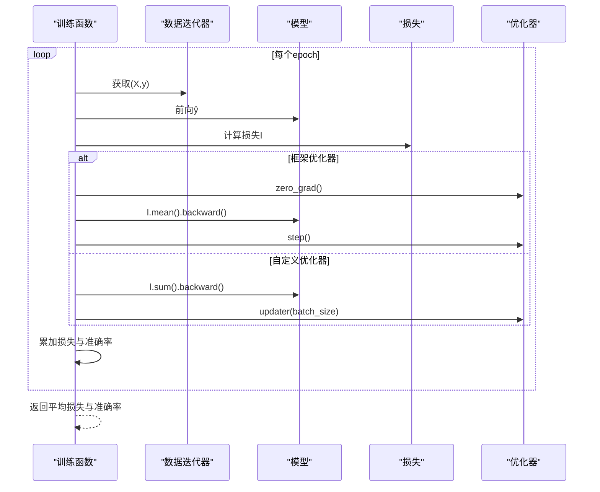

# 线性模型

<cite>
**本文引用的文件**   
- [chapter_linear-networks/linear-regression-scratch.ipynb](file://chapter_linear-networks/linear-regression-scratch.ipynb)
- [chapter_linear-networks/linear-regression-concise.ipynb](file://chapter_linear-networks/linear-regression-concise.ipynb)
- [chapter_linear-networks/softmax-regression-scratch.ipynb](file://chapter_linear-networks/softmax-regression-scratch.ipynb)
- [chapter_linear-networks/softmax-regression-concise.ipynb](file://chapter_linear-networks/softmax-regression-concise.ipynb)
- [chapter_linear-networks/image-classification-dataset.ipynb](file://chapter_linear-networks/image-classification-dataset.ipynb)
- [chapter_linear-networks/linear-regression-scratch.py](file://chapter_linear-networks/linear-regression-scratch.py)
</cite>

## 目录
1. [引言](#引言)
2. [项目结构](#项目结构)
3. [核心组件](#核心组件)
4. [架构总览](#架构总览)
5. [详细组件分析](#详细组件分析)
6. [依赖关系分析](#依赖关系分析)
7. [性能与数值稳定性](#性能与数值稳定性)
8. [训练循环、评估与可视化](#训练循环评估与可视化)
9. [从零实现 vs 框架API对比](#从零实现-vs-框架api对比)
10. [过拟合与正则化](#过拟合与正则化)
11. [故障排查指南](#故障排查指南)
12. [结论](#结论)

## 引言
本章节围绕“线性模型”展开，系统讲解线性回归与Softmax回归的原理、数学推导与工程实现。内容涵盖：
- 从零开始实现线性回归：数据生成、损失函数设计、梯度计算与参数更新
- Softmax回归用于多分类问题的完整流程：模型定义、交叉熵损失、精度评估与训练
- 图像分类数据集处理：下载、预处理、批处理与可视化
- 从零实现与PyTorch API简洁实现的对比与适用场景
- 训练循环、评估指标与可视化结果
- 常见优化技巧与过拟合现象及基础正则化方法

## 项目结构
线性模型相关内容集中在 chapter_linear-networks 目录下，包含：
- 从零实现与简洁实现两个版本的线性回归
- 从零实现与简洁实现两个版本的Softmax回归
- 图像分类数据集（Fashion-MNIST）的加载与可视化
- 线性回归的Python脚本示例



图表来源
- [chapter_linear-networks/linear-regression-scratch.ipynb:1-20](file://chapter_linear-networks/linear-regression-scratch.ipynb#L1-L20)
- [chapter_linear-networks/linear-regression-concise.ipynb:1-20](file://chapter_linear-networks/linear-regression-concise.ipynb#L1-L20)
- [chapter_linear-networks/softmax-regression-scratch.ipynb:1-20](file://chapter_linear-networks/softmax-regression-scratch.ipynb#L1-L20)
- [chapter_linear-networks/softmax-regression-concise.ipynb:1-20](file://chapter_linear-networks/softmax-regression-concise.ipynb#L1-L20)
- [chapter_linear-networks/image-classification-dataset.ipynb:1-20](file://chapter_linear-networks/image-classification-dataset.ipynb#L1-L20)
- [chapter_linear-networks/linear-regression-scratch.py:1-20](file://chapter_linear-networks/linear-regression-scratch.py#L1-L20)

章节来源
- [chapter_linear-networks/linear-regression-scratch.ipynb:1-20](file://chapter_linear-networks/linear-regression-scratch.ipynb#L1-L20)
- [chapter_linear-networks/linear-regression-concise.ipynb:1-20](file://chapter_linear-networks/linear-regression-concise.ipynb#L1-L20)
- [chapter_linear-networks/softmax-regression-scratch.ipynb:1-20](file://chapter_linear-networks/softmax-regression-scratch.ipynb#L1-L20)
- [chapter_linear-networks/softmax-regression-concise.ipynb:1-20](file://chapter_linear-networks/softmax-regression-concise.ipynb#L1-L20)
- [chapter_linear-networks/image-classification-dataset.ipynb:1-20](file://chapter_linear-networks/image-classification-dataset.ipynb#L1-L20)
- [chapter_linear-networks/linear-regression-scratch.py:1-20](file://chapter_linear-networks/linear-regression-scratch.py#L1-L20)

## 核心组件
- 数据层
  - 合成数据生成：y = Xw + b + ε
  - Fashion-MNIST数据集读取与变换（ToTensor、归一化）
  - DataLoader批处理与迭代器
- 模型层
  - 线性回归：全连接层（无激活）
  - Softmax回归：全连接层 + softmax（或LogSumExp稳定实现）
- 损失与优化
  - 均方误差（MSE）
  - 交叉熵（CE）
  - 小批量随机梯度下降（SGD）
- 评估与可视化
  - 分类准确率
  - 训练曲线绘制（损失、准确率）

章节来源
- [chapter_linear-networks/linear-regression-scratch.ipynb:53-100](file://chapter_linear-networks/linear-regression-scratch.ipynb#L53-L100)
- [chapter_linear-networks/image-classification-dataset.ipynb:53-100](file://chapter_linear-networks/image-classification-dataset.ipynb#L53-L100)
- [chapter_linear-networks/softmax-regression-scratch.ipynb:79-122](file://chapter_linear-networks/softmax-regression-scratch.ipynb#L79-L122)
- [chapter_linear-networks/linear-regression-concise.ipynb:206-265](file://chapter_linear-networks/linear-regression-concise.ipynb#L206-L265)
- [chapter_linear-networks/softmax-regression-concise.ipynb:74-112](file://chapter_linear-networks/softmax-regression-concise.ipynb#L74-L112)

## 架构总览
下图展示了从数据到预测、损失、反向传播与参数更新的端到端流程，适用于线性回归与Softmax回归两类任务。

```mermaid
sequenceDiagram
participant Data as "数据层"
participant Model as "模型(线性/Softmax)"
participant Loss as "损失函数"
participant Opt as "优化器(SGD)"
participant Eval as "评估/可视化"
Data->>Model : 输入X(批)
Model-->>Loss : 预测ŷ
Loss-->>Opt : 损失l(标量)
Opt->>Model : 反向传播+参数更新
Model-->>Eval : 预测/指标
Eval-->>Data : 下一批数据
```

图表来源
- [chapter_linear-networks/linear-regression-scratch.ipynb:86-96](file://chapter_linear-networks/linear-regression-scratch.ipynb#L86-L96)
- [chapter_linear-networks/softmax-regression-scratch.ipynb:323-325](file://chapter_linear-networks/softmax-regression-scratch.ipynb#L323-L325)
- [chapter_linear-networks/linear-regression-concise.ipynb:491-500](file://chapter_linear-networks/linear-regression-concise.ipynb#L491-L500)
- [chapter_linear-networks/softmax-regression-concise.ipynb:237-241](file://chapter_linear-networks/softmax-regression-concise.ipynb#L237-L241)

## 详细组件分析

### 线性回归（从零实现）
- 数据生成
  - 使用正态分布生成特征X，按 y = Xw + b + ε 构造标签
- 模型
  - 线性映射 ŷ = Xw + b
- 损失
  - 均方误差（平方差）
- 优化
  - 小批量随机梯度下降：对每个小批量计算梯度并更新参数
- 训练循环
  - 遍历所有批次，前向→损失→反向→更新；每轮统计训练损失



图表来源
- [chapter_linear-networks/linear-regression-scratch.ipynb:92-100](file://chapter_linear-networks/linear-regression-scratch.ipynb#L92-L100)
- [chapter_linear-networks/linear-regression-scratch.ipynb:86-96](file://chapter_linear-networks/linear-regression-scratch.ipynb#L86-L96)
- [chapter_linear-networks/linear-regression-scratch.py:16-52](file://chapter_linear-networks/linear-regression-scratch.py#L16-L52)

章节来源
- [chapter_linear-networks/linear-regression-scratch.ipynb:53-100](file://chapter_linear-networks/linear-regression-scratch.ipynb#L53-L100)
- [chapter_linear-networks/linear-regression-scratch.py:16-52](file://chapter_linear-networks/linear-regression-scratch.py#L16-L52)

### 线性回归（PyTorch简洁实现）
- 数据加载
  - 使用 TensorDataset + DataLoader 构建批迭代器
- 模型
  - nn.Sequential + nn.Linear(2,1)
- 损失
  - nn.MSELoss()
- 优化
  - torch.optim.SGD(net.parameters(), lr=...)
- 训练循环
  - 标准三步：前向→loss.backward()→optimizer.step()



图表来源
- [chapter_linear-networks/linear-regression-concise.ipynb:260-265](file://chapter_linear-networks/linear-regression-concise.ipynb#L260-L265)
- [chapter_linear-networks/linear-regression-concise.ipynb:387-388](file://chapter_linear-networks/linear-regression-concise.ipynb#L387-L388)
- [chapter_linear-networks/linear-regression-concise.ipynb:435-436](file://chapter_linear-networks/linear-regression-concise.ipynb#L435-L436)

章节来源
- [chapter_linear-networks/linear-regression-concise.ipynb:84-114](file://chapter_linear-networks/linear-regression-concise.ipynb#L84-L114)
- [chapter_linear-networks/linear-regression-concise.ipynb:206-265](file://chapter_linear-networks/linear-regression-concise.ipynb#L206-L265)
- [chapter_linear-networks/linear-regression-concise.ipynb:491-500](file://chapter_linear-networks/linear-regression-concise.ipynb#L491-L500)

### Softmax回归（从零实现）
- 数据
  - Fashion-MNIST：28×28灰度图，展平为784维向量
- 模型
  - 权重W(784×10)，偏置b(1×10)；前向：ŷ = softmax(XW + b)
- 损失
  - 交叉熵：对真实类别概率取负对数
- 评估
  - 准确率：argmax(ŷ) == y 的比例
- 训练
  - 小批量SGD，累积损失与正确数



图表来源
- [chapter_linear-networks/softmax-regression-scratch.ipynb:79-122](file://chapter_linear-networks/softmax-regression-scratch.ipynb#L79-L122)
- [chapter_linear-networks/softmax-regression-scratch.ipynb:227-231](file://chapter_linear-networks/softmax-regression-scratch.ipynb#L227-L231)
- [chapter_linear-networks/softmax-regression-scratch.ipynb:420-422](file://chapter_linear-networks/softmax-regression-scratch.ipynb#L420-L422)
- [chapter_linear-networks/softmax-regression-scratch.ipynb:489-494](file://chapter_linear-networks/softmax-regression-scratch.ipynb#L489-L494)

章节来源
- [chapter_linear-networks/softmax-regression-scratch.ipynb:79-122](file://chapter_linear-networks/softmax-regression-scratch.ipynb#L79-L122)
- [chapter_linear-networks/softmax-regression-scratch.ipynb:323-325](file://chapter_linear-networks/softmax-regression-scratch.ipynb#L323-L325)
- [chapter_linear-networks/softmax-regression-scratch.ipynb:420-422](file://chapter_linear-networks/softmax-regression-scratch.ipynb#L420-L422)
- [chapter_linear-networks/softmax-regression-scratch.ipynb:489-494](file://chapter_linear-networks/softmax-regression-scratch.ipynb#L489-L494)

### Softmax回归（PyTorch简洁实现）
- 模型
  - nn.Flatten + nn.Linear(784,10)
- 损失
  - nn.CrossEntropyLoss（内部完成log_softmax，数值稳定）
- 优化
  - SGD(lr=0.1)
- 训练
  - 复用通用训练函数（支持自定义或框架优化器）



图表来源
- [chapter_linear-networks/softmax-regression-concise.ipynb:103-112](file://chapter_linear-networks/softmax-regression-concise.ipynb#L103-L112)
- [chapter_linear-networks/softmax-regression-concise.ipynb:193-194](file://chapter_linear-networks/softmax-regression-concise.ipynb#L193-L194)
- [chapter_linear-networks/softmax-regression-concise.ipynb:227-228](file://chapter_linear-networks/softmax-regression-concise.ipynb#L227-L228)

章节来源
- [chapter_linear-networks/softmax-regression-concise.ipynb:74-112](file://chapter_linear-networks/softmax-regression-concise.ipynb#L74-L112)
- [chapter_linear-networks/softmax-regression-concise.ipynb:121-174](file://chapter_linear-networks/softmax-regression-concise.ipynb#L121-L174)
- [chapter_linear-networks/softmax-regression-concise.ipynb:237-241](file://chapter_linear-networks/softmax-regression-concise.ipynb#L237-L241)

### 图像分类数据集处理流程
- 下载与读取
  - torchvision.datasets.FashionMNIST(root, train/test, transform, download)
- 预处理
  - transforms.ToTensor：PIL→浮点张量，像素值[0,1]
- 批处理
  - DataLoader(batch_size, shuffle=True/False)
- 可视化
  - 显示若干样本图像与对应文本标签



图表来源
- [chapter_linear-networks/image-classification-dataset.ipynb:76-83](file://chapter_linear-networks/image-classification-dataset.ipynb#L76-L83)
- [chapter_linear-networks/image-classification-dataset.ipynb:206-211](file://chapter_linear-networks/image-classification-dataset.ipynb#L206-L211)
- [chapter_linear-networks/image-classification-dataset.ipynb:241-258](file://chapter_linear-networks/image-classification-dataset.ipynb#L241-L258)

章节来源
- [chapter_linear-networks/image-classification-dataset.ipynb:53-100](file://chapter_linear-networks/image-classification-dataset.ipynb#L53-L100)
- [chapter_linear-networks/image-classification-dataset.ipynb:206-211](file://chapter_linear-networks/image-classification-dataset.ipynb#L206-L211)
- [chapter_linear-networks/image-classification-dataset.ipynb:241-258](file://chapter_linear-networks/image-classification-dataset.ipynb#L241-L258)

## 依赖关系分析
- 数据依赖
  - 线性回归：numpy/torch生成合成数据
  - Softmax回归：torchvision + d2l工具库加载Fashion-MNIST
- 模型依赖
  - 线性回归：nn.Linear
  - Softmax回归：nn.Flatten + nn.Linear
- 损失与优化
  - MSE、CrossEntropyLoss；SGD
- 工具
  - d2l绘图与Accumulator/Animator等辅助类



图表来源
- [chapter_linear-networks/linear-regression-concise.ipynb:48-52](file://chapter_linear-networks/linear-regression-concise.ipynb#L48-L52)
- [chapter_linear-networks/softmax-regression-concise.ipynb:39-43](file://chapter_linear-networks/softmax-regression-concise.ipynb#L39-L43)
- [chapter_linear-networks/image-classification-dataset.ipynb:36-44](file://chapter_linear-networks/image-classification-dataset.ipynb#L36-L44)

章节来源
- [chapter_linear-networks/linear-regression-concise.ipynb:48-52](file://chapter_linear-networks/linear-regression-concise.ipynb#L48-L52)
- [chapter_linear-networks/softmax-regression-concise.ipynb:39-43](file://chapter_linear-networks/softmax-regression-concise.ipynb#L39-L43)
- [chapter_linear-networks/image-classification-dataset.ipynb:36-44](file://chapter_linear-networks/image-classification-dataset.ipynb#L36-L44)

## 性能与数值稳定性
- 数值稳定性
  - Softmax直接exp可能上溢/下溢；采用LogSumExp技巧（减去最大值）保证稳定
  - 交叉熵与softmax合并计算，避免中间log/exp不稳定
- 性能优化
  - 使用框架内置损失和优化器（C++/CUDA后端）
  - 合理设置batch_size与学习率，减少内存占用与通信开销
  - 使用GPU加速（如可用）

章节来源
- [chapter_linear-networks/softmax-regression-concise.ipynb:121-174](file://chapter_linear-networks/softmax-regression-concise.ipynb#L121-L174)
- [chapter_linear-networks/softmax-regression-concise.ipynb:193-194](file://chapter_linear-networks/softmax-regression-concise.ipynb#L193-L194)

## 训练循环、评估与可视化
- 训练循环
  - 通用train_epoch_ch3：支持自定义或框架优化器，返回平均损失与准确率
- 评估指标
  - 分类准确率：argmax(预测)与真实标签比较
- 可视化
  - Animator类动态绘制训练曲线（损失、准确率）



图表来源
- [chapter_linear-networks/softmax-regression-scratch.ipynb:728-751](file://chapter_linear-networks/softmax-regression-scratch.ipynb#L728-L751)
- [chapter_linear-networks/softmax-regression-concise.ipynb:237-241](file://chapter_linear-networks/softmax-regression-concise.ipynb#L237-L241)

章节来源
- [chapter_linear-networks/softmax-regression-scratch.ipynb:728-751](file://chapter_linear-networks/softmax-regression-scratch.ipynb#L728-L751)
- [chapter_linear-networks/softmax-regression-scratch.ipynb:489-494](file://chapter_linear-networks/softmax-regression-scratch.ipynb#L489-L494)
- [chapter_linear-networks/softmax-regression-concise.ipynb:237-241](file://chapter_linear-networks/softmax-regression-concise.ipynb#L237-L241)

## 从零实现 vs 框架API对比
- 从零实现的优势
  - 深入理解数据流、梯度与参数更新细节
  - 便于自定义层、损失与优化策略
- 框架API的优势
  - 代码简洁、可维护性高
  - 高性能后端（自动微分、并行、GPU）
  - 丰富的预定义层、损失与优化器
- 适用场景
  - 教学与算法研究：从零实现有助于理解原理
  - 工程与快速原型：框架API提升效率与稳定性

章节来源
- [chapter_linear-networks/linear-regression-concise.ipynb:10-28](file://chapter_linear-networks/linear-regression-concise.ipynb#L10-L28)
- [chapter_linear-networks/linear-regression-scratch.ipynb:10-20](file://chapter_linear-networks/linear-regression-scratch.ipynb#L10-L20)

## 过拟合与正则化
- 过拟合现象
  - 训练误差低但测试误差高，模型在训练集上过强记忆噪声
- 基础正则化方法
  - L2权重衰减（权重惩罚项）
  - Dropout（训练时随机丢弃神经元）
  - 早停（验证集监控）
- 在本仓库中的体现
  - 权重衰减与Dropout在多感知机章节有专门实现与讨论，可作为线性模型的扩展手段

章节来源
- [chapter_multilayer-perceptrons/dropout.py](file://chapter_multilayer-perceptrons/dropout.py)
- [chapter_multilayer-perceptrons/weight-decay.py](file://chapter_multilayer-perceptrons/weight-decay.py)

## 故障排查指南
- 数值问题
  - Softmax/CrossEntropy出现inf/nan：检查是否使用稳定的LogSumExp实现；确保未对softmax输出再取log
- 数据形状不匹配
  - 图像未展平导致维度错误；确认Flatten或reshape到(样本数, 784)
- 训练不收敛
  - 学习率过大/过小；调整lr；检查数据是否标准化
- 内存不足
  - 减小batch_size；关闭不必要的梯度保存

章节来源
- [chapter_linear-networks/softmax-regression-concise.ipynb:121-174](file://chapter_linear-networks/softmax-regression-concise.ipynb#L121-L174)
- [chapter_linear-networks/softmax-regression-concise.ipynb:103-112](file://chapter_linear-networks/softmax-regression-concise.ipynb#L103-L112)

## 结论
本章系统梳理了线性回归与Softmax回归的理论、实现与工程要点。通过从零实现与框架API两种路径，既加深了对底层机制的理解，也掌握了高效开发实践。结合Fashion-MNIST的数据处理流程与训练评估范式，读者可以在此基础上扩展到更复杂的模型与任务。同时，数值稳定性与正则化技巧是保障训练成功的关键。