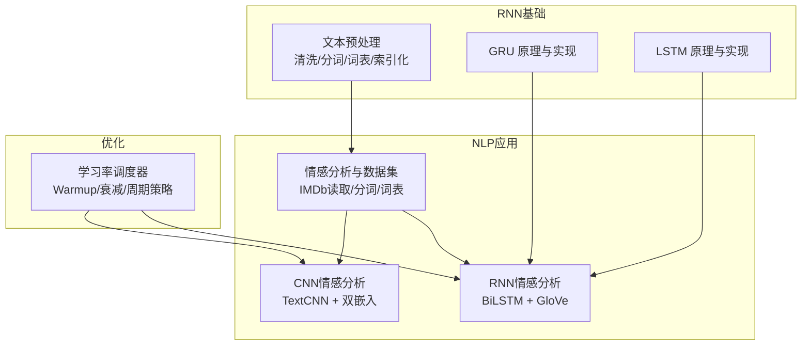
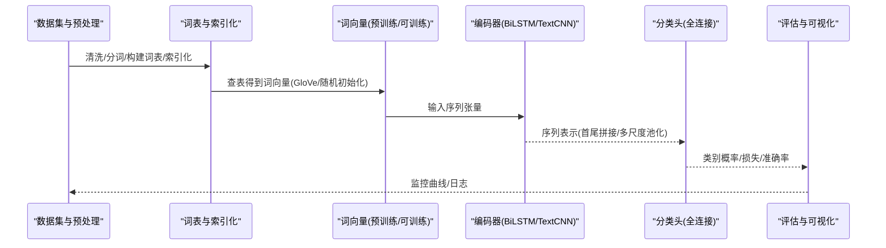
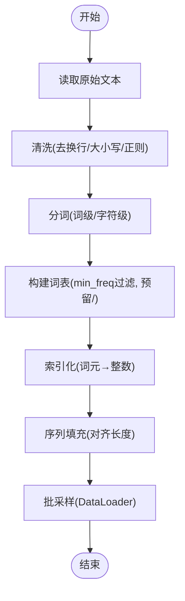
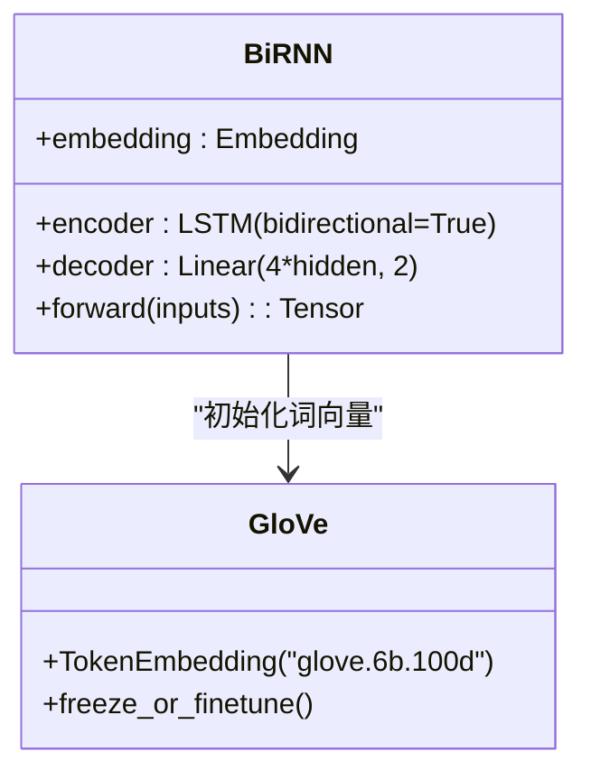
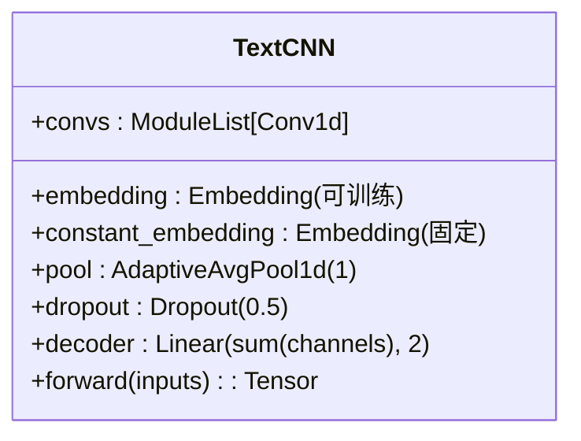
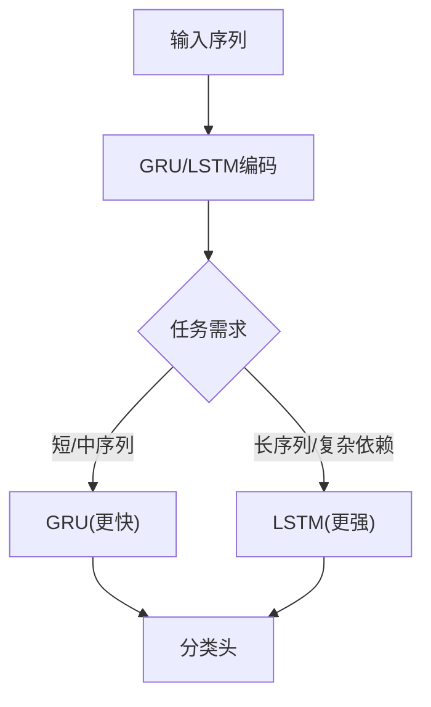
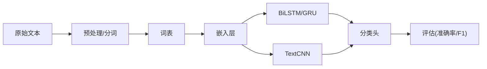

# 情感分析

<cite>
**本文引用的文件**   
- [sentiment-analysis-and-dataset.ipynb](file://chapter_natural-language-processing-applications/sentiment-analysis-and-dataset.ipynb)
- [sentiment-analysis-rnn.ipynb](file://chapter_natural-language-processing-applications/sentiment-analysis-rnn.ipynb)
- [sentiment-analysis-cnn.ipynb](file://chapter_natural-language-processing-applications/sentiment-analysis-cnn.ipynb)
- [text-preprocessing.ipynb](file://chapter_recurrent-neural-networks/text-preprocessing.ipynb)
- [gru.ipynb](file://chapter_recurrent-modern/gru.ipynb)
- [lstm.py](file://chapter_recurrent-modern/lstm.py)
- [lr-scheduler.ipynb](file://chapter_optimization/lr-scheduler.ipynb)
</cite>

## 目录
1. [简介](#简介)
2. [项目结构](#项目结构)
3. [核心组件](#核心组件)
4. [架构总览](#架构总览)
5. [详细组件分析](#详细组件分析)
6. [依赖关系分析](#依赖关系分析)
7. [性能与优化](#性能与优化)
8. [故障排查指南](#故障排查指南)
9. [结论](#结论)
10. [附录](#附录)

## 简介
本文件围绕基于循环神经网络（RNN/LSTM/GRU）与卷积神经网络（CNN）的情感分类任务，系统讲解数据预处理、模型设计、训练流程、评估指标与超参数调优策略。仓库中提供了IMDb数据集上的完整示例：双向LSTM与TextCNN两种主流方案，并配套文本预处理、词表构建、序列填充等关键步骤的实现与说明。通过对比不同架构的优缺点与适用场景，帮助读者在工程实践中做出合理选择。

## 项目结构
与情感分析直接相关的代码与示例集中在以下位置：
- 自然语言处理应用章节：情感分析与数据集、RNN/CNN实现
- 循环神经网络基础：文本预处理、GRU/LSTM原理与实现
- 优化章节：学习率调度器与训练技巧



图表来源
- [sentiment-analysis-and-dataset.ipynb:1-120](file://chapter_natural-language-processing-applications/sentiment-analysis-and-dataset.ipynb#L1-L120)
- [sentiment-analysis-rnn.ipynb:1-120](file://chapter_natural-language-processing-applications/sentiment-analysis-rnn.ipynb#L1-L120)
- [sentiment-analysis-cnn.ipynb:1-120](file://chapter_natural-language-processing-applications/sentiment-analysis-cnn.ipynb#L1-L120)
- [text-preprocessing.ipynb:1-120](file://chapter_recurrent-neural-networks/text-preprocessing.ipynb#L1-L120)
- [gru.ipynb:1-120](file://chapter_recurrent-modern/gru.ipynb#L1-L120)
- [lstm.py:1-120](file://chapter_recurrent-modern/lstm.py#L1-L120)
- [lr-scheduler.ipynb:1-120](file://chapter_optimization/lr-scheduler.ipynb#L1-L120)

章节来源
- [sentiment-analysis-and-dataset.ipynb:1-120](file://chapter_natural-language-processing-applications/sentiment-analysis-and-dataset.ipynb#L1-L120)
- [text-preprocessing.ipynb:1-120](file://chapter_recurrent-neural-networks/text-preprocessing.ipynb#L1-L120)

## 核心组件
- 数据与预处理
  - IMDb数据集读取、标签映射（正/负）、文本清洗与分词、词表构建（min_freq过滤、保留特殊符号如<pad>）、序列索引化与批量加载。
- RNN类模型
  - BiLSTM编码器：预训练GloVe词向量固定或微调；双向LSTM输出首尾隐状态拼接，经全连接层输出二分类。
- CNN类模型
  - TextCNN：可训练嵌入+固定嵌入拼接，多尺度一维卷积核并行提取局部特征，最大时间汇聚后全连接分类。
- 训练与评估
  - 损失函数（交叉熵）、准确率统计、GPU加速、学习率调度与早停策略。

章节来源
- [sentiment-analysis-and-dataset.ipynb:120-220](file://chapter_natural-language-processing-applications/sentiment-analysis-and-dataset.ipynb#L120-L220)
- [sentiment-analysis-rnn.ipynb:70-120](file://chapter_natural-language-processing-applications/sentiment-analysis-rnn.ipynb#L70-L120)
- [sentiment-analysis-cnn.ipynb:230-330](file://chapter_natural-language-processing-applications/sentiment-analysis-cnn.ipynb#L230-L330)
- [text-preprocessing.ipynb:160-270](file://chapter_recurrent-neural-networks/text-preprocessing.ipynb#L160-L270)

## 架构总览
下图展示了从原始文本到情感预测的整体流水线，以及RNN与CNN两条分支的模型结构。



图表来源
- [sentiment-analysis-and-dataset.ipynb:120-220](file://chapter_natural-language-processing-applications/sentiment-analysis-and-dataset.ipynb#L120-L220)
- [sentiment-analysis-rnn.ipynb:70-120](file://chapter_natural-language-processing-applications/sentiment-analysis-rnn.ipynb#L70-L120)
- [sentiment-analysis-cnn.ipynb:230-330](file://chapter_natural-language-processing-applications/sentiment-analysis-cnn.ipynb#L230-L330)

## 详细组件分析

### 数据预处理与序列构建
- 文本清洗：去除换行符、统一大小写、正则过滤非字母字符。
- 分词：按单词切分，支持字符级与词级两种模式。
- 词表构建：统计词频，设置最小频率阈值，预留未知词元与填充标记。
- 索引化：将词元映射为整数索引，便于嵌入查找与批处理。
- 序列填充：对变长文本进行长度对齐，保证批次内形状一致。



图表来源
- [text-preprocessing.ipynb:90-170](file://chapter_recurrent-neural-networks/text-preprocessing.ipynb#L90-L170)
- [sentiment-analysis-and-dataset.ipynb:120-220](file://chapter_natural-language-processing-applications/sentiment-analysis-and-dataset.ipynb#L120-L220)

章节来源
- [text-preprocessing.ipynb:90-170](file://chapter_recurrent-neural-networks/text-preprocessing.ipynb#L90-L170)
- [sentiment-analysis-and-dataset.ipynb:120-220](file://chapter_natural-language-processing-applications/sentiment-analysis-and-dataset.ipynb#L120-L220)

### RNN情感分析（BiLSTM）
- 嵌入层：使用预训练GloVe词向量初始化，训练时可冻结或微调。
- 编码器：双向LSTM捕获前后文依赖，取首尾时间步隐状态拼接作为序列表示。
- 分类头：全连接层输出两类得分，配合交叉熵损失训练。
- 权重初始化：线性层与LSTM权重采用Xavier均匀初始化。



图表来源
- [sentiment-analysis-rnn.ipynb:70-120](file://chapter_natural-language-processing-applications/sentiment-analysis-rnn.ipynb#L70-L120)
- [sentiment-analysis-rnn.ipynb:170-270](file://chapter_natural-language-processing-applications/sentiment-analysis-rnn.ipynb#L170-L270)

章节来源
- [sentiment-analysis-rnn.ipynb:70-120](file://chapter_natural-language-processing-applications/sentiment-analysis-rnn.ipynb#L70-L120)
- [sentiment-analysis-rnn.ipynb:170-270](file://chapter_natural-language-processing-applications/sentiment-analysis-rnn.ipynb#L170-L270)

### CNN情感分析（TextCNN）
- 双嵌入策略：一个可训练嵌入与一个固定嵌入拼接，增强表征能力。
- 多尺度卷积：多个宽度的一维卷积核并行提取n-gram局部特征。
- 最大时间汇聚：对每个通道的时间维度取最大值，得到定长向量。
- 分类头：Dropout+全连接层输出二分类结果。



图表来源
- [sentiment-analysis-cnn.ipynb:230-330](file://chapter_natural-language-processing-applications/sentiment-analysis-cnn.ipynb#L230-L330)
- [sentiment-analysis-cnn.ipynb:330-380](file://chapter_natural-language-processing-applications/sentiment-analysis-cnn.ipynb#L330-L380)

章节来源
- [sentiment-analysis-cnn.ipynb:230-330](file://chapter_natural-language-processing-applications/sentiment-analysis-cnn.ipynb#L230-L330)
- [sentiment-analysis-cnn.ipynb:330-380](file://chapter_natural-language-processing-applications/sentiment-analysis-cnn.ipynb#L330-L380)

### GRU与LSTM要点
- GRU：重置门与更新门控制信息流动，计算更高效，适合中等长度序列建模。
- LSTM：输入门、遗忘门、输出门与记忆单元，擅长长期依赖建模，但参数量更大。
- 在情感分析中，BiLSTM常优于单向RNN；GRU可作为轻量替代方案。



图表来源
- [gru.ipynb:1-120](file://chapter_recurrent-modern/gru.ipynb#L1-L120)
- [lstm.py:1-120](file://chapter_recurrent-modern/lstm.py#L1-L120)

章节来源
- [gru.ipynb:1-120](file://chapter_recurrent-modern/gru.ipynb#L1-L120)
- [lstm.py:1-120](file://chapter_recurrent-modern/lstm.py#L1-L120)

### 训练流程与评估
- 损失函数：交叉熵损失用于二分类。
- 优化器与学习率：Adam/SGD结合学习率调度（预热、指数衰减、余弦退火）。
- 评估指标：准确率、F1分数（可通过混淆矩阵计算），训练/验证集曲线监控过拟合。
- 设备与批处理：GPU加速，DataLoader批量迭代。

```mermaid
sequenceDiagram
participant Train as "训练循环"
participant Model as "模型(BiLSTM/TextCNN)"
participant Loss as "损失(CE)"
participant Opt as "优化器+调度器"
participant Eval as "评估(准确率/F1)"
Train->>Model : 前向传播
Model-->>Train : 预测logits
Train->>Loss : 计算损失
Loss-->>Opt : 反向传播梯度
Opt-->>Model : 更新参数
Train->>Eval : 计算准确率/F1
Eval-->>Train : 记录曲线/早停
```

图表来源
- [lr-scheduler.ipynb:70-120](file://chapter_optimization/lr-scheduler.ipynb#L70-L120)
- [sentiment-analysis-rnn.ipynb:270-330](file://chapter_natural-language-processing-applications/sentiment-analysis-rnn.ipynb#L270-L330)
- [sentiment-analysis-cnn.ipynb:370-420](file://chapter_natural-language-processing-applications/sentiment-analysis-cnn.ipynb#L370-L420)

章节来源
- [lr-scheduler.ipynb:70-120](file://chapter_optimization/lr-scheduler.ipynb#L70-L120)
- [sentiment-analysis-rnn.ipynb:270-330](file://chapter_natural-language-processing-applications/sentiment-analysis-rnn.ipynb#L270-L330)
- [sentiment-analysis-cnn.ipynb:370-420](file://chapter_natural-language-processing-applications/sentiment-analysis-cnn.ipynb#L370-L420)

## 依赖关系分析
- 数据流依赖：原始文本→清洗→分词→词表→索引化→嵌入→模型→分类头→评估。
- 模块耦合：
  - 预处理与词表被RNN/CNN共享。
  - 预训练词向量仅影响嵌入层，不影响后续编码器结构。
  - 训练脚本依赖优化器与调度器，评估脚本依赖混淆矩阵工具。
- 外部依赖：PyTorch、d2l工具库、GloVe词向量文件。



图表来源
- [sentiment-analysis-and-dataset.ipynb:120-220](file://chapter_natural-language-processing-applications/sentiment-analysis-and-dataset.ipynb#L120-L220)
- [sentiment-analysis-rnn.ipynb:70-120](file://chapter_natural-language-processing-applications/sentiment-analysis-rnn.ipynb#L70-L120)
- [sentiment-analysis-cnn.ipynb:230-330](file://chapter_natural-language-processing-applications/sentiment-analysis-cnn.ipynb#L230-L330)

章节来源
- [sentiment-analysis-and-dataset.ipynb:120-220](file://chapter_natural-language-processing-applications/sentiment-analysis-and-dataset.ipynb#L120-L220)
- [sentiment-analysis-rnn.ipynb:70-120](file://chapter_natural-language-processing-applications/sentiment-analysis-rnn.ipynb#L70-L120)
- [sentiment-analysis-cnn.ipynb:230-330](file://chapter_natural-language-processing-applications/sentiment-analysis-cnn.ipynb#L230-L330)

## 性能与优化
- 模型选择建议
  - BiLSTM：适合捕捉全局上下文依赖，但在长序列上训练较慢。
  - TextCNN：并行度高、训练快，擅长局部n-gram特征，适合短文本快速基线。
- 超参数调优
  - 嵌入维度、隐藏单元数、层数、卷积核尺寸与通道数、Dropout比率、学习率与调度策略。
  - 使用学习率预热与周期性调整，避免初期不稳定与后期震荡。
- 训练技巧
  - 预训练词向量冻结/微调权衡；梯度裁剪防止爆炸；早停防止过拟合；混合精度加速。
- 评估方法
  - 准确率直观但受类别不平衡影响；F1分数更稳健；绘制ROC/AUC辅助诊断。

章节来源
- [lr-scheduler.ipynb:70-120](file://chapter_optimization/lr-scheduler.ipynb#L70-L120)
- [sentiment-analysis-rnn.ipynb:270-330](file://chapter_natural-language-processing-applications/sentiment-analysis-rnn.ipynb#L270-L330)
- [sentiment-analysis-cnn.ipynb:370-420](file://chapter_natural-language-processing-applications/sentiment-analysis-cnn.ipynb#L370-L420)

## 故障排查指南
- 数据问题
  - 词表未包含<pad>导致索引越界；检查词表构建时是否预留特殊标记。
  - 序列长度不一致引发形状错误；确认填充逻辑与批处理配置。
- 模型问题
  - 嵌入维度不匹配；确保GloVe维度与模型embed_size一致。
  - 双向LSTM输出拼接维度错误；确认首尾隐状态拼接顺序与通道数。
- 训练问题
  - 损失不下降；检查学习率是否过大/过小，启用预热与衰减。
  - 过拟合；增加Dropout、正则化或减少模型容量。
- 评估问题
  - 类别不平衡导致准确率虚高；使用F1、混淆矩阵深入分析。

章节来源
- [text-preprocessing.ipynb:160-270](file://chapter_recurrent-neural-networks/text-preprocessing.ipynb#L160-L270)
- [sentiment-analysis-rnn.ipynb:70-120](file://chapter_natural-language-processing-applications/sentiment-analysis-rnn.ipynb#L70-L120)
- [sentiment-analysis-cnn.ipynb:230-330](file://chapter_natural-language-processing-applications/sentiment-analysis-cnn.ipynb#L230-L330)

## 结论
本项目提供了从数据预处理到模型训练与评估的完整情感分析流程。BiLSTM与TextCNN分别代表了序列建模与局部特征提取的两条主流路径，适用于不同场景与资源约束。通过合理的超参数调优与训练技巧，可在IMDb数据集上取得稳定且高效的性能。实际工程中建议以TextCNN为快速基线，再逐步引入BiLSTM或更复杂的Transformer方案进行对比与迭代。

## 附录
- 常用评估指标
  - 准确率：正确预测样本占比。
  - F1分数：精确率与召回率的调和平均，适用于不平衡数据。
  - 混淆矩阵：细粒度分析误分类情况。
- 最佳实践
  - 先做数据探索与分布分析，再进行模型选择。
  - 使用预训练词向量提升小数据表现。
  - 监控训练/验证曲线，及时早停与回滚。
- 常见问题解决方案
  - OOM：减小batch size、使用梯度累积或混合精度。
  - 收敛慢：调整学习率、使用更好的优化器（AdamW）。
  - 泛化差：数据增强、正则化、集成学习。