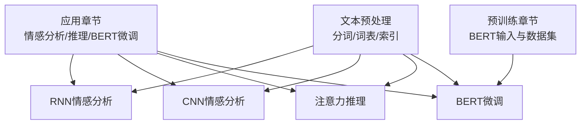
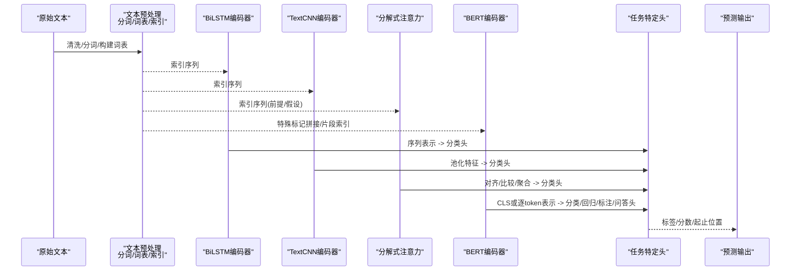
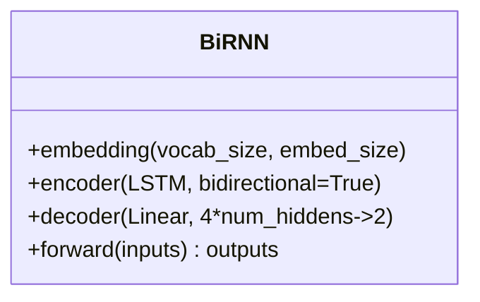
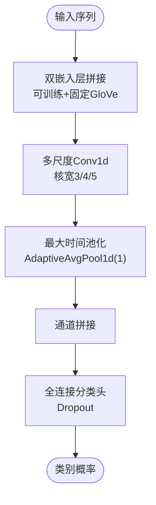
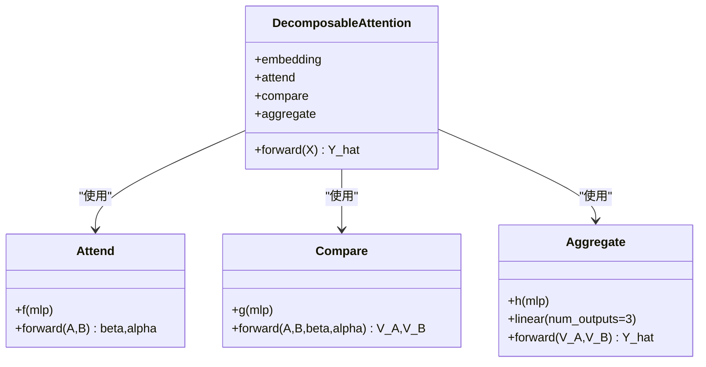
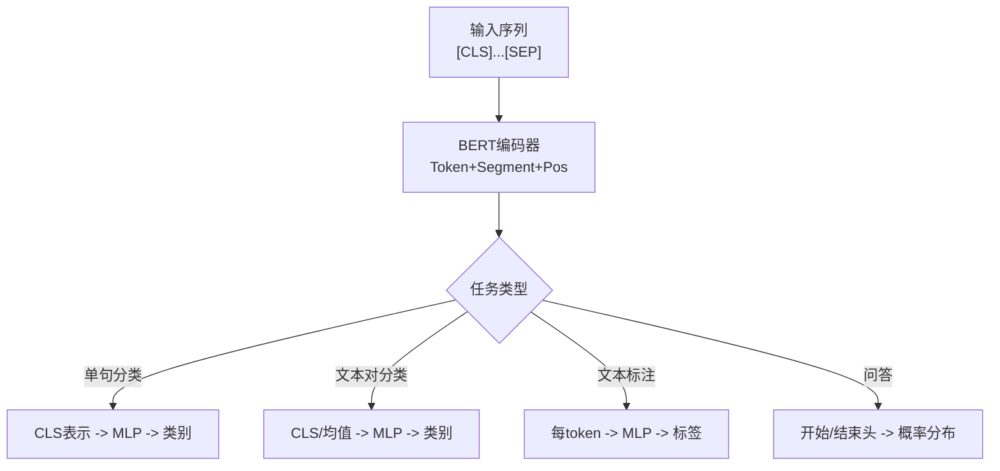
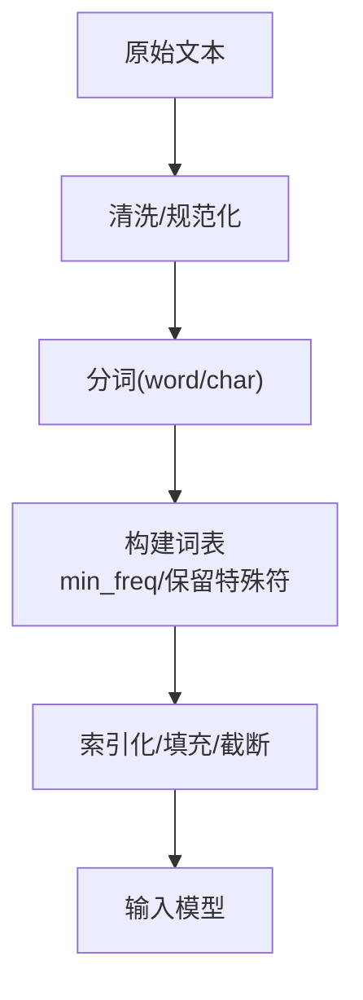
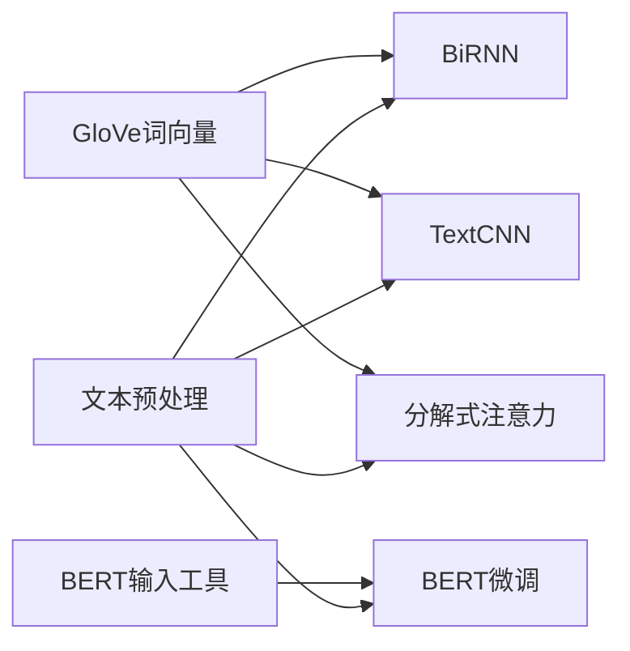

# 自然语言处理应用

<cite>
**本文引用的文件**   
- [chapter_natural-language-processing-applications/index.ipynb](file://chapter_natural-language-processing-applications/index.ipynb)
- [chapter_natural-language-processing-applications/sentiment-analysis-and-dataset.ipynb](file://chapter_natural-language-processing-applications/sentiment-analysis-and-dataset.ipynb)
- [chapter_natural-language-processing-applications/sentiment-analysis-rnn.ipynb](file://chapter_natural-language-processing-applications/sentiment-analysis-rnn.ipynb)
- [chapter_natural-language-processing-applications/sentiment-analysis-cnn.ipynb](file://chapter_natural-language-processing-applications/sentiment-analysis-cnn.ipynb)
- [chapter_natural-language-processing-applications/natural-language-inference-attention.ipynb](file://chapter_natural-language-processing-applications/natural-language-inference-attention.ipynb)
- [chapter_natural-language-processing-applications/finetuning-bert.ipynb](file://chapter_natural-language-processing-applications/finetuning-bert.ipynb)
- [chapter_recurrent-neural-networks/text-preprocessing.ipynb](file://chapter_recurrent-neural-networks/text-preprocessing.ipynb)
- [chapter_natural-language-processing-pretraining/bert.ipynb](file://chapter_natural-language-processing-pretraining/bert.ipynb)
- [chapter_natural-language-processing-pretraining/bert-dataset.ipynb](file://chapter_natural-language-processing-pretraining/bert-dataset.ipynb)
</cite>

## 目录
1. [引言](#引言)
2. [项目结构](#项目结构)
3. [核心组件](#核心组件)
4. [架构总览](#架构总览)
5. [详细组件分析](#详细组件分析)
6. [依赖关系分析](#依赖关系分析)
7. [性能与优化](#性能与优化)
8. [故障排查指南](#故障排查指南)
9. [结论](#结论)
10. [附录：任务清单与最佳实践](#附录任务清单与最佳实践)

## 引言
本章节聚焦于自然语言处理（NLP）应用，系统讲解情感分析的RNN与CNN实现、自然语言推理中的注意力机制、BERT在下游任务的微调策略与性能优化，并覆盖文本分类、序列标注等常见任务的解决方案。同时提供从数据预处理到模型训练、评估与部署的完整流程，以及迁移学习与领域适应的实践方法。

## 项目结构
该仓库按主题组织多个章节，其中“自然语言处理应用”章节包含情感分析（RNN/CNN）、自然语言推断（注意力）、BERT微调等关键内容；“预训练”章节介绍BERT输入表示与数据集构建；“循环神经网络”章节提供文本预处理基础。

**图表来源**  
- [chapter_natural-language-processing-applications/index.ipynb:10-44](file://chapter_natural-language-processing-applications/index.ipynb#L10-L44)  
- [chapter_natural-language-processing-pretraining/bert.ipynb:10-38](file://chapter_natural-language-processing-pretraining/bert.ipynb#L10-L38)  
- [chapter_recurrent-neural-networks/text-preprocessing.ipynb:10-24](file://chapter_recurrent-neural-networks/text-preprocessing.ipynb#L10-L24)

**章节来源**  
- [chapter_natural-language-processing-applications/index.ipynb:10-44](file://chapter_natural-language-processing-applications/index.ipynb#L10-L44)

## 核心组件
- 情感分析（RNN）：使用双向LSTM编码序列，结合预训练GloVe词向量，输出二分类结果。
- 情感分析（CNN）：textCNN通过多尺度一维卷积与最大时间池化提取局部n-gram特征，配合双嵌入层（可训练+固定）。
- 自然语言推断（注意力）：分解式注意力模型，对齐前提与假设的词元，比较后聚合得到蕴涵/矛盾/中性三类预测。
- BERT微调：针对单句分类、文本对分类/回归、序列标注、问答等任务，仅需添加最小全连接头，全参微调。

**章节来源**  
- [chapter_natural-language-processing-applications/sentiment-analysis-rnn.ipynb:52-100](file://chapter_natural-language-processing-applications/sentiment-analysis-rnn.ipynb#L52-L100)  
- [chapter_natural-language-processing-applications/sentiment-analysis-cnn.ipynb:216-286](file://chapter_natural-language-processing-applications/sentiment-analysis-cnn.ipynb#L216-L286)  
- [chapter_natural-language-processing-applications/natural-language-inference-attention.ipynb:146-321](file://chapter_natural-language-processing-applications/natural-language-inference-attention.ipynb#L146-L321)  
- [chapter_natural-language-processing-applications/finetuning-bert.ipynb:17-68](file://chapter_natural-language-processing-applications/finetuning-bert.ipynb#L17-L68)

## 架构总览
下图展示从文本预处理到不同下游模型的端到端流程，包括RNN/CNN情感分析、注意力推理与BERT微调。

**图表来源**  
- [chapter_recurrent-neural-networks/text-preprocessing.ipynb:10-24](file://chapter_recurrent-neural-networks/text-preprocessing.ipynb#L10-L24)  
- [chapter_natural-language-processing-applications/sentiment-analysis-rnn.ipynb:75-100](file://chapter_natural-language-processing-applications/sentiment-analysis-rnn.ipynb#L75-L100)  
- [chapter_natural-language-processing-applications/sentiment-analysis-cnn.ipynb:254-286](file://chapter_natural-language-processing-applications/sentiment-analysis-cnn.ipynb#L254-L286)  
- [chapter_natural-language-processing-applications/natural-language-inference-attention.ipynb:303-321](file://chapter_natural-language-processing-applications/natural-language-inference-attention.ipynb#L303-L321)  
- [chapter_natural-language-processing-pretraining/bert.ipynb:100-171](file://chapter_natural-language-processing-pretraining/bert.ipynb#L100-L171)

## 详细组件分析

### 情感分析：基于循环神经网络（RNN）
- 模型要点
  - 使用预训练GloVe初始化Embedding，训练时冻结权重以减少过拟合。
  - 双向LSTM编码序列，取首尾隐状态拼接作为序列表示。
  - 全连接分类头输出正/负两类概率。
- 训练与评估
  - 使用IMDb数据集，批量大小与设备并行训练，监控损失与准确率。
- 复杂度与优化
  - 双向LSTM计算开销较大，可通过梯度累积、混合精度、减少层数/隐藏维度提升速度。
  - 冻结Embedding可减少参数规模，加速收敛。

**图表来源**  
- [chapter_natural-language-processing-applications/sentiment-analysis-rnn.ipynb:75-100](file://chapter_natural-language-processing-applications/sentiment-analysis-rnn.ipynb#L75-L100)

**章节来源**  
- [chapter_natural-language-processing-applications/sentiment-analysis-rnn.ipynb:52-100](file://chapter_natural-language-processing-applications/sentiment-analysis-rnn.ipynb#L52-L100)  
- [chapter_natural-language-processing-applications/sentiment-analysis-rnn.ipynb:170-270](file://chapter_natural-language-processing-applications/sentiment-analysis-rnn.ipynb#L170-L270)

### 情感分析：基于卷积神经网络（CNN）
- 模型要点
  - textCNN采用多尺度一维卷积核捕获不同长度的局部n-gram特征。
  - 最大时间池化将变长序列压缩为固定长度向量。
  - 双嵌入层：一个可训练，一个固定（GloVe），增强鲁棒性。
- 训练与评估
  - 使用IMDb数据集，Dropout正则化防止过拟合。
- 复杂度与优化
  - 一维卷积并行度高，适合GPU加速；多通道与多核尺寸增加容量但需权衡显存。

**图表来源**  
- [chapter_natural-language-processing-applications/sentiment-analysis-cnn.ipynb:254-286](file://chapter_natural-language-processing-applications/sentiment-analysis-cnn.ipynb#L254-L286)

**章节来源**  
- [chapter_natural-language-processing-applications/sentiment-analysis-cnn.ipynb:216-286](file://chapter_natural-language-processing-applications/sentiment-analysis-cnn.ipynb#L216-L286)

### 自然语言推断：注意力机制
- 模型要点
  - 分解式注意力：分别对前提A和假设B进行非线性变换f(A)、f(B)，计算注意力矩阵e=f(A)f(B)^T。
  - 软对齐：对B加权求和得到β_i，对A加权求和得到α_j。
  - 比较：将原词元与对齐向量拼接，经g映射得到V_A、V_B。
  - 聚合：对V_A、V_B求和后拼接，经h映射输出三类预测。
- 训练与评估
  - 使用SNLI数据集，批量大小256，序列长度50，三分类交叉熵损失。
- 复杂度与优化
  - 分解技巧将二次复杂度降为线性，利于长序列；可使用梯度裁剪与学习率调度稳定训练。

**图表来源**  
- [chapter_natural-language-processing-applications/natural-language-inference-attention.ipynb:146-321](file://chapter_natural-language-processing-applications/natural-language-inference-attention.ipynb#L146-L321)

**章节来源**  
- [chapter_natural-language-processing-applications/natural-language-inference-attention.ipynb:59-125](file://chapter_natural-language-processing-applications/natural-language-inference-attention.ipynb#L59-L125)  
- [chapter_natural-language-processing-applications/natural-language-inference-attention.ipynb:174-237](file://chapter_natural-language-processing-applications/natural-language-inference-attention.ipynb#L174-L237)  
- [chapter_natural-language-processing-applications/natural-language-inference-attention.ipynb:238-272](file://chapter_natural-language-processing-applications/natural-language-inference-attention.ipynb#L238-L272)

### BERT微调：下游任务适配
- 任务类型
  - 单文本分类：CLS token表示整句，接MLP输出类别分布。
  - 文本对分类/回归：两序列拼接，CLS用于分类或均值/CLS用于回归。
  - 文本标注：每个token接相同的全连接头预测标签。
  - 问答：两个全连接头分别预测开始/结束位置的概率分布。
- 微调策略
  - 额外头从零初始化，BERT所有参数参与微调。
  - 根据任务选择损失函数（交叉熵/均方误差）。
- 性能优化
  - 使用梯度检查点、混合精度、分布式训练；合理设置学习率与warmup。

**图表来源**  
- [chapter_natural-language-processing-applications/finetuning-bert.ipynb:17-68](file://chapter_natural-language-processing-applications/finetuning-bert.ipynb#L17-L68)  
- [chapter_natural-language-processing-pretraining/bert.ipynb:100-171](file://chapter_natural-language-processing-pretraining/bert.ipynb#L100-L171)

**章节来源**  
- [chapter_natural-language-processing-applications/finetuning-bert.ipynb:17-68](file://chapter_natural-language-processing-applications/finetuning-bert.ipynb#L17-L68)

### 文本数据预处理与特征工程
- 预处理步骤
  - 读取文本、清洗（去标点/大小写归一化）、分词（word/char）、构建词表（频率阈值、保留特殊符号）。
  - 将文本转换为索引序列，支持padding与截断。
- 特征工程实践
  - 使用预训练词向量（GloVe）初始化，冻结或微调。
  - 针对任务设计特征（如n-gram、字符级特征）。
  - 数据增强（回译、同义词替换）提升鲁棒性。

**图表来源**  
- [chapter_recurrent-neural-networks/text-preprocessing.ipynb:10-24](file://chapter_recurrent-neural-networks/text-preprocessing.ipynb#L10-L24)  
- [chapter_natural-language-processing-applications/sentiment-analysis-and-dataset.ipynb:150-176](file://chapter_natural-language-processing-applications/sentiment-analysis-and-dataset.ipynb#L150-L176)

**章节来源**  
- [chapter_recurrent-neural-networks/text-preprocessing.ipynb:10-200](file://chapter_recurrent-neural-networks/text-preprocessing.ipynb#L10-L200)  
- [chapter_natural-language-processing-applications/sentiment-analysis-and-dataset.ipynb:150-176](file://chapter_natural-language-processing-applications/sentiment-analysis-and-dataset.ipynb#L150-L176)

## 依赖关系分析
- 数据流依赖
  - 文本预处理模块为所有下游模型提供统一输入格式。
  - 预训练词向量（GloVe）被RNN/CNN/注意力模型共享使用。
  - BERT微调依赖其输入表示工具与数据集生成脚本。
- 模块耦合
  - 各模型独立封装，便于替换与对比实验。
  - 注意力模型内部Attend/Compare/Aggregate解耦清晰。

**图表来源**  
- [chapter_recurrent-neural-networks/text-preprocessing.ipynb:10-24](file://chapter_recurrent-neural-networks/text-preprocessing.ipynb#L10-L24)  
- [chapter_natural-language-processing-applications/sentiment-analysis-rnn.ipynb:170-270](file://chapter_natural-language-processing-applications/sentiment-analysis-rnn.ipynb#L170-L270)  
- [chapter_natural-language-processing-applications/sentiment-analysis-cnn.ipynb:333-370](file://chapter_natural-language-processing-applications/sentiment-analysis-cnn.ipynb#L333-L370)  
- [chapter_natural-language-processing-applications/natural-language-inference-attention.ipynb:390-418](file://chapter_natural-language-processing-applications/natural-language-inference-attention.ipynb#L390-L418)  
- [chapter_natural-language-processing-pretraining/bert.ipynb:100-171](file://chapter_natural-language-processing-pretraining/bert.ipynb#L100-L171)

**章节来源**  
- [chapter_natural-language-processing-applications/index.ipynb:25-51](file://chapter_natural-language-processing-applications/index.ipynb#L25-L51)

## 性能与优化
- 训练效率
  - 使用多GPU并行（try_all_gpus）与批处理提升吞吐。
  - 混合精度训练与梯度累积降低显存占用。
- 模型容量与泛化
  - 正则化（Dropout、权重衰减）、早停、学习率调度。
  - 预训练词向量冻结/微调策略平衡偏差-方差。
- 推理部署
  - 模型量化、ONNX导出、服务化封装（FastAPI/Flask）。
  - 动态批处理与缓存机制提升QPS。

[本节为通用指导，不直接分析具体文件]

## 故障排查指南
- 数据问题
  - 词表构建失败：检查分词规则与最小频率阈值。
  - 索引越界：确认词表与模型Embedding维度一致。
- 训练不稳定
  - 损失不下降：检查学习率、梯度爆炸（梯度裁剪）、数据标签一致性。
  - 过拟合：增加正则化、减少模型复杂度、数据增强。
- 注意力模型
  - 对齐异常：检查f(A)/f(B)维度与softmax数值稳定性。
  - 内存不足：缩短序列长度或减小batch size。
- BERT微调
  - 输入格式错误：确保[CLS]/[SEP]与片段索引正确。
  - 微调效果差：调整学习率、warmup步数、任务头深度。

**章节来源**  
- [chapter_natural-language-processing-applications/sentiment-analysis-rnn.ipynb:153-161](file://chapter_natural-language-processing-applications/sentiment-analysis-rnn.ipynb#L153-L161)  
- [chapter_natural-language-processing-applications/natural-language-inference-attention.ipynb:89-102](file://chapter_natural-language-processing-applications/natural-language-inference-attention.ipynb#L89-L102)  
- [chapter_natural-language-processing-pretraining/bert.ipynb:100-171](file://chapter_natural-language-processing-pretraining/bert.ipynb#L100-L171)

## 结论
本章系统展示了NLP应用的多种实现路径：从传统RNN/CNN到注意力机制，再到BERT微调。通过统一的预处理流程与模块化设计，可在不同任务间快速迁移与对比。实践中应结合数据特性、资源约束与业务需求选择合适的模型与优化策略，并重视评估指标与部署效率。

[本节为总结性内容，不直接分析具体文件]

## 附录：任务清单与最佳实践
- 情感分析
  - RNN：适合长序列依赖，注意双向LSTM的计算成本。
  - CNN：擅长局部n-gram特征，训练速度快，易部署。
- 自然语言推断
  - 分解式注意力：线性复杂度，适合大规模语料。
- BERT微调
  - 单句分类/文本对分类/序列标注/问答：仅加最小头，全参微调。
- 数据预处理
  - 标准化清洗、稳健分词、合理词表阈值。
- 评估指标
  - 分类：准确率、F1、混淆矩阵。
  - 回归：MSE、MAE、相关系数。
  - 标注：精确率、召回率、F1（按实体/标签）。
- 部署建议
  - 模型轻量化（剪枝/量化）、服务化接口、监控与回滚。

[本节为通用指导，不直接分析具体文件]