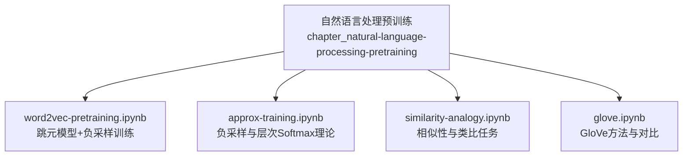
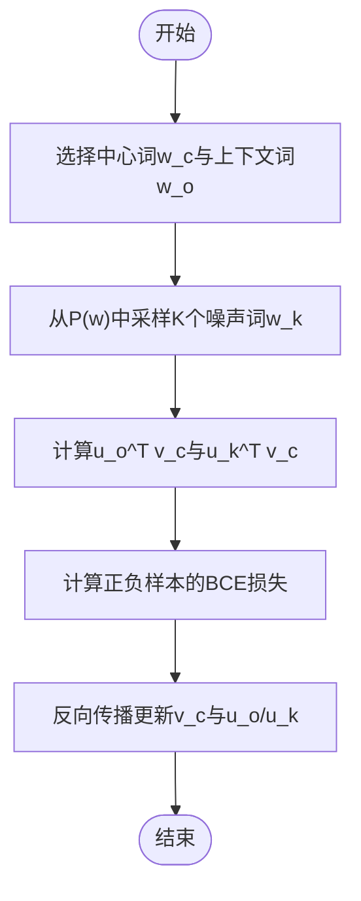
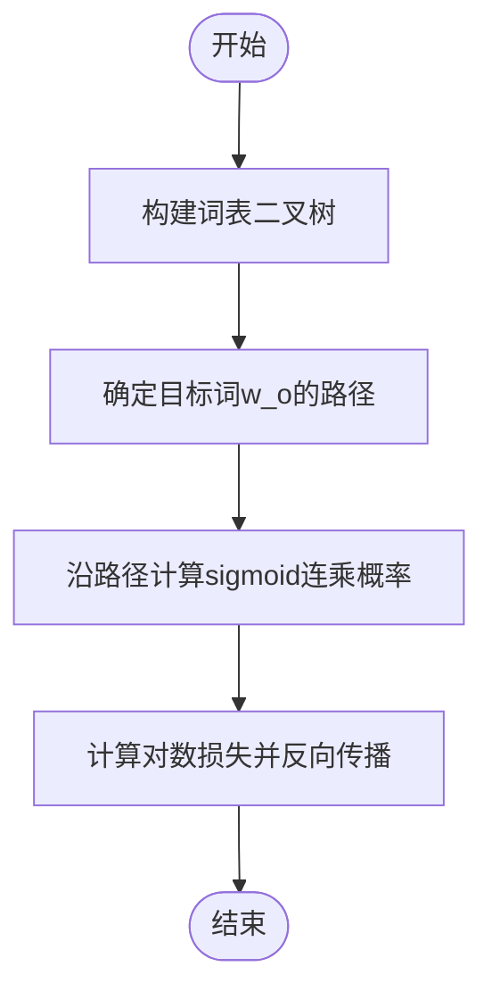
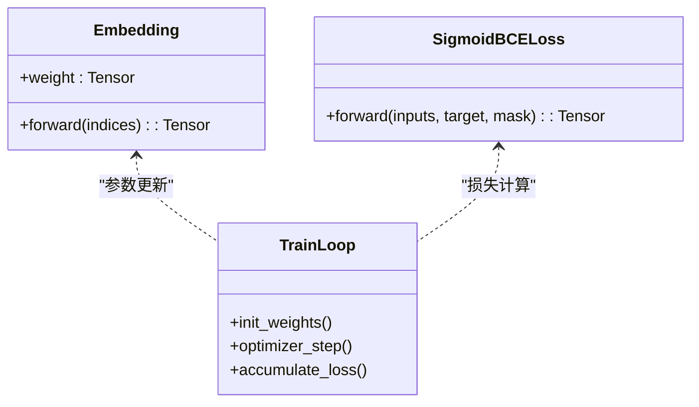
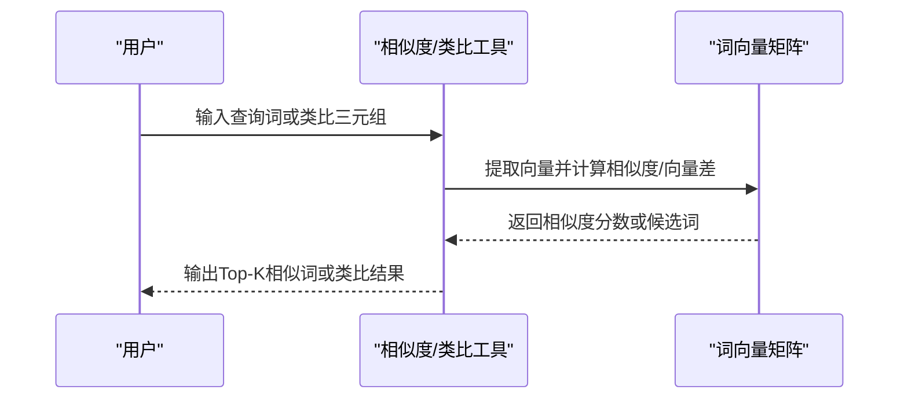

# Word2Vec预训练

<cite>
**本文引用的文件**   
- [word2vec-pretraining.ipynb](file://chapter_natural-language-processing-pretraining/word2vec-pretraining.ipynb)
- [approx-training.ipynb](file://chapter_natural-language-processing-pretraining/approx-training.ipynb)
- [similarity-analogy.ipynb](file://chapter_natural-language-processing-pretraining/similarity-analogy.ipynb)
- [glove.ipynb](file://chapter_natural-language-processing-pretraining/glove.ipynb)
</cite>

## 目录
1. [引言](#引言)
2. [项目结构](#项目结构)
3. [核心组件](#核心组件)
4. [架构总览](#架构总览)
5. [详细组件分析](#详细组件分析)
6. [依赖关系分析](#依赖关系分析)
7. [性能考量](#性能考量)
8. [故障排查指南](#故障排查指南)
9. [结论](#结论)
10. [附录](#附录)

## 引言
本文件围绕Word2Vec预训练展开，系统讲解CBOW与Skip-gram两种核心算法的数学原理、实现细节与工程实践。重点覆盖负采样与层次Softmax等近似训练技术；阐述词向量训练中的数据预处理、窗口大小设置与词频过滤策略；提供基于PyTorch的前向传播、损失计算与反向传播流程说明；解释如何评估词向量质量（相似度分析与类比推理任务）；给出可视化词向量空间的方法；并分析不同超参数对训练效果的影响，辅以实际数据集上的训练示例与结果解读。

## 项目结构
仓库中与Word2Vec预训练相关的材料集中在“自然语言处理预训练”章节，包含：
- 跳元模型（Skip-gram）的PyTorch实现与训练流程
- 近似训练方法（负采样、层次Softmax）的理论推导
- 词向量应用（相似性与类比任务）
- GloVe全局向量方法的背景与对比



**图表来源** 
- [word2vec-pretraining.ipynb:1-1265](file://chapter_natural-language-processing-pretraining/word2vec-pretraining.ipynb#L1-L1265)
- [approx-training.ipynb:1-108](file://chapter_natural-language-processing-pretraining/approx-training.ipynb#L1-L108)
- [similarity-analogy.ipynb:1-718](file://chapter_natural-language-processing-pretraining/similarity-analogy.ipynb#L1-L718)
- [glove.ipynb:1-118](file://chapter_natural-language-processing-pretraining/glove.ipynb#L1-L118)

**章节来源**
- [word2vec-pretraining.ipynb:1-1265](file://chapter_natural-language-processing-pretraining/word2vec-pretraining.ipynb#L1-L1265)
- [approx-training.ipynb:1-108](file://chapter_natural-language-processing-pretraining/approx-training.ipynb#L1-L108)
- [similarity-analogy.ipynb:1-718](file://chapter_natural-language-processing-pretraining/similarity-analogy.ipynb#L1-L718)
- [glove.ipynb:1-118](file://chapter_natural-language-processing-pretraining/glove.ipynb#L1-L118)

## 核心组件
- 嵌入层（Embedding）：将词索引映射为稠密向量，作为中心词与上下文词的表示矩阵。
- 跳元前向函数：通过批量矩阵乘法计算中心词与上下文/噪声词之间的点积得分。
- 二元交叉熵损失（SigmoidBCELoss）：用于负采样场景下的正负样本判别损失。
- 训练循环：初始化权重、优化器、按批次迭代、归一化掩码损失、统计与可视化。
- 应用模块：余弦相似度检索相似词、类比推理（向量加减）。

**章节来源**
- [word2vec-pretraining.ipynb:86-176](file://chapter_natural-language-processing-pretraining/word2vec-pretraining.ipynb#L86-L176)
- [word2vec-pretraining.ipynb:254-453](file://chapter_natural-language-processing-pretraining/word2vec-pretraining.ipynb#L254-L453)
- [word2vec-pretraining.ipynb:1185-1224](file://chapter_natural-language-processing-pretraining/word2vec-pretraining.ipynb#L1185-L1224)

## 架构总览
下图展示基于PyTorch的Word2Vec（Skip-gram + 负采样）训练架构与数据流。

```mermaid
sequenceDiagram
participant Data as "数据迭代器"
participant Model as "嵌入层(中心/上下文)"
participant Forward as "skip_gram前向"
participant Loss as "SigmoidBCELoss"
participant Opt as "Adam优化器"
Data->>Model : 输入(center, contexts_and_negatives)
Model-->>Forward : 词向量v, u
Forward->>Forward : 批量矩阵乘法得到预测得分
Forward-->>Loss : 预测得分pred
Loss-->>Opt : 计算归一化BCE损失
Opt->>Model : 反向传播更新嵌入参数
```

**图表来源** 
- [word2vec-pretraining.ipynb:170-176](file://chapter_natural-language-processing-pretraining/word2vec-pretraining.ipynb#L170-L176)
- [word2vec-pretraining.ipynb:254-266](file://chapter_natural-language-processing-pretraining/word2vec-pretraining.ipynb#L254-L266)
- [word2vec-pretraining.ipynb:423-453](file://chapter_natural-language-processing-pretraining/word2vec-pretraining.ipynb#L423-L453)

## 详细组件分析

### 跳元模型（Skip-gram）与CBOW对比
- Skip-gram：以中心词预测上下文词，适合小语料与稀有词表征。
- CBOW：以上下文词预测中心词，训练更稳定、速度更快。
- 在近似训练中，两者均可使用负采样或层次Softmax降低softmax归一化的计算开销。

**章节来源**
- [approx-training.ipynb:10-96](file://chapter_natural-language-processing-pretraining/approx-training.ipynb#L10-L96)

### 负采样（Negative Sampling）
- 目标：将条件概率建模为正样本与若干负样本的独立事件联合概率。
- 损失：对每个正样本和K个负样本分别计算sigmoid交叉熵，梯度复杂度与词表大小无关，仅与K线性相关。
- 采样分布：通常按词频的幂次进行非均匀采样，提升高频词参与训练的概率。



**图表来源** 
- [approx-training.ipynb:20-59](file://chapter_natural-language-processing-pretraining/approx-training.ipynb#L20-L59)

**章节来源**
- [approx-training.ipynb:20-59](file://chapter_natural-language-processing-pretraining/approx-training.ipynb#L20-L59)

### 层次Softmax（Hierarchical Softmax）
- 思想：用二叉树组织词表，路径长度约O(log|V|)，将全表softmax近似为沿路径的sigmoid连乘。
- 优点：梯度计算成本随词表大小对数增长，适合超大词表。
- 注意：需构建Huffman树或近似树，节点向量与方向符号决定路径概率。



**图表来源** 
- [approx-training.ipynb:61-84](file://chapter_natural-language-processing-pretraining/approx-training.ipynb#L61-L84)

**章节来源**
- [approx-training.ipynb:61-84](file://chapter_natural-language-processing-pretraining/approx-training.ipynb#L61-L84)

### PyTorch实现要点（前向、损失、反向传播）
- 嵌入层：两个独立的Embedding分别表示中心词与上下文词。
- 前向传播：对center与contexts_and_negatives做嵌入后，使用批量矩阵乘法得到预测得分。
- 损失：SigmoidBCELoss对mask进行归一化平均，避免填充影响。
- 训练：Xavier初始化嵌入、Adam优化、按批次累积损失并可视化。



**图表来源** 
- [word2vec-pretraining.ipynb:86-176](file://chapter_natural-language-processing-pretraining/word2vec-pretraining.ipynb#L86-L176)
- [word2vec-pretraining.ipynb:254-266](file://chapter_natural-language-processing-pretraining/word2vec-pretraining.ipynb#L254-L266)
- [word2vec-pretraining.ipynb:423-453](file://chapter_natural-language-processing-pretraining/word2vec-pretraining.ipynb#L423-L453)

**章节来源**
- [word2vec-pretraining.ipynb:86-176](file://chapter_natural-language-processing-pretraining/word2vec-pretraining.ipynb#L86-L176)
- [word2vec-pretraining.ipynb:254-266](file://chapter_natural-language-processing-pretraining/word2vec-pretraining.ipynb#L254-L266)
- [word2vec-pretraining.ipynb:423-453](file://chapter_natural-language-processing-pretraining/word2vec-pretraining.ipynb#L423-L453)

### 数据预处理与训练策略
- 数据加载：使用d2l.load_data_ptb获取PTB数据集迭代器与词表。
- 窗口大小：max_window_size控制上下文窗口范围，影响语义捕捉粒度。
- 噪声词数量：num_noise_words决定负采样强度，越大训练越稳健但计算量增加。
- 词频过滤：可通过最小词频阈值裁剪低频词，减少噪声与内存占用。
- 掩码与标签：针对变长序列与填充位置，使用mask进行归一化平均。

**章节来源**
- [word2vec-pretraining.ipynb:34-42](file://chapter_natural-language-processing-pretraining/word2vec-pretraining.ipynb#L34-L42)
- [word2vec-pretraining.ipynb:274-311](file://chapter_natural-language-processing-pretraining/word2vec-pretraining.ipynb#L274-L311)

### 评估词向量质量
- 相似度检索：计算查询词与词表中所有词的余弦相似度，取Top-K。
- 类比推理：利用向量运算vec(b)-vec(a)+vec(c)寻找最相似的d。
- 预训练词向量：可使用GloVe或fastText进行对比验证。



**图表来源** 
- [similarity-analogy.ipynb:308-350](file://chapter_natural-language-processing-pretraining/similarity-analogy.ipynb#L308-L350)
- [similarity-analogy.ipynb:501-548](file://chapter_natural-language-processing-pretraining/similarity-analogy.ipynb#L501-L548)

**章节来源**
- [similarity-analogy.ipynb:308-350](file://chapter_natural-language-processing-pretraining/similarity-analogy.ipynb#L308-L350)
- [similarity-analogy.ipynb:501-548](file://chapter_natural-language-processing-pretraining/similarity-analogy.ipynb#L501-L548)

### 可视化词向量空间
- PCA/t-SNE降维：将高维词向量投影到二维平面，观察聚类与语义关系。
- 交互式探索：结合词汇标注与颜色编码，辅助理解语义簇。
- 动态更新：训练过程中定期保存向量快照，观察表征演化。

[本节为概念性内容，不直接分析具体文件]

### 超参数调优建议
- 学习率：过小收敛慢，过大不稳定；常用0.001~0.01范围。
- 批大小：增大可提升稳定性与并行效率，但受显存限制。
- 窗口大小：较小捕获局部语法，较大捕获更长程语义。
- 噪声词数量：K=5~10常见，平衡精度与速度。
- 词向量维度：300较常用，维度越高表达能力强但易过拟合。
- 词频阈值：过滤极低频词可减少噪声，提高泛化。

**章节来源**
- [word2vec-pretraining.ipynb:1167-1169](file://chapter_natural-language-processing-pretraining/word2vec-pretraining.ipynb#L1167-L1169)

### 实际数据集训练示例与结果分析
- 数据集：PTB（Penn Treebank），小规模便于快速实验。
- 训练过程：记录每轮损失与tokens/sec，观察收敛趋势。
- 结果：在小型数据集上可获得基本语义区分能力；在大语料上进一步调参可显著提升质量。

**章节来源**
- [word2vec-pretraining.ipynb:480-486](file://chapter_natural-language-processing-pretraining/word2vec-pretraining.ipynb#L480-L486)

## 依赖关系分析
- 外部库：torch、torch.nn.functional、d2l（数据加载与可视化工具）。
- 内部依赖：嵌入层与损失函数耦合于训练循环；数据迭代器提供带掩码的批次数据。
- 潜在循环依赖：无；模块间通过函数调用与张量传递解耦。


**图表来源** 
- [word2vec-pretraining.ipynb:34-42](file://chapter_natural-language-processing-pretraining/word2vec-pretraining.ipynb#L34-L42)
- [word2vec-pretraining.ipynb:170-176](file://chapter_natural-language-processing-pretraining/word2vec-pretraining.ipynb#L170-L176)
- [word2vec-pretraining.ipynb:254-266](file://chapter_natural-language-processing-pretraining/word2vec-pretraining.ipynb#L254-L266)
- [word2vec-pretraining.ipynb:423-453](file://chapter_natural-language-processing-pretraining/word2vec-pretraining.ipynb#L423-L453)

**章节来源**
- [word2vec-pretraining.ipynb:34-42](file://chapter_natural-language-processing-pretraining/word2vec-pretraining.ipynb#L34-L42)
- [word2vec-pretraining.ipynb:170-176](file://chapter_natural-language-processing-pretraining/word2vec-pretraining.ipynb#L170-L176)
- [word2vec-pretraining.ipynb:254-266](file://chapter_natural-language-processing-pretraining/word2vec-pretraining.ipynb#L254-L266)
- [word2vec-pretraining.ipynb:423-453](file://chapter_natural-language-processing-pretraining/word2vec-pretraining.ipynb#L423-L453)

## 性能考量
- 时间复杂度：负采样每步复杂度O(K·d)，d为向量维度；层次Softmax为O(log|V|·d)。
- 空间复杂度：词表大小×向量维度存储嵌入矩阵；大词表需考虑内存与I/O。
- 并行化：批量矩阵乘法充分利用GPU；可结合多进程数据加载。
- 数值稳定性：余弦相似度计算加入微小常数防止除零；BCE使用logits版本提升稳定性。

[本节为通用指导，不直接分析具体文件]

## 故障排查指南
- 损失不下降：检查学习率是否过大/过小；确认mask与标签形状匹配；验证嵌入初始化。
- 训练速度慢：减小批大小或噪声词数量；检查数据加载瓶颈；启用混合精度。
- 相似度异常：确认向量已归一化或相似度公式正确；排除未知词与填充影响。
- 类比推理失败：检查向量代数顺序；确保词表对齐与索引一致。

**章节来源**
- [word2vec-pretraining.ipynb:254-266](file://chapter_natural-language-processing-pretraining/word2vec-pretraining.ipynb#L254-L266)
- [word2vec-pretraining.ipynb:423-453](file://chapter_natural-language-processing-pretraining/word2vec-pretraining.ipynb#L423-L453)
- [similarity-analogy.ipynb:308-350](file://chapter_natural-language-processing-pretraining/similarity-analogy.ipynb#L308-L350)

## 结论
Word2Vec通过Skip-gram/CBOW与近似训练（负采样/层次Softmax）有效降低了大规模词表的训练成本，并在实践中展现出强大的语义表征能力。借助PyTorch的模块化设计，可实现清晰的前向、损失与反向传播流程；通过相似度与类比任务可直观评估词向量质量。合理的数据预处理、窗口设置与词频过滤是获得高质量词向量的关键；超参数调优与可视化分析有助于深入理解训练过程与表征特性。

[本节为总结性内容，不直接分析具体文件]

## 附录
- GloVe方法对比：基于全局共现统计的平方损失，强调对称性与加权策略，可作为Word2Vec的补充或替代方案。
- 参考实现路径：
  - 跳元前向与损失：[word2vec-pretraining.ipynb:170-176](file://chapter_natural-language-processing-pretraining/word2vec-pretraining.ipynb#L170-L176)、[word2vec-pretraining.ipynb:254-266](file://chapter_natural-language-processing-pretraining/word2vec-pretraining.ipynb#L254-L266)
  - 训练循环与可视化：[word2vec-pretraining.ipynb:423-453](file://chapter_natural-language-processing-pretraining/word2vec-pretraining.ipynb#L423-L453)
  - 近似训练理论：[approx-training.ipynb:20-84](file://chapter_natural-language-processing-pretraining/approx-training.ipynb#L20-L84)
  - 相似性与类比：[similarity-analogy.ipynb:308-548](file://chapter_natural-language-processing-pretraining/similarity-analogy.ipynb#L308-L548)
  - GloVe背景：[glove.ipynb:10-108](file://chapter_natural-language-processing-pretraining/glove.ipynb#L10-L108)

**章节来源**
- [glove.ipynb:10-108](file://chapter_natural-language-processing-pretraining/glove.ipynb#L10-L108)
- [approx-training.ipynb:20-84](file://chapter_natural-language-processing-pretraining/approx-training.ipynb#L20-L84)
- [similarity-analogy.ipynb:308-548](file://chapter_natural-language-processing-pretraining/similarity-analogy.ipynb#L308-L548)
- [word2vec-pretraining.ipynb:170-453](file://chapter_natural-language-processing-pretraining/word2vec-pretraining.ipynb#L170-L453)