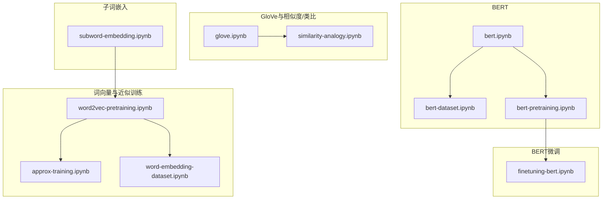
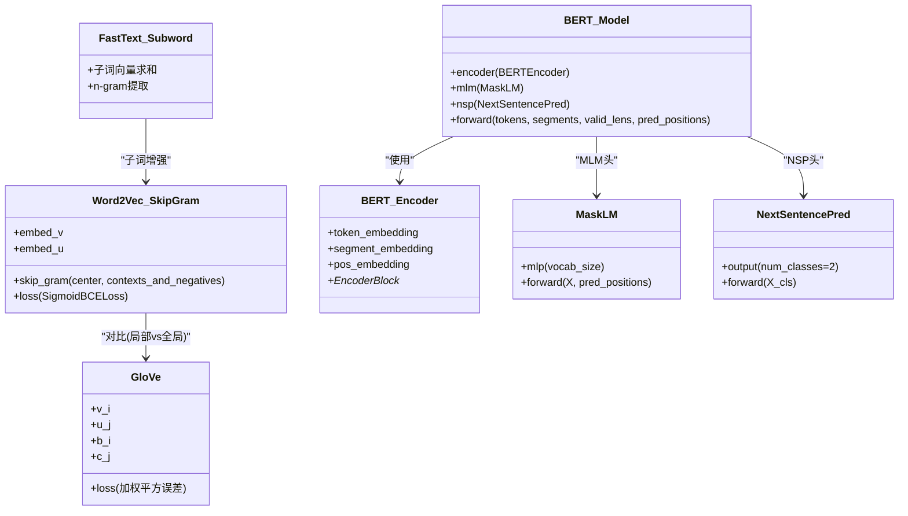
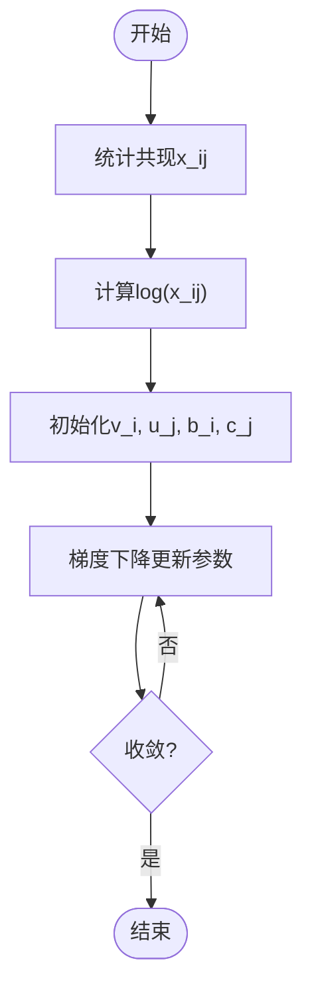
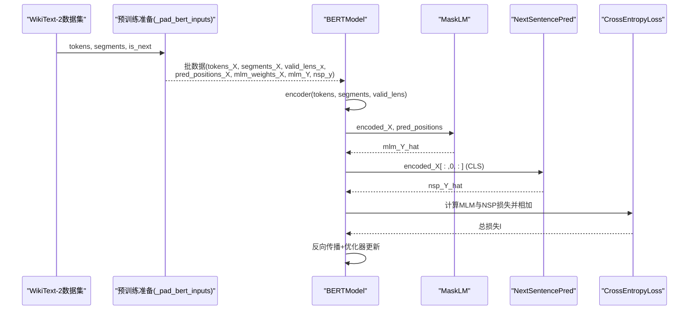
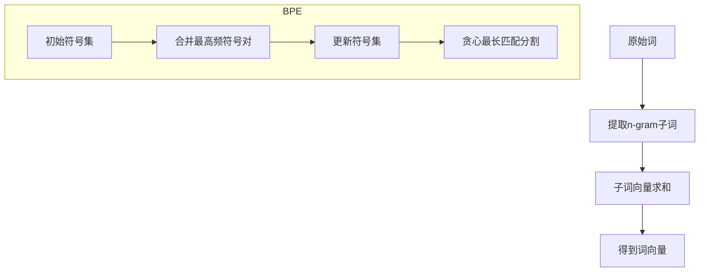
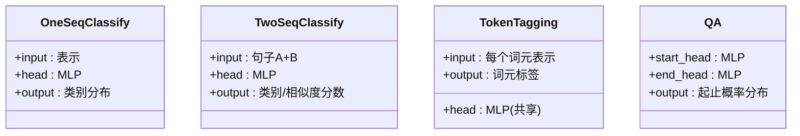
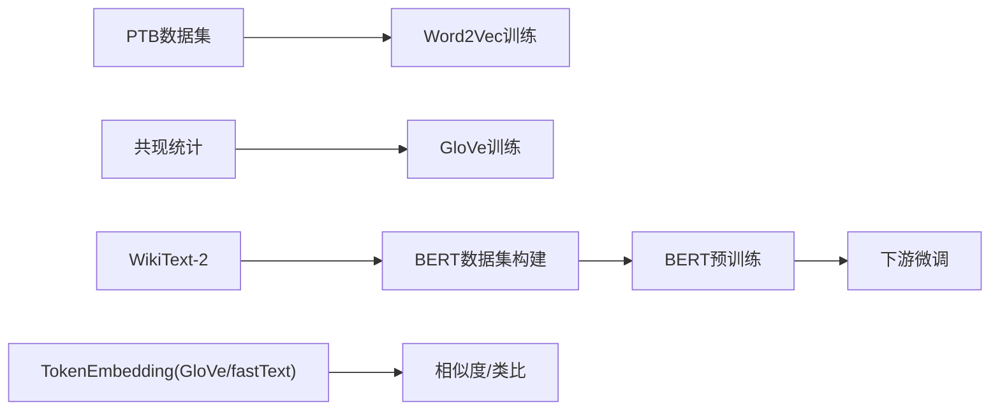

# 自然语言处理预训练

<cite>
**本文引用的文件**   
- [word2vec-pretraining.ipynb](file://chapter_natural-language-processing-pretraining/word2vec-pretraining.ipynb)
- [approx-training.ipynb](file://chapter_natural-language-processing-pretraining/approx-training.ipynb)
- [word-embedding-dataset.ipynb](file://chapter_natural-language-processing-pretraining/word-embedding-dataset.ipynb)
- [glove.ipynb](file://chapter_natural-language-processing-pretraining/glove.ipynb)
- [similarity-analogy.ipynb](file://chapter_natural-language-processing-pretraining/similarity-analogy.ipynb)
- [subword-embedding.ipynb](file://chapter_natural-language-processing-pretraining/subword-embedding.ipynb)
- [bert.ipynb](file://chapter_natural-language-processing-pretraining/bert.ipynb)
- [bert-dataset.ipynb](file://chapter_natural-language-processing-pretraining/bert-dataset.ipynb)
- [bert-pretraining.ipynb](file://chapter_natural-language-processing-pretraining/bert-pretraining.ipynb)
- [finetuning-bert.ipynb](file://chapter_natural-language-processing-applications/finetuning-bert.ipynb)
</cite>

## 目录
1. [引言](#引言)
2. [项目结构](#项目结构)
3. [核心组件](#核心组件)
4. [架构总览](#架构总览)
5. [详细组件分析](#详细组件分析)
6. [依赖关系分析](#依赖关系分析)
7. [性能考量](#性能考量)
8. [故障排查指南](#故障排查指南)
9. [结论](#结论)
10. [附录](#附录)

## 引言
本章节围绕自然语言处理的预训练技术，系统讲解词向量与上下文敏感表示的演进：从Word2Vec（CBOW与Skip-gram）、GloVe全局统计与矩阵分解思想，到BERT的双向Transformer与掩码语言建模、下一句预测。同时覆盖子词嵌入（fastText与BPE）、词向量相似度与类比推理的实现、预训练与微调流程、可视化与分析工具使用，以及迁移学习在不同NLP任务中的效果与趋势展望。

## 项目结构
仓库以“按主题分章”的方式组织，预训练相关内容集中在 chapter_natural-language-processing-pretraining 与 chapter_natural-language-processing-applications 两个目录中：
- 词向量与近似训练：word2vec-pretraining.ipynb、approx-training.ipynb、word-embedding-dataset.ipynb
- GloVe与相似度/类比：glove.ipynb、similarity-analogy.ipynb
- 子词嵌入：subword-embedding.ipynb
- BERT模型与数据：bert.ipynb、bert-dataset.ipynb、bert-pretraining.ipynb
- BERT微调应用：finetuning-bert.ipynb



**图表来源** 
- [word2vec-pretraining.ipynb:1-120](file://chapter_natural-language-processing-pretraining/word2vec-pretraining.ipynb#L1-L120)
- [approx-training.ipynb:1-108](file://chapter_natural-language-processing-pretraining/approx-training.ipynb#L1-L108)
- [word-embedding-dataset.ipynb:1-200](file://chapter_natural-language-processing-pretraining/word-embedding-dataset.ipynb#L1-L200)
- [glove.ipynb:1-118](file://chapter_natural-language-processing-pretraining/glove.ipynb#L1-L118)
- [similarity-analogy.ipynb:1-120](file://chapter_natural-language-processing-pretraining/similarity-analogy.ipynb#L1-L120)
- [subword-embedding.ipynb:1-120](file://chapter_natural-language-processing-pretraining/subword-embedding.ipynb#L1-L120)
- [bert.ipynb:1-120](file://chapter_natural-language-processing-pretraining/bert.ipynb#L1-L120)
- [bert-dataset.ipynb:1-120](file://chapter_natural-language-processing-pretraining/bert-dataset.ipynb#L1-L120)
- [bert-pretraining.ipynb:1-120](file://chapter_natural-language-processing-pretraining/bert-pretraining.ipynb#L1-L120)
- [finetuning-bert.ipynb:1-88](file://chapter_natural-language-processing-applications/finetuning-bert.ipynb#L1-L88)

**章节来源**
- [word2vec-pretraining.ipynb:1-120](file://chapter_natural-language-processing-pretraining/word2vec-pretraining.ipynb#L1-L120)
- [glove.ipynb:1-118](file://chapter_natural-language-processing-pretraining/glove.ipynb#L1-L118)
- [bert.ipynb:1-120](file://chapter_natural-language-processing-pretraining/bert.ipynb#L1-L120)

## 核心组件
- Word2Vec Skip-gram实现与负采样训练
  - 使用嵌入层与批量矩阵乘法计算中心词与上下文/噪声词的点积，配合带掩码的二元交叉熵损失进行训练。
  - 参考路径：[skip_gram函数:170-175](file://chapter_natural-language-processing-pretraining/word2vec-pretraining.ipynb#L170-L175)、[SigmoidBCELoss:254-265](file://chapter_natural-language-processing-pretraining/word2vec-pretraining.ipynb#L254-L265)、[训练循环train:423-452](file://chapter_natural-language-processing-pretraining/word2vec-pretraining.ipynb#L423-L452)。
- 近似训练方法
  - 负采样将全词表softmax近似为K个负样本的独立事件；分层Softmax通过二叉树路径降低复杂度。
  - 参考路径：[负采样推导与公式:20-60](file://chapter_natural-language-processing-pretraining/approx-training.ipynb#L20-L60)、[分层Softmax:61-84](file://chapter_natural-language-processing-pretraining/approx-training.ipynb#L61-L84)。
- GloVe全局统计与平方损失
  - 基于共现计数x_ij的对数线性拟合，引入中心词偏置b_i与上下文词偏置c_j，并使用权重函数h(x_ij)控制稀有事件影响。
  - 参考路径：[GloVe损失与解释:40-93](file://chapter_natural-language-processing-pretraining/glove.ipynb#L40-L93)。
- BERT双向编码器与预训练任务
  - 输入包含词元嵌入、片段嵌入与可学习位置嵌入；预训练包括MLM（掩码语言建模）与NSP（下一句预测）。
  - 参考路径：[BERTEncoder:146-171](file://chapter_natural-language-processing-pretraining/bert.ipynb#L146-L171)、[MaskLM:299-320](file://chapter_natural-language-processing-pretraining/bert.ipynb#L299-L320)、[NextSentencePred:446-455](file://chapter_natural-language-processing-pretraining/bert.ipynb#L446-L455)、[BERTModel整合:580-607](file://chapter_natural-language-processing-pretraining/bert.ipynb#L580-L607)。
- BERT数据集与预训练流程
  - WikiText-2语料预处理、NSP样本生成、MLM替换策略（80%掩码/10%随机/10%不变）、填充与批构建。
  - 参考路径：[_get_next_sentence:122-130](file://chapter_natural-language-processing-pretraining/bert-dataset.ipynb#L122-L130)、[_replace_mlm_tokens:206-231](file://chapter_natural-language-processing-pretraining/bert-dataset.ipynb#L206-L231)、[_pad_bert_inputs:312-337](file://chapter_natural-language-processing-pretraining/bert-dataset.ipynb#L312-L337)、[_WikiTextDataset:370-403](file://chapter_natural-language-processing-pretraining/bert-dataset.ipynb#L370-L403)、[load_data_wiki:434-443](file://chapter_natural-language-processing-pretraining/bert-dataset.ipynb#L434-L443)。
- 词向量相似度与类比推理
  - 余弦相似度+Top-K近邻检索；类比任务通过向量运算与最近邻搜索完成。
  - 参考路径：[knn与相似度检索:308-315](file://chapter_natural-language-processing-pretraining/similarity-analogy.ipynb#L308-L315)、[get_analogy:501-506](file://chapter_natural-language-processing-pretraining/similarity-analogy.ipynb#L501-L506)。
- 子词嵌入与词汇扩展
  - fastText子词向量求和；BPE迭代合并高频符号对，支持OOV与固定词表。
  - 参考路径：[fastText子词表示:15-29](file://chapter_natural-language-processing-pretraining/subword-embedding.ipynb#L15-L29)、[BPE算法与分割:30-362](file://chapter_natural-language-processing-pretraining/subword-embedding.ipynb#L30-L362)。
- BERT微调与应用
  - 序列级分类、文本对分类/回归、词元级标注、问答等仅需添加少量全连接层并微调全部参数。
  - 参考路径：[微调概述与任务图示:1-88](file://chapter_natural-language-processing-applications/finetuning-bert.ipynb#L1-L88)。

**章节来源**
- [word2vec-pretraining.ipynb:170-452](file://chapter_natural-language-processing-pretraining/word2vec-pretraining.ipynb#L170-L452)
- [approx-training.ipynb:20-84](file://chapter_natural-language-processing-pretraining/approx-training.ipynb#L20-L84)
- [glove.ipynb:40-93](file://chapter_natural-language-processing-pretraining/glove.ipynb#L40-L93)
- [bert.ipynb:146-607](file://chapter_natural-language-processing-pretraining/bert.ipynb#L146-L607)
- [bert-dataset.ipynb:122-443](file://chapter_natural-language-processing-pretraining/bert-dataset.ipynb#L122-L443)
- [similarity-analogy.ipynb:308-506](file://chapter_natural-language-processing-pretraining/similarity-analogy.ipynb#L308-L506)
- [subword-embedding.ipynb:15-362](file://chapter_natural-language-processing-pretraining/subword-embedding.ipynb#L15-L362)
- [finetuning-bert.ipynb:1-88](file://chapter_natural-language-processing-applications/finetuning-bert.ipynb#L1-L88)

## 架构总览
下图展示从词向量到上下文敏感表示的整体演进与关键模块关系。



**图表来源** 
- [word2vec-pretraining.ipynb:170-265](file://chapter_natural-language-processing-pretraining/word2vec-pretraining.ipynb#L170-L265)
- [glove.ipynb:40-93](file://chapter_natural-language-processing-pretraining/glove.ipynb#L40-L93)
- [subword-embedding.ipynb:15-29](file://chapter_natural-language-processing-pretraining/subword-embedding.ipynb#L15-L29)
- [bert.ipynb:146-607](file://chapter_natural-language-processing-pretraining/bert.ipynb#L146-L607)

## 详细组件分析

### Word2Vec Skip-gram与负采样训练
- 前向传播：中心词索引经嵌入层得到向量v，上下文/噪声索引经嵌入层得到U，批量矩阵乘法得到点积预测。
- 损失：带掩码的二元交叉熵，屏蔽填充位并按有效长度归一化。
- 训练：Adam优化器，Xavier初始化嵌入层，计时与动画记录损失曲线。

```mermaid
sequenceDiagram
participant Data as "数据迭代器"
participant Model as "SkipGram模型"
participant Loss as "SigmoidBCELoss"
participant Opt as "Adam优化器"
Data->>Model : 批次(center, contexts_and_negatives, mask, label)
Model->>Model : embed_v(center), embed_u(contexts_and_negatives)
Model->>Model : bmm(v, u^T) -> pred
Model->>Loss : pred, label, mask
Loss-->>Model : 归一化损失
Model->>Opt : 反向传播+更新参数
```

**图表来源** 
- [word2vec-pretraining.ipynb:170-265](file://chapter_natural-language-processing-pretraining/word2vec-pretraining.ipynb#L170-L265)
- [word2vec-pretraining.ipynb:423-452](file://chapter_natural-language-processing-pretraining/word2vec-pretraining.ipynb#L423-L452)

**章节来源**
- [word2vec-pretraining.ipynb:170-265](file://chapter_natural-language-processing-pretraining/word2vec-pretraining.ipynb#L170-L265)
- [word2vec-pretraining.ipynb:423-452](file://chapter_natural-language-processing-pretraining/word2vec-pretraining.ipynb#L423-L452)
- [approx-training.ipynb:20-60](file://chapter_natural-language-processing-pretraining/approx-training.ipynb#L20-L60)

### GloVe全局统计与矩阵分解
- 目标：最小化加权平方误差，拟合log(x_ij) ≈ u_j^T v_i + b_i + c_j。
- 权重函数h(x_ij)抑制稀疏项影响，提升训练效率。
- 对称性：中心词与上下文词向量在数学上等价，实际输出常取两者之和。



**图表来源** 
- [glove.ipynb:40-93](file://chapter_natural-language-processing-pretraining/glove.ipynb#L40-L93)

**章节来源**
- [glove.ipynb:40-93](file://chapter_natural-language-processing-pretraining/glove.ipynb#L40-L93)

### BERT双向编码器与预训练任务
- 输入表示：词元嵌入+片段嵌入+可学习位置嵌入。
- MLM：随机选择15%非特殊词元，80%替换为<mask>，10%保持不变，10%替换为随机词；预测这些位置的词元标签。
- NSP：判断第二句是否为第一句的下一句，二分类任务。
- 训练：MLM与NSP损失相加，使用Adam优化器，多GPU并行。



**图表来源** 
- [bert.ipynb:146-607](file://chapter_natural-language-processing-pretraining/bert.ipynb#L146-L607)
- [bert-dataset.ipynb:312-443](file://chapter_natural-language-processing-pretraining/bert-dataset.ipynb#L312-L443)
- [bert-pretraining.ipynb:138-223](file://chapter_natural-language-processing-pretraining/bert-pretraining.ipynb#L138-L223)

**章节来源**
- [bert.ipynb:264-455](file://chapter_natural-language-processing-pretraining/bert.ipynb#L264-L455)
- [bert-dataset.ipynb:184-337](file://chapter_natural-language-processing-pretraining/bert-dataset.ipynb#L184-L337)
- [bert-pretraining.ipynb:138-223](file://chapter_natural-language-processing-pretraining/bert-pretraining.ipynb#L138-L223)

### 词向量相似度与类比推理
- 相似度：余弦相似度计算，Top-K检索最相似词。
- 类比：向量运算 vec(b) - vec(a) + vec(c)，再检索最近邻。

```mermaid
flowchart TD
A["输入词a,b,c"] --> V["获取向量vec(a),vec(b),vec(c)]
V --> Op["x = vec(b) - vec(a) + vec(c)"]
Op --> KNN["knn(W, x, k)"]
KNN --> Out["返回top-k相似词/类比结果"]
```

**图表来源** 
- [similarity-analogy.ipynb:308-315](file://chapter_natural-language-processing-pretraining/similarity-analogy.ipynb#L308-L315)
- [similarity-analogy.ipynb:501-506](file://chapter_natural-language-processing-pretraining/similarity-analogy.ipynb#L501-L506)

**章节来源**
- [similarity-analogy.ipynb:308-315](file://chapter_natural-language-processing-pretraining/similarity-analogy.ipynb#L308-L315)
- [similarity-analogy.ipynb:501-506](file://chapter_natural-language-processing-pretraining/similarity-analogy.ipynb#L501-L506)

### 子词嵌入与词汇扩展
- fastText：将词拆分为字符n-gram，中心词向量为其子词向量之和。
- BPE：统计高频符号对，迭代合并，形成可变长子词序列，支持OOV与固定词表。



**图表来源** 
- [subword-embedding.ipynb:15-29](file://chapter_natural-language-processing-pretraining/subword-embedding.ipynb#L15-L29)
- [subword-embedding.ipynb:30-362](file://chapter_natural-language-processing-pretraining/subword-embedding.ipynb#L30-L362)

**章节来源**
- [subword-embedding.ipynb:15-29](file://chapter_natural-language-processing-pretraining/subword-embedding.ipynb#L15-L29)
- [subword-embedding.ipynb:30-362](file://chapter_natural-language-processing-pretraining/subword-embedding.ipynb#L30-L362)

### BERT微调与应用
- 序列级分类：使用<cls>位置表示，接MLP输出类别分布。
- 文本对分类/回归：拼接两句话，<cls>表示用于分类或回归。
- 词元级标注：每个词元BERT表示接相同的全连接层输出标签。
- 问答：分别预测答案片段的起止位置，最大化起止概率似然。



**图表来源** 
- [finetuning-bert.ipynb:17-64](file://chapter_natural-language-processing-applications/finetuning-bert.ipynb#L17-L64)

**章节来源**
- [finetuning-bert.ipynb:17-64](file://chapter_natural-language-processing-applications/finetuning-bert.ipynb#L17-L64)

## 依赖关系分析
- 数据流依赖
  - Word2Vec训练依赖PTB数据集与下采样、负采样构造。
  - GloVe依赖全局共现统计与权重函数。
  - BERT预训练依赖WikiText-2、MLM替换策略与NSP样本构造。
- 模块耦合
  - BERTModel由BERTEncoder、MaskLM、NextSentencePred组合而成，低耦合高内聚。
  - 相似度/类比模块依赖TokenEmbedding封装的词向量库。



**图表来源** 
- [word-embedding-dataset.ipynb:89-200](file://chapter_natural-language-processing-pretraining/word-embedding-dataset.ipynb#L89-L200)
- [bert-dataset.ipynb:370-443](file://chapter_natural-language-processing-pretraining/bert-dataset.ipynb#L370-L443)
- [similarity-analogy.ipynb:116-149](file://chapter_natural-language-processing-pretraining/similarity-analogy.ipynb#L116-L149)

**章节来源**
- [word-embedding-dataset.ipynb:89-200](file://chapter_natural-language-processing-pretraining/word-embedding-dataset.ipynb#L89-L200)
- [bert-dataset.ipynb:370-443](file://chapter_natural-language-processing-pretraining/bert-dataset.ipynb#L370-L443)
- [similarity-analogy.ipynb:116-149](file://chapter_natural-language-processing-pretraining/similarity-analogy.ipynb#L116-L149)

## 性能考量
- 词表规模与复杂度
  - Word2Vec softmax在全词表上求和成本高，采用负采样或分层Softmax降低复杂度。
  - GloVe利用稀疏共现矩阵与权重函数减少计算量。
- 批大小与序列长度
  - BERT预训练中批大小与最大序列长度直接影响显存与吞吐，需权衡。
- 数据预处理
  - 下采样高频词加速训练；BPE固定词表提高编码效率。
- 并行与优化
  - 多GPU并行训练BERT；Adam优化器与合适的学习率调度有助于收敛。

[本节为通用指导，不直接分析具体文件]

## 故障排查指南
- 训练发散或损失不降
  - 检查学习率、初始化方式（如Xavier）、掩码权重是否正确。
  - 确认负采样K值与窗口大小合理。
- 内存不足
  - 减小批大小或序列长度；启用梯度累积或混合精度。
- 数据问题
  - 检查词表构建阈值、下采样比例、BPE合并次数。
  - BERT数据填充与权重掩码是否一致。
- 相似度/类比结果异常
  - 确认向量维度与归一化；检查未知词映射与索引一致性。

**章节来源**
- [word2vec-pretraining.ipynb:423-452](file://chapter_natural-language-processing-pretraining/word2vec-pretraining.ipynb#L423-L452)
- [bert-pretraining.ipynb:185-223](file://chapter_natural-language-processing-pretraining/bert-pretraining.ipynb#L185-L223)
- [similarity-analogy.ipynb:308-315](file://chapter_natural-language-processing-pretraining/similarity-analogy.ipynb#L308-L315)

## 结论
本章节系统梳理了从静态词向量到上下文敏感表示的预训练范式：Word2Vec与GloVe奠定了词向量的基础，BERT通过双向Transformer与双任务预训练实现了强大的通用表示。结合子词技术与微调策略，可在多样NLP任务中取得优异迁移效果。未来趋势包括更大规模预训练、更高效的数据与训练策略、跨模态与领域自适应等。

[本节为总结性内容，不直接分析具体文件]

## 附录
- 可视化与分析工具
  - 使用d2l.Animator绘制训练损失曲线；借助Matplotlib输出图像。
  - 使用余弦相似度与Top-K检索进行词向量可视化与语义分析。
- 实践建议
  - 根据任务选择合适的预训练模型与词表策略（BPE/WordPiece）。
  - 微调时冻结部分层或全参微调，依据数据规模与算力决定。

[本节为补充信息，不直接分析具体文件]