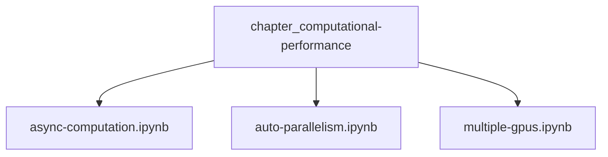
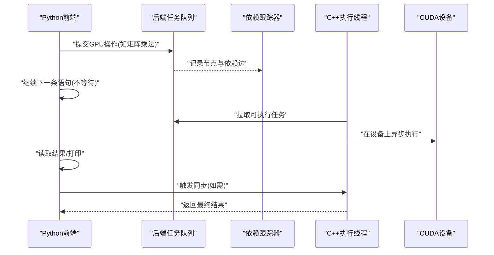
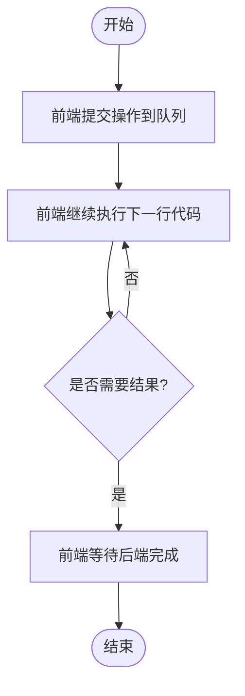
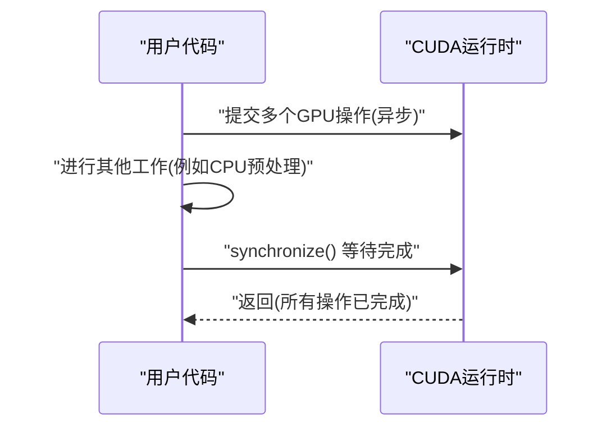
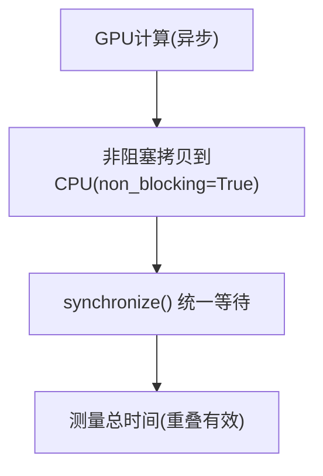
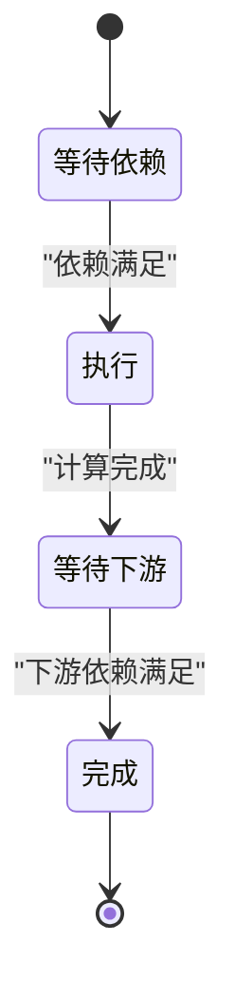
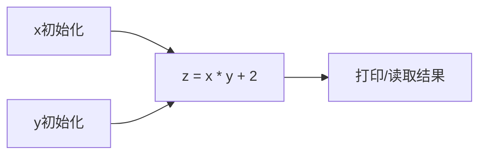

# 异步计算

<cite>
**本文引用的文件**   
- [async-computation.ipynb](file://chapter_computational-performance/async-computation.ipynb)
- [auto-parallelism.ipynb](file://chapter_computational-performance/auto-parallelism.ipynb)
- [multiple-gpus.ipynb](file://chapter_computational-performance/multiple-gpus.ipynb)
</cite>

## 目录
1. [简介](#简介)
2. [项目结构](#项目结构)
3. [核心组件](#核心组件)
4. [架构总览](#架构总览)
5. [详细组件分析](#详细组件分析)
6. [依赖关系分析](#依赖关系分析)
7. [性能考量](#性能考量)
8. [故障排查指南](#故障排查指南)
9. [结论](#结论)
10. [附录：最佳实践与常见陷阱](#附录最佳实践与常见陷阱)

## 简介
本章节聚焦于PyTorch中的异步计算机制，解释前端Python线程与后端C++线程的交互方式、GPU操作的异步执行特性、任务队列管理与依赖关系跟踪、同步与异步的区别及同步方法的使用场景，并说明异步如何提升CPU/GPU利用率、降低内存开销。文档还包含障碍器（barrier）与阻塞器（blocker）的工作原理说明，以及基于仓库示例的性能优势展示与最佳实践建议。

## 项目结构
本节内容主要来源于“计算性能”章节下的三个notebook：
- 异步计算基础与前后端交互
- 自动并行与通信重叠（non_blocking）
- 多GPU训练中的屏障同步与数据并行

**图表来源** 
- [async-computation.ipynb:1-30](file://chapter_computational-performance/async-computation.ipynb#L1-L30)
- [auto-parallelism.ipynb:1-30](file://chapter_computational-performance/auto-parallelism.ipynb#L1-L30)
- [multiple-gpus.ipynb:1-30](file://chapter_computational-performance/multiple-gpus.ipynb#L1-L30)

**章节来源**
- [async-computation.ipynb:1-30](file://chapter_computational-performance/async-computation.ipynb#L1-L30)
- [auto-parallelism.ipynb:1-30](file://chapter_computational-performance/auto-parallelism.ipynb#L1-L30)
- [multiple-gpus.ipynb:1-30](file://chapter_computational-performance/multiple-gpus.ipynb#L1-L30)

## 核心组件
- 前端（Python）与后端（C++）解耦：前端负责构建操作与调度，后端维护任务队列与执行线程，跟踪计算图依赖。
- GPU异步执行：默认情况下GPU操作被入队而非立即执行，直到需要结果或显式同步。
- 同步原语：torch.cuda.synchronize()用于等待设备上的所有流完成，常用于计时与调试。
- 非阻塞拷贝：to()/copy_()支持non_blocking参数，允许在GPU仍在计算时启动数据传输，实现计算与通信重叠。
- 屏障（barrier）：在多设备或多层依赖场景中，确保所有相关计算完成后才继续后续步骤。

**章节来源**
- [async-computation.ipynb:10-16](file://chapter_computational-performance/async-computation.ipynb#L10-L16)
- [async-computation.ipynb:118-122](file://chapter_computational-performance/async-computation.ipynb#L118-L122)
- [auto-parallelism.ipynb:89-91](file://chapter_computational-performance/auto-parallelism.ipynb#L89-L91)
- [auto-parallelism.ipynb:250-256](file://chapter_computational-performance/auto-parallelism.ipynb#L250-L256)
- [multiple-gpus.ipynb:48-52](file://chapter_computational-performance/multiple-gpus.ipynb#L48-L52)

## 架构总览
下图展示了Python前端与C++后端的交互流程，包括任务入队、依赖跟踪、异步执行与结果返回。

**图表来源** 
- [async-computation.ipynb:160-167](file://chapter_computational-performance/async-computation.ipynb#L160-L167)
- [auto-parallelism.ipynb:290-302](file://chapter_computational-performance/auto-parallelism.ipynb#L290-L302)

**章节来源**
- [async-computation.ipynb:160-167](file://chapter_computational-performance/async-computation.ipynb#L160-L167)
- [auto-parallelism.ipynb:290-302](file://chapter_computational-performance/auto-parallelism.ipynb#L290-L302)

## 详细组件分析

### 前端与后端的异步交互
- Python前端将操作插入后端队列，不等待执行完成；当需要结果（如打印或后续依赖）时，前端才会阻塞等待。
- 后端维护计算图依赖，仅当输入就绪且无冲突时才执行任务，从而最大化并行度。
- 通过基准测试对比NumPy（CPU同步）与PyTorch（GPU异步）的时间差异，体现异步带来的显著加速。

**图表来源** 
- [async-computation.ipynb:118-122](file://chapter_computational-performance/async-computation.ipynb#L118-L122)
- [async-computation.ipynb:148-155](file://chapter_computational-performance/async-computation.ipynb#L148-L155)

**章节来源**
- [async-computation.ipynb:118-122](file://chapter_computational-performance/async-computation.ipynb#L118-L122)
- [async-computation.ipynb:148-155](file://chapter_computational-performance/async-computation.ipynb#L148-L155)

### 同步与异步的区别与使用场景
- 异步：调用即入队，立即返回控制给前端，适合流水线化与重叠计算/通信。
- 同步：强制等待设备完成，常用于计时、调试、跨设备一致性检查。
- torch.cuda.synchronize(device)会等待指定设备的所有流完成；若不传device则对当前设备生效。

**图表来源** 
- [auto-parallelism.ipynb:89-91](file://chapter_computational-performance/auto-parallelism.ipynb#L89-L91)
- [auto-parallelism.ipynb:127-137](file://chapter_computational-performance/auto-parallelism.ipynb#L127-L137)
- [auto-parallelism.ipynb:179-183](file://chapter_computational-performance/auto-parallelism.ipynb#L179-L183)

**章节来源**
- [auto-parallelism.ipynb:89-91](file://chapter_computational-performance/auto-parallelism.ipynb#L89-L91)
- [auto-parallelism.ipynb:127-137](file://chapter_computational-performance/auto-parallelism.ipynb#L127-L137)
- [auto-parallelism.ipynb:179-183](file://chapter_computational-performance/auto-parallelism.ipynb#L179-L183)

### 非阻塞拷贝与计算/通信重叠
- to()/copy_()支持non_blocking=True，可在GPU仍在计算时启动PCIe传输，减少总耗时。
- 典型模式：先运行GPU计算，再发起非阻塞拷贝，最后统一同步以获取准确时间。

**图表来源** 
- [auto-parallelism.ipynb:250-256](file://chapter_computational-performance/auto-parallelism.ipynb#L250-L256)
- [auto-parallelism.ipynb:283-287](file://chapter_computational-performance/auto-parallelism.ipynb#L283-L287)

**章节来源**
- [auto-parallelism.ipynb:250-256](file://chapter_computational-performance/auto-parallelism.ipynb#L250-L256)
- [auto-parallelism.ipynb:283-287](file://chapter_computational-performance/auto-parallelism.ipynb#L283-L287)

### 屏障（barrier）与阻塞器（blocker）
- 屏障（barrier）：在多设备或多层依赖中，确保所有相关计算完成后才继续后续步骤。例如多GPU训练中每层依赖前一层结果，需大量屏障同步。
- 阻塞器（blocker）：在框架内部用于挂起某些操作直到依赖满足，避免乱序执行导致的数据竞争。
- 在PyTorch中，屏障通常由框架根据依赖图隐式插入；显式同步可通过synchronize()或在需要结果的点隐式触发。

**图表来源** 
- [multiple-gpus.ipynb:48-52](file://chapter_computational-performance/multiple-gpus.ipynb#L48-L52)
- [async-computation.ipynb:160-167](file://chapter_computational-performance/async-computation.ipynb#L160-L167)

**章节来源**
- [multiple-gpus.ipynb:48-52](file://chapter_computational-performance/multiple-gpus.ipynb#L48-L52)
- [async-computation.ipynb:160-167](file://chapter_computational-performance/async-computation.ipynb#L160-L167)

### 性能优势示例（基于notebook基准）
- NumPy在CPU上同步执行矩阵乘法，PyTorch在GPU上异步执行，前者耗时远大于后者。
- 加入synchronize()后，实际GPU执行时间显现，验证了异步入队与延迟执行的特性。
- 非阻塞拷贝与计算重叠进一步缩短端到端时间，体现异步编程的收益。

**章节来源**
- [async-computation.ipynb:94-108](file://chapter_computational-performance/async-computation.ipynb#L94-L108)
- [async-computation.ipynb:148-155](file://chapter_computational-performance/async-computation.ipynb#L148-L155)
- [auto-parallelism.ipynb:283-287](file://chapter_computational-performance/auto-parallelism.ipynb#L283-L287)

## 依赖关系分析
- 后端通过计算图跟踪各步骤之间的依赖，无法并行化相互依赖的操作。
- 独立初始化或无依赖的操作可被并行执行，提高吞吐。
- 多GPU场景下，数据并行天然具备低耦合性，适合大规模并行；模型并行则需要更多屏障同步。

**图表来源** 
- [async-computation.ipynb:212-216](file://chapter_computational-performance/async-computation.ipynb#L212-L216)
- [auto-parallelism.ipynb:290-302](file://chapter_computational-performance/auto-parallelism.ipynb#L290-L302)

**章节来源**
- [async-computation.ipynb:212-216](file://chapter_computational-performance/async-computation.ipynb#L212-L216)
- [auto-parallelism.ipynb:290-302](file://chapter_computational-performance/auto-parallelism.ipynb#L290-L302)

## 性能考量
- 异步可减少前端等待时间，提升CPU/GPU利用率。
- 过度填充任务队列可能导致内存占用上升，建议按小批量粒度进行同步，保持前后端大致同步。
- 使用工具（如NVIDIA Nsight）进行细粒度性能分析与验证。

**章节来源**
- [async-computation.ipynb:262-267](file://chapter_computational-performance/async-computation.ipynb#L262-L267)
- [auto-parallelism.ipynb:303-315](file://chapter_computational-performance/auto-parallelism.ipynb#L303-L315)

## 故障排查指南
- 若计时异常或结果不一致，检查是否遗漏synchronize()或在错误位置同步。
- 多GPU训练出现梯度不同步，确认屏障位置与allreduce调用顺序。
- 使用设备级synchronize(device)定位具体设备的瓶颈。

**章节来源**
- [auto-parallelism.ipynb:89-91](file://chapter_computational-performance/auto-parallelism.ipynb#L89-L91)
- [multiple-gpus.ipynb:48-52](file://chapter_computational-performance/multiple-gpus.ipynb#L48-L52)

## 结论
PyTorch通过前端与后端的解耦设计，实现了GPU操作的异步执行与依赖驱动的并行调度。合理使用synchronize()与非阻塞拷贝，可以在保证正确性的前提下显著提升性能与资源利用率。在多GPU与复杂依赖场景中，理解屏障与阻塞机制有助于编写高效且稳定的程序。

## 附录：最佳实践与常见陷阱
- 最佳实践
  - 仅在必要时同步（计时、调试、跨设备一致性）。
  - 使用non_blocking=True进行GPU到CPU的拷贝，实现计算与通信重叠。
  - 按小批量粒度同步，避免队列膨胀导致内存峰值过高。
  - 利用框架自动并行能力，减少手动调度复杂度。
- 常见陷阱
  - 忘记同步导致计时不准确或结果未就绪。
  - 在不支持的硬件/驱动上使用non_blocking引发异常。
  - 过度同步破坏并行性，降低吞吐。

[无需来源：本节为通用指导，不直接分析具体文件]