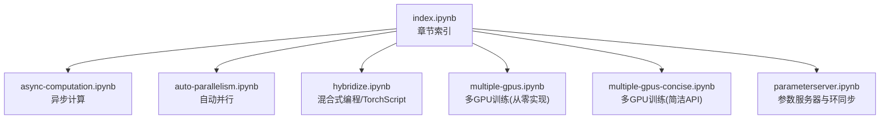
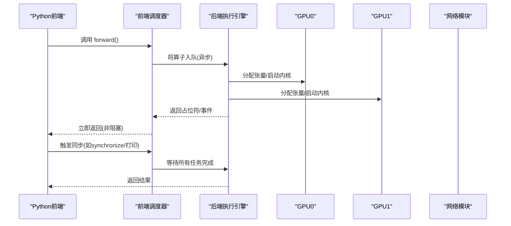
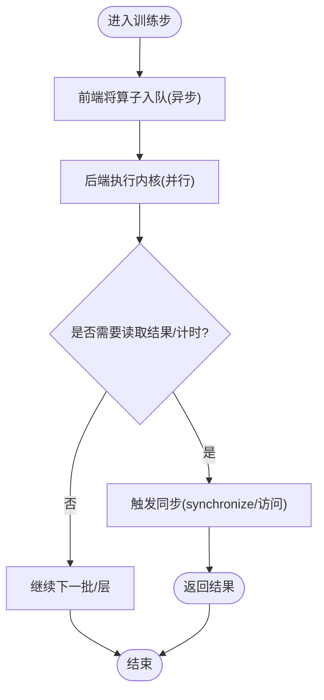
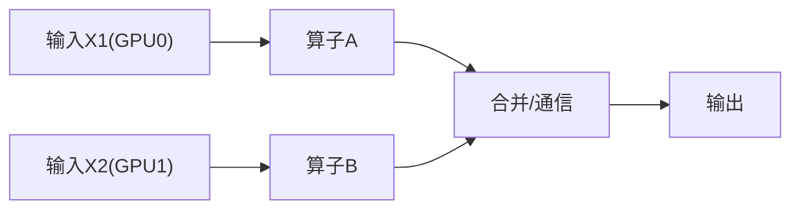
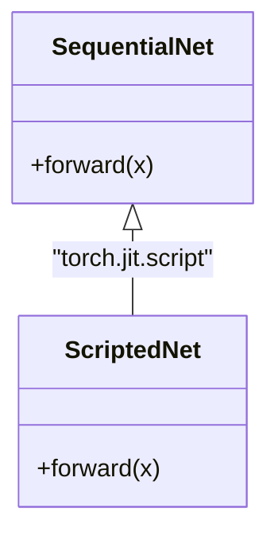
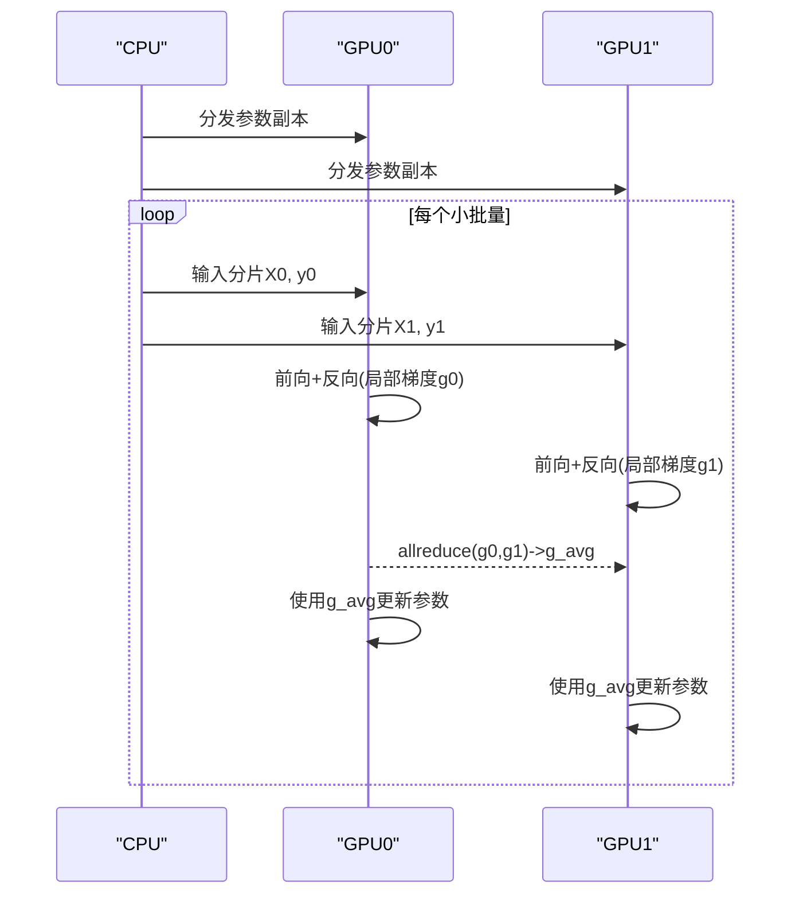
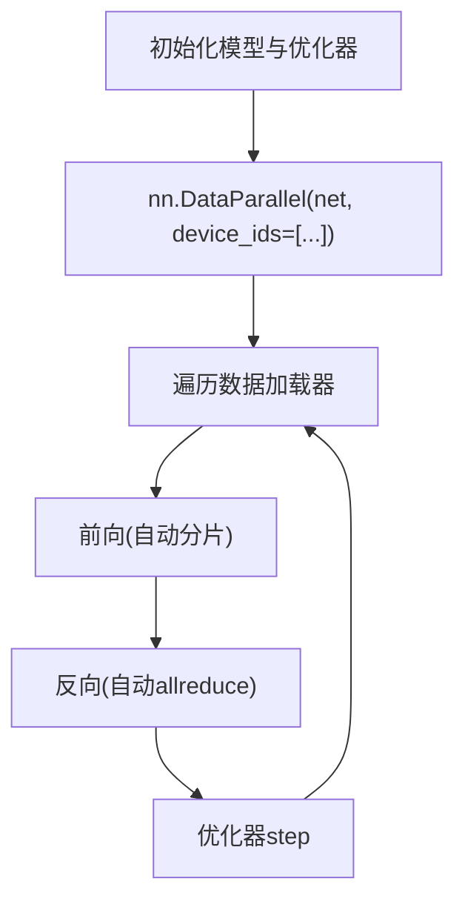
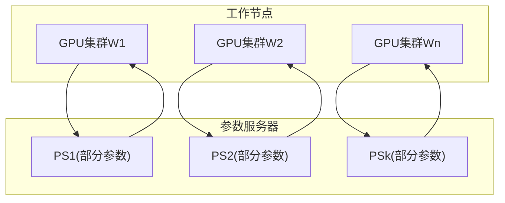
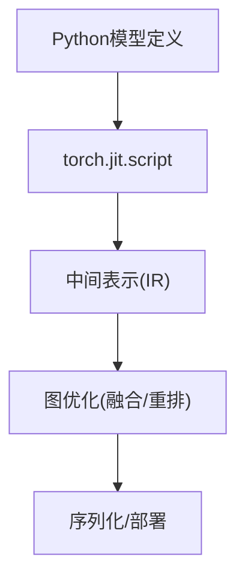
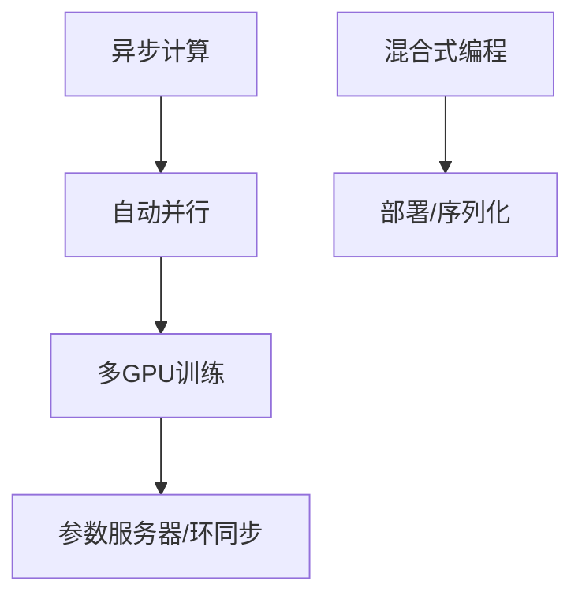

# 计算性能

<cite>
**本文引用的文件**   
- [chapter_computational-performance/index.ipynb](file://chapter_computational-performance/index.ipynb)
- [chapter_computational-performance/async-computation.ipynb](file://chapter_computational-performance/async-computation.ipynb)
- [chapter_computational-performance/auto-parallelism.ipynb](file://chapter_computational-performance/auto-parallelism.ipynb)
- [chapter_computational-performance/hybridize.ipynb](file://chapter_computational-performance/hybridize.ipynb)
- [chapter_computational-performance/multiple-gpus.ipynb](file://chapter_computational-performance/multiple-gpus.ipynb)
- [chapter_computational-performance/multiple-gpus-concise.ipynb](file://chapter_computational-performance/multiple-gpus-concise.ipynb)
- [chapter_computational-performance/parameterserver.ipynb](file://chapter_computational-performance/parameterserver.ipynb)
- [chapter_deep-learning-computation/model-construction.py](file://chapter_deep-learning-computation/model-construction.py)
- [chapter_multilayer-perceptrons/mlp-concise.py](file://chapter_multilayer-perceptrons/mlp-concise.py)
</cite>

## 目录
1. [引言](#引言)
2. [项目结构](#项目结构)
3. [核心组件](#核心组件)
4. [架构总览](#架构总览)
5. [详细组件分析](#详细组件分析)
6. [依赖关系分析](#依赖关系分析)
7. [性能考量与优化实践](#性能考量与优化实践)
8. [故障排查指南](#故障排查指南)
9. [结论](#结论)
10. [附录](#附录)

## 引言
本章聚焦深度学习训练中的“计算性能”主题，系统阐述异步计算、自动并行、混合精度、多GPU/分布式训练、计算图优化与编译、性能分析与瓶颈识别、内存优化与加速、大规模部署与资源管理、以及监控调试工具等关键内容。通过仓库中“计算性能”章节的示例与实践，帮助读者在不牺牲精度的前提下显著缩短训练时间并提升吞吐。

## 项目结构
“计算性能”相关代码与教程集中在 chapter_computational-performance 目录下，涵盖：
- 异步计算（前端/后端解耦、任务队列、同步点）
- 自动并行（设备间调度、通信与计算重叠）
- 编译器与解释器（命令式 vs 符号式，TorchScript 混合式）
- 多GPU训练（数据并行、梯度聚合、allreduce）
- 参数服务器与环同步（跨机扩展、带宽层次）

**图表来源** 
- [chapter_computational-performance/index.ipynb:1-40](file://chapter_computational-performance/index.ipynb#L1-L40)

**章节来源**
- [chapter_computational-performance/index.ipynb:1-40](file://chapter_computational-performance/index.ipynb#L1-L40)

## 核心组件
- 异步执行模型：Python 前端将操作入队，C++ 后端线程池消费任务；使用同步原语控制边界。
- 自动并行：基于计算图的依赖分析，在多个设备上并发执行无依赖子图，并与通信重叠。
- 混合式编程：用 TorchScript 将命令式模型编译为静态图，减少解释器开销并启用更多优化。
- 多GPU数据并行：每个设备维护完整参数副本，按小批量切片独立前向/反向，再聚合梯度更新。
- 参数服务器与环同步：针对多机多卡场景，采用分层聚合与环形拓扑最大化带宽利用率。

**章节来源**
- [chapter_computational-performance/async-computation.ipynb:1-314](file://chapter_computational-performance/async-computation.ipynb#L1-L314)
- [chapter_computational-performance/auto-parallelism.ipynb:1-340](file://chapter_computational-performance/auto-parallelism.ipynb#L1-L340)
- [chapter_computational-performance/hybridize.ipynb:1-507](file://chapter_computational-performance/hybridize.ipynb#L1-L507)
- [chapter_computational-performance/multiple-gpus.ipynb:1-800](file://chapter_computational-performance/multiple-gpus.ipynb#L1-L800)
- [chapter_computational-performance/multiple-gpus-concise.ipynb:1-800](file://chapter_computational-performance/multiple-gpus-concise.ipynb#L1-L800)
- [chapter_computational-performance/parameterserver.ipynb:1-124](file://chapter_computational-performance/parameterserver.ipynb#L1-L124)

## 架构总览
下图展示了从 Python 前端到后端执行引擎、再到多设备并行与通信的整体流程。

**图表来源** 
- [chapter_computational-performance/async-computation.ipynb:150-170](file://chapter_computational-performance/async-computation.ipynb#L150-L170)
- [chapter_computational-performance/auto-parallelism.ipynb:170-190](file://chapter_computational-performance/auto-parallelism.ipynb#L170-L190)

## 详细组件分析

### 异步计算：前端/后端解耦与同步点
- 概念要点
  - 前端仅负责构建计算图并将任务入队；后端线程池负责实际执行。
  - 默认情况下，GPU 操作是异步的，避免频繁同步带来的阻塞。
  - 通过显式同步点（如 CUDA synchronize、访问输出）确保一致性。
- 实践建议
  - 在小批量循环内避免不必要的同步，仅在需要测量或调试时插入。
  - 利用 non_blocking 传输与流，使计算与数据传输重叠。
- 典型模式
  - 预热设备后计时，减少冷启动影响。
  - 使用基准工具对比有/无同步的时间差异。

**图表来源** 
- [chapter_computational-performance/async-computation.ipynb:110-170](file://chapter_computational-performance/async-computation.ipynb#L110-L170)

**章节来源**
- [chapter_computational-performance/async-computation.ipynb:1-314](file://chapter_computational-performance/async-computation.ipynb#L1-L314)

### 自动并行：设备间调度与通信重叠
- 原理
  - 框架根据计算图依赖关系，自动将无依赖的子图分配到不同设备并行执行。
  - 通信（如 to('cpu')、scatter/allreduce）可与计算重叠，降低整体延迟。
- 关键点
  - 使用 non_blocking=True 进行拷贝，允许流水线化。
  - 合理划分批次与算子粒度，提高设备利用率。
- 实验观察
  - 两个 GPU 上分别执行相同矩阵乘法，总耗时小于两者之和，体现自动并行收益。

**图表来源** 
- [chapter_computational-performance/auto-parallelism.ipynb:120-190](file://chapter_computational-performance/auto-parallelism.ipynb#L120-L190)

**章节来源**
- [chapter_computational-performance/auto-parallelism.ipynb:1-340](file://chapter_computational-performance/auto-parallelism.ipynb#L1-L340)

### 混合式编程与编译优化（TorchScript）
- 动机
  - 命令式编程便于开发调试，但存在解释器开销与图优化受限问题。
  - 符号式/编译式可消除解释器开销、进行常量折叠、算子融合等优化。
- 方法
  - 使用 torch.jit.script 将 nn.Sequential 或自定义 Module 脚本化。
  - 序列化模型以支持跨语言/环境部署。
- 效果
  - 在相同模型下，脚本化后推理/训练步时间通常下降。

**图表来源** 
- [chapter_computational-performance/hybridize.ipynb:240-380](file://chapter_computational-performance/hybridize.ipynb#L240-L380)

**章节来源**
- [chapter_computational-performance/hybridize.ipynb:1-507](file://chapter_computational-performance/hybridize.ipynb#L1-L507)

### 多GPU训练：数据并行与梯度聚合
- 数据并行流程
  - 每个 GPU 持有完整参数副本。
  - 小批量切分到各 GPU，独立前向/反向计算损失与梯度。
  - 使用 allreduce 聚合梯度，再统一更新参数。
- 关键函数
  - split_batch：将输入与标签均匀拆分到多设备。
  - allreduce：跨设备向量求和并广播。
- 训练循环
  - 在每个 epoch 内迭代数据加载器，调用 train_batch 执行多卡训练。
  - 评估通常在单卡上进行，简化实现。

**图表来源** 
- [chapter_computational-performance/multiple-gpus.ipynb:210-320](file://chapter_computational-performance/multiple-gpus.ipynb#L210-L320)
- [chapter_computational-performance/multiple-gpus.ipynb:460-540](file://chapter_computational-performance/multiple-gpus.ipynb#L460-L540)

**章节来源**
- [chapter_computational-performance/multiple-gpus.ipynb:1-800](file://chapter_computational-performance/multiple-gpus.ipynb#L1-L800)

### 多GPU训练：简洁实现（DataParallel）
- 思路
  - 使用 nn.DataParallel 包装模型，自动完成数据分发与梯度聚合。
  - 训练循环与单卡类似，仅需指定 device_ids。
- 适用性
  - 快速原型验证与中等规模多卡训练。
  - 更复杂的场景建议使用 DistributedDataParallel（本仓库未包含）。

**图表来源** 
- [chapter_computational-performance/multiple-gpus-concise.ipynb:180-210](file://chapter_computational-performance/multiple-gpus-concise.ipynb#L180-L210)

**章节来源**
- [chapter_computational-performance/multiple-gpus-concise.ipynb:1-800](file://chapter_computational-performance/multiple-gpus-concise.ipynb#L1-L800)

### 参数服务器与环同步（多机多卡）
- 背景
  - 单机多卡可用 NVLink/PCIe，多机之间受限于以太网带宽。
  - 同步策略需适配硬件拓扑与带宽层次。
- 策略
  - 单参数服务器：简单但易成瓶颈。
  - 多参数服务器：按参数分片存储，线性扩展聚合带宽。
  - 环同步：将梯度分块并在环上滚动累加，时间复杂度接近常数。
- 实践
  - 结合 Horovod 等框架实现 push/pull 语义的键值存储抽象。

**图表来源** 
- [chapter_computational-performance/parameterserver.ipynb:60-110](file://chapter_computational-performance/parameterserver.ipynb#L60-L110)

**章节来源**
- [chapter_computational-performance/parameterserver.ipynb:1-124](file://chapter_computational-performance/parameterserver.ipynb#L1-L124)

### 计算图优化与编译技术
- 动态图 vs 静态图
  - 动态图灵活但优化受限；静态图可进行全局优化（融合、重排、常量折叠）。
- TorchScript
  - 将 Python 定义的模型转换为可序列化的中间表示，支持跨平台部署。
  - 在推理与训练步均可获得速度提升。
- 其他优化
  - 算子融合（如 Conv+BN+ReLU）、内存复用、Kernel 选择。

**图表来源** 
- [chapter_computational-performance/hybridize.ipynb:240-380](file://chapter_computational-performance/hybridize.ipynb#L240-L380)

**章节来源**
- [chapter_computational-performance/hybridize.ipynb:1-507](file://chapter_computational-performance/hybridize.ipynb#L1-L507)

### 性能分析与瓶颈识别
- 常用手段
  - 使用同步点前后计时，定位热点步骤。
  - 借助厂商工具（如 Nsight Compute/Systems）分析 GPU 利用率、内存带宽、内核耗时。
- 关注点
  - I/O 瓶颈（数据加载慢于计算）。
  - 通信瓶颈（allreduce/广播成为热点）。
  - Python 解释器开销（可通过脚本化缓解）。
- 实践
  - 在训练循环中插入轻量级计时，绘制每步耗时分布。

[本节为通用指导，不直接分析具体文件]

### 内存优化与计算加速最佳实践
- 内存
  - 合理使用 batch size，避免 OOM。
  - 及时释放中间变量，使用 in-place 操作谨慎。
  - 使用梯度累积模拟更大 batch。
- 精度
  - 混合精度（AMP）可降低显存占用并提升吞吐（本仓库未包含示例，实践中推荐）。
- 并行
  - 优先数据并行，必要时考虑模型并行或流水线并行。
  - 使用 non_blocking 传输与多流重叠计算与通信。

[本节为通用指导，不直接分析具体文件]

### 大规模训练的部署策略与资源管理
- 单机多卡
  - 使用 DataParallel/DistributedDataParallel 简化实现。
  - 调整学习率与 batch size，配合 warmup 与 LR 调度。
- 多机多卡
  - 采用参数服务器或 AllReduce 集合通信。
  - 根据拓扑选择最优同步策略（环同步、树形聚合）。
- 资源管理
  - 容器化部署，隔离环境。
  - 使用作业调度器（Slurm/Kubernetes）管理 GPU/CPU/内存配额。

[本节为通用指导，不直接分析具体文件]

### 性能监控与调试工具使用方法
- 内置工具
  - torch.cuda.synchronize 用于精确计时与调试。
  - 日志记录关键指标（loss、acc、吞吐、内存峰值）。
- 外部工具
  - NVIDIA Nsight Systems/Compute：可视化内核执行、内存访问、通信。
  - 系统监控：nvidia-smi、htop、iostat 等。
- 调试技巧
  - 逐步缩小问题范围（单卡/双卡、小batch、简化模型）。
  - 检查数据/参数形状与设备一致性。

[本节为通用指导，不直接分析具体文件]

## 依赖关系分析
- 模块耦合
  - 异步与自动并行依赖后端执行引擎对计算图的依赖解析。
  - 多GPU训练依赖 scatter/allreduce 等集合通信原语。
  - 混合式编程依赖 TorchScript 编译器与序列化机制。
- 潜在循环依赖
  - 训练循环与数据加载器应解耦，避免死锁。
- 外部依赖
  - CUDA/NCCL（多卡通信）、NVLink/PCIe（硬件拓扑）。

**图表来源** 
- [chapter_computational-performance/async-computation.ipynb:150-170](file://chapter_computational-performance/async-computation.ipynb#L150-L170)
- [chapter_computational-performance/auto-parallelism.ipynb:170-190](file://chapter_computational-performance/auto-parallelism.ipynb#L170-L190)
- [chapter_computational-performance/multiple-gpus.ipynb:210-320](file://chapter_computational-performance/multiple-gpus.ipynb#L210-L320)
- [chapter_computational-performance/parameterserver.ipynb:60-110](file://chapter_computational-performance/parameterserver.ipynb#L60-L110)

**章节来源**
- [chapter_computational-performance/async-computation.ipynb:1-314](file://chapter_computational-performance/async-computation.ipynb#L1-L314)
- [chapter_computational-performance/auto-parallelism.ipynb:1-340](file://chapter_computational-performance/auto-parallelism.ipynb#L1-L340)
- [chapter_computational-performance/multiple-gpus.ipynb:1-800](file://chapter_computational-performance/multiple-gpus.ipynb#L1-L800)
- [chapter_computational-performance/parameterserver.ipynb:1-124](file://chapter_computational-performance/parameterserver.ipynb#L1-L124)

## 性能考量与优化实践
- 数据加载与模型训练并行化
  - 使用多线程/多进程 DataLoader，预取数据，避免 GPU 空闲。
  - 将数据预处理移至 GPU 或使用高效算子。
- 自动并行与通信重叠
  - 开启 non_blocking 传输，使用多流隐藏通信延迟。
  - 合理划分批次，使计算与通信比例均衡。
- 混合精度训练
  - 使用 AMP 降低显存占用，提升吞吐（需验证数值稳定性）。
- 多GPU/分布式策略
  - 优先数据并行；当模型过大时考虑模型并行或流水线并行。
  - 选择合适的集合通信后端（NCCL）与拓扑感知策略。
- 计算图优化与编译
  - 使用 TorchScript 或导出 ONNX 进行部署优化。
  - 启用算子融合与内存复用。
- 内存优化
  - 梯度累积、激活检查点、减少中间变量。
- 大规模部署
  - 容器化、弹性扩缩容、作业调度与资源隔离。
- 监控与调试
  - 定期采集 GPU/CPU/内存/网络指标，建立基线与告警。

[本节为通用指导，不直接分析具体文件]

## 故障排查指南
- 常见问题
  - OOM：减小 batch size、启用梯度累积、使用混合精度。
  - 速度慢：检查数据加载是否瓶颈、是否存在过多同步点。
  - 多卡不一致：确认参数同步是否正确，allreduce 是否覆盖所有参数。
- 调试步骤
  - 单卡复现问题，逐步增加卡数定位。
  - 插入同步点与日志，观察关键路径耗时。
  - 使用 Nsight 分析内核与内存访问模式。

**章节来源**
- [chapter_computational-performance/async-computation.ipynb:110-170](file://chapter_computational-performance/async-computation.ipynb#L110-L170)
- [chapter_computational-performance/multiple-gpus.ipynb:210-320](file://chapter_computational-performance/multiple-gpus.ipynb#L210-L320)

## 结论
通过异步计算、自动并行、混合式编译、多GPU数据并行与分布式同步等技术的组合应用，可以显著提升深度学习训练的性能与可扩展性。实践中需结合硬件拓扑与通信带宽，选择合适的并行策略与优化手段，并辅以完善的监控与调试体系，确保稳定高效的训练体验。

[本节为总结性内容，不直接分析具体文件]

## 附录
- 参考实现路径
  - 模型构建与模块化设计：[model-construction.py](file://chapter_deep-learning-computation/model-construction.py)
  - 简洁训练循环与可视化：[mlp-concise.py](file://chapter_multilayer-perceptrons/mlp-concise.py)

**章节来源**
- [chapter_deep-learning-computation/model-construction.py:1-95](file://chapter_deep-learning-computation/model-construction.py#L1-L95)
- [chapter_multilayer-perceptrons/mlp-concise.py:1-59](file://chapter_multilayer-perceptrons/mlp-concise.py#L1-L59)