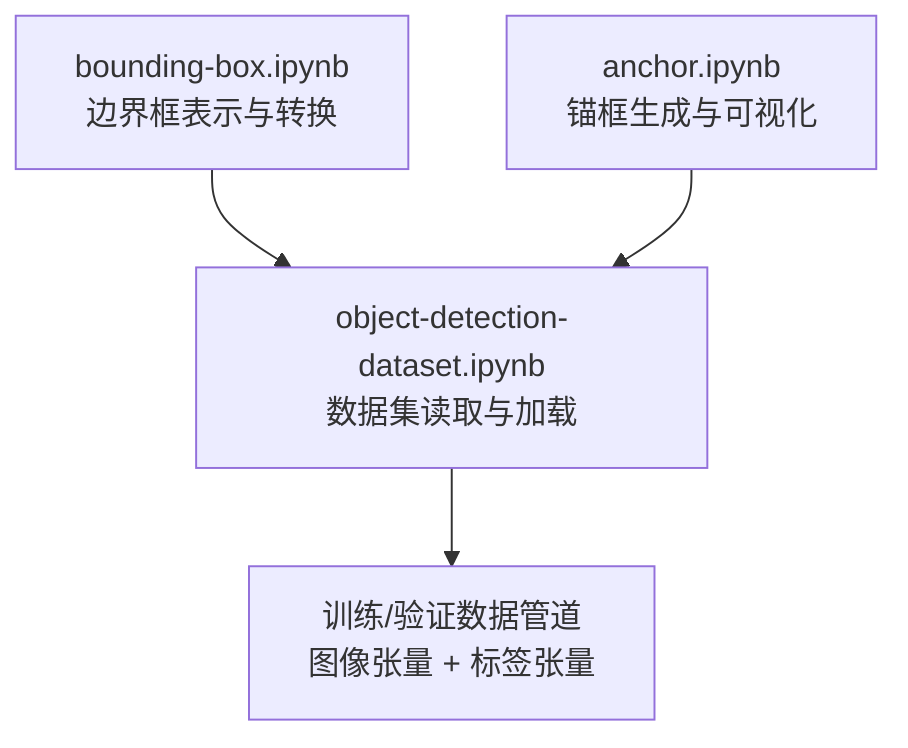
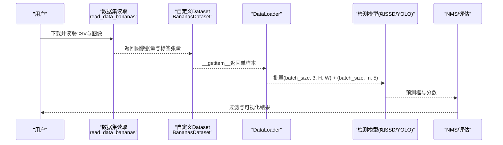
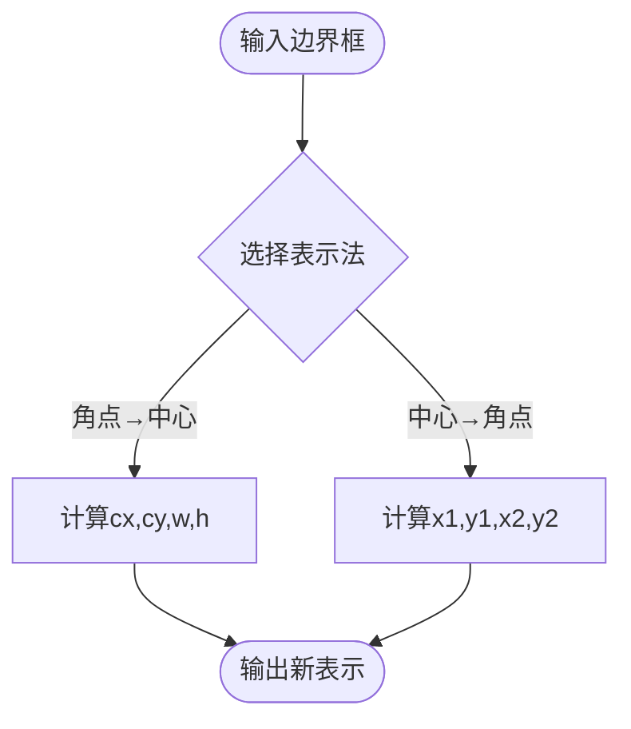
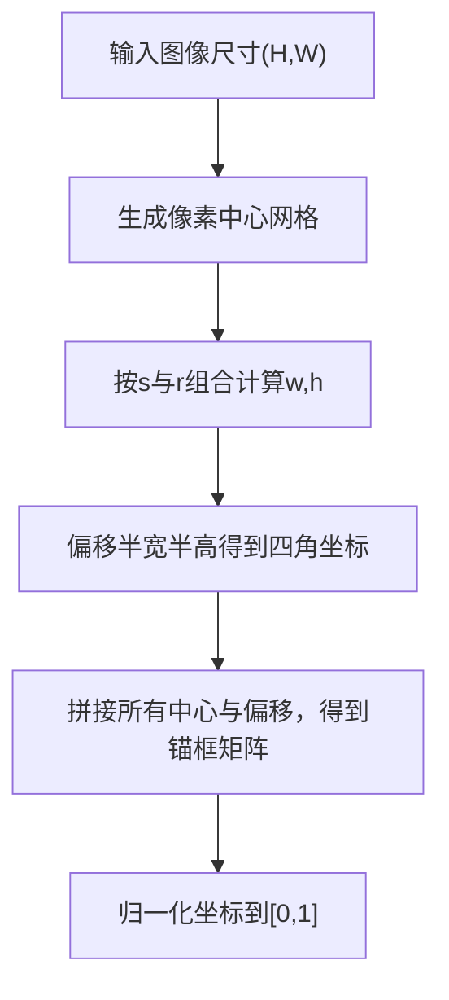
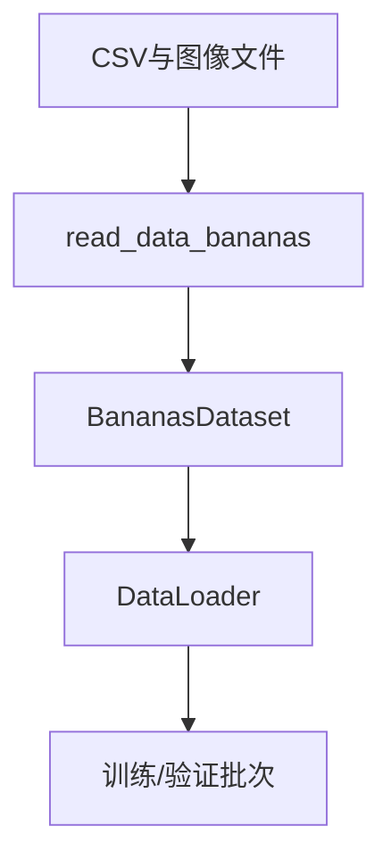
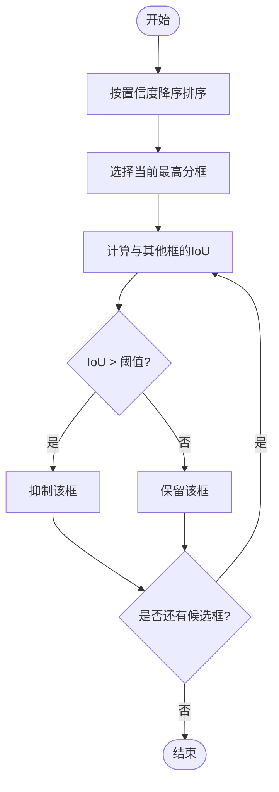
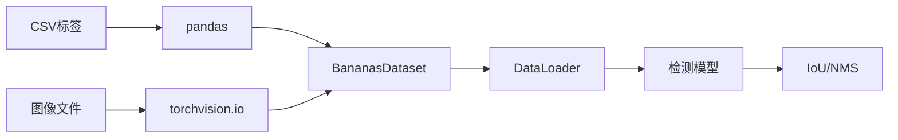

# 目标检测

<cite>
**本文引用的文件**   
- [bounding-box.ipynb](file://chapter_computer-vision/bounding-box.ipynb)
- [anchor.ipynb](file://chapter_computer-vision/anchor.ipynb)
- [object-detection-dataset.ipynb](file://chapter_computer-vision/object-detection-dataset.ipynb)
</cite>

## 目录
1. [引言](#引言)
2. [项目结构](#项目结构)
3. [核心组件](#核心组件)
4. [架构总览](#架构总览)
5. [详细组件分析](#详细组件分析)
6. [依赖关系分析](#依赖关系分析)
7. [性能考量](#性能考量)
8. [故障排查指南](#故障排查指南)
9. [结论](#结论)
10. [附录](#附录)

## 引言
本文件面向目标检测任务，系统讲解边界框标注格式与坐标系统（绝对坐标与相对坐标转换）、锚框（Anchor Box）的生成策略与多尺度检测原理、交并比（IoU）与非极大值抑制（NMS）算法、数据集构建与处理流程，以及经典模型SSD与YOLO的核心思想。同时提供边界框处理的代码实现路径与可视化示例说明，并给出mAP评估指标的计算方法与调试技巧。

## 项目结构
本仓库中目标检测相关内容集中在“计算机视觉”章节的三个Notebook：
- bounding-box.ipynb：边界框表示、坐标转换与可视化
- anchor.ipynb：锚框生成、网格化与可视化
- object-detection-dataset.ipynb：香蕉检测数据集的下载、读取、Dataset封装与DataLoader加载

图表来源 
- [bounding-box.ipynb](file://chapter_computer-vision/bounding-box.ipynb)
- [anchor.ipynb](file://chapter_computer-vision/anchor.ipynb)
- [object-detection-dataset.ipynb](file://chapter_computer-vision/object-detection-dataset.ipynb)

章节来源
- [bounding-box.ipynb](file://chapter_computer-vision/bounding-box.ipynb)
- [anchor.ipynb](file://chapter_computer-vision/anchor.ipynb)
- [object-detection-dataset.ipynb](file://chapter_computer-vision/object-detection-dataset.ipynb)

## 核心组件
- 边界框表示与转换
  - 两种常用表示：角点表示（左上x, 左上y, 右下x, 右下y）与中心-宽高表示（cx, cy, w, h）
  - 提供双向转换函数，支持批量输入（n×4）
- 锚框生成
  - 以每个像素为中心，按缩放比s与宽高比r组合生成多个锚框
  - 为控制数量，采用“固定一个比例+遍历另一个维度”的组合策略
  - 输出形状为（批量大小，锚框数，4），坐标归一化为[0,1]
- 数据集与数据管道
  - 自定义CSV标签格式：类别 + 左上/右下坐标（可归一化到[0,1]）
  - 自定义Dataset类封装图像与标签，返回（图像张量，标签张量）
  - DataLoader批量加载，统一标签形状（批大小，最大框数，5），用特殊类别填充非法框

章节来源
- [bounding-box.ipynb](file://chapter_computer-vision/bounding-box.ipynb)
- [anchor.ipynb](file://chapter_computer-vision/anchor.ipynb)
- [object-detection-dataset.ipynb](file://chapter_computer-vision/object-detection-dataset.ipynb)

## 架构总览
下图展示从数据到模型训练的数据流与关键处理模块：

图表来源 
- [object-detection-dataset.ipynb](file://chapter_computer-vision/object-detection-dataset.ipynb)

## 详细组件分析

### 边界框表示与坐标转换
- 角点表示 ↔ 中心-宽高表示的双向转换
- 支持批量操作，便于与模型输出对齐
- 可视化辅助：将边界框转换为绘图矩形对象

图表来源 
- [bounding-box.ipynb](file://chapter_computer-vision/bounding-box.ipynb)

章节来源
- [bounding-box.ipynb](file://chapter_computer-vision/bounding-box.ipynb)

### 锚框（Anchor Box）生成与多尺度检测
- 生成策略
  - 对每个像素中心，按一组缩放比s与宽高比r生成多个锚框
  - 为控制复杂度，仅使用(s1,r1…rm)与(s2…sn,r1)的组合，每像素(n+m-1)个
- 坐标系统
  - 输出坐标归一化到[0,1]，便于跨分辨率一致处理
- 可视化
  - 通过显示工具在图像上绘制不同s/r的锚框，观察覆盖效果

图表来源 
- [anchor.ipynb](file://chapter_computer-vision/anchor.ipynb)

章节来源
- [anchor.ipynb](file://chapter_computer-vision/anchor.ipynb)

### 数据集构建与处理流程
- CSV标签格式
  - 列：图像名、类别、左上x、左上y、右下x、右下y
  - 坐标可归一化到[0,1]
- 读取与封装
  - read_data_bananas：读取CSV与图像，返回图像列表与标签张量
  - BananasDataset：实现__getitem__与__len__，返回标准化后的张量
- DataLoader
  - 训练集打乱，验证集顺序读取
  - 标签统一形状（批大小，最大框数，5），非法框用特殊类别填充

图表来源 
- [object-detection-dataset.ipynb](file://chapter_computer-vision/object-detection-dataset.ipynb)

章节来源
- [object-detection-dataset.ipynb](file://chapter_computer-vision/object-detection-dataset.ipynb)

### 交并比（IoU）与非极大值抑制（NMS）
- IoU定义
  - 两个边界框交集面积与并集面积的比值，衡量重叠程度
- NMS流程
  - 按置信度排序候选框
  - 选取最高分框，抑制与其IoU超过阈值的其余框
  - 重复直至处理完所有候选框

图表来源 
- [anchor.ipynb](file://chapter_computer-vision/anchor.ipynb)
- [bounding-box.ipynb](file://chapter_computer-vision/bounding-box.ipynb)

章节来源
- [anchor.ipynb](file://chapter_computer-vision/anchor.ipynb)
- [bounding-box.ipynb](file://chapter_computer-vision/bounding-box.ipynb)

### 经典模型核心思想（SSD与YOLO）
- SSD（Single Shot MultiBox Detector）
  - 基于多尺度特征图，在每个位置生成多个锚框
  - 直接回归类别概率与边界框偏移，端到端单阶段检测
- YOLO（You Only Look Once）
  - 将检测视为回归问题，划分网格，每个网格预测固定数量的框与类别
  - 单阶段快速推理，兼顾速度与精度

（本节为概念性说明，不直接引用具体代码文件）

## 依赖关系分析
- 数据层依赖
  - pandas用于读取CSV；torchvision用于图像读取；d2l用于下载与工具
- 模型层依赖
  - 通常依赖PyTorch框架进行前向传播与损失计算
- 后处理依赖
  - 需要IoU与NMS等基础几何与筛选逻辑

图表来源 
- [object-detection-dataset.ipynb](file://chapter_computer-vision/object-detection-dataset.ipynb)

章节来源
- [object-detection-dataset.ipynb](file://chapter_computer-vision/object-detection-dataset.ipynb)

## 性能考量
- 锚框数量控制
  - 通过限制s与r的组合方式降低计算复杂度
- 数据管道优化
  - 使用DataLoader并行读取与预处理，减少I/O瓶颈
- 数值稳定性
  - 坐标归一化避免大数值导致的数值不稳定
- 内存占用
  - 合理设置batch_size与最大框数m，防止显存溢出

（本节为通用指导，不直接引用具体代码文件）

## 故障排查指南
- 坐标不一致
  - 检查角点与中心-宽高转换是否正确，确保批量维度一致
- 标签形状异常
  - 确认每张图像的标签被填充到统一长度，非法框类别正确
- 可视化错位
  - 检查坐标是否已归一化到[0,1]，绘图时是否需要还原到像素坐标
- 数据读取失败
  - 核对CSV路径与文件名，确保下载与解压成功

章节来源
- [bounding-box.ipynb](file://chapter_computer-vision/bounding-box.ipynb)
- [anchor.ipynb](file://chapter_computer-vision/anchor.ipynb)
- [object-detection-dataset.ipynb](file://chapter_computer-vision/object-detection-dataset.ipynb)

## 结论
本文件围绕目标检测的关键环节展开：边界框表示与转换、锚框生成与多尺度检测、数据集构建与处理、IoU与NMS算法，以及SSD与YOLO的核心思想。通过提供的代码实现路径与可视化示例，读者可在实际项目中快速搭建与调试检测流水线，并结合mAP评估指标持续优化模型性能。

## 附录
- mAP计算方法（概念性说明）
  - 对每个类别计算PR曲线，求曲线下面积得到AP
  - 对所有类别的AP取平均得到mAP
  - 常用IoU阈值（如0.5或0.5:0.95）影响AP计算
- 调试技巧
  - 逐步打印中间张量形状与数值范围
  - 可视化部分样本的预测框与真实框对比
  - 调整NMS阈值与置信度阈值观察结果变化

（本节为通用指导，不直接引用具体代码文件）