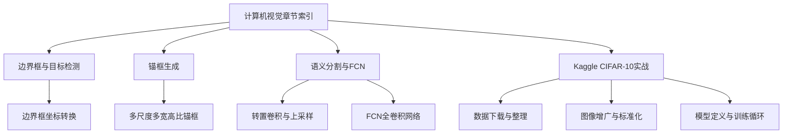
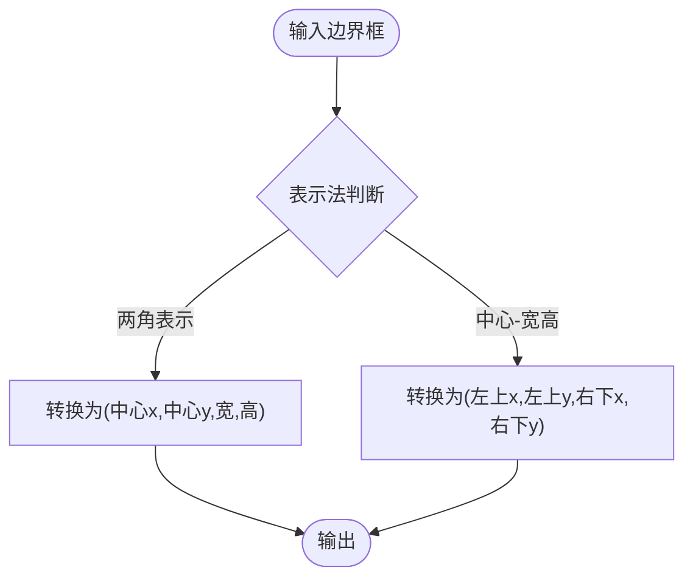
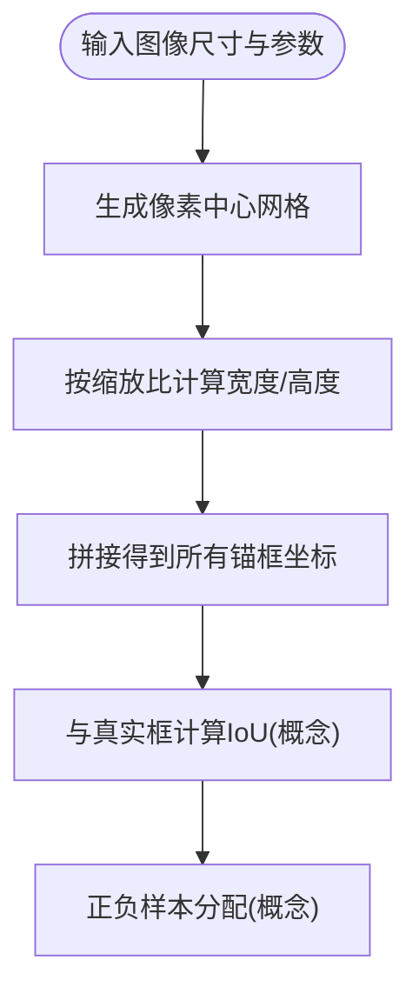
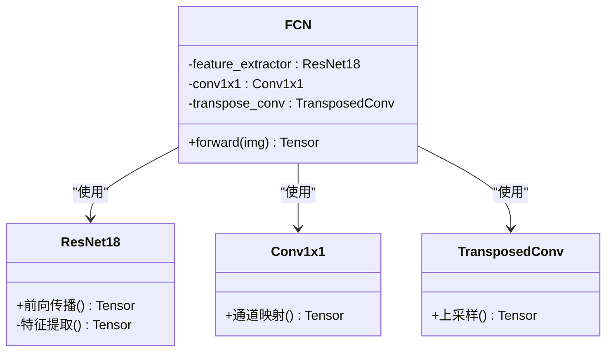
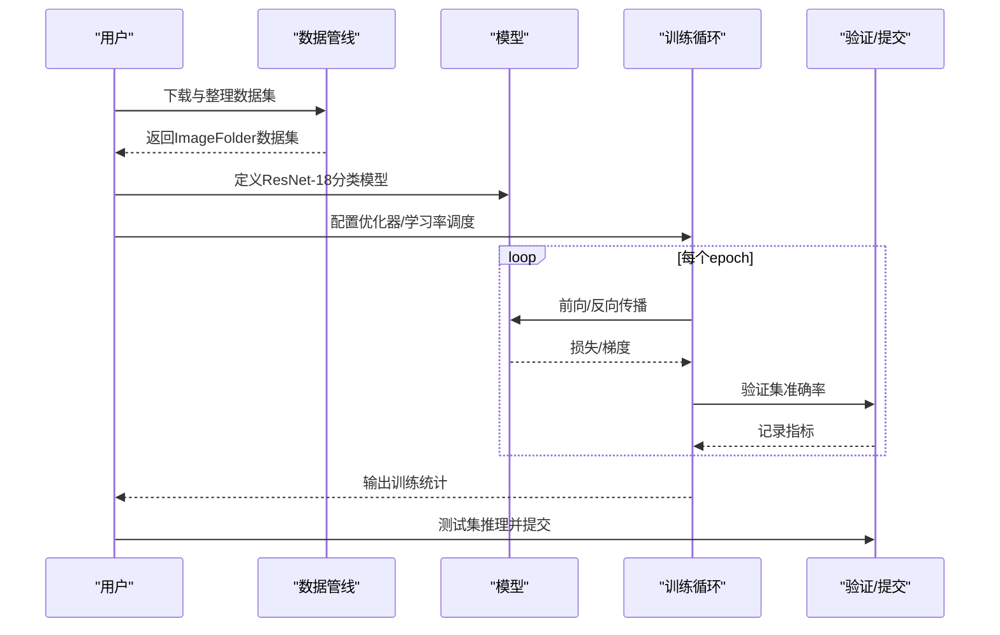
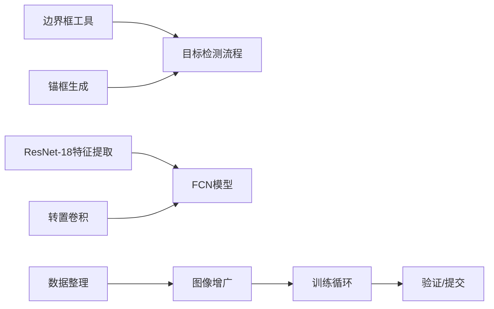

# 计算机视觉应用

<cite>
**本文引用的文件**   
- [chapter_computer-vision/index.ipynb](file://chapter_computer-vision/index.ipynb)
- [chapter_computer-vision/bounding-box.ipynb](file://chapter_computer-vision/bounding-box.ipynb)
- [chapter_computer-vision/anchor.ipynb](file://chapter_computer-vision/anchor.ipynb)
- [chapter_computer-vision/fcn.ipynb](file://chapter_computer-vision/fcn.ipynb)
- [chapter_computer-vision/kaggle-cifar10.ipynb](file://chapter_computer-vision/kaggle-cifar10.ipynb)
</cite>

## 目录
1. [引言](#引言)
2. [项目结构](#项目结构)
3. [核心组件](#核心组件)
4. [架构总览](#架构总览)
5. [详细组件分析](#详细组件分析)
6. [依赖关系分析](#依赖关系分析)
7. [性能考量](#性能考量)
8. [故障排查指南](#故障排查指南)
9. [结论](#结论)
10. [附录](#附录)

## 引言
本章节聚焦计算机视觉应用，系统讲解目标检测与语义分割两大任务的核心流程与实现要点。内容涵盖边界框标注、锚框生成与IoU计算思路；全卷积网络（FCN）的像素级分类原理与构建方式；以及Kaggle CIFAR-10竞赛的实战方案与调优策略。同时补充数据增强技术、评估指标与度量方法，并展望现代CV模型的设计趋势与发展方向。

## 项目结构
本章代码以Jupyter Notebook形式组织，围绕“目标检测”和“语义分割”两条主线展开：
- 目标检测相关：边界框表示与转换、锚框生成、数据集准备等
- 语义分割相关：转置卷积、FCN模型构建与上采样初始化
- 竞赛实战：CIFAR-10数据组织、图像增广、训练与验证流程

**图示来源**
- [chapter_computer-vision/index.ipynb](file://chapter_computer-vision/index.ipynb)

**章节来源**
- [chapter_computer-vision/index.ipynb](file://chapter_computer-vision/index.ipynb)

## 核心组件
- 边界框与坐标转换：提供两角表示与中心-宽高表示之间的互转函数，便于可视化与损失计算
- 锚框生成：按像素为中心，按缩放比与宽高比组合生成大量候选框，为单阶段检测器提供先验
- FCN与转置卷积：使用预训练CNN作为特征提取器，通过1x1卷积映射到类别通道，再用转置卷积将特征图恢复到输入分辨率，实现像素级分类
- Kaggle CIFAR-10流水线：从原始图像到张量数据加载、数据划分、图像增广、模型训练与验证、学习率调度与多卡并行

**章节来源**
- [chapter_computer-vision/bounding-box.ipynb](file://chapter_computer-vision/bounding-box.ipynb)
- [chapter_computer-vision/anchor.ipynb](file://chapter_computer-vision/anchor.ipynb)
- [chapter_computer-vision/fcn.ipynb](file://chapter_computer-vision/fcn.ipynb)
- [chapter_computer-vision/kaggle-cifar10.ipynb](file://chapter_computer-vision/kaggle-cifar10.ipynb)

## 架构总览
下图展示目标检测与语义分割在代码层面的关键模块与数据流：

```mermaid
graph TB
subgraph "目标检测"
BB["边界框工具<br/>坐标转换/绘制"] --> AN["锚框生成器<br/>multibox_prior"]
AN --> DS["检测数据集接口<br/>object-detection-dataset"]
DS --> MD["检测模型(如SSD/RCNN)<br/>预测类别与偏移"]
end
subgraph "语义分割"
FE["特征提取器<br/>ResNet-18(预训练)"] --> CONV1X1["1x1卷积<br/>通道→类别数"]
CONV1X1 --> TC["转置卷积<br/>上采样至原尺寸"]
TC --> OUT["像素级类别预测"]
end
subgraph "竞赛实战(CIFAR-10)"
DL["数据下载与整理"] --> AUG["图像增广与标准化"]
AUG --> DL2["DataLoader批处理"]
DL2 --> TR["训练循环/验证/学习率调度"]
TR --> SUB["提交结果"]
end
```

**图示来源**
- [chapter_computer-vision/bounding-box.ipynb](file://chapter_computer-vision/bounding-box.ipynb)
- [chapter_computer-vision/anchor.ipynb](file://chapter_computer-vision/anchor.ipynb)
- [chapter_computer-vision/fcn.ipynb](file://chapter_computer-vision/fcn.ipynb)
- [chapter_computer-vision/kaggle-cifar10.ipynb](file://chapter_computer-vision/kaggle-cifar10.ipynb)

## 详细组件分析

### 边界框与坐标转换
- 两角表示（左上、右下）与中心-宽高表示可互相转换，便于不同模块间的数据一致性
- 提供批量操作支持，适合与深度学习框架的张量运算无缝集成
- 可视化辅助函数可将边界框绘制到图像上，便于调试与展示

**图示来源**
- [chapter_computer-vision/bounding-box.ipynb](file://chapter_computer-vision/bounding-box.ipynb)

**章节来源**
- [chapter_computer-vision/bounding-box.ipynb](file://chapter_computer-vision/bounding-box.ipynb)

### 锚框生成与IoU计算思路
- 以每个像素为中心，按预设的缩放比与宽高比组合生成多个锚框，覆盖不同尺度与形状的目标
- 通过网格化坐标与偏移计算，高效生成大量候选框，便于后续正负样本分配与损失计算
- IoU（交并比）用于衡量预测框与真实框的重叠程度，是定位质量与NMS的关键指标

**图示来源**
- [chapter_computer-vision/anchor.ipynb](file://chapter_computer-vision/anchor.ipynb)

**章节来源**
- [chapter_computer-vision/anchor.ipynb](file://chapter_computer-vision/anchor.ipynb)

### 全卷积网络（FCN）与转置卷积
- 使用预训练的ResNet-18作为特征提取器，去除全局平均池化与全连接层，保留空间信息
- 通过1x1卷积将通道数映射到类别数，再使用转置卷积将特征图上采样至输入分辨率
- 转置卷积可用双线性插值核初始化，保证初始上采样质量稳定

**图示来源**
- [chapter_computer-vision/fcn.ipynb](file://chapter_computer-vision/fcn.ipynb)

**章节来源**
- [chapter_computer-vision/fcn.ipynb](file://chapter_computer-vision/fcn.ipynb)

### Kaggle CIFAR-10竞赛实战
- 数据组织：从CSV标签读取，拆分训练/验证集，测试集统一放置以便推理
- 图像增广：随机裁剪、水平翻转、归一化等，提升泛化能力
- 模型与训练：基于ResNet-18的分类头，SGD优化器+StepLR学习率调度，多卡并行加速
- 评估与提交：验证集准确率监控，最终在测试集上推理并提交结果

**图示来源**
- [chapter_computer-vision/kaggle-cifar10.ipynb](file://chapter_computer-vision/kaggle-cifar10.ipynb)

**章节来源**
- [chapter_computer-vision/kaggle-cifar10.ipynb](file://chapter_computer-vision/kaggle-cifar10.ipynb)

## 依赖关系分析
- 边界框与锚框模块相互独立，但共同服务于目标检测的数据准备与模型输入
- FCN依赖预训练特征提取器与转置卷积，形成“编码器-解码器”式的上采样路径
- CIFAR-10实战中，数据管线与训练循环解耦，便于替换模型或增广策略

**图示来源**
- [chapter_computer-vision/bounding-box.ipynb](file://chapter_computer-vision/bounding-box.ipynb)
- [chapter_computer-vision/anchor.ipynb](file://chapter_computer-vision/anchor.ipynb)
- [chapter_computer-vision/fcn.ipynb](file://chapter_computer-vision/fcn.ipynb)
- [chapter_computer-vision/kaggle-cifar10.ipynb](file://chapter_computer-vision/kaggle-cifar10.ipynb)

**章节来源**
- [chapter_computer-vision/bounding-box.ipynb](file://chapter_computer-vision/bounding-box.ipynb)
- [chapter_computer-vision/anchor.ipynb](file://chapter_computer-vision/anchor.ipynb)
- [chapter_computer-vision/fcn.ipynb](file://chapter_computer-vision/fcn.ipynb)
- [chapter_computer-vision/kaggle-cifar10.ipynb](file://chapter_computer-vision/kaggle-cifar10.ipynb)

## 性能考量
- 锚框数量与图像分辨率成正比，需权衡召回率与计算开销
- 转置卷积的上采样倍数与步幅、填充设置直接影响输出尺寸与内存占用
- 数据增广强度与批次大小影响训练速度与收敛稳定性
- 多卡并行与学习率调度对大规模数据集训练至关重要

[本节为通用指导，不直接分析具体文件]

## 故障排查指南
- 边界框绘制异常：检查坐标表示是否一致（两角 vs 中心-宽高），确认绘图坐标系与图像尺寸匹配
- 锚框生成错误：核对缩放比与宽高比列表，确保网格步长与偏移计算正确
- FCN输出尺寸不符：检查转置卷积的步幅、填充与卷积核尺寸，确保上采样后与输入一致
- 训练不收敛：检查数据增广是否过强、学习率是否过大、批次大小是否过小

**章节来源**
- [chapter_computer-vision/bounding-box.ipynb](file://chapter_computer-vision/bounding-box.ipynb)
- [chapter_computer-vision/anchor.ipynb](file://chapter_computer-vision/anchor.ipynb)
- [chapter_computer-vision/fcn.ipynb](file://chapter_computer-vision/fcn.ipynb)
- [chapter_computer-vision/kaggle-cifar10.ipynb](file://chapter_computer-vision/kaggle-cifar10.ipynb)

## 结论
本章围绕目标检测与语义分割两大任务，系统梳理了从数据准备、模型构建到训练评估的完整流程。边界框与锚框为基础构件，FCN提供了像素级分类的经典范式，而CIFAR-10实战展示了工程化的数据处理与训练技巧。未来可进一步探索更高效的检测器（如YOLO系列）、更精细的分割网络（如DeepLab、Mask R-CNN）以及自监督与多模态学习的新趋势。

[本节为总结性内容，不直接分析具体文件]

## 附录
- 评估指标建议：
  - 目标检测：mAP（不同IoU阈值）、Precision/Recall曲线、混淆矩阵
  - 语义分割：mIoU、像素准确率、类别级IoU
  - 图像分类：Top-1/Top-5准确率、AUC、F1分数
- 数据增强实践：
  - 几何变换（随机裁剪、翻转、旋转、仿射）
  - 颜色空间变换（亮度、对比度、饱和度、色调）
  - 正则化（MixUp、CutOut、RandomErasing）
- 现代CV趋势：
  - 端到端检测（DETR、YOLOv8/v9）
  - 实例分割与全景分割（Mask2Former、Segment Anything）
  - 自监督预训练（MAE、DINO）与大模型（ViT、Swin）

[本节为通用指导，不直接分析具体文件]