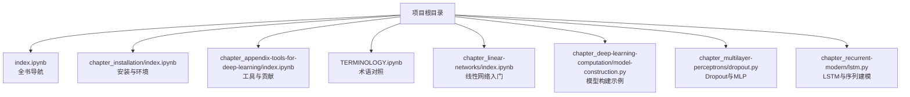
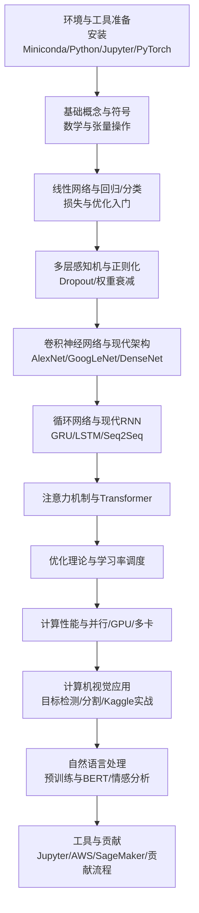
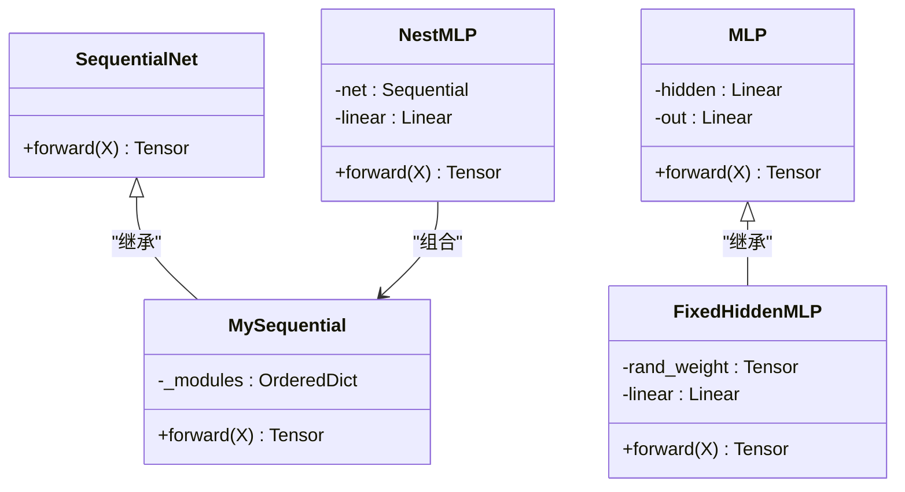
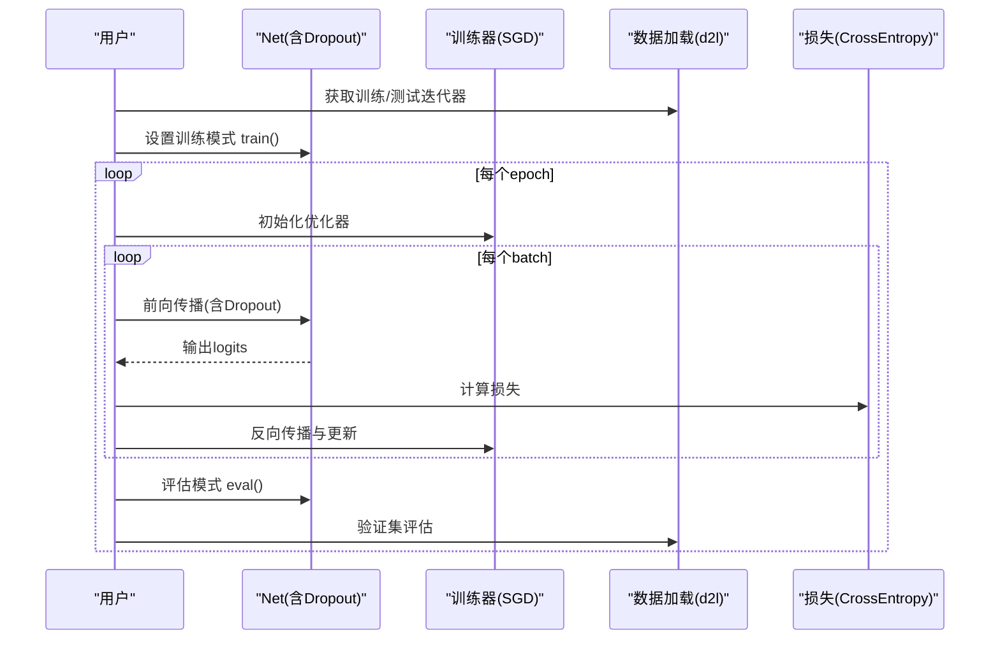
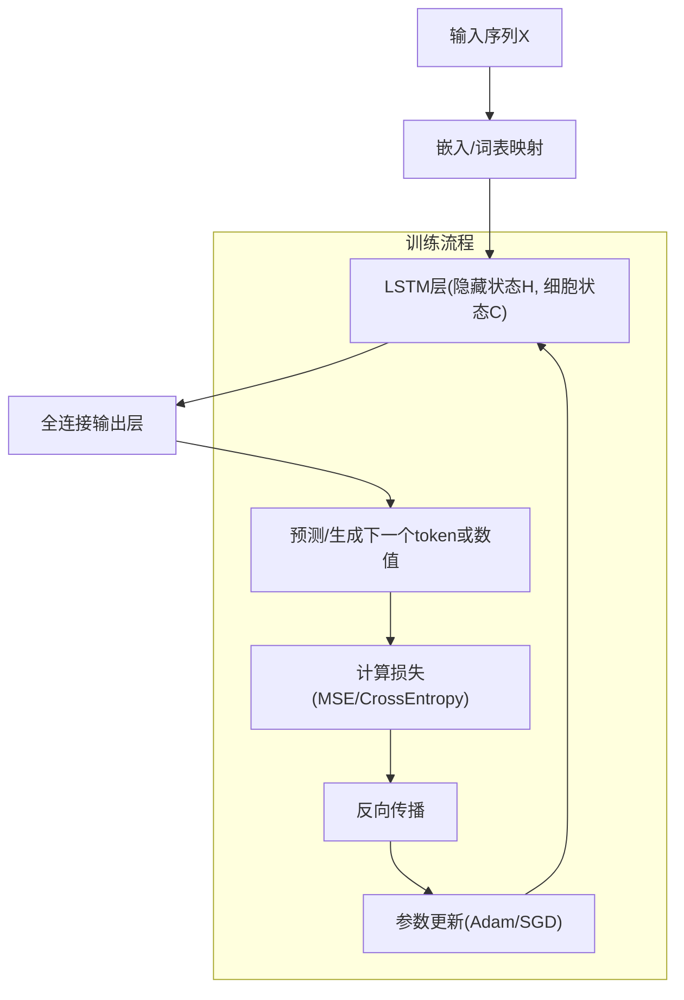
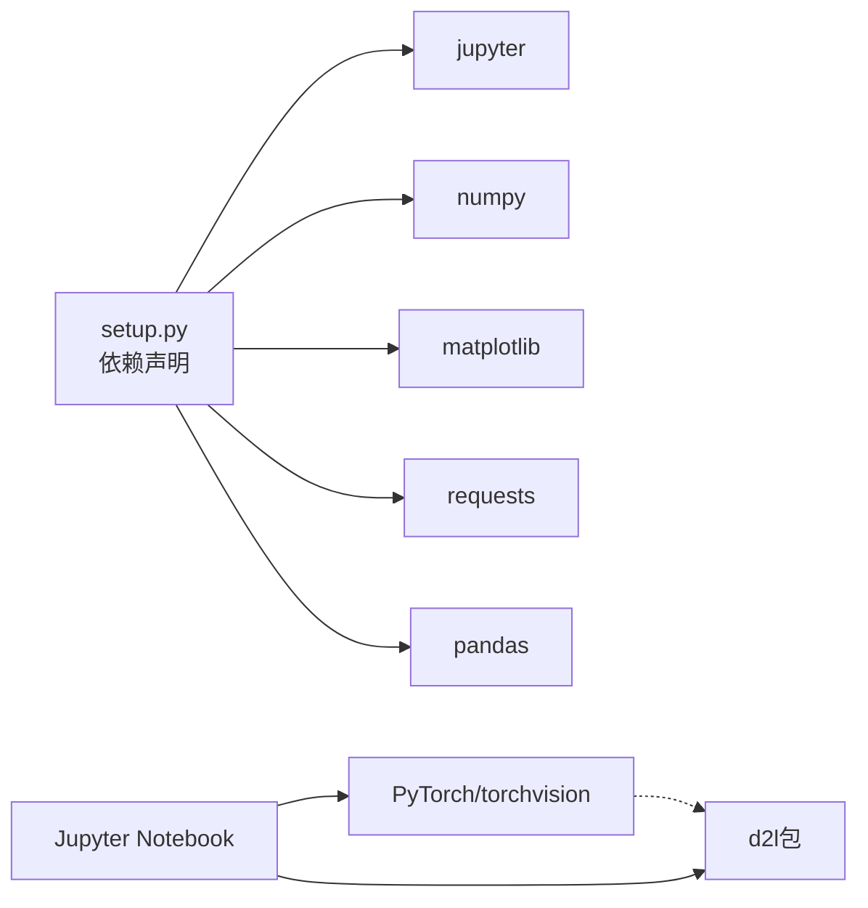

# 项目概述

<cite>
**本文引用的文件**   
- [index.ipynb](file://index.ipynb)
- [setup.py](file://setup.py)
- [TERMINOLOGY.ipynb](file://TERMINOLOGY.ipynb)
- [chapter_installation/index.ipynb](file://chapter_installation/index.ipynb)
- [chapter_linear-networks/index.ipynb](file://chapter_linear-networks/index.ipynb)
- [chapter_deep-learning-computation/model-construction.py](file://chapter_deep-learning-computation/model-construction.py)
- [chapter_multilayer-perceptrons/dropout.py](file://chapter_multilayer-perceptrons/dropout.py)
- [chapter_recurrent-modern/lstm.py](file://chapter_recurrent-modern/lstm.py)
- [chapter_appendix-tools-for-deep-learning/index.ipynb](file://chapter_appendix-tools-for-deep-learning/index.ipynb)
</cite>

## 目录
1. [简介](#简介)
2. [项目结构](#项目结构)
3. [核心组件](#核心组件)
4. [架构总览](#架构总览)
5. [详细组件分析](#详细组件分析)
6. [依赖关系分析](#依赖关系分析)
7. [性能与学习建议](#性能与学习建议)
8. [故障排查指南](#故障排查指南)
9. [结论](#结论)
10. [附录：术语与快速开始](#附录术语与快速开始)

## 简介
本项目是《动手学深度学习》PyTorch版的交互式学习仓库，以Jupyter Notebook为载体，提供从基础概念到现代深度学习架构的完整知识体系。其设计理念强调“边学边练”：通过可执行的代码、循序渐进的章节组织与丰富的实践案例，帮助读者在真实环境中掌握深度学习的核心思想与工程实践。技术栈以PyTorch为核心，配套d2l工具包与常用数据科学库，形成统一的学习与实验环境。

## 项目结构
项目采用“按主题分章”的组织方式，每章一个目录，包含若干.ipynb或.py示例文件，便于按需学习与扩展。根目录的索引Notebook汇总了所有章节入口，安装与环境配置集中在独立章节，附录则提供工具使用与贡献指南。

**图示来源** 
- [index.ipynb:1-57](file://index.ipynb#L1-L57)
- [chapter_installation/index.ipynb:1-159](file://chapter_installation/index.ipynb#L1-L159)
- [chapter_appendix-tools-for-deep-learning/index.ipynb:1-35](file://chapter_appendix-tools-for-deep-learning/index.ipynb#L1-L35)
- [TERMINOLOGY.ipynb:1-298](file://TERMINOLOGY.ipynb#L1-L298)
- [chapter_linear-networks/index.ipynb:1-40](file://chapter_linear-networks/index.ipynb#L1-L40)
- [chapter_deep-learning-computation/model-construction.py:1-95](file://chapter_deep-learning-computation/model-construction.py#L1-L95)
- [chapter_multilayer-perceptrons/dropout.py:1-96](file://chapter_multilayer-perceptrons/dropout.py#L1-L96)
- [chapter_recurrent-modern/lstm.py:1-345](file://chapter_recurrent-modern/lstm.py#L1-L345)

**章节来源**
- [index.ipynb:1-57](file://index.ipynb#L1-L57)

## 核心组件
- 交互式学习载体：Jupyter Notebook贯穿全书，支持代码、文本与可视化一体化呈现。
- 框架与工具：PyTorch作为计算与建模核心；d2l提供常用函数与训练辅助；numpy、matplotlib、pandas等支撑数据处理与可视化。
- 渐进式章节：从线性模型、多层感知机、卷积网络、循环网络、注意力机制到优化与性能提升，覆盖计算机视觉与自然语言处理应用。
- 工程化支持：安装与环境配置、GPU/多卡加速、分布式与并行、工具链（如AWS/SageMaker）与贡献流程。

**章节来源**
- [chapter_installation/index.ipynb:1-159](file://chapter_installation/index.ipynb#L1-L159)
- [TERMINOLOGY.ipynb:1-298](file://TERMINOLOGY.ipynb#L1-L298)
- [chapter_appendix-tools-for-deep-learning/index.ipynb:1-35](file://chapter_appendix-tools-for-deep-learning/index.ipynb#L1-L35)

## 架构总览
整体学习路径由“环境准备 → 基础概念 → 核心模型 → 高级主题 → 应用实践 → 工具与贡献”构成。每个阶段通过对应的章节与示例代码串联，形成闭环学习体验。

[本图为概念性流程图，不直接映射具体源码文件]

## 详细组件分析

### 模型构建与自定义模块（PyTorch）
该组件展示了如何使用nn.Sequential与自定义nn.Module构建网络，包括前向传播、参数共享、控制流与嵌套块组合，体现PyTorch的动态图特性与模块化设计。

**图示来源** 
- [chapter_deep-learning-computation/model-construction.py:1-95](file://chapter_deep-learning-computation/model-construction.py#L1-L95)

**章节来源**
- [chapter_deep-learning-computation/model-construction.py:1-95](file://chapter_deep-learning-computation/model-construction.py#L1-L95)

### Dropout与MLP训练流程
该组件演示了从零实现Dropout层与简洁实现对比，结合FashionMNIST数据集进行训练与评估，展示训练模式切换与正则化技巧。

**图示来源** 
- [chapter_multilayer-perceptrons/dropout.py:1-96](file://chapter_multilayer-perceptrons/dropout.py#L1-L96)

**章节来源**
- [chapter_multilayer-perceptrons/dropout.py:1-96](file://chapter_multilayer-perceptrons/dropout.py#L1-L96)

### LSTM与序列建模（从零与简洁实现）
该组件涵盖从零实现LSTM门控逻辑、状态管理与训练流程，以及基于nn.LSTM的简洁实现；同时包含时间序列预测（PM2.5）与字符级语言模型的端到端示例。

**图示来源** 
- [chapter_recurrent-modern/lstm.py:1-345](file://chapter_recurrent-modern/lstm.py#L1-L345)

**章节来源**
- [chapter_recurrent-modern/lstm.py:1-345](file://chapter_recurrent-modern/lstm.py#L1-L345)

### 线性网络入门
本章从线性回归与Softmax回归入手，介绍数据加载、损失定义与训练循环，为后续复杂模型奠定基础。

**章节来源**
- [chapter_linear-networks/index.ipynb:1-40](file://chapter_linear-networks/index.ipynb#L1-L40)

## 依赖关系分析
项目依赖分为运行时依赖与开发依赖两类：
- 运行时依赖：jupyter、numpy、matplotlib、requests、pandas等，用于数据、可视化与交互。
- 框架依赖：PyTorch及其生态（torchvision），用于模型构建与训练。
- 工具依赖：d2l包提供统一的API与训练辅助函数。

**图示来源** 
- [setup.py:1-24](file://setup.py#L1-L24)

**章节来源**
- [setup.py:1-24](file://setup.py#L1-L24)

## 性能与学习建议
- 硬件选择：CPU足以完成前期章节；如需流畅学习全部章节，建议尽早准备GPU并安装对应版本的PyTorch。
- 环境隔离：使用conda创建独立环境，避免依赖冲突。
- 数据与批大小：合理设置batch_size与num_workers，平衡内存与吞吐。
- 训练稳定性：关注数值稳定性、梯度裁剪与学习率调度策略。
- 复现实验：固定随机种子，记录超参数与日志，便于对比与调试。

[本节为通用指导，不直接分析具体文件]

## 故障排查指南
- 无法启动Jupyter：确认已激活conda环境，执行jupyter notebook命令后访问localhost:8888。
- GPU不可用：检查CUDA驱动与PyTorch GPU版本是否匹配；如无GPU，确保CPU版本可用。
- d2l导入失败：确认已安装对应版本的d2l包，并在当前环境内运行。
- 数据下载失败：检查网络连接与代理设置，必要时手动下载数据至本地路径。

**章节来源**
- [chapter_installation/index.ipynb:1-159](file://chapter_installation/index.ipynb#L1-L159)

## 结论
本项目以Jupyter Notebook为载体，围绕PyTorch构建了系统化的深度学习学习与实践平台。通过模块化章节、渐进式路径与丰富示例，既适合初学者循序渐进地掌握核心概念，也为有经验的开发者提供了快速参考与工程实践素材。配合完善的安装与工具指南，读者可在本地高效开展实验与探索。

[本节为总结性内容，不直接分析具体文件]

## 附录：术语与快速开始

### 术语对照
- 项目提供英汉术语对照，统一关键概念的中英文表达，便于阅读与交流。

**章节来源**
- [TERMINOLOGY.ipynb:1-298](file://TERMINOLOGY.ipynb#L1-L298)

### 快速开始
- 安装Miniconda并创建名为d2l的环境，激活后安装PyTorch（CPU/GPU）、torchvision与d2l包。
- 下载本书代码并进入pytorch目录，运行jupyter notebook打开交互界面。
- 从线性网络章节开始，逐步推进至卷积、循环、注意力与应用实践。

**章节来源**
- [chapter_installation/index.ipynb:1-159](file://chapter_installation/index.ipynb#L1-L159)